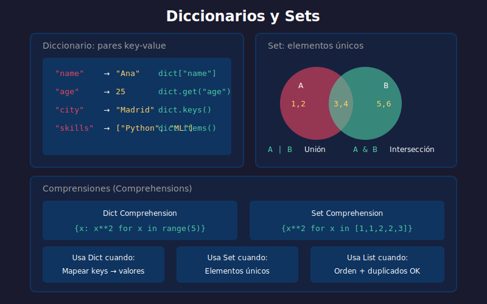

# 📖 Diccionarios y Sets

## 🎯 Objetivos

- Dominar diccionarios: creación, acceso, modificación
- Aplicar métodos de diccionarios
- Comprender sets y operaciones de conjuntos
- Usar comprensiones de diccionario y set
- Saber cuándo usar cada estructura

---

## 📋 Contenido



### 1. Diccionarios: Pares Key-Value

Un diccionario es una colección **no ordenada** de pares clave-valor.

> 📌 Desde Python 3.7+, los diccionarios mantienen el orden de inserción.

```python
# Crear diccionarios
empty_dict = {}
person = {"name": "Ana", "age": 25, "city": "Madrid"}

# Crear con dict()
person = dict(name="Ana", age=25, city="Madrid")

# Desde lista de tuplas
items = [("a", 1), ("b", 2), ("c", 3)]
d = dict(items)
print(d)  # {'a': 1, 'b': 2, 'c': 3}
```

---

### 2. Acceso a Valores

```python
person = {"name": "Ana", "age": 25, "city": "Madrid"}

# Acceso directo (KeyError si no existe)
print(person["name"])  # Ana
# print(person["email"])  # KeyError!

# Método get (None o default si no existe)
print(person.get("name"))       # Ana
print(person.get("email"))      # None
print(person.get("email", "N/A"))  # N/A

# Verificar existencia
print("name" in person)   # True
print("email" in person)  # False
```

---

### 3. Modificar Diccionarios

```python
person = {"name": "Ana", "age": 25}

# Agregar o modificar
person["city"] = "Madrid"        # Agregar
person["age"] = 26               # Modificar
print(person)  # {'name': 'Ana', 'age': 26, 'city': 'Madrid'}

# update: agregar múltiples
person.update({"email": "ana@mail.com", "phone": "123456"})
print(person)

# Eliminar
del person["phone"]              # Eliminar key
email = person.pop("email")      # Eliminar y retornar valor
last = person.popitem()          # Eliminar último par
person.clear()                   # Vaciar diccionario
```

---

### 4. Métodos de Diccionarios

```python
config = {"host": "localhost", "port": 8080, "debug": True}

# keys, values, items
print(config.keys())    # dict_keys(['host', 'port', 'debug'])
print(config.values())  # dict_values(['localhost', 8080, True])
print(config.items())   # dict_items([('host', 'localhost'), ...])

# Iterar
for key in config:
    print(f"{key}: {config[key]}")

for key, value in config.items():
    print(f"{key} = {value}")

# setdefault: obtener o establecer si no existe
config.setdefault("timeout", 30)
print(config["timeout"])  # 30 (agregado porque no existía)
```

#### Tabla de Métodos

| Método                 | Descripción                | Ejemplo                |
| ---------------------- | -------------------------- | ---------------------- |
| `get(key, default)`    | Obtener valor seguro       | `d.get("x", 0)`        |
| `keys()`               | Obtener todas las keys     | `d.keys()`             |
| `values()`             | Obtener todos los valores  | `d.values()`           |
| `items()`              | Obtener pares (key, value) | `d.items()`            |
| `pop(key)`             | Eliminar y retornar        | `d.pop("x")`           |
| `update(dict2)`        | Fusionar diccionarios      | `d.update(d2)`         |
| `setdefault(key, val)` | Obtener o establecer       | `d.setdefault("x", 0)` |
| `copy()`               | Copia superficial          | `d2 = d.copy()`        |

---

### 5. Diccionarios Anidados

```python
# Base de datos de usuarios
users = {
    "user001": {
        "name": "Ana García",
        "age": 28,
        "skills": ["Python", "ML", "SQL"]
    },
    "user002": {
        "name": "Carlos López",
        "age": 32,
        "skills": ["JavaScript", "React", "Node"]
    }
}

# Acceder a datos anidados
print(users["user001"]["name"])          # Ana García
print(users["user001"]["skills"][0])     # Python

# Modificar anidado
users["user001"]["age"] = 29
users["user002"]["skills"].append("TypeScript")
```

---

### 6. Comprensiones de Diccionario

```python
# Sintaxis: {key: value for item in iterable if condition}

# Cuadrados
squares = {x: x**2 for x in range(6)}
print(squares)  # {0: 0, 1: 1, 2: 4, 3: 9, 4: 16, 5: 25}

# Filtrar
scores = {"Ana": 85, "Bob": 60, "Carlos": 92, "Diana": 55}
passed = {name: score for name, score in scores.items() if score >= 70}
print(passed)  # {'Ana': 85, 'Carlos': 92}

# Invertir diccionario
original = {"a": 1, "b": 2, "c": 3}
inverted = {v: k for k, v in original.items()}
print(inverted)  # {1: 'a', 2: 'b', 3: 'c'}

# Transformar valores
prices = {"apple": 1.0, "banana": 0.5, "orange": 0.75}
with_tax = {item: price * 1.21 for item, price in prices.items()}
print(with_tax)  # {'apple': 1.21, 'banana': 0.605, 'orange': 0.9075}
```

---

### 7. Sets: Conjuntos

Un set es una colección **no ordenada de elementos únicos**.

```python
# Crear sets
empty_set = set()  # ¡No {}! Eso es dict vacío
numbers = {1, 2, 3, 4, 5}
from_list = set([1, 2, 2, 3, 3, 3])
print(from_list)  # {1, 2, 3} - duplicados eliminados

# Desde string
letters = set("mississippi")
print(letters)  # {'m', 'i', 's', 'p'}
```

---

### 8. Operaciones de Sets

#### Agregar y Eliminar

```python
colors = {"red", "green", "blue"}

# Agregar
colors.add("yellow")
print(colors)  # {'red', 'green', 'blue', 'yellow'}

# Agregar múltiples
colors.update(["orange", "purple"])

# Eliminar
colors.remove("red")     # KeyError si no existe
colors.discard("pink")   # No error si no existe
last = colors.pop()      # Eliminar elemento arbitrario
colors.clear()           # Vaciar set
```

#### Operaciones Matemáticas de Conjuntos

```python
A = {1, 2, 3, 4, 5}
B = {4, 5, 6, 7, 8}

# Unión: elementos en A o B (o ambos)
print(A | B)              # {1, 2, 3, 4, 5, 6, 7, 8}
print(A.union(B))         # Equivalente

# Intersección: elementos en A y B
print(A & B)              # {4, 5}
print(A.intersection(B))  # Equivalente

# Diferencia: elementos en A pero no en B
print(A - B)              # {1, 2, 3}
print(A.difference(B))    # Equivalente

# Diferencia simétrica: elementos en A o B, pero no en ambos
print(A ^ B)                      # {1, 2, 3, 6, 7, 8}
print(A.symmetric_difference(B))  # Equivalente
```

#### Diagrama de Operaciones

```
    A = {1, 2, 3, 4, 5}        B = {4, 5, 6, 7, 8}

         ┌─────────────────────────────┐
         │      A           B          │
         │   ┌─────┐    ┌─────┐       │
         │   │1 2 3│4 5 │6 7 8│       │
         │   └─────┘    └─────┘       │
         └─────────────────────────────┘

    A | B (Unión):        {1, 2, 3, 4, 5, 6, 7, 8}
    A & B (Intersección): {4, 5}
    A - B (Diferencia):   {1, 2, 3}
    A ^ B (Simétrica):    {1, 2, 3, 6, 7, 8}
```

#### Comparación de Sets

```python
A = {1, 2, 3}
B = {1, 2, 3, 4, 5}
C = {1, 2, 3}

# Subconjunto
print(A <= B)           # True (A es subconjunto de B)
print(A.issubset(B))    # True

# Superconjunto
print(B >= A)           # True (B es superconjunto de A)
print(B.issuperset(A))  # True

# Igualdad
print(A == C)           # True

# Disjuntos (sin elementos comunes)
D = {6, 7, 8}
print(A.isdisjoint(D))  # True
```

---

### 9. Comprensiones de Set

```python
# Sintaxis: {expresión for item in iterable if condición}

# Cuadrados únicos
numbers = [1, 2, 2, 3, 3, 3, 4]
squares = {x**2 for x in numbers}
print(squares)  # {1, 4, 9, 16}

# Filtrar
words = ["Python", "python", "PYTHON", "Java", "java"]
unique_lower = {w.lower() for w in words}
print(unique_lower)  # {'python', 'java'}
```

---

### 10. Frozenset: Set Inmutable

```python
# Set inmutable (puede ser key de dict o elemento de set)
immutable = frozenset([1, 2, 3])

# No se puede modificar
# immutable.add(4)  # AttributeError

# Puede ser key de diccionario
permissions = {
    frozenset(["read"]): "viewer",
    frozenset(["read", "write"]): "editor",
    frozenset(["read", "write", "delete"]): "admin"
}
```

---

### 11. ¿Cuándo usar cada estructura?

| Estructura | Usar cuando...                             | Ejemplo               |
| ---------- | ------------------------------------------ | --------------------- |
| **Lista**  | Orden importa, duplicados permitidos       | Historial, secuencias |
| **Tupla**  | Datos inmutables, orden importa            | Coordenadas, RGB      |
| **Dict**   | Mapear keys a valores                      | Config, JSON, cache   |
| **Set**    | Elementos únicos, operaciones de conjuntos | Tags, IDs únicos      |

---

### 12. Estructuras en ML/IA

```python
# Diccionario: hiperparámetros de modelo
hyperparams = {
    "learning_rate": 0.001,
    "epochs": 100,
    "batch_size": 32,
    "optimizer": "adam"
}

# Set: palabras únicas (vocabulario)
text = "machine learning is a subset of artificial intelligence"
vocabulary = set(text.lower().split())
print(vocabulary)
# {'machine', 'learning', 'is', 'a', 'subset', 'of', 'artificial', 'intelligence'}

# Dict: conteo de palabras (bag of words)
from collections import Counter
words = text.lower().split()
word_counts = dict(Counter(words))
print(word_counts)
# {'machine': 1, 'learning': 1, 'is': 1, ...}

# Dict: one-hot encoding manual
categories = ["cat", "dog", "bird"]
one_hot = {cat: [1 if i == j else 0 for j in range(len(categories))]
           for i, cat in enumerate(categories)}
print(one_hot)
# {'cat': [1, 0, 0], 'dog': [0, 1, 0], 'bird': [0, 0, 1]}
```

---

## 📚 Recursos Adicionales

- [Python Dictionaries - Real Python](https://realpython.com/python-dicts/)
- [Python Sets - Real Python](https://realpython.com/python-sets/)
- [Dict Comprehensions - Real Python](https://realpython.com/iterate-through-dictionary-python/)

---

## ✅ Checklist de Verificación

- [ ] Puedo crear y acceder a diccionarios
- [ ] Conozco los métodos principales de diccionarios
- [ ] Entiendo sets y sus operaciones matemáticas
- [ ] Puedo escribir comprensiones de dict y set
- [ ] Sé cuándo usar cada estructura de datos

---

_Siguiente: [04-modulos.md](04-modulos.md)_
