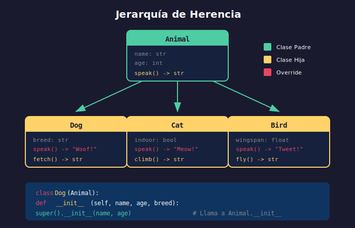

# 🌳 Herencia en Python

## 🎯 Objetivos

- Comprender qué es la herencia y cuándo usarla
- Implementar herencia simple y múltiple
- Usar `super()` correctamente
- Entender el MRO (Method Resolution Order)
- Conocer la composición como alternativa

---

## 📋 Contenido

### 1. ¿Qué es la Herencia?

La **herencia** permite crear clases nuevas basadas en clases existentes, heredando sus atributos y métodos.



```python
# Clase padre (base/superclass)
class Animal:
    def __init__(self, name: str):
        self.name = name

    def speak(self) -> str:
        return "Some sound"

# Clase hija (derived/subclass)
class Dog(Animal):  # Dog hereda de Animal
    def speak(self) -> str:
        return f"{self.name} says: Woof!"

class Cat(Animal):
    def speak(self) -> str:
        return f"{self.name} says: Meow!"

# Uso
buddy = Dog("Buddy")
whiskers = Cat("Whiskers")

print(buddy.name)      # Buddy (heredado de Animal)
print(buddy.speak())   # Buddy says: Woof! (override)
print(whiskers.speak())  # Whiskers says: Meow!
```

---

### 2. `super()` - Llamar al Padre

`super()` permite acceder a métodos de la clase padre:

```python
class Animal:
    def __init__(self, name: str, age: int):
        self.name = name
        self.age = age

    def info(self) -> str:
        return f"{self.name}, {self.age} years"

class Dog(Animal):
    def __init__(self, name: str, age: int, breed: str):
        # Llamar al __init__ del padre
        super().__init__(name, age)
        # Añadir atributo propio
        self.breed = breed

    def info(self) -> str:
        # Extender el método del padre
        parent_info = super().info()
        return f"{parent_info}, {self.breed}"

buddy = Dog("Buddy", 3, "Golden Retriever")
print(buddy.name)   # Buddy
print(buddy.breed)  # Golden Retriever
print(buddy.info()) # Buddy, 3 years, Golden Retriever
```

#### ⚠️ No olvides `super().__init__()`

```python
# ❌ INCORRECTO - No llamar a super()
class BadDog(Animal):
    def __init__(self, name: str, age: int, breed: str):
        self.breed = breed  # ¡name y age no se inicializan!

bad = BadDog("Max", 5, "Beagle")
# print(bad.name)  # AttributeError: 'BadDog' object has no attribute 'name'

# ✅ CORRECTO
class GoodDog(Animal):
    def __init__(self, name: str, age: int, breed: str):
        super().__init__(name, age)  # Inicializa name y age
        self.breed = breed

good = GoodDog("Max", 5, "Beagle")
print(good.name)  # Max ✓
```

---

### 3. isinstance() y issubclass()

```python
class Animal:
    pass

class Dog(Animal):
    pass

class Cat(Animal):
    pass

buddy = Dog()

# isinstance - verifica si objeto es instancia de clase
print(isinstance(buddy, Dog))     # True
print(isinstance(buddy, Animal))  # True (también es Animal)
print(isinstance(buddy, Cat))     # False

# issubclass - verifica si clase hereda de otra
print(issubclass(Dog, Animal))    # True
print(issubclass(Cat, Animal))    # True
print(issubclass(Dog, Cat))       # False
```

---

### 4. Herencia Múltiple

Python permite heredar de múltiples clases:

```python
class Flyer:
    def fly(self) -> str:
        return "Flying through the sky!"

class Swimmer:
    def swim(self) -> str:
        return "Swimming in the water!"

# Herencia múltiple
class Duck(Flyer, Swimmer):
    def __init__(self, name: str):
        self.name = name

    def quack(self) -> str:
        return f"{self.name} says: Quack!"

donald = Duck("Donald")
print(donald.fly())   # Flying through the sky!
print(donald.swim())  # Swimming in the water!
print(donald.quack()) # Donald says: Quack!
```

---

### 5. MRO (Method Resolution Order)

El MRO determina el orden de búsqueda de métodos en herencia múltiple:

```python
class A:
    def method(self) -> str:
        return "A"

class B(A):
    def method(self) -> str:
        return "B"

class C(A):
    def method(self) -> str:
        return "C"

class D(B, C):  # D hereda de B y C
    pass

d = D()
print(d.method())  # B (primero encuentra en B)

# Ver el MRO
print(D.__mro__)
# (<class 'D'>, <class 'B'>, <class 'C'>, <class 'A'>, <class 'object'>)

# También con .mro()
print(D.mro())
```

#### El Problema del Diamante

```python
class A:
    def __init__(self):
        print("A init")

class B(A):
    def __init__(self):
        print("B init")
        super().__init__()

class C(A):
    def __init__(self):
        print("C init")
        super().__init__()

class D(B, C):
    def __init__(self):
        print("D init")
        super().__init__()

d = D()
# Output:
# D init
# B init
# C init
# A init

# super() sigue el MRO, evitando llamar A dos veces
```

---

### 6. Composición vs Herencia

**Herencia**: "es un" (is-a relationship)
**Composición**: "tiene un" (has-a relationship)

```python
# ❌ Herencia incorrecta
class Engine:
    def start(self) -> str:
        return "Engine started"

class Car(Engine):  # ¿Un carro ES un motor? ❌
    pass

# ✅ Composición correcta
class Engine:
    def start(self) -> str:
        return "Engine started"

    def stop(self) -> str:
        return "Engine stopped"

class Car:
    def __init__(self, brand: str):
        self.brand = brand
        self.engine = Engine()  # Un carro TIENE un motor ✓

    def start(self) -> str:
        return f"{self.brand}: {self.engine.start()}"

    def stop(self) -> str:
        return f"{self.brand}: {self.engine.stop()}"

my_car = Car("Toyota")
print(my_car.start())  # Toyota: Engine started
```

#### Cuándo usar cada uno

| Usar Herencia cuando...    | Usar Composición cuando...     |
| -------------------------- | ------------------------------ |
| Hay relación "es un" clara | Hay relación "tiene un"        |
| Quieres polimorfismo       | Quieres flexibilidad           |
| La jerarquía es estable    | Los componentes pueden cambiar |
| Ejemplo: Dog es Animal     | Ejemplo: Car tiene Engine      |

---

### 7. Ejemplo Completo: Sistema de Empleados

```python
class Employee:
    """Base class for all employees."""

    def __init__(self, name: str, employee_id: str, salary: float):
        self.name = name
        self.employee_id = employee_id
        self.salary = salary

    def get_annual_salary(self) -> float:
        """Calculate annual salary."""
        return self.salary * 12

    def __str__(self) -> str:
        return f"{self.name} ({self.employee_id})"


class Manager(Employee):
    """Manager with team management capabilities."""

    def __init__(self, name: str, employee_id: str, salary: float, department: str):
        super().__init__(name, employee_id, salary)
        self.department = department
        self.team: list[Employee] = []

    def add_team_member(self, employee: Employee) -> None:
        """Add an employee to the team."""
        self.team.append(employee)

    def get_team_size(self) -> int:
        """Return number of team members."""
        return len(self.team)

    def get_annual_salary(self) -> float:
        """Managers get 20% bonus."""
        base = super().get_annual_salary()
        return base * 1.2


class Developer(Employee):
    """Developer with technical skills."""

    def __init__(self, name: str, employee_id: str, salary: float,
                 programming_languages: list[str] | None = None):
        super().__init__(name, employee_id, salary)
        self.programming_languages = programming_languages or []

    def add_skill(self, language: str) -> None:
        """Add a programming language skill."""
        if language not in self.programming_languages:
            self.programming_languages.append(language)

    def __str__(self) -> str:
        skills = ", ".join(self.programming_languages) or "None"
        return f"{super().__str__()} - Skills: {skills}"


class SeniorDeveloper(Developer):
    """Senior developer with mentoring capabilities."""

    def __init__(self, name: str, employee_id: str, salary: float,
                 programming_languages: list[str] | None = None):
        super().__init__(name, employee_id, salary, programming_languages)
        self.mentees: list[Developer] = []

    def add_mentee(self, developer: Developer) -> None:
        """Add a developer to mentor."""
        self.mentees.append(developer)

    def get_annual_salary(self) -> float:
        """Senior devs get 15% bonus."""
        base = super().get_annual_salary()
        return base * 1.15


# Uso del sistema
manager = Manager("Alice", "M001", 8000, "Engineering")
dev1 = Developer("Bob", "D001", 5000, ["Python", "JavaScript"])
dev2 = Developer("Carol", "D002", 5000, ["Python"])
senior = SeniorDeveloper("Dave", "D003", 7000, ["Python", "Go", "Rust"])

# Construir equipo
manager.add_team_member(dev1)
manager.add_team_member(dev2)
manager.add_team_member(senior)

# Mentoring
senior.add_mentee(dev2)

# Información
print(f"Manager: {manager}")
print(f"Team size: {manager.get_team_size()}")
print(f"Manager annual salary: ${manager.get_annual_salary():,.2f}")
print()
print(f"Developer: {dev1}")
print(f"Developer annual salary: ${dev1.get_annual_salary():,.2f}")
print()
print(f"Senior: {senior}")
print(f"Senior annual salary: ${senior.get_annual_salary():,.2f}")
```

---

## 💡 Buenas Prácticas

1. **Preferir composición**: "Favor composition over inheritance"
2. **Herencia superficial**: Evitar más de 2-3 niveles
3. **Siempre usar `super()`**: Para mantener el MRO correcto
4. **Liskov Substitution**: Las subclases deben ser intercambiables con la clase padre
5. **No heredar solo por reutilizar código**: Debe haber relación "es un"

---

## ⚠️ Errores Comunes

```python
# ❌ Olvidar super().__init__()
class Child(Parent):
    def __init__(self, extra):
        self.extra = extra  # ¡Parent.__init__ nunca se llama!

# ❌ Herencia profunda
class A: pass
class B(A): pass
class C(B): pass
class D(C): pass
class E(D): pass  # ¡Muy difícil de mantener!

# ❌ Herencia para reutilizar código sin relación
class Utils:
    def format_date(self): ...

class User(Utils):  # ¿User ES Utils? No tiene sentido
    pass
```

---

## ✅ Checklist de Verificación

- [ ] Entiendo cuándo usar herencia vs composición
- [ ] Uso `super()` correctamente
- [ ] Comprendo el MRO
- [ ] Puedo implementar herencia simple y múltiple
- [ ] Conozco `isinstance()` y `issubclass()`

---

## 🔗 Recursos

- [Python Docs - Inheritance](https://docs.python.org/3/tutorial/classes.html#inheritance)
- [Real Python - Inheritance](https://realpython.com/inheritance-composition-python/)
- [MRO Explained](https://www.python.org/download/releases/2.3/mro/)

---

_Anterior: [Clases y Objetos](01-clases-objetos.md) | Siguiente: [Encapsulamiento](03-encapsulamiento.md)_
