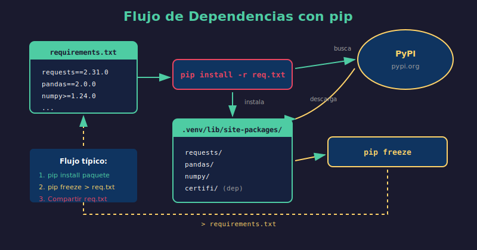

# 🛠️ Proyecto: CLI Utils Package



## 🎯 Objetivo

Crear un **paquete Python instalable** con utilidades de línea de comandos (CLI) que se pueda instalar con `pip install -e .` y usar desde cualquier lugar del sistema.

---

## 📋 Descripción

Desarrollarás `cli_utils`, un paquete que proporciona comandos útiles para:

- 📁 **Operaciones de archivos**: contar líneas, buscar texto
- 📝 **Procesamiento de texto**: formatear, limpiar
- 💻 **Información del sistema**: mostrar detalles del entorno

---

## 🏗️ Estructura del Proyecto

```
3-proyecto/
├── README.md                 # Este archivo
├── starter/
│   ├── cli_utils/
│   │   ├── __init__.py
│   │   ├── files.py          # Utilidades de archivos
│   │   ├── text.py           # Utilidades de texto
│   │   ├── system.py         # Info del sistema
│   │   └── cli.py            # Entry point CLI
│   ├── pyproject.toml        # Configuración del paquete
│   └── README.md             # Documentación del paquete
└── .solution/
    └── ...                   # Solución completa
```

---

## 📝 Requisitos Funcionales

### 1. Módulo `files.py`

```python
def count_lines(filepath: str) -> int:
    """Cuenta las líneas de un archivo."""

def search_in_file(filepath: str, pattern: str) -> list[tuple[int, str]]:
    """Busca un patrón y retorna líneas que coinciden."""

def list_files(directory: str, extension: str = None) -> list[str]:
    """Lista archivos en un directorio."""
```

### 2. Módulo `text.py`

```python
def clean_text(text: str) -> str:
    """Elimina espacios extra y caracteres especiales."""

def word_count(text: str) -> dict:
    """Cuenta palabras y retorna estadísticas."""

def to_slug(text: str) -> str:
    """Convierte texto a formato slug (url-friendly)."""
```

### 3. Módulo `system.py`

```python
def get_system_info() -> dict:
    """Retorna información del sistema."""

def get_python_info() -> dict:
    """Retorna información de Python y entorno."""
```

### 4. Módulo `cli.py`

Entry point principal que procesa argumentos de línea de comandos.

---

## ⚙️ Configuración del Paquete

### `pyproject.toml`

```toml
[build-system]
requires = ["setuptools>=61.0"]
build-backend = "setuptools.build_meta"

[project]
name = "cli_utils"
version = "1.0.0"
description = "Utilidades de línea de comandos"
requires-python = ">=3.10"

[project.scripts]
cli-utils = "cli_utils.cli:main"
```

---

## 🚀 Instalación y Uso

### Instalar en Modo Desarrollo

```bash
# Crear entorno virtual
python -m venv .venv
source .venv/bin/activate  # Linux/Mac

# Instalar en modo editable
pip install -e .

# Verificar instalación
cli-utils --help
```

### Comandos Disponibles

```bash
# Contar líneas
cli-utils count-lines archivo.py

# Buscar texto
cli-utils search "def " archivo.py

# Info del sistema
cli-utils system-info

# Info de Python
cli-utils python-info

# Limpiar texto
echo "  texto   con   espacios  " | cli-utils clean-text

# Convertir a slug
cli-utils slug "Mi Título de Artículo"
```

---

## 📌 Tareas

### Nivel Básico ⭐

- [ ] Crear estructura de carpetas del paquete
- [ ] Implementar `files.py` con `count_lines`
- [ ] Implementar `text.py` con `clean_text`
- [ ] Crear `__init__.py` con exports

### Nivel Intermedio ⭐⭐

- [ ] Implementar todas las funciones de cada módulo
- [ ] Crear `pyproject.toml` completo
- [ ] Hacer el paquete instalable con `pip install -e .`

### Nivel Avanzado ⭐⭐⭐

- [ ] Implementar `cli.py` con argparse
- [ ] Configurar entry points en pyproject.toml
- [ ] Agregar manejo de errores robusto
- [ ] Documentar con docstrings completos

---

## ✅ Criterios de Evaluación

| Criterio                           | Puntos  |
| ---------------------------------- | ------- |
| Estructura de paquete correcta     | 15      |
| Funciones implementadas (mínimo 6) | 25      |
| Instalable con `pip install -e .`  | 15      |
| CLI funcional con argparse         | 15      |
| Type hints y docstrings            | 15      |
| Manejo de errores                  | 15      |
| **Total**                          | **100** |

---

## 💡 Tips

1. **Empieza simple**: Primero haz que el paquete sea importable
2. **Prueba cada paso**: Verifica que `pip install -e .` funcione
3. **Usa `argparse`**: Es la forma estándar de crear CLIs en Python
4. **Type hints**: Agrégalos desde el inicio
5. **Maneja errores**: `FileNotFoundError`, `PermissionError`, etc.

---

## 📚 Recursos

- [argparse docs](https://docs.python.org/3/library/argparse.html)
- [Packaging Python Projects](https://packaging.python.org/tutorials/packaging-projects/)
- [Entry Points](https://setuptools.pypa.io/en/latest/userguide/entry_point.html)

---

_Volver a: [Semana 04](../README.md)_
