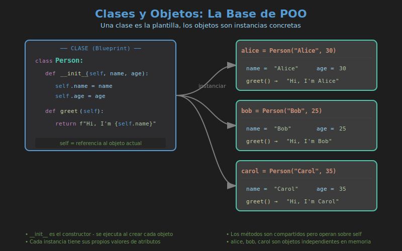

# 📘 Clases y Objetos en Python

## 🎯 Objetivos

- Comprender qué son las clases y los objetos
- Aprender a definir clases con `class`
- Entender el método `__init__` y `self`
- Crear instancias y usar atributos/métodos

---

## 📋 Contenido

1. [¿Qué es la POO?](#1-qué-es-la-poo)
2. [Clases y Objetos](#2-clases-y-objetos)
3. [Definiendo Clases](#3-definiendo-clases)
4. [El Método `__init__`](#4-el-método-__init__)
5. [Atributos de Instancia vs Clase](#5-atributos-de-instancia-vs-clase)
6. [Métodos](#6-métodos)

---

## 1. ¿Qué es la POO?

La **Programación Orientada a Objetos (POO)** es un paradigma de programación que organiza el código en torno a "objetos" que combinan datos y comportamiento.

### Paradigmas de Programación

| Paradigma               | Enfoque                             | Ejemplo                   |
| ----------------------- | ----------------------------------- | ------------------------- |
| **Imperativo**          | Secuencia de instrucciones          | Scripts básicos           |
| **Funcional**           | Funciones puras                     | `map`, `filter`, `reduce` |
| **Orientado a Objetos** | Objetos con estado y comportamiento | Clases y métodos          |

### Los 4 Pilares de la POO


---

## 2. Clases y Objetos



### Conceptos Fundamentales

- **Clase**: Plantilla o molde que define la estructura y comportamiento
- **Objeto**: Instancia concreta de una clase
- **Atributo**: Variable que pertenece a un objeto
- **Método**: Función que pertenece a una clase

### Analogía

```
Clase: Plano de una casa
       └── Define: habitaciones, puertas, ventanas

Objeto: Casa construida
        └── Tiene: 3 habitaciones, 2 puertas, 5 ventanas
```

```python
# La clase es el plano
class Dog:
    pass

# Los objetos son instancias concretas
fido = Dog()   # Un perro específico
rex = Dog()    # Otro perro específico

# Cada objeto es único
print(fido is rex)  # False
print(type(fido))   # <class '__main__.Dog'>
```

---

## 3. Definiendo Clases

### Sintaxis Básica

```python
class ClassName:
    """Docstring describing the class."""

    # Class body
    pass
```

### Convenciones de Nomenclatura

| Elemento   | Convención | Ejemplo                             |
| ---------- | ---------- | ----------------------------------- |
| Clases     | PascalCase | `BankAccount`, `HttpClient`         |
| Métodos    | snake_case | `get_balance`, `calculate_interest` |
| Atributos  | snake_case | `account_number`, `owner_name`      |
| Constantes | UPPER_CASE | `MAX_BALANCE`, `DEFAULT_RATE`       |

### Ejemplo: Clase Vacía

```python
class Car:
    """Represents a car."""
    pass

# Create instance
my_car = Car()
print(type(my_car))  # <class '__main__.Car'>
```

---

## 4. El Método `__init__`

El método `__init__` es el **constructor** de la clase. Se ejecuta automáticamente al crear una instancia.

### Sintaxis

```python
class ClassName:
    def __init__(self, param1, param2):
        self.attribute1 = param1
        self.attribute2 = param2
```

### ¿Qué es `self`?

`self` es una referencia al objeto actual. Es el primer parámetro de todos los métodos de instancia.

```python
class Person:
    def __init__(self, name: str, age: int):
        # self.name creates an instance attribute
        self.name = name
        self.age = age

    def greet(self) -> str:
        # Access attributes via self
        return f"Hello, I'm {self.name}"

# Create instances
alice = Person("Alice", 30)
bob = Person("Bob", 25)

print(alice.name)    # Alice
print(bob.name)      # Bob
print(alice.greet()) # Hello, I'm Alice
```

### Parámetros por Defecto

```python
class Product:
    def __init__(self, name: str, price: float, quantity: int = 0):
        self.name = name
        self.price = price
        self.quantity = quantity

    def total_value(self) -> float:
        return self.price * self.quantity

# With default
laptop = Product("Laptop", 999.99)
print(laptop.quantity)  # 0

# Overriding default
phone = Product("Phone", 699.99, 50)
print(phone.quantity)   # 50
```

---

## 5. Atributos de Instancia vs Clase

### Atributos de Instancia

Pertenecen a cada objeto individual. Se definen en `__init__` con `self`.

```python
class Dog:
    def __init__(self, name: str):
        self.name = name  # Instance attribute

fido = Dog("Fido")
rex = Dog("Rex")

print(fido.name)  # Fido
print(rex.name)   # Rex
```

### Atributos de Clase

Compartidos por todas las instancias. Se definen directamente en la clase.

```python
class Dog:
    species = "Canis familiaris"  # Class attribute
    count = 0                      # Track instances

    def __init__(self, name: str):
        self.name = name           # Instance attribute
        Dog.count += 1             # Modify class attribute

# Create instances
fido = Dog("Fido")
rex = Dog("Rex")

# Class attribute is shared
print(fido.species)  # Canis familiaris
print(rex.species)   # Canis familiaris
print(Dog.count)     # 2

# Modifying class attribute
Dog.species = "Canis lupus familiaris"
print(fido.species)  # Canis lupus familiaris
print(rex.species)   # Canis lupus familiaris
```

### Comparación

| Aspecto     | Instancia                  | Clase                    |
| ----------- | -------------------------- | ------------------------ |
| Definición  | En `__init__` con `self`   | Directamente en la clase |
| Pertenencia | Cada objeto                | Compartido               |
| Acceso      | `self.attr` o `obj.attr`   | `ClassName.attr`         |
| Memoria     | Cada instancia tiene copia | Una sola copia           |

---

## 6. Métodos

### Métodos de Instancia

El tipo más común. Reciben `self` como primer parámetro.

```python
class BankAccount:
    def __init__(self, owner: str, balance: float = 0):
        self.owner = owner
        self.balance = balance

    def deposit(self, amount: float) -> None:
        """Add money to account."""
        if amount > 0:
            self.balance += amount

    def withdraw(self, amount: float) -> bool:
        """Remove money from account."""
        if 0 < amount <= self.balance:
            self.balance -= amount
            return True
        return False

    def get_info(self) -> str:
        """Return account information."""
        return f"{self.owner}: ${self.balance:.2f}"

# Usage
account = BankAccount("Alice", 1000)
account.deposit(500)
account.withdraw(200)
print(account.get_info())  # Alice: $1300.00
```

### Métodos de Clase (`@classmethod`)

Reciben la clase como primer parámetro (`cls`). Útiles para factory methods.

```python
class Date:
    def __init__(self, year: int, month: int, day: int):
        self.year = year
        self.month = month
        self.day = day

    @classmethod
    def from_string(cls, date_string: str) -> 'Date':
        """Create Date from string 'YYYY-MM-DD'."""
        year, month, day = map(int, date_string.split('-'))
        return cls(year, month, day)

    @classmethod
    def today(cls) -> 'Date':
        """Create Date for current date."""
        from datetime import date
        d = date.today()
        return cls(d.year, d.month, d.day)

# Different ways to create Date
date1 = Date(2024, 1, 15)
date2 = Date.from_string("2024-06-20")
date3 = Date.today()
```

### Métodos Estáticos (`@staticmethod`)

No reciben `self` ni `cls`. Son funciones relacionadas con la clase pero independientes.

```python
class MathUtils:
    @staticmethod
    def is_even(n: int) -> bool:
        """Check if number is even."""
        return n % 2 == 0

    @staticmethod
    def factorial(n: int) -> int:
        """Calculate factorial of n."""
        if n <= 1:
            return 1
        return n * MathUtils.factorial(n - 1)

# No need for instance
print(MathUtils.is_even(4))    # True
print(MathUtils.factorial(5))  # 120
```

### Comparación de Métodos

| Tipo      | Primer Parámetro | Decorador       | Uso                                        |
| --------- | ---------------- | --------------- | ------------------------------------------ |
| Instancia | `self`           | Ninguno         | Operar con datos del objeto                |
| Clase     | `cls`            | `@classmethod`  | Factory methods, modificar estado de clase |
| Estático  | Ninguno          | `@staticmethod` | Funciones utilitarias relacionadas         |

---

## 🔑 Resumen

```python
class Example:
    class_attr = "shared"      # Class attribute

    def __init__(self, value):
        self.instance_attr = value  # Instance attribute

    def instance_method(self):     # Instance method
        return self.instance_attr

    @classmethod
    def class_method(cls):         # Class method
        return cls.class_attr

    @staticmethod
    def static_method():           # Static method
        return "utility function"
```

---

## 📚 Referencias

- [Python Classes Tutorial](https://docs.python.org/3/tutorial/classes.html)
- [Real Python - OOP](https://realpython.com/python3-object-oriented-programming/)

---

## 🔗 Navegación

| Anterior                    | Índice      | Siguiente                    |
| --------------------------- | ----------- | ---------------------------- |
| [← Semana 06](../README.md) | [Teoría](.) | [Herencia →](02-herencia.md) |
