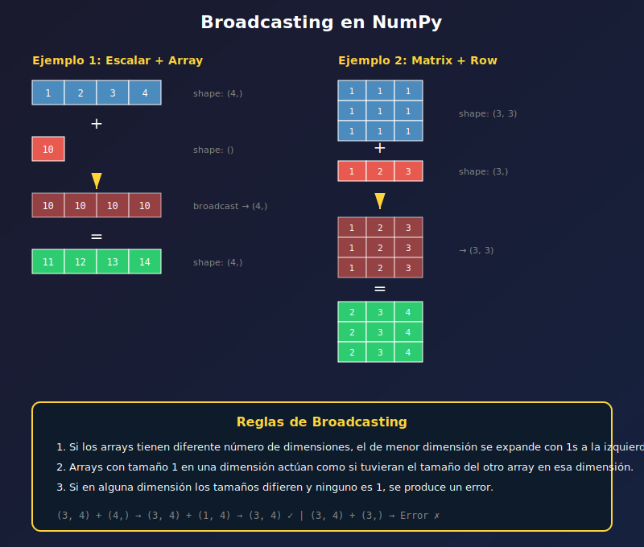

# 📘 Operaciones Vectorizadas y Broadcasting

## 🎯 Objetivos

- Realizar operaciones elemento a elemento
- Entender y aplicar broadcasting
- Usar funciones universales (ufuncs)
- Calcular agregaciones con axis
- Aplicar álgebra lineal básica

---

## 📋 Contenido

1. [Operaciones Elemento a Elemento](#1-operaciones-elemento-a-elemento)
2. [Broadcasting](#2-broadcasting)
3. [Funciones Universales (ufuncs)](#3-funciones-universales-ufuncs)
4. [Agregaciones](#4-agregaciones)
5. [Álgebra Lineal Básica](#5-álgebra-lineal-básica)

---

## 1. Operaciones Elemento a Elemento

### Operaciones Aritméticas

```python
import numpy as np

a = np.array([1, 2, 3, 4])
b = np.array([10, 20, 30, 40])

# Operaciones elemento a elemento
print(a + b)   # [11 22 33 44]
print(a - b)   # [-9 -18 -27 -36]
print(a * b)   # [10 40 90 160]
print(a / b)   # [0.1 0.1 0.1 0.1]
print(a ** 2)  # [1 4 9 16]
print(b // a)  # [10 10 10 10] (división entera)
print(b % a)   # [0 0 0 0] (módulo)
```

### Operaciones con Escalares

```python
import numpy as np

arr = np.array([1, 2, 3, 4, 5])

# El escalar se aplica a todos los elementos
print(arr + 10)   # [11 12 13 14 15]
print(arr * 2)    # [ 2  4  6  8 10]
print(arr ** 2)   # [ 1  4  9 16 25]
print(10 - arr)   # [9 8 7 6 5]
print(1 / arr)    # [1.   0.5  0.33 0.25 0.2]
```

### Comparaciones

```python
import numpy as np

a = np.array([1, 2, 3, 4, 5])
b = np.array([5, 4, 3, 2, 1])

# Comparaciones elemento a elemento
print(a == b)  # [False False  True False False]
print(a > b)   # [False False False  True  True]
print(a >= 3)  # [False False  True  True  True]

# Funciones de comparación
print(np.equal(a, b))        # [False False  True False False]
print(np.greater(a, 3))      # [False False False  True  True]
print(np.array_equal(a, a))  # True (arrays idénticos)
```

---

## 2. Broadcasting

Broadcasting permite operar arrays de diferentes shapes siguiendo reglas específicas.



### Reglas de Broadcasting

1. Si los arrays tienen diferente número de dimensiones, se añaden 1s al inicio del shape más pequeño
2. Arrays con tamaño 1 en una dimensión se "estiran" para coincidir con el otro
3. Si los tamaños no son 1 ni iguales, error

### Ejemplos de Broadcasting

```python
import numpy as np

# Caso 1: Array + Escalar
arr = np.array([[1, 2, 3], [4, 5, 6]])
print(arr + 10)
# [[11 12 13]
#  [14 15 16]]
# Shape: (2,3) + () -> (2,3) + (1,1) -> (2,3)

# Caso 2: Matriz + Vector fila
matrix = np.array([[1, 2, 3], [4, 5, 6]])  # (2, 3)
row = np.array([10, 20, 30])                # (3,)

print(matrix + row)
# [[11 22 33]
#  [14 25 36]]
# Shape: (2,3) + (3,) -> (2,3) + (1,3) -> (2,3)
```

### Vector Columna vs Vector Fila

```python
import numpy as np

matrix = np.ones((3, 4))

# Vector fila - se expande verticalmente
row = np.array([1, 2, 3, 4])  # shape (4,)
print(matrix + row)
# [[2. 3. 4. 5.]
#  [2. 3. 4. 5.]
#  [2. 3. 4. 5.]]

# Vector columna - se expande horizontalmente
col = np.array([[10], [20], [30]])  # shape (3, 1)
print(matrix + col)
# [[11. 11. 11. 11.]
#  [21. 21. 21. 21.]
#  [31. 31. 31. 31.]]
```

### Ejemplo Práctico: Normalización

```python
import numpy as np

# Datos: 4 muestras, 3 features
data = np.array([
    [10, 200, 3000],
    [20, 400, 6000],
    [15, 300, 4500],
    [25, 500, 7500]
])

# Normalizar cada columna (feature)
mean = data.mean(axis=0)  # Media por columna: [17.5, 350, 5250]
std = data.std(axis=0)    # Std por columna

normalized = (data - mean) / std  # Broadcasting!
print(normalized)
```

### Errores de Broadcasting

```python
import numpy as np

a = np.ones((3, 4))  # shape (3, 4)
b = np.ones((2, 4))  # shape (2, 4)

# ❌ Error: 3 != 2 y ninguno es 1
# print(a + b)  # ValueError: operands could not be broadcast

# ✅ Funciona
c = np.ones((1, 4))  # shape (1, 4)
print((a + c).shape)  # (3, 4)
```

---

## 3. Funciones Universales (ufuncs)

Las ufuncs son funciones que operan elemento a elemento, optimizadas en C.

### Matemáticas Básicas

```python
import numpy as np

arr = np.array([1, 4, 9, 16, 25])

# Raíz cuadrada
print(np.sqrt(arr))  # [1. 2. 3. 4. 5.]

# Potencias
print(np.square(arr))  # [  1  16  81 256 625]
print(np.power(arr, 0.5))  # Igual que sqrt

# Exponencial y logaritmo
print(np.exp(np.array([0, 1, 2])))  # [1.  2.718  7.389]
print(np.log(np.array([1, np.e, np.e**2])))  # [0. 1. 2.]
print(np.log10(np.array([1, 10, 100])))  # [0. 1. 2.]

# Valor absoluto
print(np.abs(np.array([-1, -2, 3, -4])))  # [1 2 3 4]

# Signo
print(np.sign(np.array([-5, 0, 5])))  # [-1  0  1]
```

### Trigonométricas

```python
import numpy as np

# Ángulos en radianes
angles = np.array([0, np.pi/6, np.pi/4, np.pi/3, np.pi/2])

print(np.sin(angles))  # [0.  0.5  0.707  0.866  1.]
print(np.cos(angles))  # [1.  0.866  0.707  0.5  0.]
print(np.tan(angles[:4]))  # [0.  0.577  1.  1.732]

# Convertir grados a radianes
degrees = np.array([0, 30, 45, 60, 90])
radians = np.radians(degrees)
# o np.deg2rad(degrees)
```

### Redondeo

```python
import numpy as np

arr = np.array([1.2, 2.5, 3.7, 4.4, 5.9])

print(np.round(arr))   # [1. 2. 4. 4. 6.]
print(np.floor(arr))   # [1. 2. 3. 4. 5.] (hacia abajo)
print(np.ceil(arr))    # [2. 3. 4. 5. 6.] (hacia arriba)
print(np.trunc(arr))   # [1. 2. 3. 4. 5.] (truncar)

# Redondear a decimales
print(np.round(np.pi, 4))  # 3.1416
```

### Clipping

```python
import numpy as np

arr = np.array([1, 5, 10, 15, 20, 25])

# Limitar valores a un rango
clipped = np.clip(arr, 5, 20)
print(clipped)  # [ 5  5 10 15 20 20]

# Útil para normalizar imágenes a [0, 255]
image = np.array([-10, 100, 300])
image_clipped = np.clip(image, 0, 255)
print(image_clipped)  # [  0 100 255]
```

---

## 4. Agregaciones

### Funciones de Agregación

```python
import numpy as np

arr = np.array([1, 2, 3, 4, 5, 6, 7, 8, 9, 10])

print(np.sum(arr))    # 55
print(np.prod(arr))   # 3628800
print(np.mean(arr))   # 5.5
print(np.median(arr)) # 5.5
print(np.std(arr))    # 2.872...
print(np.var(arr))    # 8.25
print(np.min(arr))    # 1
print(np.max(arr))    # 10

# Métodos del array (equivalentes)
print(arr.sum())      # 55
print(arr.mean())     # 5.5
```

### Agregaciones con axis

```python
import numpy as np

matrix = np.array([
    [1, 2, 3],
    [4, 5, 6],
    [7, 8, 9]
])

# Sin axis - opera sobre todos los elementos
print(np.sum(matrix))  # 45

# axis=0 - opera sobre filas (resultado por columna)
print(np.sum(matrix, axis=0))  # [12 15 18]

# axis=1 - opera sobre columnas (resultado por fila)
print(np.sum(matrix, axis=1))  # [ 6 15 24]
```

### Funciones de Búsqueda

```python
import numpy as np

arr = np.array([3, 1, 4, 1, 5, 9, 2, 6])

# Índice del mínimo/máximo
print(np.argmin(arr))  # 1 (índice del valor 1)
print(np.argmax(arr))  # 5 (índice del valor 9)

# En matrices
matrix = np.array([[3, 1], [4, 2]])
print(np.argmax(matrix, axis=0))  # [1 1] (fila del máximo por columna)
print(np.argmax(matrix, axis=1))  # [0 0] (columna del máximo por fila)

# Ordenar
print(np.sort(arr))  # [1 1 2 3 4 5 6 9]
print(np.argsort(arr))  # [1 3 6 0 2 4 7 5] (índices ordenados)
```

### Estadísticas Avanzadas

```python
import numpy as np

arr = np.array([1, 2, 3, 4, 5, 6, 7, 8, 9, 10])

# Percentiles
print(np.percentile(arr, 50))   # 5.5 (mediana)
print(np.percentile(arr, 25))   # 3.25 (Q1)
print(np.percentile(arr, 75))   # 7.75 (Q3)

# Rango intercuartil
q75, q25 = np.percentile(arr, [75, 25])
iqr = q75 - q25
print(f"IQR: {iqr}")  # 4.5

# Valores únicos
arr2 = np.array([1, 2, 2, 3, 3, 3, 4])
print(np.unique(arr2))  # [1 2 3 4]
unique, counts = np.unique(arr2, return_counts=True)
print(dict(zip(unique, counts)))  # {1: 1, 2: 2, 3: 3, 4: 1}
```

---

## 5. Álgebra Lineal Básica

### Producto Punto y Matricial

```python
import numpy as np

# Vectores
a = np.array([1, 2, 3])
b = np.array([4, 5, 6])

# Producto punto (dot product)
print(np.dot(a, b))  # 32 (1*4 + 2*5 + 3*6)
print(a @ b)         # 32 (operador @)

# Matrices
A = np.array([[1, 2], [3, 4]])
B = np.array([[5, 6], [7, 8]])

# Producto matricial
print(np.dot(A, B))
# [[19 22]
#  [43 50]]
print(A @ B)  # Equivalente
```

### Transposición

```python
import numpy as np

matrix = np.array([[1, 2, 3], [4, 5, 6]])
print(matrix.shape)  # (2, 3)

# Transponer
print(matrix.T)
# [[1 4]
#  [2 5]
#  [3 6]]
print(matrix.T.shape)  # (3, 2)
```

### Operaciones de Matrices

```python
import numpy as np

A = np.array([[1, 2], [3, 4]])

# Determinante
print(np.linalg.det(A))  # -2.0

# Inversa
print(np.linalg.inv(A))
# [[-2.   1. ]
#  [ 1.5 -0.5]]

# Verificar: A @ A_inv = I
print(A @ np.linalg.inv(A))
# [[1. 0.]
#  [0. 1.]]

# Traza (suma de diagonal)
print(np.trace(A))  # 5

# Eigenvalores y eigenvectores
eigenvalues, eigenvectors = np.linalg.eig(A)
print(f"Eigenvalues: {eigenvalues}")
```

---

## ✅ Checklist de Verificación

- [ ] Puedo realizar operaciones elemento a elemento
- [ ] Entiendo las reglas de broadcasting
- [ ] Sé usar ufuncs comunes (sqrt, exp, sin, etc.)
- [ ] Puedo calcular agregaciones con axis específico
- [ ] Conozco operaciones básicas de álgebra lineal

---

## 📚 Recursos Adicionales

- [Broadcasting](https://numpy.org/doc/stable/user/basics.broadcasting.html)
- [Universal functions](https://numpy.org/doc/stable/reference/ufuncs.html)
- [Linear Algebra](https://numpy.org/doc/stable/reference/routines.linalg.html)
