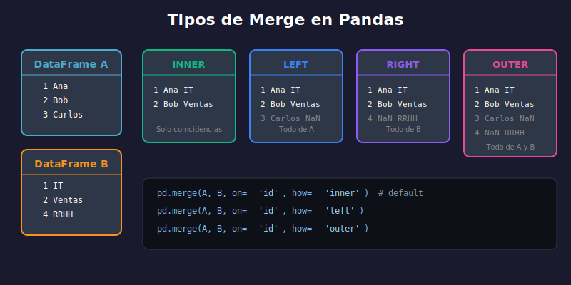

# 🔗 Agrupación y Combinación de Datos

## 🎯 Objetivos

- Dominar groupby para agregaciones
- Combinar DataFrames con merge y join
- Concatenar datos con concat
- Crear tablas pivote y de contingencia

---

## 1. Agrupación con groupby()

`groupby()` divide los datos en grupos, aplica una función y combina resultados.

### Concepto Split-Apply-Combine

```
DataFrame Original
       ↓
    Split (agrupar por columna)
       ↓
    Apply (aplicar función a cada grupo)
       ↓
    Combine (combinar resultados)
```

### Agregación Básica

```python
import pandas as pd

df = pd.DataFrame({
    'departamento': ['IT', 'Ventas', 'IT', 'RRHH', 'Ventas', 'IT'],
    'empleado': ['Ana', 'Bob', 'Carlos', 'Diana', 'Eva', 'Frank'],
    'salario': [55000, 48000, 62000, 45000, 51000, 58000],
    'años': [3, 5, 7, 2, 4, 6]
})

# Agrupar y calcular media
print(df.groupby('departamento')['salario'].mean())
# departamento
# IT        58333.33
# RRHH      45000.00
# Ventas    49500.00

# Múltiples agregaciones
print(df.groupby('departamento')['salario'].agg(['mean', 'sum', 'count']))
#                  mean     sum  count
# departamento
# IT           58333.33  175000      3
# RRHH         45000.00   45000      1
# Ventas       49500.00   99000      2
```

### Múltiples Columnas de Agrupación

```python
# Agrupar por múltiples columnas
df['nivel'] = ['Senior', 'Junior', 'Senior', 'Junior', 'Mid', 'Mid']

grouped = df.groupby(['departamento', 'nivel'])['salario'].mean()
print(grouped)
# departamento  nivel
# IT            Mid       58000.0
#               Senior    58500.0
# RRHH          Junior    45000.0
# Ventas        Junior    48000.0
#               Mid       51000.0
```

### Agregaciones Personalizadas con agg()

```python
# Diccionario de agregaciones por columna
agg_dict = {
    'salario': ['mean', 'sum', 'max'],
    'años': ['mean', 'max']
}
result = df.groupby('departamento').agg(agg_dict)
print(result)

# Agregaciones con nombres personalizados
result = df.groupby('departamento').agg(
    salario_promedio=('salario', 'mean'),
    salario_total=('salario', 'sum'),
    empleados=('empleado', 'count'),
    experiencia_max=('años', 'max')
)
print(result)

# Funciones personalizadas
def rango(x):
    return x.max() - x.min()

result = df.groupby('departamento')['salario'].agg(['mean', rango])
print(result)
```

### Transformaciones con transform()

`transform()` devuelve un resultado del mismo tamaño que el input.

```python
# Agregar media del departamento a cada fila
df['salario_dept_mean'] = df.groupby('departamento')['salario'].transform('mean')

# Normalizar salario dentro del departamento
df['salario_norm'] = df.groupby('departamento')['salario'].transform(
    lambda x: (x - x.mean()) / x.std()
)

# Ranking dentro del grupo
df['rank_dept'] = df.groupby('departamento')['salario'].transform('rank')
```

### Filtrado de Grupos con filter()

```python
# Mantener solo departamentos con más de 1 empleado
df_filtered = df.groupby('departamento').filter(lambda x: len(x) > 1)

# Mantener grupos donde el salario promedio > 50000
df_filtered = df.groupby('departamento').filter(lambda x: x['salario'].mean() > 50000)
```

---

## 2. Combinación con merge()

`merge()` combina DataFrames basándose en columnas comunes (como JOIN en SQL).

### Tipos de Join



```python
# DataFrames de ejemplo
empleados = pd.DataFrame({
    'emp_id': [1, 2, 3, 4],
    'nombre': ['Ana', 'Bob', 'Carlos', 'Diana'],
    'dept_id': [10, 20, 10, 30]
})

departamentos = pd.DataFrame({
    'dept_id': [10, 20, 40],
    'dept_nombre': ['IT', 'Ventas', 'Marketing']
})
```

### Inner Join (default)

Solo filas con coincidencia en ambos DataFrames.

```python
result = pd.merge(empleados, departamentos, on='dept_id')
# o: empleados.merge(departamentos, on='dept_id')
print(result)
#    emp_id  nombre  dept_id dept_nombre
# 0       1     Ana       10          IT
# 1       3  Carlos       10          IT
# 2       2     Bob       20      Ventas
```

### Left Join

Todas las filas del DataFrame izquierdo.

```python
result = pd.merge(empleados, departamentos, on='dept_id', how='left')
print(result)
#    emp_id  nombre  dept_id dept_nombre
# 0       1     Ana       10          IT
# 1       2     Bob       20      Ventas
# 2       3  Carlos       10          IT
# 3       4   Diana       30         NaN  <- No hay dept 30
```

### Right Join

Todas las filas del DataFrame derecho.

```python
result = pd.merge(empleados, departamentos, on='dept_id', how='right')
print(result)
#    emp_id  nombre  dept_id dept_nombre
# 0     1.0     Ana       10          IT
# 1     3.0  Carlos       10          IT
# 2     2.0     Bob       20      Ventas
# 3     NaN     NaN       40   Marketing  <- No hay empleados
```

### Outer Join

Todas las filas de ambos DataFrames.

```python
result = pd.merge(empleados, departamentos, on='dept_id', how='outer')
print(result)
#    emp_id  nombre  dept_id dept_nombre
# 0     1.0     Ana       10          IT
# 1     3.0  Carlos       10          IT
# 2     2.0     Bob       20      Ventas
# 3     4.0   Diana       30         NaN
# 4     NaN     NaN       40   Marketing
```

### Merge con Columnas de Diferente Nombre

```python
empleados = pd.DataFrame({
    'emp_id': [1, 2, 3],
    'nombre': ['Ana', 'Bob', 'Carlos'],
    'department': [10, 20, 10]  # Nombre diferente
})

departamentos = pd.DataFrame({
    'id': [10, 20],             # Nombre diferente
    'dept_nombre': ['IT', 'Ventas']
})

# Especificar columnas left y right
result = pd.merge(empleados, departamentos,
                  left_on='department', right_on='id')
```

### Merge por Índice

```python
# on index
result = pd.merge(df1, df2, left_index=True, right_index=True)

# Combinación índice y columna
result = pd.merge(df1, df2, left_index=True, right_on='col')
```

---

## 3. Concatenación con concat()

`concat()` apila DataFrames vertical u horizontalmente.

### Concatenación Vertical (filas)

```python
df1 = pd.DataFrame({'A': [1, 2], 'B': [3, 4]})
df2 = pd.DataFrame({'A': [5, 6], 'B': [7, 8]})

# Concatenar verticalmente
result = pd.concat([df1, df2])
print(result)
#    A  B
# 0  1  3
# 1  2  4
# 0  5  7  <- Índice repetido
# 1  6  8

# Ignorar índice original
result = pd.concat([df1, df2], ignore_index=True)
print(result)
#    A  B
# 0  1  3
# 1  2  4
# 2  5  7
# 3  6  8
```

### Concatenación Horizontal (columnas)

```python
df1 = pd.DataFrame({'A': [1, 2], 'B': [3, 4]})
df2 = pd.DataFrame({'C': [5, 6], 'D': [7, 8]})

result = pd.concat([df1, df2], axis=1)
print(result)
#    A  B  C  D
# 0  1  3  5  7
# 1  2  4  6  8
```

### Manejar Columnas Diferentes

```python
df1 = pd.DataFrame({'A': [1, 2], 'B': [3, 4]})
df2 = pd.DataFrame({'A': [5, 6], 'C': [7, 8]})

# join='outer' (default): mantiene todas las columnas
result = pd.concat([df1, df2], ignore_index=True)
print(result)
#    A    B    C
# 0  1  3.0  NaN
# 1  2  4.0  NaN
# 2  5  NaN  7.0
# 3  6  NaN  8.0

# join='inner': solo columnas comunes
result = pd.concat([df1, df2], ignore_index=True, join='inner')
print(result)
#    A
# 0  1
# 1  2
# 2  5
# 3  6
```

---

## 4. Tablas Pivote

### pivot_table()

Crea tabla resumen como en Excel.

```python
df = pd.DataFrame({
    'fecha': ['2024-01', '2024-01', '2024-02', '2024-02'],
    'producto': ['A', 'B', 'A', 'B'],
    'region': ['Norte', 'Norte', 'Sur', 'Sur'],
    'ventas': [100, 150, 200, 120]
})

# Pivot básico
pivot = df.pivot_table(
    values='ventas',      # Valores a agregar
    index='fecha',        # Filas
    columns='producto',   # Columnas
    aggfunc='sum'         # Función de agregación
)
print(pivot)
# producto    A    B
# fecha
# 2024-01   100  150
# 2024-02   200  120

# Múltiples agregaciones
pivot = df.pivot_table(
    values='ventas',
    index='fecha',
    columns='producto',
    aggfunc=['sum', 'mean', 'count']
)

# Múltiples índices
pivot = df.pivot_table(
    values='ventas',
    index=['fecha', 'region'],
    columns='producto',
    aggfunc='sum',
    fill_value=0,        # Reemplazar NaN
    margins=True         # Agregar totales
)
```

### pivot() (sin agregación)

```python
# Cuando cada combinación índice-columna es única
df = pd.DataFrame({
    'fecha': ['2024-01', '2024-01', '2024-02', '2024-02'],
    'metrica': ['ventas', 'gastos', 'ventas', 'gastos'],
    'valor': [100, 50, 150, 60]
})

pivot = df.pivot(index='fecha', columns='metrica', values='valor')
print(pivot)
# metrica  gastos  ventas
# fecha
# 2024-01      50     100
# 2024-02      60     150
```

### melt() (unpivot)

Convierte columnas a filas (opuesto a pivot).

```python
df = pd.DataFrame({
    'nombre': ['Ana', 'Bob'],
    'Q1': [100, 150],
    'Q2': [120, 160],
    'Q3': [110, 155]
})
print(df)
#   nombre   Q1   Q2   Q3
# 0    Ana  100  120  110
# 1    Bob  150  160  155

# Melt: convertir Q1, Q2, Q3 a filas
melted = df.melt(
    id_vars=['nombre'],       # Columnas a mantener
    value_vars=['Q1', 'Q2', 'Q3'],  # Columnas a convertir
    var_name='trimestre',     # Nombre para la columna de variables
    value_name='ventas'       # Nombre para la columna de valores
)
print(melted)
#   nombre trimestre  ventas
# 0    Ana        Q1     100
# 1    Bob        Q1     150
# 2    Ana        Q2     120
# 3    Bob        Q2     160
# 4    Ana        Q3     110
# 5    Bob        Q3     155
```

---

## 5. Tablas de Contingencia

`crosstab()` cuenta frecuencias de combinaciones.

```python
df = pd.DataFrame({
    'genero': ['M', 'F', 'M', 'F', 'M', 'F'],
    'departamento': ['IT', 'IT', 'Ventas', 'Ventas', 'IT', 'RRHH'],
    'nivel': ['Senior', 'Junior', 'Junior', 'Senior', 'Senior', 'Junior']
})

# Tabla de contingencia básica
ct = pd.crosstab(df['genero'], df['departamento'])
print(ct)
# departamento  IT  RRHH  Ventas
# genero
# F              1     1       1
# M              2     0       1

# Con márgenes
ct = pd.crosstab(df['genero'], df['departamento'], margins=True)

# Normalizar (porcentajes)
ct = pd.crosstab(df['genero'], df['departamento'], normalize='all')  # Total
ct = pd.crosstab(df['genero'], df['departamento'], normalize='index')  # Por fila
ct = pd.crosstab(df['genero'], df['departamento'], normalize='columns')  # Por columna
```

---

## 6. Ejemplo Completo

```python
import pandas as pd

# Dataset de ventas
ventas = pd.DataFrame({
    'fecha': pd.date_range('2024-01-01', periods=10, freq='D'),
    'producto': ['A', 'B', 'A', 'C', 'B', 'A', 'C', 'B', 'A', 'C'],
    'region': ['Norte', 'Sur', 'Norte', 'Sur', 'Norte', 'Sur', 'Norte', 'Sur', 'Norte', 'Sur'],
    'cantidad': [10, 15, 8, 20, 12, 9, 18, 14, 11, 22],
    'precio': [100, 80, 100, 50, 80, 100, 50, 80, 100, 50]
})
ventas['total'] = ventas['cantidad'] * ventas['precio']

print("=== Dataset de Ventas ===")
print(ventas)
print()

# Agrupación: ventas por producto
print("=== Ventas por Producto ===")
por_producto = ventas.groupby('producto').agg({
    'cantidad': 'sum',
    'total': ['sum', 'mean']
})
print(por_producto)
print()

# Agrupación: ventas por región y producto
print("=== Ventas por Región y Producto ===")
por_region_producto = ventas.groupby(['region', 'producto'])['total'].sum().unstack()
print(por_region_producto)
print()

# Pivot Table
print("=== Pivot Table ===")
pivot = pd.pivot_table(
    ventas,
    values='total',
    index='region',
    columns='producto',
    aggfunc='sum',
    margins=True
)
print(pivot)
print()

# Productos con info
productos = pd.DataFrame({
    'producto': ['A', 'B', 'C'],
    'categoria': ['Electrónica', 'Hogar', 'Alimentos'],
    'proveedor': ['Prov1', 'Prov2', 'Prov1']
})

# Merge para agregar categoría
ventas_completas = pd.merge(ventas, productos, on='producto')
print("=== Ventas con Categoría ===")
print(ventas_completas.head())
print()

# Ventas por categoría
print("=== Ventas por Categoría ===")
print(ventas_completas.groupby('categoria')['total'].sum())
```

---

## ✅ Resumen

| Operación           | Método          | Uso                               |
| ------------------- | --------------- | --------------------------------- |
| Agrupar             | `groupby()`     | Dividir-Aplicar-Combinar          |
| Agregar             | `agg()`         | Múltiples funciones de agregación |
| Transformar         | `transform()`   | Mantener mismo tamaño             |
| Combinar (SQL-like) | `merge()`       | Join por columnas                 |
| Apilar              | `concat()`      | Vertical u horizontal             |
| Tabla resumen       | `pivot_table()` | Agregación 2D                     |
| Unpivot             | `melt()`        | Columnas a filas                  |
| Contingencia        | `crosstab()`    | Contar frecuencias                |

---

## 🔗 Navegación

| Anterior                                                     | Índice                       |
| ------------------------------------------------------------ | ---------------------------- |
| [← Limpieza y Transformación](03-limpieza-transformacion.md) | [📚 Semana 08](../README.md) |
