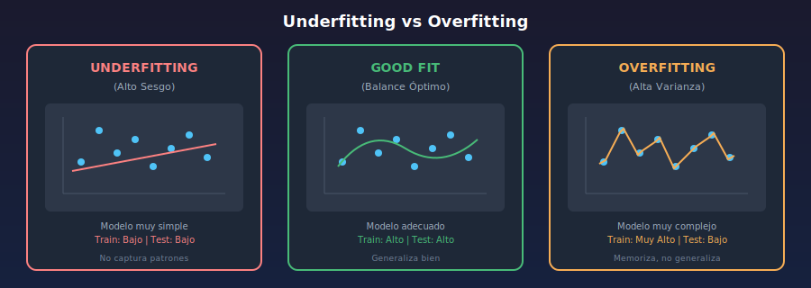
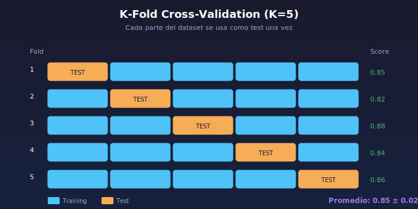
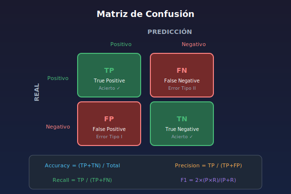

# 🎯 Conceptos Fundamentales de Machine Learning

## 🎯 Objetivos

- Comprender train/test split y su importancia
- Entender overfitting y underfitting
- Conocer el tradeoff sesgo-varianza
- Aplicar validación cruzada
- Interpretar métricas de evaluación

---

## 1. División de Datos: Train/Test Split

### ¿Por qué dividir los datos?

Si entrenamos y evaluamos con los mismos datos, no sabemos si el modelo **generaliza** o solo **memoriza**.


### Implementación

```python
from sklearn.model_selection import train_test_split
import pandas as pd

# Cargar datos
df = pd.read_csv('data/dataset.csv')
X = df.drop('target', axis=1)
y = df['target']

# División 80/20
X_train, X_test, y_train, y_test = train_test_split(
    X, y,
    test_size=0.2,       # 20% para test
    random_state=42,     # Reproducibilidad
    stratify=y           # Mantener proporción de clases
)

print(f'Training set: {len(X_train)} samples')
print(f'Test set: {len(X_test)} samples')
```

### División Train/Validation/Test

Para proyectos más robustos, se utiliza una tercera división:

- **Train (60%)**: Para entrenar el modelo
- **Validation (20%)**: Para ajustar hiperparámetros
- **Test (20%)**: Para evaluación final

```python
# División en tres conjuntos
X_temp, X_test, y_temp, y_test = train_test_split(
    X, y, test_size=0.2, random_state=42
)

X_train, X_val, y_train, y_val = train_test_split(
    X_temp, y_temp, test_size=0.25, random_state=42  # 0.25 * 0.8 = 0.2
)

print(f'Train: {len(X_train)}, Val: {len(X_val)}, Test: {len(X_test)}')
```

---

## 2. Overfitting y Underfitting

### Definiciones

| Concepto         | Definición                             | Síntoma                           |
| ---------------- | -------------------------------------- | --------------------------------- |
| **Underfitting** | Modelo muy simple, no captura patrones | Bajo score en train Y test        |
| **Overfitting**  | Modelo memoriza datos, no generaliza   | Alto score en train, bajo en test |
| **Good Fit**     | Modelo generaliza bien                 | Scores similares y altos          |

### Visualización



### Ejemplo en Código

```python
from sklearn.linear_model import LinearRegression
from sklearn.tree import DecisionTreeRegressor
from sklearn.preprocessing import PolynomialFeatures
from sklearn.model_selection import train_test_split
import numpy as np

# Datos sintéticos
np.random.seed(42)
X = np.sort(np.random.rand(100, 1) * 10, axis=0)
y = np.sin(X).ravel() + np.random.randn(100) * 0.3

X_train, X_test, y_train, y_test = train_test_split(X, y, test_size=0.2)

# Underfitting: Modelo muy simple
modelo_simple = LinearRegression()
modelo_simple.fit(X_train, y_train)
print(f'Lineal - Train: {modelo_simple.score(X_train, y_train):.3f}')
print(f'Lineal - Test:  {modelo_simple.score(X_test, y_test):.3f}')

# Good fit: Modelo adecuado
poly = PolynomialFeatures(degree=3)
X_poly_train = poly.fit_transform(X_train)
X_poly_test = poly.transform(X_test)
modelo_medio = LinearRegression()
modelo_medio.fit(X_poly_train, y_train)
print(f'\nPoly(3) - Train: {modelo_medio.score(X_poly_train, y_train):.3f}')
print(f'Poly(3) - Test:  {modelo_medio.score(X_poly_test, y_test):.3f}')

# Overfitting: Modelo muy complejo
modelo_complejo = DecisionTreeRegressor(max_depth=None)
modelo_complejo.fit(X_train, y_train)
print(f'\nTree - Train: {modelo_complejo.score(X_train, y_train):.3f}')
print(f'Tree - Test:  {modelo_complejo.score(X_test, y_test):.3f}')
```

Salida típica:

```
Lineal - Train: 0.102  ← Underfitting
Lineal - Test:  0.095

Poly(3) - Train: 0.892  ← Good fit
Poly(3) - Test:  0.867

Tree - Train: 1.000     ← Overfitting
Tree - Test:  0.654
```

### ¿Cómo Solucionar?

| Problema         | Soluciones                                              |
| ---------------- | ------------------------------------------------------- |
| **Underfitting** | Modelo más complejo, más features, menos regularización |
| **Overfitting**  | Más datos, regularización, modelo más simple, dropout   |

---

## 3. Tradeoff Sesgo-Varianza (Bias-Variance)

### Definiciones

- **Sesgo (Bias)**: Error por suposiciones simplificadoras del modelo
- **Varianza**: Sensibilidad del modelo a fluctuaciones en los datos

### Relación con Over/Underfitting

$$\text{Error Total} = \text{Sesgo}^2 + \text{Varianza} + \text{Ruido irreducible}$$

| Complejidad | Sesgo | Varianza | Estado       |
| ----------- | ----- | -------- | ------------ |
| Baja        | Alto  | Bajo     | Underfitting |
| Media       | Bajo  | Bajo     | **Óptimo**   |
| Alta        | Bajo  | Alto     | Overfitting  |

### Ejemplo Intuitivo

```python
# Analogía: Arqueros
# Sesgo = qué tan centrados están los tiros respecto al centro
# Varianza = qué tan dispersos están los tiros entre sí

archero_alto_sesgo = "Tiros consistentes pero lejos del centro"
archero_alta_varianza = "Tiros muy dispersos, algunos cerca"
archero_optimo = "Tiros consistentes y centrados"
```

---

## 4. Validación Cruzada (Cross-Validation)

### Problema del Train/Test Simple

Una sola división puede no ser representativa del rendimiento real.

### K-Fold Cross-Validation

Divide datos en K partes, entrena K veces usando cada parte como test.



### Implementación

```python
from sklearn.model_selection import cross_val_score, KFold
from sklearn.ensemble import RandomForestClassifier

modelo = RandomForestClassifier(random_state=42)

# Cross-validation simple
scores = cross_val_score(modelo, X, y, cv=5, scoring='accuracy')

print(f'Scores por fold: {scores}')
print(f'Accuracy: {scores.mean():.3f} (+/- {scores.std() * 2:.3f})')
```

### Stratified K-Fold (Para Clasificación)

Mantiene la proporción de clases en cada fold.

```python
from sklearn.model_selection import StratifiedKFold

skf = StratifiedKFold(n_splits=5, shuffle=True, random_state=42)

scores = cross_val_score(modelo, X, y, cv=skf, scoring='f1')
print(f'F1 Stratified: {scores.mean():.3f} (+/- {scores.std() * 2:.3f})')
```

---

## 5. Métricas de Evaluación

### Métricas de Clasificación

#### Matriz de Confusión



#### Métricas Derivadas

```python
from sklearn.metrics import (
    accuracy_score, precision_score, recall_score,
    f1_score, confusion_matrix
)

y_true = [1, 0, 1, 1, 0, 1, 0, 0, 1, 0]
y_pred = [1, 0, 1, 0, 0, 1, 1, 0, 1, 0]

# Accuracy: (TP + TN) / Total
print(f'Accuracy: {accuracy_score(y_true, y_pred):.3f}')

# Precision: TP / (TP + FP) - De los que predije positivo, cuántos eran?
print(f'Precision: {precision_score(y_true, y_pred):.3f}')

# Recall: TP / (TP + FN) - De los positivos reales, cuántos encontré?
print(f'Recall: {recall_score(y_true, y_pred):.3f}')

# F1-Score: 2 * (Precision * Recall) / (Precision + Recall)
print(f'F1-Score: {f1_score(y_true, y_pred):.3f}')
```

#### ¿Cuándo Usar Cada Métrica?

| Métrica       | Usar cuando...           | Ejemplo                                  |
| ------------- | ------------------------ | ---------------------------------------- |
| **Accuracy**  | Clases balanceadas       | Clasificación general                    |
| **Precision** | Costo alto de FP         | Filtro de spam (no perder emails buenos) |
| **Recall**    | Costo alto de FN         | Detección de cáncer (no miss casos)      |
| **F1-Score**  | Balance precision/recall | Casos desbalanceados                     |

### Métricas de Regresión

```python
from sklearn.metrics import (
    mean_squared_error, mean_absolute_error,
    r2_score, mean_absolute_percentage_error
)

y_true = [100, 150, 200, 250, 300]
y_pred = [110, 145, 210, 240, 290]

# MAE: Error absoluto promedio
print(f'MAE: {mean_absolute_error(y_true, y_pred):.2f}')

# MSE: Error cuadrático promedio
print(f'MSE: {mean_squared_error(y_true, y_pred):.2f}')

# RMSE: Raíz del MSE (mismas unidades que y)
print(f'RMSE: {mean_squared_error(y_true, y_pred, squared=False):.2f}')

# R²: Proporción de varianza explicada (1 = perfecto)
print(f'R²: {r2_score(y_true, y_pred):.3f}')

# MAPE: Error porcentual
print(f'MAPE: {mean_absolute_percentage_error(y_true, y_pred):.2%}')
```

| Métrica | Fórmula                          | Interpretación                             |
| ------- | -------------------------------- | ------------------------------------------ |
| MAE     | $\frac{1}{n}\sum\|y - \hat{y}\|$ | Error promedio en unidades originales      |
| MSE     | $\frac{1}{n}\sum(y - \hat{y})^2$ | Penaliza errores grandes                   |
| RMSE    | $\sqrt{MSE}$                     | Como MAE pero penaliza más errores grandes |
| R²      | $1 - \frac{SS_{res}}{SS_{tot}}$  | 1 = perfecto, 0 = igual que predecir media |

---

## 6. Regularización

### ¿Qué es?

Técnica para prevenir overfitting penalizando la complejidad del modelo.

### Tipos en Regresión Lineal

```python
from sklearn.linear_model import Ridge, Lasso, ElasticNet

# Ridge (L2): Penaliza pesos grandes
ridge = Ridge(alpha=1.0)
ridge.fit(X_train, y_train)

# Lasso (L1): Puede hacer pesos = 0 (selección de features)
lasso = Lasso(alpha=1.0)
lasso.fit(X_train, y_train)

# ElasticNet: Combina L1 y L2
elastic = ElasticNet(alpha=1.0, l1_ratio=0.5)
elastic.fit(X_train, y_train)
```

### Regularización en Árboles

```python
from sklearn.tree import DecisionTreeClassifier

# Sin regularización (overfitting)
arbol_sin_reg = DecisionTreeClassifier(max_depth=None)

# Con regularización
arbol_con_reg = DecisionTreeClassifier(
    max_depth=5,           # Limitar profundidad
    min_samples_split=10,  # Mínimo samples para dividir
    min_samples_leaf=5     # Mínimo samples en hojas
)
```

---

## 7. Ejemplo Integrador

```python
"""Diagnóstico completo de un modelo"""

import pandas as pd
import numpy as np
from sklearn.model_selection import train_test_split, cross_val_score
from sklearn.ensemble import RandomForestClassifier
from sklearn.metrics import classification_report, confusion_matrix
from sklearn.datasets import make_classification

# Datos
X, y = make_classification(
    n_samples=1000, n_features=20,
    n_informative=10, random_state=42
)

# División
X_train, X_test, y_train, y_test = train_test_split(
    X, y, test_size=0.2, random_state=42, stratify=y
)

# Modelo
modelo = RandomForestClassifier(n_estimators=100, random_state=42)

# Cross-validation
cv_scores = cross_val_score(modelo, X_train, y_train, cv=5, scoring='f1')
print(f'CV F1-Score: {cv_scores.mean():.3f} (+/- {cv_scores.std()*2:.3f})')

# Entrenar y evaluar
modelo.fit(X_train, y_train)

# Diagnóstico de overfitting
train_score = modelo.score(X_train, y_train)
test_score = modelo.score(X_test, y_test)
print(f'\nTrain Accuracy: {train_score:.3f}')
print(f'Test Accuracy:  {test_score:.3f}')
print(f'Gap: {train_score - test_score:.3f}')

if train_score - test_score > 0.1:
    print('⚠️  Posible overfitting detectado')
elif test_score < 0.7:
    print('⚠️  Posible underfitting detectado')
else:
    print('✅ El modelo parece generalizar bien')

# Reporte completo
y_pred = modelo.predict(X_test)
print('\n' + classification_report(y_test, y_pred))
```

---

## ✅ Resumen de Conceptos

| Concepto         | Definición                                  | Solución                  |
| ---------------- | ------------------------------------------- | ------------------------- |
| Train/Test Split | Dividir datos para evaluar generalización   | `train_test_split()`      |
| Overfitting      | Modelo memoriza, no generaliza              | Regularización, más datos |
| Underfitting     | Modelo muy simple                           | Modelo más complejo       |
| Bias-Variance    | Tradeoff entre simplicidad y flexibilidad   | Encontrar balance         |
| Cross-Validation | Evaluación robusta con múltiples divisiones | `cross_val_score()`       |
| Regularización   | Penalizar complejidad                       | Ridge, Lasso, max_depth   |

---

## 🔗 Navegación

| Anterior                                          | Siguiente                      |
| ------------------------------------------------- | ------------------------------ |
| [← Flujo de Proyecto ML](03-flujo-proyecto-ml.md) | [Prácticas →](../2-practicas/) |
