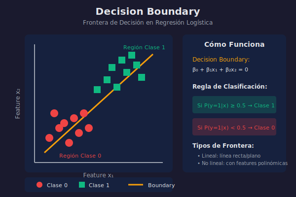

# Regresión Logística

## 🎯 Objetivos

- Entender por qué regresión lineal no sirve para clasificación
- Comprender la función sigmoide
- Implementar regresión logística para clasificación binaria
- Interpretar coeficientes como odds ratios

## 📖 De Regresión a Clasificación

A pesar de su nombre, la **regresión logística** es un algoritmo de **clasificación**, no de regresión.

### ¿Por qué no usar regresión lineal para clasificación?

Si usamos regresión lineal para predecir clases (0 o 1):

- Puede predecir valores < 0 o > 1
- No tiene sentido probabilístico
- Sensible a outliers

**Solución**: Usar una función que mapee cualquier valor a un rango [0, 1].

## 📊 Función Sigmoide

La **función sigmoide** (o logística) transforma cualquier número real en un valor entre 0 y 1:

$$\sigma(z) = \frac{1}{1 + e^{-z}}$$


### Propiedades

- **Rango**: $(0, 1)$ - interpreta como probabilidad
- **Centro**: $\sigma(0) = 0.5$
- **Asíntotas**: $\lim_{z \to -\infty} \sigma(z) = 0$, $\lim_{z \to +\infty} \sigma(z) = 1$
- **Derivada**: $\sigma'(z) = \sigma(z)(1 - \sigma(z))$

### En Regresión Logística

Combinamos la regresión lineal con la sigmoide:

$$P(y=1|x) = \sigma(\beta_0 + \beta_1 x_1 + ... + \beta_n x_n)$$

$$P(y=1|x) = \frac{1}{1 + e^{-(\beta_0 + \beta_1 x_1 + ... + \beta_n x_n)}}$$

## 🎯 Decision Boundary

La **frontera de decisión** es donde $P(y=1|x) = 0.5$:

$$\beta_0 + \beta_1 x_1 + ... + \beta_n x_n = 0$$



### Regla de Clasificación

```python
if P(y=1|x) >= 0.5:
    clase = 1
else:
    clase = 0
```

## 💻 Implementación con Scikit-learn

```python
from sklearn.linear_model import LogisticRegression
from sklearn.model_selection import train_test_split
from sklearn.metrics import accuracy_score, classification_report
from sklearn.datasets import load_breast_cancer

# Cargar dataset
data = load_breast_cancer()
X = data.data
y = data.target

# Dividir datos
X_train, X_test, y_train, y_test = train_test_split(
    X, y, test_size=0.2, random_state=42, stratify=y
)

# Crear y entrenar modelo
modelo = LogisticRegression(max_iter=1000)
modelo.fit(X_train, y_train)

# Predicciones
y_pred = modelo.predict(X_test)

# Evaluación
print(f'Accuracy: {accuracy_score(y_test, y_pred):.4f}')
print('\nClassification Report:')
print(classification_report(y_test, y_pred, target_names=data.target_names))
```

## 📊 Probabilidades

Regresión logística no solo predice clases, sino **probabilidades**:

```python
# Probabilidades de cada clase
proba = modelo.predict_proba(X_test)

print('Primeras 5 predicciones:')
print('P(clase 0)  P(clase 1)  Predicción  Real')
print('-' * 45)
for i in range(5):
    print(f'{proba[i][0]:.3f}       {proba[i][1]:.3f}        {y_pred[i]}           {y_test[i]}')
```

**Salida**:

```
P(clase 0)  P(clase 1)  Predicción  Real
---------------------------------------------
0.002       0.998        1           1
0.987       0.013        0           0
0.001       0.999        1           1
...
```

## 🔍 Interpretación de Coeficientes

### Odds y Log-Odds

La regresión logística modela el **log-odds** (logaritmo de las odds):

$$\log\left(\frac{P}{1-P}\right) = \beta_0 + \beta_1 x_1 + ...$$

### Interpretación de βⱼ

$\beta_j$ representa el cambio en **log-odds** por cada unidad de cambio en $x_j$.

Para interpretación más intuitiva, usamos el **odds ratio**:

$$OR_j = e^{\beta_j}$$

```python
import numpy as np

# Ver coeficientes para las primeras 5 features
print('Feature              Coef (β)    Odds Ratio')
print('-' * 50)
for name, coef in zip(data.feature_names[:5], modelo.coef_[0][:5]):
    odds_ratio = np.exp(coef)
    print(f'{name:20} {coef:8.3f}    {odds_ratio:.3f}')
```

### Interpretación del Odds Ratio

| Odds Ratio | Interpretación                        |
| ---------- | ------------------------------------- |
| OR = 1     | Sin efecto                            |
| OR > 1     | Aumenta la probabilidad de clase 1    |
| OR < 1     | Disminuye la probabilidad de clase 1  |
| OR = 2     | Duplica las odds de clase 1           |
| OR = 0.5   | Reduce a la mitad las odds de clase 1 |

## ⚙️ Hiperparámetros Importantes

### Parámetro C (Regularización)

`C` controla la regularización (inverso de la fuerza):

```python
# C grande = menos regularización
modelo_high_c = LogisticRegression(C=10, max_iter=1000)

# C pequeño = más regularización
modelo_low_c = LogisticRegression(C=0.1, max_iter=1000)
```

### Solver

Diferentes algoritmos de optimización:

```python
# Para datasets pequeños
LogisticRegression(solver='lbfgs')

# Para datasets grandes
LogisticRegression(solver='sag')

# Para regularización L1 (Lasso)
LogisticRegression(solver='saga', penalty='l1')
```

## 📊 Clasificación Multiclase

Regresión logística puede extenderse a múltiples clases:

```python
from sklearn.datasets import load_iris

iris = load_iris()
X, y = iris.data, iris.target

modelo_multi = LogisticRegression(max_iter=1000, multi_class='multinomial')
modelo_multi.fit(X, y)

# Probabilidades para 3 clases
proba = modelo_multi.predict_proba(X[:3])
print('Probabilidades (setosa, versicolor, virginica):')
print(proba)
```

## 🆚 Regresión Lineal vs Logística

| Aspecto     | Regresión Lineal | Regresión Logística |
| ----------- | ---------------- | ------------------- |
| **Tarea**   | Regresión        | Clasificación       |
| **Output**  | Valor continuo   | Probabilidad [0,1]  |
| **Target**  | Continuo         | Categórico          |
| **Función** | Identidad        | Sigmoide            |
| **Costo**   | MSE              | Log-loss            |

## ✅ Checklist de Verificación

- [ ] Entiendo por qué usamos sigmoide para clasificación
- [ ] Puedo interpretar probabilidades y decision boundary
- [ ] Sé usar LogisticRegression de sklearn
- [ ] Puedo interpretar coeficientes como odds ratios
- [ ] Conozco la diferencia entre regresión lineal y logística

## 🔗 Recursos Adicionales

- [Sklearn LogisticRegression](https://scikit-learn.org/stable/modules/generated/sklearn.linear_model.LogisticRegression.html)
- [StatQuest: Logistic Regression](https://www.youtube.com/watch?v=yIYKR4sgzI8)
