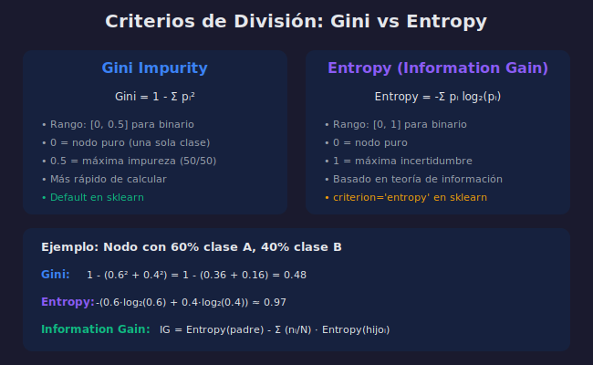

# Criterios de División: Gini vs Entropy

## 🎯 Objetivos

- Entender Gini Impurity y cómo se calcula
- Comprender Entropy e Information Gain
- Comparar ambos criterios
- Saber cuándo usar cada uno

## 📋 Contenido

### 1. ¿Por Qué Necesitamos Criterios?

El árbol debe decidir **qué feature y qué threshold** usar para dividir. Los criterios miden la **"pureza"** de los nodos resultantes.

- **Nodo puro**: Todas las muestras son de una sola clase
- **Nodo impuro**: Mezcla de clases



### 2. Gini Impurity

Mide la probabilidad de clasificar incorrectamente una muestra aleatoria.

#### Fórmula

$$Gini = 1 - \sum_{i=1}^{C} p_i^2$$

Donde $p_i$ es la proporción de muestras de clase $i$.

#### Propiedades

| Característica  | Valor         |
| --------------- | ------------- |
| Rango (binario) | [0, 0.5]      |
| Nodo puro       | 0             |
| Máxima impureza | 0.5 (50/50)   |
| Complejidad     | O(C) - rápido |

#### Ejemplo de Cálculo

```python
# Nodo con 60 muestras clase A, 40 muestras clase B
p_A = 60 / 100  # 0.6
p_B = 40 / 100  # 0.4

gini = 1 - (p_A**2 + p_B**2)
gini = 1 - (0.36 + 0.16)
gini = 0.48
```

### 3. Entropy (Entropía)

Basada en teoría de la información, mide el desorden o incertidumbre.

#### Fórmula

$$Entropy = -\sum_{i=1}^{C} p_i \log_2(p_i)$$

#### Propiedades

| Característica       | Valor                |
| -------------------- | -------------------- |
| Rango (binario)      | [0, 1]               |
| Nodo puro            | 0                    |
| Máxima incertidumbre | 1 (50/50)            |
| Complejidad          | O(C·log) - más lento |

#### Ejemplo de Cálculo

```python
import numpy as np

# Mismo nodo: 60% A, 40% B
p_A, p_B = 0.6, 0.4

entropy = -(p_A * np.log2(p_A) + p_B * np.log2(p_B))
entropy = -(0.6 * (-0.737) + 0.4 * (-1.322))
entropy = 0.971
```

### 4. Information Gain

Mide **cuánto reduce la entropía** una división.

#### Fórmula

$$IG = Entropy(padre) - \sum_{j} \frac{n_j}{n} \cdot Entropy(hijo_j)$$

#### Ejemplo

```python
# Nodo padre: 100 muestras (60 A, 40 B)
entropy_padre = 0.971

# División produce:
# - Hijo izquierdo: 50 muestras (45 A, 5 B)
# - Hijo derecho: 50 muestras (15 A, 35 B)

# Entropía hijos
p_A_izq, p_B_izq = 0.9, 0.1
entropy_izq = -(0.9 * np.log2(0.9) + 0.1 * np.log2(0.1))  # ≈ 0.469

p_A_der, p_B_der = 0.3, 0.7
entropy_der = -(0.3 * np.log2(0.3) + 0.7 * np.log2(0.7))  # ≈ 0.881

# Information Gain
ig = entropy_padre - (0.5 * entropy_izq + 0.5 * entropy_der)
ig = 0.971 - (0.5 * 0.469 + 0.5 * 0.881)
ig = 0.296
```

### 5. Comparación Gini vs Entropy

| Aspecto             | Gini          | Entropy            |
| ------------------- | ------------- | ------------------ |
| **Velocidad**       | ✅ Más rápido | Más lento (log)    |
| **Default sklearn** | ✅ Sí         | No                 |
| **Interpretación**  | Prob. error   | Teoría información |
| **Rango**           | [0, 0.5]      | [0, 1]             |
| **Resultados**      | Similares     | Similares          |

### 6. Uso en Scikit-learn

```python
from sklearn.tree import DecisionTreeClassifier

# Usando Gini (default)
tree_gini = DecisionTreeClassifier(criterion='gini')

# Usando Entropy
tree_entropy = DecisionTreeClassifier(criterion='entropy')

# Para regresión: MSE o MAE
from sklearn.tree import DecisionTreeRegressor

tree_mse = DecisionTreeRegressor(criterion='squared_error')  # default
tree_mae = DecisionTreeRegressor(criterion='absolute_error')
```

### 7. ¿Cuál Elegir?

En la práctica, **ambos dan resultados muy similares**.

```python
from sklearn.datasets import load_iris
from sklearn.model_selection import cross_val_score

iris = load_iris()
X, y = iris.data, iris.target

# Comparar
for criterion in ['gini', 'entropy']:
    tree = DecisionTreeClassifier(criterion=criterion, max_depth=4, random_state=42)
    scores = cross_val_score(tree, X, y, cv=5)
    print(f"{criterion}: {scores.mean():.4f} ± {scores.std():.4f}")
```

**Recomendación**: Usa Gini (default) a menos que tengas razón específica para Entropy.

### 8. Visualizar Impureza

```python
import numpy as np
import matplotlib.pyplot as plt

p = np.linspace(0.01, 0.99, 100)

# Gini
gini = 1 - p**2 - (1-p)**2

# Entropy
entropy = -p * np.log2(p) - (1-p) * np.log2(1-p)

plt.figure(figsize=(10, 6))
plt.plot(p, gini, label='Gini', linewidth=2)
plt.plot(p, entropy, label='Entropy', linewidth=2)
plt.xlabel('P(clase = 1)')
plt.ylabel('Impureza')
plt.title('Gini vs Entropy')
plt.legend()
plt.grid(True, alpha=0.3)
plt.savefig('gini_vs_entropy.png', dpi=150)
plt.show()
```

---

## ✅ Checklist de Verificación

- [ ] Sé calcular Gini Impurity manualmente
- [ ] Entiendo Entropy y su base en teoría de información
- [ ] Puedo calcular Information Gain
- [ ] Conozco las diferencias prácticas entre Gini y Entropy
- [ ] Sé cambiar el criterio en sklearn

---

## 📚 Recursos

- [Decision Tree - Mathematical Formulation](https://scikit-learn.org/stable/modules/tree.html#mathematical-formulation)
- [Gini vs Entropy - Towards Data Science](https://towardsdatascience.com/gini-impurity-vs-entropy-in-decision-trees-3a62ff79e917)
