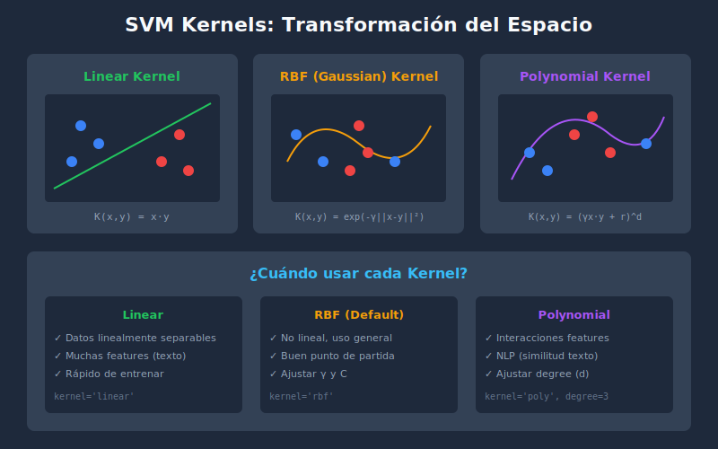

# Support Vector Machines (SVM)

## 🎯 Objetivos

- Comprender el concepto de hiperplano y margen máximo
- Entender los vectores de soporte
- Conocer los diferentes kernels y cuándo usarlos
- Implementar SVM con scikit-learn

## 📋 Contenido

### 1. ¿Qué es SVM?

Support Vector Machine es un algoritmo que busca el **hiperplano óptimo** que separa las clases maximizando el **margen**.


### 2. Conceptos Fundamentales

#### Hiperplano

Frontera de decisión definida por:

$$w \cdot x + b = 0$$

Donde:

- $w$: vector de pesos (normal al hiperplano)
- $b$: bias (intercepto)
- $x$: punto a clasificar

#### Margen

Distancia entre el hiperplano y los puntos más cercanos de cada clase.

$$\text{margen} = \frac{2}{||w||}$$

**Objetivo**: Maximizar el margen → Minimizar $||w||$

#### Vectores de Soporte

Puntos más cercanos al hiperplano que **definen** el margen. Son los únicos puntos que importan para el modelo.

### 3. SVM Lineal

```python
from sklearn.svm import SVC, LinearSVC
from sklearn.preprocessing import StandardScaler
from sklearn.pipeline import Pipeline

# SVC con kernel lineal
svm_linear = Pipeline([
    ('scaler', StandardScaler()),
    ('svm', SVC(kernel='linear'))
])

# LinearSVC (más rápido para grandes datasets)
linear_svc = Pipeline([
    ('scaler', StandardScaler()),
    ('svm', LinearSVC())
])

svm_linear.fit(X_train, y_train)
y_pred = svm_linear.predict(X_test)
```

### 4. Soft Margin: Parámetro C

En datos no perfectamente separables, permitimos algunos errores.

| C pequeño              | C grande              |
| ---------------------- | --------------------- |
| Margen amplio          | Margen estrecho       |
| Más errores permitidos | Menos errores         |
| Mejor generalización   | Riesgo de overfitting |

```python
# C bajo: más regularización
svm_soft = SVC(kernel='linear', C=0.1)

# C alto: menos errores de clasificación
svm_hard = SVC(kernel='linear', C=10)
```

### 5. Kernels: El Truco del Kernel

Para datos **no linealmente separables**, transformamos el espacio.



#### Tipos de Kernel

| Kernel         | Fórmula                                | Uso                        |
| -------------- | -------------------------------------- | -------------------------- |
| **Linear**     | $K(x,y) = x \cdot y$                   | Datos separables, texto    |
| **RBF**        | $K(x,y) = e^{-\gamma\|x-y\|^2}$        | Default, uso general       |
| **Polynomial** | $K(x,y) = (\gamma x \cdot y + r)^d$    | Interacciones features     |
| **Sigmoid**    | $K(x,y) = \tanh(\gamma x \cdot y + r)$ | Similar a redes neuronales |

```python
# RBF (default) - el más usado
svm_rbf = SVC(kernel='rbf', C=1.0, gamma='scale')

# Polynomial
svm_poly = SVC(kernel='poly', degree=3, C=1.0)

# Linear
svm_linear = SVC(kernel='linear', C=1.0)
```

### 6. Parámetro Gamma (γ)

Controla el alcance de influencia de cada punto de entrenamiento.

| γ pequeño        | γ grande            |
| ---------------- | ------------------- |
| Alcance amplio   | Alcance limitado    |
| Fronteras suaves | Fronteras complejas |
| Underfitting     | Overfitting         |

```python
# Gamma bajo
svm_low_gamma = SVC(kernel='rbf', gamma=0.01)

# Gamma alto
svm_high_gamma = SVC(kernel='rbf', gamma=10)

# Auto-calculado (recomendado)
svm_auto = SVC(kernel='rbf', gamma='scale')  # 1 / (n_features * X.var())
```

### 7. GridSearch para Hiperparámetros

```python
from sklearn.model_selection import GridSearchCV

param_grid = {
    'svm__C': [0.1, 1, 10, 100],
    'svm__gamma': ['scale', 'auto', 0.01, 0.1, 1],
    'svm__kernel': ['rbf', 'linear', 'poly']
}

pipeline = Pipeline([
    ('scaler', StandardScaler()),
    ('svm', SVC())
])

grid_search = GridSearchCV(pipeline, param_grid, cv=5, scoring='accuracy', n_jobs=-1)
grid_search.fit(X_train, y_train)

print(f"Mejores parámetros: {grid_search.best_params_}")
print(f"Mejor score: {grid_search.best_score_:.4f}")
```

### 8. SVM para Regresión (SVR)

```python
from sklearn.svm import SVR

svr = Pipeline([
    ('scaler', StandardScaler()),
    ('svr', SVR(kernel='rbf', C=1.0, epsilon=0.1))
])

svr.fit(X_train, y_train)
y_pred = svr.predict(X_test)
```

### 9. Probabilidades

Por defecto SVM no da probabilidades. Se puede activar con `probability=True`:

```python
svm_proba = SVC(kernel='rbf', probability=True)
svm_proba.fit(X_train, y_train)

# Probabilidades
proba = svm_proba.predict_proba(X_test)
```

⚠️ **Nota**: Activar probabilidades hace el entrenamiento más lento.

### 10. Ventajas y Desventajas

#### ✅ Ventajas

- Efectivo en alta dimensionalidad
- Funciona bien con pocos datos
- Versátil con diferentes kernels
- Robusto al overfitting (especialmente con margen)
- Solo depende de vectores de soporte

#### ❌ Desventajas

- Lento en datasets grandes (O(n²) a O(n³))
- Sensible a la escala (requiere normalización)
- Difícil de interpretar
- No da probabilidades naturalmente
- Selección de kernel y parámetros puede ser compleja

### 11. Ejemplo Completo

```python
from sklearn.datasets import load_breast_cancer
from sklearn.model_selection import train_test_split, GridSearchCV
from sklearn.preprocessing import StandardScaler
from sklearn.svm import SVC
from sklearn.pipeline import Pipeline
from sklearn.metrics import classification_report, confusion_matrix

# Cargar datos
cancer = load_breast_cancer()
X, y = cancer.data, cancer.target

# Split
X_train, X_test, y_train, y_test = train_test_split(
    X, y, test_size=0.2, random_state=42, stratify=y
)

# Pipeline
pipeline = Pipeline([
    ('scaler', StandardScaler()),
    ('svm', SVC())
])

# GridSearch
param_grid = {
    'svm__C': [0.1, 1, 10],
    'svm__gamma': ['scale', 0.01, 0.1],
    'svm__kernel': ['rbf', 'linear']
}

grid = GridSearchCV(pipeline, param_grid, cv=5, scoring='accuracy', n_jobs=-1)
grid.fit(X_train, y_train)

print(f"Mejores parámetros: {grid.best_params_}")
print(f"Mejor score CV: {grid.best_score_:.4f}")

# Evaluar
y_pred = grid.predict(X_test)
print(f"\nTest Accuracy: {grid.score(X_test, y_test):.4f}")
print("\nClassification Report:")
print(classification_report(y_test, y_pred, target_names=cancer.target_names))
```

---

## ✅ Checklist de Verificación

- [ ] Entiendo el concepto de hiperplano y margen máximo
- [ ] Conozco qué son los vectores de soporte
- [ ] Sé cuándo usar cada tipo de kernel
- [ ] Comprendo los parámetros C y gamma
- [ ] Puedo implementar y tunear SVM con sklearn

---

## 📚 Recursos

- [SVM - sklearn](https://scikit-learn.org/stable/modules/svm.html)
- [SVC](https://scikit-learn.org/stable/modules/generated/sklearn.svm.SVC.html)
- [Kernel Functions](https://scikit-learn.org/stable/modules/svm.html#kernel-functions)
