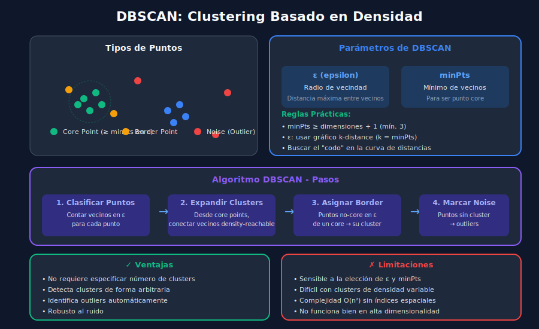

# 🔍 DBSCAN: Clustering Basado en Densidad

## 🎯 Objetivos de Aprendizaje

- Comprender el concepto de clustering por densidad
- Dominar los parámetros epsilon (ε) y minPts
- Implementar y configurar DBSCAN correctamente
- Usar DBSCAN para detección de anomalías
- Conocer variantes: OPTICS y HDBSCAN

---

## 📋 ¿Qué es DBSCAN?

**DBSCAN** (Density-Based Spatial Clustering of Applications with Noise) agrupa puntos que están **densamente conectados** y marca como **ruido** (outliers) los puntos en regiones de baja densidad.

### Ventajas sobre K-Means

| Aspecto            | K-Means                  | DBSCAN                      |
| ------------------ | ------------------------ | --------------------------- |
| Número de clusters | Debe especificarse       | Se descubre automáticamente |
| Forma de clusters  | Solo esféricos           | Cualquier forma             |
| Outliers           | Los incluye forzadamente | Los identifica              |
| Densidad variable  | No maneja                | Parcialmente                |



---

## 🔑 Conceptos Fundamentales

### Parámetros de DBSCAN

**ε (epsilon)**: Radio de vecindad

- Define qué tan lejos puede estar un vecino

**minPts**: Mínimo de puntos

- Cuántos vecinos necesita para ser un "core point"

### Tipos de Puntos

```
┌────────────────────────────────────────────────────────────────┐
│                                                                │
│   CORE POINT (●)              BORDER POINT (◐)                 │
│   ≥ minPts vecinos            < minPts vecinos                 │
│   dentro de ε                 pero en ε de un core             │
│                                                                │
│       ● ●                          ◐                           │
│      ● ● ●   ← core               ●●●                          │
│       ● ●                        ●●●●● ← core                  │
│                                   ●●●                          │
│                                                                │
│   NOISE POINT (✗)                                              │
│   No es core ni está                                           │
│   en ε de ningún core            ✗                             │
│                                                                │
└────────────────────────────────────────────────────────────────┘
```

### Definiciones Formales

```python
def is_core_point(point_idx: int, X: np.ndarray, eps: float,
                  min_pts: int) -> bool:
    """Check if a point is a core point."""
    neighbors = get_neighbors(point_idx, X, eps)
    return len(neighbors) >= min_pts


def get_neighbors(point_idx: int, X: np.ndarray, eps: float) -> list:
    """Get all points within eps distance of point."""
    distances = np.sqrt(np.sum((X - X[point_idx])**2, axis=1))
    return np.where(distances <= eps)[0].tolist()
```

---

## 🔄 El Algoritmo DBSCAN

### Pasos del Algoritmo

1. Para cada punto no visitado:

   - Calcular vecinos dentro de ε
   - Si tiene ≥ minPts vecinos → es **core point** → iniciar cluster
   - Si no → marcarlo como **ruido** (puede cambiar después)

2. Para expandir un cluster desde un core point:

   - Agregar todos sus vecinos al cluster
   - Para cada vecino que también es core → expandir recursivamente

3. Los puntos de ruido que están en ε de un core se convierten en **border points**

### Implementación desde Cero

```python
import numpy as np
from collections import deque

def dbscan_from_scratch(X: np.ndarray, eps: float, min_pts: int) -> np.ndarray:
    """
    Implement DBSCAN clustering from scratch.

    Args:
        X: Data matrix of shape (n_samples, n_features)
        eps: Maximum distance between neighbors
        min_pts: Minimum points to form a dense region

    Returns:
        labels: Cluster labels (-1 for noise)
    """
    n_samples = X.shape[0]
    labels = np.full(n_samples, -1)  # -1 = unvisited/noise
    cluster_id = 0

    def get_neighbors(point_idx: int) -> list:
        """Find all points within eps distance."""
        distances = np.sqrt(np.sum((X - X[point_idx])**2, axis=1))
        return np.where(distances <= eps)[0].tolist()

    def expand_cluster(point_idx: int, neighbors: list,
                       cluster_id: int) -> None:
        """Expand cluster from a core point using BFS."""
        labels[point_idx] = cluster_id
        queue = deque(neighbors)

        while queue:
            current_point = queue.popleft()

            # If it was noise, now it's a border point
            if labels[current_point] == -1:
                labels[current_point] = cluster_id

            # If already processed, skip
            if labels[current_point] != -1 and labels[current_point] != cluster_id:
                continue

            labels[current_point] = cluster_id

            # Get neighbors of current point
            current_neighbors = get_neighbors(current_point)

            # If current is also a core point, expand
            if len(current_neighbors) >= min_pts:
                for neighbor in current_neighbors:
                    if labels[neighbor] == -1:
                        queue.append(neighbor)

    # Main loop
    for point_idx in range(n_samples):
        if labels[point_idx] != -1:  # Already processed
            continue

        neighbors = get_neighbors(point_idx)

        if len(neighbors) < min_pts:
            labels[point_idx] = -1  # Mark as noise (for now)
        else:
            # Start new cluster
            expand_cluster(point_idx, neighbors, cluster_id)
            cluster_id += 1

    return labels


# Ejemplo de uso
from sklearn.datasets import make_moons

X, _ = make_moons(n_samples=200, noise=0.05, random_state=42)
labels = dbscan_from_scratch(X, eps=0.2, min_pts=5)

n_clusters = len(set(labels)) - (1 if -1 in labels else 0)
n_noise = list(labels).count(-1)
print(f"Clusters encontrados: {n_clusters}")
print(f"Puntos de ruido: {n_noise}")
```

---

## 🎛️ Selección de Parámetros

### Selección de minPts

**Regla general**: minPts ≥ dimensiones + 1

```python
# Recomendaciones prácticas
# - 2D: minPts = 4
# - Alta dimensionalidad: minPts = 2 * dim
# - Datasets con ruido: aumentar minPts

n_features = X.shape[1]
min_pts = max(4, 2 * n_features)
print(f"minPts recomendado: {min_pts}")
```

### Selección de ε con k-distance

El **gráfico de k-distance** ayuda a encontrar ε:

```python
from sklearn.neighbors import NearestNeighbors
import matplotlib.pyplot as plt

def find_optimal_eps(X: np.ndarray, k: int = 4) -> None:
    """
    Use k-distance graph to find optimal epsilon.

    Args:
        X: Data matrix
        k: Number of nearest neighbors (usually = minPts)
    """
    # Find k nearest neighbors for each point
    neigh = NearestNeighbors(n_neighbors=k)
    neigh.fit(X)
    distances, _ = neigh.kneighbors(X)

    # Get distance to k-th neighbor (last column)
    k_distances = distances[:, -1]

    # Sort in ascending order
    k_distances_sorted = np.sort(k_distances)

    # Plot
    plt.figure(figsize=(10, 6))
    plt.plot(range(len(k_distances_sorted)), k_distances_sorted, 'b-', linewidth=2)
    plt.xlabel('Puntos ordenados por distancia', fontsize=12)
    plt.ylabel(f'Distancia al {k}-ésimo vecino', fontsize=12)
    plt.title('Gráfico K-Distance para selección de ε', fontsize=14)
    plt.grid(True, alpha=0.3)

    # Mark the "elbow"
    plt.axhline(y=np.percentile(k_distances_sorted, 90), color='r',
                linestyle='--', label='Posible ε (percentil 90)')
    plt.legend()
    plt.show()

    # Suggest epsilon
    suggested_eps = np.percentile(k_distances_sorted, 90)
    print(f"ε sugerido (percentil 90): {suggested_eps:.4f}")


# Ejemplo
find_optimal_eps(X, k=5)
```

### Buscar el "Codo"

```
Distancia al k-ésimo vecino
    │
    │                    ╱
    │                  ╱
    │                ╱
    │              ╱  ← Codo: elegir ε aquí
    │            ╱
    │__________╱
    └──────────────────────── Puntos ordenados
```

---

## 🐍 DBSCAN con Scikit-learn

### Uso Básico

```python
from sklearn.cluster import DBSCAN
from sklearn.preprocessing import StandardScaler
import numpy as np

# Preparar datos
X = np.random.randn(300, 2)
scaler = StandardScaler()
X_scaled = scaler.fit_transform(X)

# Crear y entrenar DBSCAN
dbscan = DBSCAN(
    eps=0.5,           # Radio de vecindad
    min_samples=5,     # Mínimo de vecinos (minPts)
    metric='euclidean' # Métrica de distancia
)

# Fit y obtener labels
labels = dbscan.fit_predict(X_scaled)

# Análisis de resultados
n_clusters = len(set(labels)) - (1 if -1 in labels else 0)
n_noise = list(labels).count(-1)

print(f"Número de clusters: {n_clusters}")
print(f"Puntos de ruido: {n_noise}")
print(f"Porcentaje de ruido: {100 * n_noise / len(labels):.1f}%")
```

### Atributos del Modelo

```python
# Después de fit()
print(f"Labels: {dbscan.labels_}")
print(f"Core samples indices: {dbscan.core_sample_indices_}")
print(f"Componentes: {dbscan.components_}")  # Core points

# Identificar core points
core_mask = np.zeros(len(labels), dtype=bool)
core_mask[dbscan.core_sample_indices_] = True
print(f"Core points: {np.sum(core_mask)}")
```

### Visualización

```python
import matplotlib.pyplot as plt

def visualize_dbscan(X: np.ndarray, labels: np.ndarray,
                     core_indices: np.ndarray) -> None:
    """
    Visualize DBSCAN clustering results.

    Args:
        X: Data matrix (2D)
        labels: Cluster labels (-1 for noise)
        core_indices: Indices of core samples
    """
    unique_labels = set(labels)
    colors = plt.cm.tab10(np.linspace(0, 1, len(unique_labels)))

    plt.figure(figsize=(12, 8))

    for label, color in zip(unique_labels, colors):
        if label == -1:
            # Noise points in black
            color = 'black'
            marker = 'x'
            size = 50
            label_name = 'Ruido'
        else:
            marker = 'o'
            size = 50
            label_name = f'Cluster {label}'

        mask = labels == label
        plt.scatter(X[mask, 0], X[mask, 1], c=[color], marker=marker,
                   s=size, label=label_name, alpha=0.7)

    # Highlight core points
    core_mask = np.zeros(len(labels), dtype=bool)
    core_mask[core_indices] = True
    plt.scatter(X[core_mask, 0], X[core_mask, 1], c='none',
               edgecolors='red', s=100, linewidths=2, label='Core Points')

    plt.xlabel('Feature 1')
    plt.ylabel('Feature 2')
    plt.title('DBSCAN Clustering')
    plt.legend()
    plt.grid(True, alpha=0.3)
    plt.show()


visualize_dbscan(X_scaled, labels, dbscan.core_sample_indices_)
```

---

## 🎯 Detección de Anomalías con DBSCAN

DBSCAN es excelente para detectar outliers:

```python
def detect_anomalies_dbscan(X: np.ndarray, eps: float = 0.5,
                            min_samples: int = 5) -> dict:
    """
    Use DBSCAN for anomaly detection.

    Args:
        X: Data matrix
        eps: Epsilon parameter
        min_samples: MinPts parameter

    Returns:
        Dictionary with anomaly information
    """
    # Normalizar
    scaler = StandardScaler()
    X_scaled = scaler.fit_transform(X)

    # DBSCAN
    dbscan = DBSCAN(eps=eps, min_samples=min_samples)
    labels = dbscan.fit_predict(X_scaled)

    # Anomalías = puntos con label -1
    anomaly_mask = labels == -1
    anomalies = X[anomaly_mask]

    return {
        'labels': labels,
        'anomaly_indices': np.where(anomaly_mask)[0],
        'anomalies': anomalies,
        'n_anomalies': np.sum(anomaly_mask),
        'anomaly_percentage': 100 * np.sum(anomaly_mask) / len(X)
    }


# Ejemplo: Detectar transacciones fraudulentas
np.random.seed(42)
# Transacciones normales
normal = np.random.randn(1000, 2) * 10 + 50
# Transacciones sospechosas (outliers)
fraud = np.array([[100, 100], [120, 90], [10, 10], [5, 5]])
transactions = np.vstack([normal, fraud])

results = detect_anomalies_dbscan(transactions, eps=5, min_samples=10)
print(f"Anomalías detectadas: {results['n_anomalies']}")
print(f"Porcentaje de anomalías: {results['anomaly_percentage']:.2f}%")
print(f"Índices de anomalías: {results['anomaly_indices']}")
```

---

## 🔧 Variantes de DBSCAN

### OPTICS (Ordering Points To Identify Clustering Structure)

No requiere elegir ε, produce un ordenamiento que permite explorar diferentes escalas:

```python
from sklearn.cluster import OPTICS

optics = OPTICS(
    min_samples=5,
    xi=0.05,           # Steepness threshold
    min_cluster_size=0.1
)
labels = optics.fit_predict(X)

# Reachability plot para análisis
plt.figure(figsize=(10, 5))
plt.plot(optics.reachability_[optics.ordering_])
plt.xlabel('Ordered Points')
plt.ylabel('Reachability Distance')
plt.title('OPTICS Reachability Plot')
plt.show()
```

### HDBSCAN (Hierarchical DBSCAN)

La versión más robusta, maneja densidades variables:

```python
# pip install hdbscan
import hdbscan

clusterer = hdbscan.HDBSCAN(
    min_cluster_size=15,
    min_samples=5,
    cluster_selection_method='eom'  # Excess of Mass
)
labels = clusterer.fit_predict(X)

# Probabilidades de pertenencia
probabilities = clusterer.probabilities_
outlier_scores = clusterer.outlier_scores_
```

---

## ⚠️ Limitaciones de DBSCAN

### 1. Sensible a Parámetros

```python
# Diferentes eps/min_samples dan resultados muy diferentes
for eps in [0.1, 0.3, 0.5, 1.0]:
    dbscan = DBSCAN(eps=eps, min_samples=5)
    labels = dbscan.fit_predict(X)
    n_clusters = len(set(labels)) - (1 if -1 in labels else 0)
    print(f"eps={eps}: {n_clusters} clusters")
```

### 2. Densidad Variable

```python
# DBSCAN tiene problemas con clusters de diferente densidad
from sklearn.datasets import make_blobs

# Cluster denso y cluster disperso
X_dense, _ = make_blobs(n_samples=300, centers=1, cluster_std=0.5)
X_sparse, _ = make_blobs(n_samples=100, centers=1, cluster_std=2.0)
X_sparse += 5
X = np.vstack([X_dense, X_sparse])

# Un solo eps no funciona para ambos
# Solución: usar HDBSCAN
```

### 3. Alta Dimensionalidad

```python
# La noción de densidad se degrada en alta dimensionalidad
# Solución: reducir dimensionalidad antes
from sklearn.decomposition import PCA

pca = PCA(n_components=0.95)  # Mantener 95% varianza
X_reduced = pca.fit_transform(X_high_dim)
dbscan.fit(X_reduced)
```

---

## 📊 Ejemplo Completo: Segmentación Geográfica

```python
import numpy as np
import pandas as pd
from sklearn.cluster import DBSCAN
from sklearn.preprocessing import StandardScaler
import matplotlib.pyplot as plt

# Simular ubicaciones de tiendas
np.random.seed(42)

# Tres zonas comerciales
zona1 = np.random.randn(50, 2) * 0.5 + [0, 0]
zona2 = np.random.randn(40, 2) * 0.3 + [5, 5]
zona3 = np.random.randn(30, 2) * 0.4 + [10, 2]
# Tiendas aisladas (outliers)
aisladas = np.array([[2, 8], [8, 0], [-3, 3]])

locations = np.vstack([zona1, zona2, zona3, aisladas])
df = pd.DataFrame(locations, columns=['lat', 'lon'])

# Clustering
scaler = StandardScaler()
X_scaled = scaler.fit_transform(locations)

dbscan = DBSCAN(eps=0.5, min_samples=5)
df['cluster'] = dbscan.fit_predict(X_scaled)

# Análisis
print("\n📍 Análisis de Zonas Comerciales:")
for cluster in sorted(df['cluster'].unique()):
    if cluster == -1:
        name = "Tiendas Aisladas"
    else:
        name = f"Zona {cluster + 1}"

    subset = df[df['cluster'] == cluster]
    print(f"\n{name}:")
    print(f"  - Número de tiendas: {len(subset)}")
    print(f"  - Centro: ({subset['lat'].mean():.2f}, {subset['lon'].mean():.2f})")

# Visualización
plt.figure(figsize=(12, 8))
colors = {-1: 'black', 0: 'red', 1: 'blue', 2: 'green'}
for cluster in df['cluster'].unique():
    subset = df[df['cluster'] == cluster]
    label = 'Aisladas' if cluster == -1 else f'Zona {cluster + 1}'
    plt.scatter(subset['lat'], subset['lon'],
               c=colors.get(cluster, 'gray'),
               label=label, s=100, alpha=0.7)

plt.xlabel('Latitud')
plt.ylabel('Longitud')
plt.title('Segmentación de Zonas Comerciales con DBSCAN')
plt.legend()
plt.grid(True, alpha=0.3)
plt.show()
```

---

## ✅ Checklist de Verificación

- [ ] Entiendo la diferencia entre clustering por densidad y por partición
- [ ] Puedo explicar core points, border points y noise
- [ ] Sé elegir eps usando el gráfico k-distance
- [ ] Puedo usar DBSCAN para detección de anomalías
- [ ] Conozco las limitaciones de DBSCAN
- [ ] Sé cuándo usar HDBSCAN en lugar de DBSCAN

---

## 📚 Recursos Adicionales

- [DBSCAN Scikit-learn](https://scikit-learn.org/stable/modules/clustering.html#dbscan)
- [HDBSCAN Documentation](https://hdbscan.readthedocs.io/)
- [Paper Original DBSCAN](https://www.aaai.org/Papers/KDD/1996/KDD96-037.pdf)

---

## 🔗 Navegación

| ⬅️ Anterior             | 🏠 Inicio                 | Siguiente ➡️                              |
| ----------------------- | ------------------------- | ----------------------------------------- |
| [K-Means](02-kmeans.md) | [Semana 13](../README.md) | [Jerárquico](04-clustering-jerarquico.md) |
