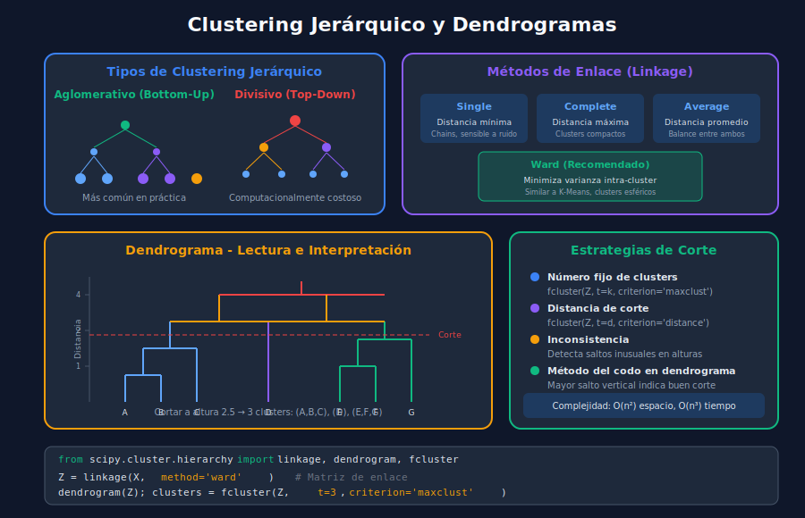

# 🌳 Clustering Jerárquico

## 🎯 Objetivos de Aprendizaje

- Comprender el clustering aglomerativo y divisivo
- Construir e interpretar dendrogramas
- Dominar los diferentes métodos de enlace (linkage)
- Aplicar estrategias de corte para obtener clusters
- Comparar clustering jerárquico con otros métodos

---

## 📋 ¿Qué es el Clustering Jerárquico?

El clustering jerárquico construye una **jerarquía de clusters** representada como un árbol (dendrograma). No requiere especificar el número de clusters de antemano.

### Dos Enfoques

```
┌─────────────────────────────────────────────────────────────┐
│                                                             │
│  AGLOMERATIVO (Bottom-Up)      DIVISIVO (Top-Down)         │
│                                                             │
│        ┌───┐                        ┌───┐                  │
│      ┌─┴─┬─┘                      ┌─┴───┴─┐                │
│    ┌─┴─┐ │                      ┌─┴─┐   ┌─┴─┐              │
│    A B C D                      A B C   D E F              │
│                                                             │
│  Empieza con n clusters        Empieza con 1 cluster       │
│  Fusiona los más cercanos      Divide recursivamente       │
│  MÁS COMÚN                     Menos eficiente             │
│                                                             │
└─────────────────────────────────────────────────────────────┘
```



---

## 🔄 Algoritmo Aglomerativo

### Pasos del Algoritmo

1. Cada punto es un cluster individual (n clusters)
2. Calcular matriz de distancias entre todos los clusters
3. Fusionar los dos clusters más cercanos
4. Actualizar matriz de distancias
5. Repetir 3-4 hasta tener un solo cluster

### Implementación Conceptual

```python
import numpy as np
from scipy.spatial.distance import pdist, squareform

def agglomerative_clustering_concept(X: np.ndarray) -> list:
    """
    Conceptual implementation of agglomerative clustering.

    Args:
        X: Data matrix of shape (n_samples, n_features)

    Returns:
        merge_history: List of merges [(cluster_i, cluster_j, distance), ...]
    """
    n_samples = X.shape[0]

    # Each point starts as its own cluster
    clusters = {i: [i] for i in range(n_samples)}
    merge_history = []

    # Compute initial pairwise distances
    distances = squareform(pdist(X, metric='euclidean'))
    np.fill_diagonal(distances, np.inf)  # Ignore self-distances

    while len(clusters) > 1:
        # Find minimum distance
        min_dist = np.inf
        merge_i, merge_j = None, None

        cluster_keys = list(clusters.keys())
        for i in range(len(cluster_keys)):
            for j in range(i + 1, len(cluster_keys)):
                ci, cj = cluster_keys[i], cluster_keys[j]
                # Single linkage: minimum distance between any two points
                dist = min(distances[pi, pj]
                          for pi in clusters[ci]
                          for pj in clusters[cj])
                if dist < min_dist:
                    min_dist = dist
                    merge_i, merge_j = ci, cj

        # Merge clusters
        new_cluster_id = max(clusters.keys()) + 1
        clusters[new_cluster_id] = clusters[merge_i] + clusters[merge_j]
        del clusters[merge_i]
        del clusters[merge_j]

        merge_history.append((merge_i, merge_j, min_dist,
                             len(clusters[new_cluster_id])))

    return merge_history
```

---

## 🔗 Métodos de Enlace (Linkage)

El **método de enlace** define cómo medir la distancia entre clusters.

### Single Linkage (Enlace Simple)

Distancia **mínima** entre cualquier par de puntos:

$$d(A, B) = \min_{a \in A, b \in B} d(a, b)$$

```python
# Características:
# ✓ Puede detectar clusters alargados/irregulares
# ✗ Sensible al "efecto cadena" (chaining)
# ✗ Puede unir clusters que no deberían unirse
```

### Complete Linkage (Enlace Completo)

Distancia **máxima** entre cualquier par de puntos:

$$d(A, B) = \max_{a \in A, b \in B} d(a, b)$$

```python
# Características:
# ✓ Produce clusters compactos y esféricos
# ✓ Menos sensible a outliers que single
# ✗ Puede romper clusters grandes
```

### Average Linkage (Enlace Promedio)

Distancia **promedio** entre todos los pares:

$$d(A, B) = \frac{1}{|A| \cdot |B|} \sum_{a \in A} \sum_{b \in B} d(a, b)$$

```python
# Características:
# ✓ Balance entre single y complete
# ✓ Menos sensible a outliers
# ✓ Clusters de tamaño similar
```

### Ward's Method (Método de Ward)

Minimiza la **varianza** dentro del cluster fusionado:

$$d(A, B) = \sqrt{\frac{2|A||B|}{|A|+|B|}} \cdot ||c_A - c_B||$$

```python
# Características:
# ✓ Produce clusters compactos y de tamaño similar
# ✓ Más usado en la práctica
# ✓ Similar a K-Means en resultados
# ✗ Asume clusters esféricos
```

### Comparación Visual

```
Single:     ●────●────●────●────●   Cadenas largas

Complete:   ●●●    ●●●    ●●●       Clusters compactos
            ●●●    ●●●    ●●●

Ward:       ○○○    ○○○    ○○○       Esféricos, tamaño similar
            ○○○    ○○○    ○○○
```

---

## 📊 Dendrogramas

### ¿Qué es un Dendrograma?

Un **dendrograma** es una representación gráfica del clustering jerárquico:

- Eje Y: Distancia de fusión
- Eje X: Muestras individuales
- Líneas horizontales: Fusiones de clusters
- Altura de la línea: Distancia a la que se fusionaron

### Construcción con SciPy

```python
from scipy.cluster.hierarchy import dendrogram, linkage
import matplotlib.pyplot as plt

def create_dendrogram(X: np.ndarray, method: str = 'ward',
                      labels: list = None) -> None:
    """
    Create and display a dendrogram.

    Args:
        X: Data matrix
        method: Linkage method
        labels: Sample labels for x-axis
    """
    # Compute linkage matrix
    Z = linkage(X, method=method)

    # Plot dendrogram
    plt.figure(figsize=(14, 7))
    dendrogram(
        Z,
        labels=labels,
        leaf_rotation=90,
        leaf_font_size=10,
        color_threshold=0.7 * max(Z[:, 2])  # Color clusters
    )

    plt.title(f'Dendrograma (Método: {method})', fontsize=14)
    plt.xlabel('Muestras', fontsize=12)
    plt.ylabel('Distancia', fontsize=12)
    plt.tight_layout()
    plt.show()

    return Z


# Ejemplo
from sklearn.datasets import make_blobs

X, _ = make_blobs(n_samples=30, centers=3, random_state=42)
Z = create_dendrogram(X, method='ward')
```

### Interpretación del Dendrograma

```
Distancia
    │
 4  │              ┌─────────────────┐
    │              │                 │
 3  │        ┌─────┤           ┌─────┤
    │        │     │           │     │
 2  │   ┌────┤     │      ┌────┤     │   ← Posible corte: 3 clusters
    │   │    │     │      │    │     │
 1  │ ┌─┤  ┌─┤     │    ┌─┤  ┌─┤     │
    │ │ │  │ │     │    │ │  │ │     │
    └─┴─┴──┴─┴─────┴────┴─┴──┴─┴─────┴──
      A B  C D     E    F G  H I     J

    Cluster 1     C2      Cluster 3
```

---

## ✂️ Estrategias de Corte

### Corte por Número de Clusters

```python
from scipy.cluster.hierarchy import fcluster

# Obtener exactamente K clusters
K = 3
labels = fcluster(Z, t=K, criterion='maxclust')
print(f"Clusters: {labels}")
```

### Corte por Distancia

```python
# Cortar a una distancia específica
distance_threshold = 5.0
labels = fcluster(Z, t=distance_threshold, criterion='distance')

n_clusters = len(set(labels))
print(f"Clusters encontrados: {n_clusters}")
```

### Corte Automático con Inconsistency

```python
# Corte basado en inconsistencia (detecta saltos inusuales)
from scipy.cluster.hierarchy import inconsistent

depth = 3  # Profundidad para calcular inconsistencia
incons = inconsistent(Z, d=depth)

# Cortar donde la inconsistencia excede un umbral
labels = fcluster(Z, t=1.5, criterion='inconsistent', depth=depth)
```

### Método Visual: Buscar el Mayor Salto

```python
def find_optimal_cut(Z: np.ndarray) -> float:
    """
    Find optimal cut point by looking for largest gap in distances.

    Args:
        Z: Linkage matrix

    Returns:
        Optimal distance threshold
    """
    distances = Z[:, 2]
    gaps = np.diff(distances)
    max_gap_idx = np.argmax(gaps)

    # Cut between the two distances with largest gap
    optimal_threshold = (distances[max_gap_idx] + distances[max_gap_idx + 1]) / 2

    print(f"Mayor salto entre distancias: {gaps[max_gap_idx]:.4f}")
    print(f"Umbral óptimo sugerido: {optimal_threshold:.4f}")

    return optimal_threshold


threshold = find_optimal_cut(Z)
labels = fcluster(Z, t=threshold, criterion='distance')
```

---

## 🐍 Clustering Jerárquico con Scikit-learn

### Uso Básico

```python
from sklearn.cluster import AgglomerativeClustering
from sklearn.preprocessing import StandardScaler

# Preparar datos
X = np.random.randn(100, 2)
scaler = StandardScaler()
X_scaled = scaler.fit_transform(X)

# Crear modelo
agg = AgglomerativeClustering(
    n_clusters=3,           # Número de clusters (o None)
    metric='euclidean',     # Métrica de distancia
    linkage='ward'          # Método de enlace
)

# Fit y obtener labels
labels = agg.fit_predict(X_scaled)
print(f"Labels: {labels}")
```

### Usando Threshold en lugar de n_clusters

```python
# Dejar que el algoritmo determine el número de clusters
agg = AgglomerativeClustering(
    n_clusters=None,
    distance_threshold=1.5,  # Distancia de corte
    linkage='ward'
)
labels = agg.fit_predict(X_scaled)
n_clusters = len(set(labels))
print(f"Clusters encontrados: {n_clusters}")
```

### Atributos del Modelo

```python
# Después de fit()
print(f"Labels: {agg.labels_}")
print(f"Número de clusters: {agg.n_clusters_}")
print(f"Número de hojas: {agg.n_leaves_}")
print(f"Número de componentes: {agg.n_connected_components_}")

# Para obtener el dendrograma completo, usar scipy
from scipy.cluster.hierarchy import linkage, dendrogram
Z = linkage(X_scaled, method='ward')
```

---

## 🔄 Workflow Completo

```python
import numpy as np
import matplotlib.pyplot as plt
from sklearn.datasets import make_blobs
from sklearn.preprocessing import StandardScaler
from sklearn.cluster import AgglomerativeClustering
from scipy.cluster.hierarchy import dendrogram, linkage, fcluster

def hierarchical_clustering_workflow(X: np.ndarray,
                                    method: str = 'ward') -> dict:
    """
    Complete hierarchical clustering workflow.

    Args:
        X: Data matrix
        method: Linkage method

    Returns:
        Dictionary with results
    """
    # 1. Normalizar datos
    scaler = StandardScaler()
    X_scaled = scaler.fit_transform(X)

    # 2. Calcular matriz de enlace
    Z = linkage(X_scaled, method=method)

    # 3. Crear dendrograma
    fig, axes = plt.subplots(1, 2, figsize=(16, 6))

    # Dendrograma
    axes[0].set_title(f'Dendrograma ({method})', fontsize=14)
    dendrogram(Z, ax=axes[0], color_threshold=0.7 * max(Z[:, 2]))
    axes[0].set_xlabel('Muestras')
    axes[0].set_ylabel('Distancia')

    # 4. Encontrar K óptimo con el método del codo
    last = Z[-10:, 2]
    last_rev = last[::-1]
    idxs = np.arange(1, len(last) + 1)

    axes[1].plot(idxs, last_rev, 'bo-')
    axes[1].set_title('Método del Codo (últimas fusiones)', fontsize=14)
    axes[1].set_xlabel('Número de Clusters')
    axes[1].set_ylabel('Distancia de Fusión')
    axes[1].grid(True, alpha=0.3)

    plt.tight_layout()
    plt.show()

    # 5. Sugerir número de clusters basado en mayor salto
    acceleration = np.diff(last_rev, 2)  # Segunda derivada
    k_optimal = acceleration.argmax() + 2  # +2 porque perdimos 2 puntos
    print(f"K óptimo sugerido: {k_optimal}")

    # 6. Obtener labels finales
    labels = fcluster(Z, t=k_optimal, criterion='maxclust')

    return {
        'linkage_matrix': Z,
        'labels': labels,
        'k_optimal': k_optimal,
        'scaler': scaler
    }


# Ejemplo
X, y_true = make_blobs(n_samples=150, centers=4, random_state=42)
results = hierarchical_clustering_workflow(X, method='ward')
```

---

## ⚖️ Comparación con Otros Métodos

### Jerárquico vs K-Means

| Aspecto              | K-Means | Jerárquico      |
| -------------------- | ------- | --------------- |
| K requerido          | Sí      | Opcional        |
| Complejidad temporal | O(nKt)  | O(n²) o O(n³)   |
| Complejidad espacial | O(n)    | O(n²)           |
| Dendrograma          | No      | Sí              |
| Determinístico       | No      | Sí              |
| Escala               | Grande  | Pequeño-Mediano |

### Jerárquico vs DBSCAN

| Aspecto        | DBSCAN     | Jerárquico         |
| -------------- | ---------- | ------------------ |
| K requerido    | No         | Opcional           |
| Outliers       | Detecta    | No                 |
| Forma clusters | Arbitraria | Depende de linkage |
| Visualización  | Scatter    | Dendrograma        |

### ¿Cuándo usar Jerárquico?

```python
# Usar clustering jerárquico cuando:
# ✓ Dataset pequeño-mediano (< 10,000 muestras)
# ✓ Necesitas explorar diferentes números de clusters
# ✓ Quieres visualizar la estructura jerárquica
# ✓ Tienes datos taxonómicos/jerárquicos
# ✓ No sabes cuántos clusters esperar

# NO usar cuando:
# ✗ Dataset muy grande (> 50,000 muestras)
# ✗ Necesitas clustering en tiempo real
# ✗ Los clusters tienen formas muy irregulares
```

---

## ⚠️ Limitaciones

### Complejidad Computacional

```python
# O(n²) en espacio y O(n³) en tiempo (sin optimizaciones)
# Para n = 10,000:
#   - Memoria: ~800 MB (matriz de distancias)
#   - Tiempo: Minutos a horas

# Soluciones para datos grandes:
# 1. Muestreo
sample_indices = np.random.choice(len(X), size=5000, replace=False)
X_sample = X[sample_indices]

# 2. Mini-batch clustering previo
from sklearn.cluster import MiniBatchKMeans
mbk = MiniBatchKMeans(n_clusters=100)
X_reduced = mbk.fit_transform(X)  # Cluster centroids
```

### No es Reversible

Una vez fusionados, los clusters no pueden separarse en pasos posteriores:

```python
# Si una fusión temprana es incorrecta, el error se propaga
# Solución: probar diferentes métodos de linkage
for method in ['single', 'complete', 'average', 'ward']:
    Z = linkage(X_scaled, method=method)
    # Comparar dendrogramas
```

---

## 📊 Ejemplo Completo: Taxonomía de Productos

```python
import numpy as np
import pandas as pd
from sklearn.preprocessing import StandardScaler
from sklearn.cluster import AgglomerativeClustering
from scipy.cluster.hierarchy import dendrogram, linkage
import matplotlib.pyplot as plt

# Simular características de productos
np.random.seed(42)
products = {
    'producto': [f'P{i}' for i in range(20)],
    'precio': [100, 120, 95, 500, 480, 520, 50, 45, 55, 800,
               105, 115, 490, 510, 48, 52, 790, 810, 110, 495],
    'peso_kg': [0.5, 0.6, 0.4, 2.0, 1.8, 2.2, 0.3, 0.25, 0.35, 5.0,
                0.55, 0.45, 1.9, 2.1, 0.28, 0.32, 4.8, 5.2, 0.52, 2.0],
    'categoria_manual': ['A', 'A', 'A', 'B', 'B', 'B', 'C', 'C', 'C', 'D',
                         'A', 'A', 'B', 'B', 'C', 'C', 'D', 'D', 'A', 'B']
}
df = pd.DataFrame(products)

# Preparar datos
X = df[['precio', 'peso_kg']].values
scaler = StandardScaler()
X_scaled = scaler.fit_transform(X)

# Clustering jerárquico
Z = linkage(X_scaled, method='ward')

# Visualizar
fig, axes = plt.subplots(1, 2, figsize=(16, 6))

# Dendrograma
dendrogram(Z, labels=df['producto'].values, ax=axes[0],
           leaf_rotation=90, leaf_font_size=10)
axes[0].set_title('Taxonomía de Productos', fontsize=14)
axes[0].set_ylabel('Distancia')

# Cortar en 4 clusters
from scipy.cluster.hierarchy import fcluster
df['cluster'] = fcluster(Z, t=4, criterion='maxclust')

# Scatter plot
colors = {1: 'red', 2: 'blue', 3: 'green', 4: 'orange'}
for cluster in df['cluster'].unique():
    subset = df[df['cluster'] == cluster]
    axes[1].scatter(subset['precio'], subset['peso_kg'],
                   c=colors[cluster], label=f'Cluster {cluster}',
                   s=100, alpha=0.7)
    for _, row in subset.iterrows():
        axes[1].annotate(row['producto'], (row['precio'], row['peso_kg']),
                        fontsize=8)

axes[1].set_xlabel('Precio')
axes[1].set_ylabel('Peso (kg)')
axes[1].set_title('Productos por Cluster')
axes[1].legend()
axes[1].grid(True, alpha=0.3)

plt.tight_layout()
plt.show()

# Análisis de clusters
print("\n📦 Análisis de Clusters:")
print(df.groupby('cluster').agg({
    'precio': ['mean', 'std'],
    'peso_kg': ['mean', 'std'],
    'producto': 'count'
}).round(2))
```

---

## ✅ Checklist de Verificación

- [ ] Entiendo la diferencia entre aglomerativo y divisivo
- [ ] Puedo construir e interpretar un dendrograma
- [ ] Conozco los métodos de linkage y cuándo usar cada uno
- [ ] Sé aplicar diferentes estrategias de corte
- [ ] Comprendo las limitaciones del clustering jerárquico

---

## 📚 Recursos Adicionales

- [SciPy Hierarchical Clustering](https://docs.scipy.org/doc/scipy/reference/cluster.hierarchy.html)
- [Scikit-learn AgglomerativeClustering](https://scikit-learn.org/stable/modules/clustering.html#hierarchical-clustering)
- [Understanding Dendrograms](https://www.displayr.com/what-is-dendrogram/)

---

## 🔗 Navegación

| ⬅️ Anterior            | 🏠 Inicio                 | Siguiente ➡️                                                 |
| ---------------------- | ------------------------- | ------------------------------------------------------------ |
| [DBSCAN](03-dbscan.md) | [Semana 13](../README.md) | [Ejercicio 01](../2-practicas/ejercicio-01-kmeans/README.md) |
