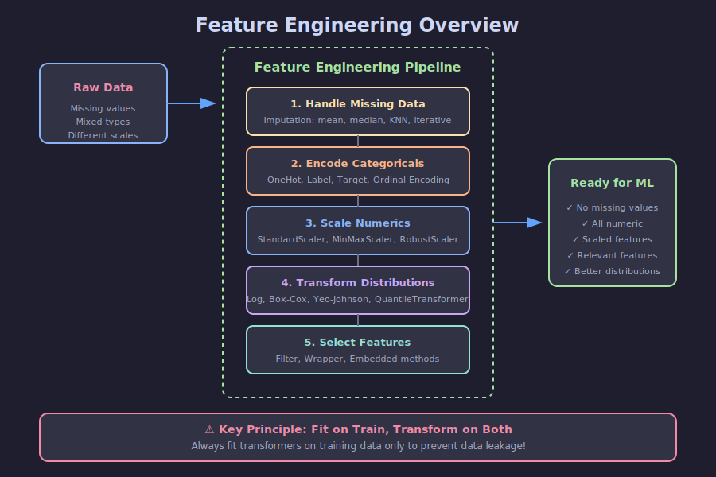

# 🔧 Introducción a Feature Engineering

## 🎯 Objetivos

- Comprender qué es Feature Engineering y su importancia
- Conocer el flujo de trabajo de preprocesamiento
- Entender el principio "Fit on Train, Transform on Both"

---

## 📋 Contenido

### 1. ¿Qué es Feature Engineering?

**Feature Engineering** es el proceso de transformar datos crudos en características (features) que los algoritmos de Machine Learning pueden utilizar efectivamente.

> "Coming up with features is difficult, time-consuming, requires expert knowledge. Applied machine learning is basically feature engineering." — Andrew Ng

```python
# Raw data (difícil para ML)
raw_data = {
    'fecha': '2024-03-15',
    'ciudad': 'Madrid',
    'temperatura': None,
    'ingresos': 50000
}

# Engineered features (listo para ML)
engineered = {
    'dia_semana': 4,           # Extraído de fecha
    'es_fin_semana': 0,        # Derivado
    'ciudad_Madrid': 1,        # One-hot encoded
    'ciudad_Barcelona': 0,
    'temperatura': 18.5,       # Imputado
    'log_ingresos': 10.82      # Transformado
}
```

### 2. ¿Por qué es Importante?

| Sin Feature Engineering          | Con Feature Engineering |
| -------------------------------- | ----------------------- |
| Valores faltantes causan errores | Datos completos         |
| Categorías como texto            | Todo numérico           |
| Escalas muy diferentes           | Escalas normalizadas    |
| Features irrelevantes            | Features seleccionadas  |
| Distribuciones sesgadas          | Distribuciones normales |

### 3. Pipeline de Feature Engineering



```
Raw Data → Handle Missing → Encode Categories → Scale/Transform → Select Features → ML Model
```

**Orden típico de operaciones:**

1. **Manejo de valores faltantes** - Imputation
2. **Codificación de categóricas** - Encoding
3. **Escalado/Normalización** - Scaling
4. **Transformaciones** - Power transforms
5. **Selección de características** - Feature selection

### 4. Principio Fundamental: Fit on Train

⚠️ **REGLA DE ORO**: Siempre ajustar (fit) los transformadores SOLO en datos de entrenamiento.

```python
from sklearn.model_selection import train_test_split
from sklearn.preprocessing import StandardScaler

# Split primero
X_train, X_test, y_train, y_test = train_test_split(X, y, test_size=0.2)

# ✅ CORRECTO: fit solo en train
scaler = StandardScaler()
X_train_scaled = scaler.fit_transform(X_train)
X_test_scaled = scaler.transform(X_test)  # Solo transform

# ❌ INCORRECTO: fit en todo el dataset (DATA LEAKAGE!)
scaler_bad = StandardScaler()
X_all_scaled = scaler_bad.fit_transform(X)  # NUNCA hacer esto
```

**¿Por qué?**

- Si hacemos fit en todo el dataset, el scaler "ve" información del test set
- Esto es **data leakage**: información del futuro contamina el entrenamiento
- El modelo parecerá mejor de lo que realmente es

### 5. Tipos de Features

| Tipo                      | Descripción         | Ejemplo                       |
| ------------------------- | ------------------- | ----------------------------- |
| **Numéricas continuas**   | Valores en un rango | Edad, salario, temperatura    |
| **Numéricas discretas**   | Valores contables   | Número de hijos, habitaciones |
| **Categóricas nominales** | Sin orden           | Color, ciudad, género         |
| **Categóricas ordinales** | Con orden           | Educación (bajo/medio/alto)   |
| **Datetime**              | Fechas y tiempos    | Fecha de compra               |
| **Texto**                 | Strings libres      | Comentarios, descripciones    |

### 6. Herramientas en sklearn

```python
# Preprocesamiento
from sklearn.preprocessing import (
    StandardScaler,      # Escalado estándar
    MinMaxScaler,        # Escalado 0-1
    RobustScaler,        # Robusto a outliers
    OneHotEncoder,       # Codificación one-hot
    OrdinalEncoder,      # Codificación ordinal
    LabelEncoder,        # Para target (clasificación)
    PowerTransformer,    # Box-Cox, Yeo-Johnson
)

# Imputación
from sklearn.impute import (
    SimpleImputer,       # Media, mediana, moda
    KNNImputer,          # Basado en vecinos
)

# Selección de features
from sklearn.feature_selection import (
    SelectKBest,         # Top K features
    RFE,                 # Recursive Feature Elimination
    SelectFromModel,     # Basado en importancias
)

# Pipelines
from sklearn.pipeline import Pipeline
from sklearn.compose import ColumnTransformer
```

---

## 📚 Recursos Adicionales

- [sklearn Preprocessing](https://scikit-learn.org/stable/modules/preprocessing.html)
- [Feature Engineering Book (Free)](https://www.feat.engineering/)

---

## ✅ Checklist de Verificación

- [ ] Entiendo qué es Feature Engineering
- [ ] Comprendo el principio "Fit on Train"
- [ ] Conozco los tipos de features
- [ ] Sé qué herramientas ofrece sklearn
