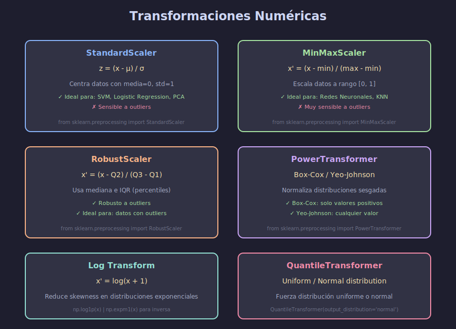

# 📊 Transformaciones Numéricas

## 🎯 Objetivos

- Dominar StandardScaler, MinMaxScaler y RobustScaler
- Aplicar transformaciones de potencia (Log, Box-Cox, Yeo-Johnson)
- Saber cuándo usar cada tipo de escalador

---

## 📋 Contenido

### 1. ¿Por qué Escalar?

Muchos algoritmos son sensibles a la escala de las features:

| Algoritmo           | Sensible a Escala |
| ------------------- | ----------------- |
| SVM                 | ✅ Muy sensible   |
| KNN                 | ✅ Muy sensible   |
| Logistic Regression | ✅ Sensible       |
| Neural Networks     | ✅ Muy sensible   |
| PCA                 | ✅ Sensible       |
| Random Forest       | ❌ No sensible    |
| XGBoost             | ❌ No sensible    |



### 2. StandardScaler (Z-score)

Centra los datos con media 0 y desviación estándar 1.

$$z = \frac{x - \mu}{\sigma}$$

```python
from sklearn.preprocessing import StandardScaler
import numpy as np

# Datos de ejemplo
X = np.array([[1000], [2000], [3000], [4000], [5000]])

scaler = StandardScaler()
X_scaled = scaler.fit_transform(X)

print(f"Media original: {X.mean():.2f}")      # 3000.00
print(f"Std original: {X.std():.2f}")         # 1414.21
print(f"Media escalada: {X_scaled.mean():.2f}")  # 0.00
print(f"Std escalada: {X_scaled.std():.2f}")     # 1.00
```

**Cuándo usar:**

- ✅ Datos aproximadamente normales
- ✅ SVM, Logistic Regression, PCA
- ❌ Datos con muchos outliers

### 3. MinMaxScaler

Escala los datos al rango [0, 1] (o personalizado).

$$x' = \frac{x - x_{min}}{x_{max} - x_{min}}$$

```python
from sklearn.preprocessing import MinMaxScaler

scaler = MinMaxScaler()  # Rango [0, 1] por defecto
X_scaled = scaler.fit_transform(X)

# Rango personalizado
scaler_custom = MinMaxScaler(feature_range=(-1, 1))
X_custom = scaler_custom.fit_transform(X)

print(f"Min: {X_scaled.min()}, Max: {X_scaled.max()}")  # 0.0, 1.0
```

**Cuándo usar:**

- ✅ Redes neuronales (especialmente con sigmoid/tanh)
- ✅ Algoritmos basados en distancia
- ❌ Muy sensible a outliers

### 4. RobustScaler

Usa la mediana y el rango intercuartílico (IQR), robusto a outliers.

$$x' = \frac{x - Q_2}{Q_3 - Q_1}$$

```python
from sklearn.preprocessing import RobustScaler

# Datos con outlier
X_outliers = np.array([[100], [200], [300], [400], [10000]])

robust = RobustScaler()
X_robust = robust.fit_transform(X_outliers)

standard = StandardScaler()
X_standard = standard.fit_transform(X_outliers)

# RobustScaler maneja mejor el outlier
print("RobustScaler:", X_robust.flatten())
print("StandardScaler:", X_standard.flatten())
```

**Cuándo usar:**

- ✅ Datos con outliers
- ✅ Cuando no puedes eliminar outliers
- ✅ Datos no normales

### 5. Transformaciones de Potencia

Para normalizar distribuciones sesgadas (skewed).

#### Log Transform

```python
import numpy as np

# Datos con distribución exponencial
X_skewed = np.array([[10], [100], [1000], [10000], [100000]])

# Log transform (log1p para manejar ceros)
X_log = np.log1p(X_skewed)

# Inversa
X_original = np.expm1(X_log)
```

**Cuándo usar:**

- ✅ Distribuciones con cola larga a la derecha
- ✅ Datos de ingresos, precios, conteos
- ❌ Valores negativos (usar Yeo-Johnson)

#### PowerTransformer (Box-Cox / Yeo-Johnson)

```python
from sklearn.preprocessing import PowerTransformer

# Box-Cox (solo valores positivos)
pt_boxcox = PowerTransformer(method='box-cox')

# Yeo-Johnson (cualquier valor)
pt_yj = PowerTransformer(method='yeo-johnson')

X_transformed = pt_yj.fit_transform(X_skewed)

# El lambda óptimo se encuentra automáticamente
print(f"Lambda: {pt_yj.lambdas_}")
```

#### QuantileTransformer

Fuerza una distribución uniforme o normal.

```python
from sklearn.preprocessing import QuantileTransformer

# Distribución uniforme
qt_uniform = QuantileTransformer(output_distribution='uniform')

# Distribución normal
qt_normal = QuantileTransformer(output_distribution='normal')

X_normal = qt_normal.fit_transform(X_skewed)
```

### 6. Comparación Visual

```python
import matplotlib.pyplot as plt
from sklearn.preprocessing import StandardScaler, MinMaxScaler, RobustScaler

fig, axes = plt.subplots(2, 2, figsize=(10, 8))

# Original
axes[0, 0].hist(X.flatten(), bins=20)
axes[0, 0].set_title('Original')

# StandardScaler
axes[0, 1].hist(StandardScaler().fit_transform(X).flatten(), bins=20)
axes[0, 1].set_title('StandardScaler')

# MinMaxScaler
axes[1, 0].hist(MinMaxScaler().fit_transform(X).flatten(), bins=20)
axes[1, 0].set_title('MinMaxScaler')

# RobustScaler
axes[1, 1].hist(RobustScaler().fit_transform(X).flatten(), bins=20)
axes[1, 1].set_title('RobustScaler')

plt.tight_layout()
plt.show()
```

### 7. Guía de Selección

| Situación                    | Escalador Recomendado |
| ---------------------------- | --------------------- |
| Datos normales, sin outliers | StandardScaler        |
| Redes neuronales             | MinMaxScaler          |
| Datos con outliers           | RobustScaler          |
| Distribución sesgada         | PowerTransformer      |
| Forzar normalidad            | QuantileTransformer   |
| Tree-based models            | No necesario          |

---

## 💻 Ejemplo Completo

```python
from sklearn.preprocessing import StandardScaler, PowerTransformer
from sklearn.compose import ColumnTransformer
import pandas as pd

# DataFrame de ejemplo
df = pd.DataFrame({
    'edad': [25, 30, 35, 40, 45],
    'ingresos': [30000, 50000, 80000, 150000, 500000],  # Sesgado
    'score': [0.5, 0.6, 0.7, 0.8, 0.9]
})

# Diferentes transformaciones por columna
preprocessor = ColumnTransformer([
    ('standard', StandardScaler(), ['edad', 'score']),
    ('power', PowerTransformer(method='yeo-johnson'), ['ingresos'])
])

X_transformed = preprocessor.fit_transform(df)
```

---

## ✅ Checklist de Verificación

- [ ] Sé calcular z-score manualmente
- [ ] Entiendo la diferencia entre los escaladores
- [ ] Sé cuándo usar PowerTransformer
- [ ] Puedo aplicar transformaciones con sklearn
