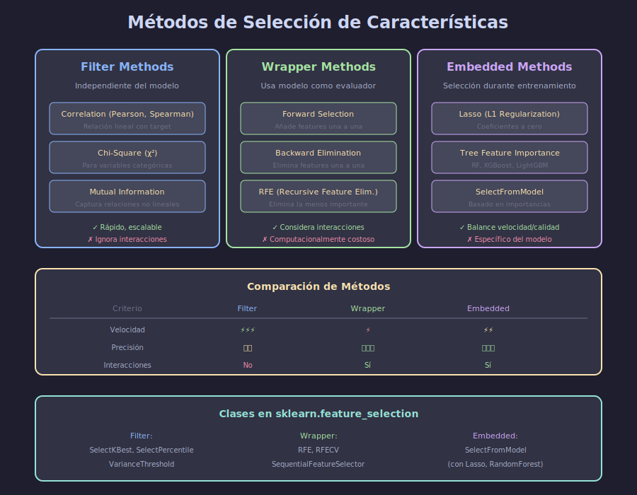

# 🎯 Selección de Características

## 🎯 Objetivos

- Dominar métodos Filter, Wrapper y Embedded
- Aplicar SelectKBest, RFE y SelectFromModel
- Entender cuándo usar cada método

---

## 📋 Contenido

### 1. ¿Por qué Seleccionar Features?

| Beneficio              | Descripción                        |
| ---------------------- | ---------------------------------- |
| **Reduce overfitting** | Menos features = modelo más simple |
| **Mejora precisión**   | Elimina ruido                      |
| **Reduce tiempo**      | Entrenamiento más rápido           |
| **Interpretabilidad**  | Más fácil de explicar              |



### 2. Métodos Filter

Evalúan features **independientemente del modelo**. Rápidos y escalables.

#### Variance Threshold

Elimina features con varianza baja (poca información):

```python
from sklearn.feature_selection import VarianceThreshold

# Eliminar features con varianza < 0.1
selector = VarianceThreshold(threshold=0.1)
X_selected = selector.fit_transform(X)

# Ver features eliminadas
print(f"Features originales: {X.shape[1]}")
print(f"Features seleccionadas: {X_selected.shape[1]}")
```

#### SelectKBest

Selecciona las K mejores features según una métrica:

```python
from sklearn.feature_selection import SelectKBest, f_classif, mutual_info_classif

# Para clasificación: f_classif o mutual_info_classif
selector = SelectKBest(score_func=f_classif, k=10)
X_selected = selector.fit_transform(X, y)

# Ver scores
scores = pd.DataFrame({
    'feature': feature_names,
    'score': selector.scores_
}).sort_values('score', ascending=False)
print(scores)
```

#### Funciones de Score

| Función                  | Tipo          | Descripción                   |
| ------------------------ | ------------- | ----------------------------- |
| `f_classif`              | Clasificación | ANOVA F-value                 |
| `chi2`                   | Clasificación | Chi-cuadrado (solo positivos) |
| `mutual_info_classif`    | Clasificación | Información mutua             |
| `f_regression`           | Regresión     | F-value regresión             |
| `mutual_info_regression` | Regresión     | Información mutua             |

```python
from sklearn.feature_selection import SelectKBest, chi2, mutual_info_classif

# Chi-cuadrado (para features no negativas)
selector_chi2 = SelectKBest(score_func=chi2, k=5)

# Mutual Information (captura relaciones no lineales)
selector_mi = SelectKBest(score_func=mutual_info_classif, k=5)
```

#### Correlación

```python
import pandas as pd
import numpy as np

# Matriz de correlación
corr_matrix = df.corr()

# Features altamente correlacionadas con target
target_corr = corr_matrix['target'].abs().sort_values(ascending=False)
print(target_corr)

# Eliminar features correlacionadas entre sí
def remove_correlated_features(df, threshold=0.95):
    corr = df.corr().abs()
    upper = corr.where(np.triu(np.ones(corr.shape), k=1).astype(bool))
    to_drop = [col for col in upper.columns if any(upper[col] > threshold)]
    return df.drop(columns=to_drop)
```

### 3. Métodos Wrapper

Usan un **modelo como evaluador**. Más precisos pero costosos.

#### RFE (Recursive Feature Elimination)

```python
from sklearn.feature_selection import RFE
from sklearn.ensemble import RandomForestClassifier

# Modelo base
model = RandomForestClassifier(n_estimators=100, random_state=42)

# RFE: selecciona 10 features
rfe = RFE(estimator=model, n_features_to_select=10, step=1)
rfe.fit(X, y)

# Ver ranking (1 = seleccionada)
ranking = pd.DataFrame({
    'feature': feature_names,
    'ranking': rfe.ranking_,
    'selected': rfe.support_
}).sort_values('ranking')
print(ranking)
```

#### RFECV (RFE con Cross-Validation)

Encuentra automáticamente el número óptimo de features:

```python
from sklearn.feature_selection import RFECV

rfecv = RFECV(
    estimator=model,
    step=1,
    cv=5,
    scoring='accuracy',
    min_features_to_select=5
)
rfecv.fit(X, y)

print(f"Número óptimo de features: {rfecv.n_features_}")

# Visualizar
import matplotlib.pyplot as plt
plt.plot(range(5, len(rfecv.cv_results_['mean_test_score']) + 5),
         rfecv.cv_results_['mean_test_score'])
plt.xlabel('Número de features')
plt.ylabel('CV Score')
plt.show()
```

#### SequentialFeatureSelector

Forward selection o backward elimination:

```python
from sklearn.feature_selection import SequentialFeatureSelector

# Forward selection
sfs_forward = SequentialFeatureSelector(
    model,
    n_features_to_select=10,
    direction='forward',
    cv=5
)

# Backward elimination
sfs_backward = SequentialFeatureSelector(
    model,
    n_features_to_select=10,
    direction='backward',
    cv=5
)
```

### 4. Métodos Embedded

La selección ocurre **durante el entrenamiento**.

#### Lasso (L1 Regularization)

```python
from sklearn.linear_model import Lasso
from sklearn.feature_selection import SelectFromModel

# Lasso pone coeficientes a cero
lasso = Lasso(alpha=0.01)
lasso.fit(X, y)

# Ver coeficientes
coef = pd.DataFrame({
    'feature': feature_names,
    'coef': lasso.coef_
}).sort_values('coef', key=abs, ascending=False)
print(coef)

# SelectFromModel con Lasso
selector = SelectFromModel(Lasso(alpha=0.01))
X_selected = selector.fit_transform(X, y)
```

#### Tree-based Feature Importance

```python
from sklearn.ensemble import RandomForestClassifier
from sklearn.feature_selection import SelectFromModel

# Entrenar modelo
rf = RandomForestClassifier(n_estimators=100, random_state=42)
rf.fit(X, y)

# Ver importancias
importances = pd.DataFrame({
    'feature': feature_names,
    'importance': rf.feature_importances_
}).sort_values('importance', ascending=False)
print(importances)

# Visualizar
importances.head(20).plot(kind='barh', x='feature', y='importance')
plt.title('Feature Importances')
plt.show()

# Seleccionar con threshold
selector = SelectFromModel(rf, threshold='median')  # o valor numérico
X_selected = selector.fit_transform(X, y)
```

### 5. Comparación de Métodos

| Método   | Velocidad | Precisión | Interacciones |
| -------- | --------- | --------- | ------------- |
| Filter   | ⚡⚡⚡    | ⭐⭐      | ❌            |
| Wrapper  | ⚡        | ⭐⭐⭐    | ✅            |
| Embedded | ⚡⚡      | ⭐⭐⭐    | ✅            |

### 6. Pipeline con Feature Selection

```python
from sklearn.pipeline import Pipeline
from sklearn.feature_selection import SelectKBest, f_classif
from sklearn.preprocessing import StandardScaler
from sklearn.linear_model import LogisticRegression

pipeline = Pipeline([
    ('scaler', StandardScaler()),
    ('selector', SelectKBest(f_classif, k=10)),
    ('classifier', LogisticRegression())
])

# Cross-validation
from sklearn.model_selection import cross_val_score
scores = cross_val_score(pipeline, X, y, cv=5)
print(f"CV Score: {scores.mean():.3f} ± {scores.std():.3f}")
```

---

## 💻 Ejemplo: Comparar Métodos

```python
from sklearn.feature_selection import (
    SelectKBest, f_classif, RFE, SelectFromModel
)
from sklearn.ensemble import RandomForestClassifier
from sklearn.linear_model import LogisticRegression
from sklearn.model_selection import cross_val_score

results = {}

# Filter
pipe_filter = Pipeline([
    ('scaler', StandardScaler()),
    ('selector', SelectKBest(f_classif, k=10)),
    ('model', LogisticRegression())
])
results['Filter'] = cross_val_score(pipe_filter, X, y, cv=5).mean()

# Wrapper (RFE)
pipe_rfe = Pipeline([
    ('scaler', StandardScaler()),
    ('selector', RFE(LogisticRegression(), n_features_to_select=10)),
    ('model', LogisticRegression())
])
results['RFE'] = cross_val_score(pipe_rfe, X, y, cv=5).mean()

# Embedded
pipe_embedded = Pipeline([
    ('scaler', StandardScaler()),
    ('selector', SelectFromModel(RandomForestClassifier(n_estimators=50))),
    ('model', LogisticRegression())
])
results['Embedded'] = cross_val_score(pipe_embedded, X, y, cv=5).mean()

print(pd.Series(results).sort_values(ascending=False))
```

---

## ✅ Checklist de Verificación

- [ ] Entiendo la diferencia entre Filter, Wrapper y Embedded
- [ ] Puedo usar SelectKBest y RFE
- [ ] Sé interpretar feature importances
- [ ] Puedo integrar selección en un Pipeline
