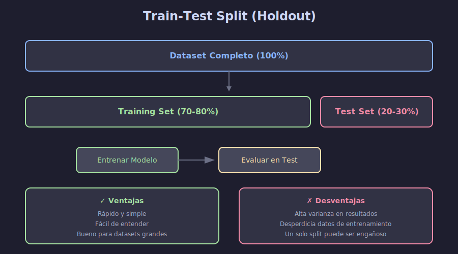

# 📊 Validación Holdout (Train-Test Split)

## 🎯 Objetivos de Aprendizaje

- Comprender la necesidad de separar datos de entrenamiento y prueba
- Implementar train-test split correctamente
- Conocer las limitaciones de la validación holdout
- Entender el concepto de data leakage

---

## 📋 Contenido

### 1. ¿Por Qué Necesitamos Validación?

El objetivo de Machine Learning es crear modelos que **generalicen** bien a datos nuevos, no solo que memoricen los datos de entrenamiento.

```python
# ❌ MAL: Evaluar en los mismos datos de entrenamiento
from sklearn.linear_model import LogisticRegression

model = LogisticRegression()
model.fit(X, y)
accuracy = model.score(X, y)  # Esto sobreestima el rendimiento real
print(f"Accuracy (train): {accuracy:.2f}")  # Puede ser 99% pero fallar en producción
```

**Problema**: Un modelo puede memorizar los datos de entrenamiento (overfitting) y dar métricas excelentes, pero fallar completamente con datos nuevos.

---

### 2. Train-Test Split

La solución más simple es dividir los datos en dos conjuntos:



```python
from sklearn.model_selection import train_test_split
import numpy as np

# Datos de ejemplo
np.random.seed(42)
X = np.random.randn(1000, 10)
y = np.random.randint(0, 2, 1000)

# División 80-20
X_train, X_test, y_train, y_test = train_test_split(
    X, y,
    test_size=0.2,      # 20% para test
    random_state=42,    # Reproducibilidad
    stratify=y          # Mantener proporción de clases
)

print(f"Training set: {len(X_train)} muestras")
print(f"Test set: {len(X_test)} muestras")
```

**Output:**
```
Training set: 800 muestras
Test set: 200 muestras
```

---

### 3. Parámetros Importantes

#### 3.1 `test_size` y `train_size`

```python
# Proporción (0-1)
X_train, X_test, y_train, y_test = train_test_split(X, y, test_size=0.2)

# Número absoluto
X_train, X_test, y_train, y_test = train_test_split(X, y, test_size=200)

# Equivalentes
train_test_split(X, y, test_size=0.2)
train_test_split(X, y, train_size=0.8)
```

| Dataset Size | Recomendación test_size |
|--------------|------------------------|
| < 1,000 | 0.30 - 0.40 |
| 1,000 - 10,000 | 0.20 - 0.30 |
| 10,000 - 100,000 | 0.15 - 0.20 |
| > 100,000 | 0.10 - 0.15 |

#### 3.2 `random_state`

**Crucial para reproducibilidad:**

```python
# ✅ BIEN: Siempre fijar random_state
X_train, X_test, y_train, y_test = train_test_split(
    X, y, test_size=0.2, random_state=42
)

# Ejecutar múltiples veces da el mismo resultado
```

#### 3.3 `stratify` - Clasificación Balanceada

```python
# Verificar distribución original
import pandas as pd
print("Distribución original:")
print(pd.Series(y).value_counts(normalize=True))

# Sin stratify - puede desbalancear
X_train, X_test, y_train, y_test = train_test_split(X, y, test_size=0.2)
print("\nSin stratify:")
print(pd.Series(y_test).value_counts(normalize=True))

# ✅ Con stratify - mantiene proporción
X_train, X_test, y_train, y_test = train_test_split(
    X, y, test_size=0.2, stratify=y
)
print("\nCon stratify:")
print(pd.Series(y_test).value_counts(normalize=True))
```

---

### 4. Flujo Completo de Evaluación

```python
from sklearn.ensemble import RandomForestClassifier
from sklearn.metrics import accuracy_score, classification_report

# 1. Dividir datos
X_train, X_test, y_train, y_test = train_test_split(
    X, y, test_size=0.2, random_state=42, stratify=y
)

# 2. Entrenar modelo
model = RandomForestClassifier(n_estimators=100, random_state=42)
model.fit(X_train, y_train)

# 3. Predecir en test (datos NUNCA vistos)
y_pred = model.predict(X_test)

# 4. Evaluar
print(f"Accuracy en Train: {model.score(X_train, y_train):.4f}")
print(f"Accuracy en Test: {model.score(X_test, y_test):.4f}")
print("\nClassification Report:")
print(classification_report(y_test, y_pred))
```

---

### 5. Train-Validation-Test Split

Para ajustar hiperparámetros necesitamos **tres** conjuntos:

```python
# Primero: separar test (hold-out final)
X_temp, X_test, y_temp, y_test = train_test_split(
    X, y, test_size=0.2, random_state=42, stratify=y
)

# Segundo: separar train y validation
X_train, X_val, y_train, y_val = train_test_split(
    X_temp, y_temp, test_size=0.25, random_state=42, stratify=y_temp
)
# 0.25 de 0.8 = 0.2 del total

print(f"Train: {len(X_train)} ({len(X_train)/len(X):.0%})")
print(f"Validation: {len(X_val)} ({len(X_val)/len(X):.0%})")
print(f"Test: {len(X_test)} ({len(X_test)/len(X):.0%})")
```

**Propósito de cada conjunto:**

| Conjunto | Uso | Cuándo se evalúa |
|----------|-----|------------------|
| **Train** | Entrenar modelo | Durante entrenamiento |
| **Validation** | Ajustar hiperparámetros | Durante desarrollo |
| **Test** | Evaluación final | Solo al final, UNA vez |

---

### 6. ⚠️ Data Leakage - Error Común

**Data Leakage** ocurre cuando información del test "se filtra" al entrenamiento:

```python
# ❌ MAL: Escalar ANTES de dividir
from sklearn.preprocessing import StandardScaler

scaler = StandardScaler()
X_scaled = scaler.fit_transform(X)  # Usa info de TODO el dataset
X_train, X_test, y_train, y_test = train_test_split(X_scaled, y)
# El scaler ya "vio" los datos de test!

# ✅ BIEN: Escalar DESPUÉS de dividir
X_train, X_test, y_train, y_test = train_test_split(X, y)
scaler = StandardScaler()
X_train_scaled = scaler.fit_transform(X_train)  # Solo usa train
X_test_scaled = scaler.transform(X_test)        # Aplica sin refit
```

**Otros ejemplos de Data Leakage:**

```python
# ❌ MAL: Imputar valores faltantes con media de TODO el dataset
# ❌ MAL: Seleccionar features basándose en correlación con TODO y
# ❌ MAL: Eliminar outliers mirando TODO el dataset

# ✅ BIEN: Todo el preprocesamiento debe hacerse SOLO con datos de train
```

---

### 7. Limitaciones de Holdout

| Limitación | Explicación |
|------------|-------------|
| **Alta Varianza** | Un solo split puede no ser representativo |
| **Desperdicio de Datos** | 20-30% no se usa para entrenar |
| **Sensible al Split** | Diferentes splits dan diferentes resultados |

```python
# Demostración de varianza entre splits
from sklearn.linear_model import LogisticRegression

accuracies = []
for seed in range(10):
    X_train, X_test, y_train, y_test = train_test_split(
        X, y, test_size=0.2, random_state=seed
    )
    model = LogisticRegression()
    model.fit(X_train, y_train)
    acc = model.score(X_test, y_test)
    accuracies.append(acc)

print(f"Accuracy promedio: {np.mean(accuracies):.4f}")
print(f"Desviación estándar: {np.std(accuracies):.4f}")
print(f"Rango: {np.min(accuracies):.4f} - {np.max(accuracies):.4f}")
```

**Solución**: Usar **Cross-Validation** (siguiente tema).

---

### 8. Regresión: Sin Stratify

Para regresión no usamos `stratify`:

```python
# Datos de regresión
X = np.random.randn(1000, 10)
y_continuous = X[:, 0] * 2 + np.random.randn(1000) * 0.1

# Sin stratify (no aplica a valores continuos)
X_train, X_test, y_train, y_test = train_test_split(
    X, y_continuous, test_size=0.2, random_state=42
)

from sklearn.linear_model import LinearRegression
from sklearn.metrics import mean_squared_error, r2_score

model = LinearRegression()
model.fit(X_train, y_train)
y_pred = model.predict(X_test)

print(f"MSE: {mean_squared_error(y_test, y_pred):.4f}")
print(f"R²: {r2_score(y_test, y_pred):.4f}")
```

---

## 📚 Resumen

| Concepto | Descripción |
|----------|-------------|
| **Holdout** | División única en train/test |
| **test_size** | Proporción para test (típico: 0.2) |
| **stratify** | Mantiene proporción de clases |
| **random_state** | Fija seed para reproducibilidad |
| **Data Leakage** | Filtración de info de test a train |

---

## ✅ Checklist de Verificación

- [ ] Entiendo por qué es necesario separar train y test
- [ ] Sé usar `train_test_split` con sus parámetros principales
- [ ] Comprendo cuándo usar `stratify`
- [ ] Identifico situaciones de Data Leakage
- [ ] Reconozco las limitaciones del holdout simple

---

## 🔗 Recursos Adicionales

- [Documentación train_test_split](https://scikit-learn.org/stable/modules/generated/sklearn.model_selection.train_test_split.html)
- [Data Leakage in ML](https://machinelearningmastery.com/data-leakage-machine-learning/)

---

**Siguiente**: [Cross-Validation](02-cross-validation.md)
