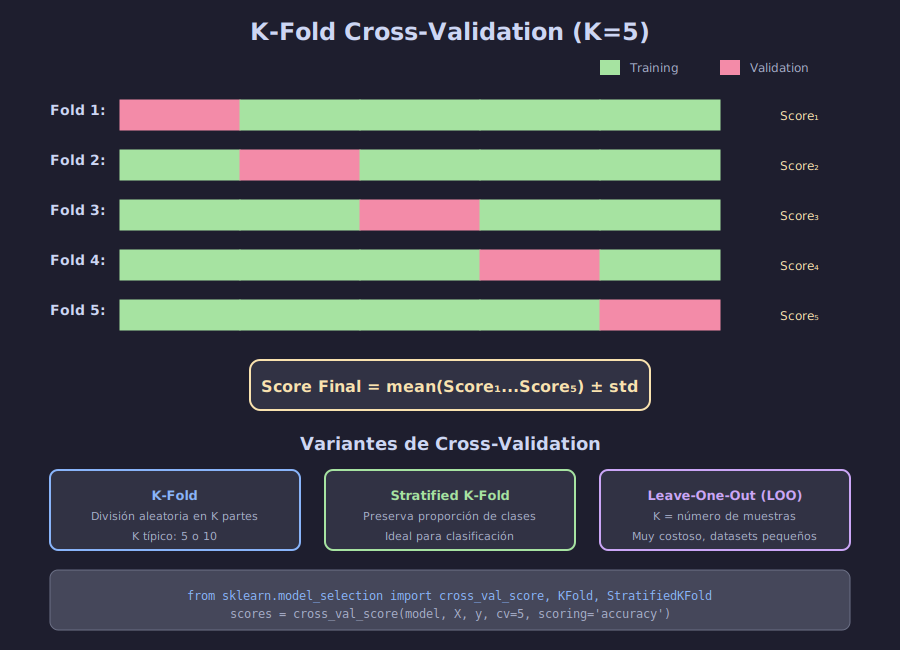

# 🔄 Cross-Validation (Validación Cruzada)

## 🎯 Objetivos de Aprendizaje

- Comprender el concepto y beneficios de Cross-Validation
- Implementar K-Fold y Stratified K-Fold CV
- Usar `cross_val_score` y `cross_validate` correctamente
- Conocer variantes: LOO, Repeated, Group K-Fold

---

## 📋 Contenido

### 1. ¿Por Qué Cross-Validation?

Cross-Validation resuelve los problemas del holdout simple:

| Problema Holdout | Solución CV |
|-----------------|-------------|
| Alta varianza en resultados | Múltiples evaluaciones promediadas |
| Desperdicio de datos | Todos los datos se usan para train y test |
| Un split puede ser engañoso | K splits diferentes |



---

### 2. K-Fold Cross-Validation

El dataset se divide en **K** partes (folds). En cada iteración:
- K-1 folds para entrenar
- 1 fold para validar

```python
import numpy as np
from sklearn.model_selection import KFold
from sklearn.linear_model import LogisticRegression
from sklearn.datasets import make_classification

# Crear dataset
X, y = make_classification(n_samples=1000, n_features=20, random_state=42)

# K-Fold con K=5
kfold = KFold(n_splits=5, shuffle=True, random_state=42)

model = LogisticRegression(max_iter=1000)
scores = []

for fold, (train_idx, val_idx) in enumerate(kfold.split(X)):
    # Dividir datos
    X_train, X_val = X[train_idx], X[val_idx]
    y_train, y_val = y[train_idx], y[val_idx]
    
    # Entrenar y evaluar
    model.fit(X_train, y_train)
    score = model.score(X_val, y_val)
    scores.append(score)
    
    print(f"Fold {fold+1}: {score:.4f}")

print(f"\nPromedio: {np.mean(scores):.4f} ± {np.std(scores):.4f}")
```

**Output:**
```
Fold 1: 0.8450
Fold 2: 0.8500
Fold 3: 0.8350
Fold 4: 0.8600
Fold 5: 0.8400
Promedio: 0.8460 ± 0.0089
```

---

### 3. cross_val_score - Forma Simplificada

```python
from sklearn.model_selection import cross_val_score

model = LogisticRegression(max_iter=1000)

# Una línea hace todo
scores = cross_val_score(model, X, y, cv=5, scoring='accuracy')

print(f"Scores por fold: {scores}")
print(f"Accuracy: {scores.mean():.4f} ± {scores.std():.4f}")
```

**Parámetros importantes:**

| Parámetro | Descripción |
|-----------|-------------|
| `cv` | Número de folds o estrategia de CV |
| `scoring` | Métrica a evaluar |
| `n_jobs` | Paralelización (-1 = todos los cores) |

```python
# Paralelizado
scores = cross_val_score(model, X, y, cv=5, n_jobs=-1)
```

---

### 4. cross_validate - Más Información

```python
from sklearn.model_selection import cross_validate

results = cross_validate(
    model, X, y,
    cv=5,
    scoring=['accuracy', 'precision', 'recall', 'f1'],
    return_train_score=True,
    n_jobs=-1
)

import pandas as pd
df_results = pd.DataFrame(results)
print(df_results.round(4))
```

**Output:**
```
   fit_time  score_time  test_accuracy  train_accuracy  test_precision  ...
0    0.0234      0.0012         0.8450          0.8713          0.8462  ...
1    0.0189      0.0011         0.8500          0.8700          0.8421  ...
...
```

---

### 5. Stratified K-Fold (Clasificación)

**Crucial para clases desbalanceadas:**

```python
from sklearn.model_selection import StratifiedKFold

# Dataset desbalanceado
X_imb, y_imb = make_classification(
    n_samples=1000, n_classes=2, weights=[0.9, 0.1],
    n_features=20, random_state=42
)

print("Distribución original:")
print(np.bincount(y_imb) / len(y_imb))

# ✅ Stratified K-Fold mantiene proporción
skf = StratifiedKFold(n_splits=5, shuffle=True, random_state=42)

for fold, (train_idx, val_idx) in enumerate(skf.split(X_imb, y_imb)):
    train_dist = np.bincount(y_imb[train_idx]) / len(train_idx)
    val_dist = np.bincount(y_imb[val_idx]) / len(val_idx)
    print(f"Fold {fold+1} - Train: {train_dist.round(2)}, Val: {val_dist.round(2)}")
```

**Uso con cross_val_score:**

```python
# Automáticamente usa StratifiedKFold para clasificación
scores = cross_val_score(model, X_imb, y_imb, cv=5)

# O explícitamente
skf = StratifiedKFold(n_splits=5, shuffle=True, random_state=42)
scores = cross_val_score(model, X_imb, y_imb, cv=skf)
```

---

### 6. Leave-One-Out (LOO)

Cada muestra es un fold de validación:

```python
from sklearn.model_selection import LeaveOneOut, cross_val_score

# Solo para datasets pequeños
X_small = X[:100]
y_small = y[:100]

loo = LeaveOneOut()
scores = cross_val_score(model, X_small, y_small, cv=loo)

print(f"Número de folds: {len(scores)}")  # = número de muestras
print(f"Accuracy: {scores.mean():.4f}")
```

**Cuándo usar LOO:**
- Datasets muy pequeños (< 100 muestras)
- Cuando necesitas máxima utilización de datos
- Costo computacional: O(n) entrenamientos

---

### 7. Repeated K-Fold

Repite K-Fold con diferentes splits:

```python
from sklearn.model_selection import RepeatedStratifiedKFold

rskf = RepeatedStratifiedKFold(n_splits=5, n_repeats=3, random_state=42)

scores = cross_val_score(model, X, y, cv=rskf)

print(f"Total de evaluaciones: {len(scores)}")  # 5 * 3 = 15
print(f"Accuracy: {scores.mean():.4f} ± {scores.std():.4f}")
```

**Beneficio:** Estimación más estable del rendimiento.

---

### 8. Group K-Fold

Cuando hay grupos que no deben mezclarse entre train y test:

```python
from sklearn.model_selection import GroupKFold

# Ejemplo: múltiples mediciones por paciente
# No queremos datos del mismo paciente en train y test
groups = np.array([0, 0, 0, 1, 1, 1, 2, 2, 2, 3, 3, 3] * 83 + [4])

gkf = GroupKFold(n_splits=5)

for fold, (train_idx, val_idx) in enumerate(gkf.split(X, y, groups)):
    train_groups = set(groups[train_idx])
    val_groups = set(groups[val_idx])
    print(f"Fold {fold+1}")
    print(f"  Train groups: {train_groups}")
    print(f"  Val groups: {val_groups}")
    print(f"  Overlap: {train_groups & val_groups}")  # Debe ser vacío
```

---

### 9. Time Series Split

Para datos con orden temporal:

```python
from sklearn.model_selection import TimeSeriesSplit

tscv = TimeSeriesSplit(n_splits=5)

# Simulando datos temporales
X_time = np.arange(100).reshape(-1, 1)
y_time = np.sin(X_time).ravel()

for fold, (train_idx, val_idx) in enumerate(tscv.split(X_time)):
    print(f"Fold {fold+1}")
    print(f"  Train: índices {train_idx[0]}-{train_idx[-1]}")
    print(f"  Test:  índices {val_idx[0]}-{val_idx[-1]}")
```

**Importante:** En series temporales NUNCA usar datos futuros para predecir el pasado.

---

### 10. Elegir K (número de folds)

| K | Pros | Contras |
|---|------|---------|
| **K=5** | Buen balance, rápido | Puede tener más varianza |
| **K=10** | Estándar, menos varianza | Más lento |
| **K=n (LOO)** | Máximo uso de datos | Muy costoso, alta varianza |

**Regla general:**
- K=5 para exploración rápida
- K=10 para evaluación final
- LOO solo para datasets muy pequeños

```python
# Comparar diferentes K
for k in [3, 5, 10]:
    scores = cross_val_score(model, X, y, cv=k)
    print(f"K={k}: {scores.mean():.4f} ± {scores.std():.4f}")
```

---

### 11. Ejemplo Completo: Comparar Modelos

```python
from sklearn.linear_model import LogisticRegression
from sklearn.ensemble import RandomForestClassifier
from sklearn.svm import SVC
from sklearn.neighbors import KNeighborsClassifier
from sklearn.model_selection import cross_val_score
import pandas as pd

# Modelos a comparar
models = {
    'Logistic Regression': LogisticRegression(max_iter=1000),
    'Random Forest': RandomForestClassifier(n_estimators=100, random_state=42),
    'SVM': SVC(kernel='rbf'),
    'KNN': KNeighborsClassifier(n_neighbors=5)
}

# Evaluar cada modelo con CV
results = []
for name, model in models.items():
    scores = cross_val_score(model, X, y, cv=5, scoring='accuracy', n_jobs=-1)
    results.append({
        'Modelo': name,
        'Accuracy': f"{scores.mean():.4f} ± {scores.std():.4f}",
        'Mean': scores.mean(),
        'Std': scores.std()
    })

# Mostrar resultados ordenados
df = pd.DataFrame(results).sort_values('Mean', ascending=False)
print(df[['Modelo', 'Accuracy']])
```

---

### 12. Scoring Options

```python
# Lista de métricas disponibles
from sklearn.metrics import get_scorer_names
print(sorted(get_scorer_names()))
```

**Métricas comunes:**

| Clasificación | Regresión |
|--------------|-----------|
| `accuracy` | `r2` |
| `precision` | `neg_mean_squared_error` |
| `recall` | `neg_mean_absolute_error` |
| `f1` | `neg_root_mean_squared_error` |
| `roc_auc` | |

```python
# Nota: métricas de error son NEGATIVAS (para maximizar)
scores = cross_val_score(model, X, y, cv=5, scoring='neg_mean_squared_error')
mse = -scores.mean()  # Convertir a positivo
```

---

## 📚 Resumen

| Estrategia | Uso | shuffle |
|------------|-----|---------|
| **KFold** | General | Recomendado |
| **StratifiedKFold** | Clasificación | Recomendado |
| **LeaveOneOut** | Datos pequeños | No aplica |
| **GroupKFold** | Grupos | No |
| **TimeSeriesSplit** | Series temporales | No |

---

## ✅ Checklist de Verificación

- [ ] Entiendo el concepto de K-Fold Cross-Validation
- [ ] Sé usar `cross_val_score` y `cross_validate`
- [ ] Comprendo cuándo usar StratifiedKFold
- [ ] Conozco las variantes de CV (LOO, Group, TimeSeries)
- [ ] Puedo comparar modelos usando CV

---

## 🔗 Recursos Adicionales

- [Cross-validation en scikit-learn](https://scikit-learn.org/stable/modules/cross_validation.html)
- [Choosing the right CV strategy](https://scikit-learn.org/stable/auto_examples/model_selection/plot_cv_indices.html)

---

**Siguiente**: [Métricas de Clasificación](03-metricas-clasificacion.md)
