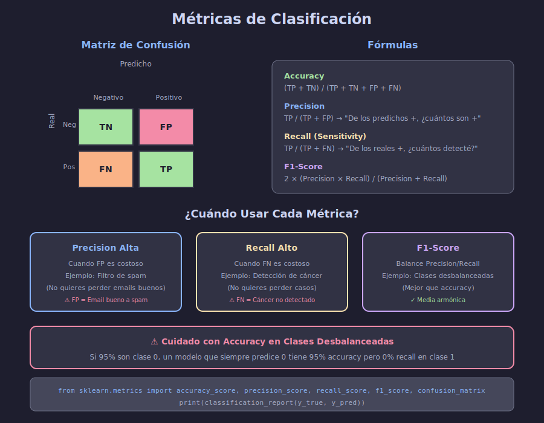
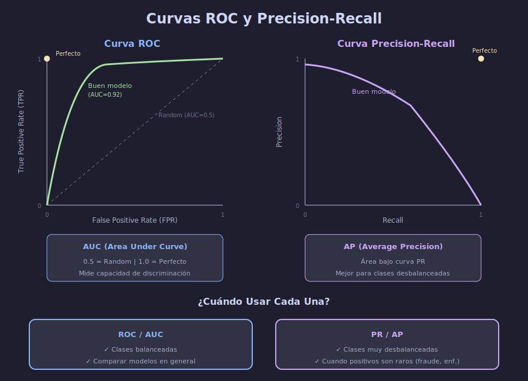

# 📊 Métricas de Clasificación

## 🎯 Objetivos de Aprendizaje

- Comprender la matriz de confusión y sus componentes
- Calcular e interpretar Accuracy, Precision, Recall y F1-Score
- Implementar curvas ROC y Precision-Recall
- Elegir la métrica adecuada según el problema

---

## 📋 Contenido

### 1. Matriz de Confusión

La base de todas las métricas de clasificación:



```python
import numpy as np
from sklearn.metrics import confusion_matrix, ConfusionMatrixDisplay
from sklearn.datasets import make_classification
from sklearn.model_selection import train_test_split
from sklearn.linear_model import LogisticRegression
import matplotlib.pyplot as plt

# Crear y entrenar modelo
X, y = make_classification(n_samples=1000, n_features=20, random_state=42)
X_train, X_test, y_train, y_test = train_test_split(X, y, test_size=0.2, random_state=42)

model = LogisticRegression()
model.fit(X_train, y_train)
y_pred = model.predict(X_test)

# Matriz de confusión
cm = confusion_matrix(y_test, y_pred)
print("Matriz de Confusión:")
print(cm)

# Visualizar
fig, ax = plt.subplots(figsize=(6, 5))
ConfusionMatrixDisplay(cm, display_labels=['Negativo', 'Positivo']).plot(ax=ax)
plt.title('Matriz de Confusión')
plt.tight_layout()
plt.show()
```

**Componentes:**

| Término | Significado | Descripción |
|---------|-------------|-------------|
| **TN** | True Negative | Correctamente predicho como negativo |
| **FP** | False Positive | Incorrectamente predicho como positivo (Error Tipo I) |
| **FN** | False Negative | Incorrectamente predicho como negativo (Error Tipo II) |
| **TP** | True Positive | Correctamente predicho como positivo |

---

### 2. Accuracy (Exactitud)

$$\text{Accuracy} = \frac{TP + TN}{TP + TN + FP + FN}$$

```python
from sklearn.metrics import accuracy_score

accuracy = accuracy_score(y_test, y_pred)
print(f"Accuracy: {accuracy:.4f}")

# Equivalente manual
tn, fp, fn, tp = cm.ravel()
accuracy_manual = (tp + tn) / (tp + tn + fp + fn)
print(f"Accuracy (manual): {accuracy_manual:.4f}")
```

**⚠️ Limitación:** Engañosa con clases desbalanceadas.

```python
# Ejemplo: 95% clase 0, 5% clase 1
y_imbalanced = np.array([0]*950 + [1]*50)
y_pred_dummy = np.zeros(1000)  # Siempre predice 0

acc = accuracy_score(y_imbalanced, y_pred_dummy)
print(f"Accuracy del modelo 'dummy': {acc:.2f}")  # 0.95! Pero inútil
```

---

### 3. Precision (Precisión)

$$\text{Precision} = \frac{TP}{TP + FP}$$

"De todos los que predije positivos, ¿cuántos realmente lo son?"

```python
from sklearn.metrics import precision_score

precision = precision_score(y_test, y_pred)
print(f"Precision: {precision:.4f}")

# Manual
precision_manual = tp / (tp + fp)
print(f"Precision (manual): {precision_manual:.4f}")
```

**Usar cuando FP es costoso:**
- Filtro de spam (no quieres perder emails importantes)
- Sistema de recomendación (no quieres recomendar mal)

---

### 4. Recall (Sensibilidad / TPR)

$$\text{Recall} = \frac{TP}{TP + FN}$$

"De todos los positivos reales, ¿cuántos detecté?"

```python
from sklearn.metrics import recall_score

recall = recall_score(y_test, y_pred)
print(f"Recall: {recall:.4f}")

# Manual
recall_manual = tp / (tp + fn)
print(f"Recall (manual): {recall_manual:.4f}")
```

**Usar cuando FN es costoso:**
- Detección de cáncer (no puedes perder ningún caso)
- Detección de fraude (no puedes dejar pasar fraudes)
- Seguridad (no puedes perder amenazas)

---

### 5. F1-Score

Media armónica de Precision y Recall:

$$F1 = 2 \times \frac{Precision \times Recall}{Precision + Recall}$$

```python
from sklearn.metrics import f1_score

f1 = f1_score(y_test, y_pred)
print(f"F1-Score: {f1:.4f}")

# Manual
f1_manual = 2 * (precision * recall) / (precision + recall)
print(f"F1 (manual): {f1_manual:.4f}")
```

**Usar cuando:**
- Necesitas balance entre Precision y Recall
- Clases desbalanceadas
- No puedes decidir cuál priorizar

---

### 6. Classification Report

Todas las métricas en un solo comando:

```python
from sklearn.metrics import classification_report

print(classification_report(y_test, y_pred, target_names=['Clase 0', 'Clase 1']))
```

**Output:**
```
              precision    recall  f1-score   support

     Clase 0       0.85      0.88      0.86       102
     Clase 1       0.87      0.83      0.85        98

    accuracy                           0.86       200
   macro avg       0.86      0.86      0.86       200
weighted avg       0.86      0.86      0.86       200
```

**Promedios:**
- `macro avg`: Promedio simple (trata clases igual)
- `weighted avg`: Promedio ponderado por soporte (considera desbalance)

---

### 7. Multiclase

```python
# Crear dataset multiclase
from sklearn.datasets import load_iris
from sklearn.ensemble import RandomForestClassifier

iris = load_iris()
X_train, X_test, y_train, y_test = train_test_split(
    iris.data, iris.target, test_size=0.2, random_state=42
)

model = RandomForestClassifier(random_state=42)
model.fit(X_train, y_train)
y_pred = model.predict(X_test)

# Matriz de confusión multiclase
cm = confusion_matrix(y_test, y_pred)
print(cm)

# Classification report
print(classification_report(y_test, y_pred, target_names=iris.target_names))
```

**Estrategias de promediado:**

```python
# micro: Cuenta globalmente TP, FP, FN
f1_micro = f1_score(y_test, y_pred, average='micro')

# macro: Promedio sin ponderar
f1_macro = f1_score(y_test, y_pred, average='macro')

# weighted: Promedio ponderado por soporte
f1_weighted = f1_score(y_test, y_pred, average='weighted')

# Por clase
f1_per_class = f1_score(y_test, y_pred, average=None)
```

---

### 8. Curva ROC y AUC



La curva ROC grafica TPR vs FPR a diferentes umbrales:

```python
from sklearn.metrics import roc_curve, roc_auc_score, RocCurveDisplay

# Necesitamos probabilidades, no predicciones
y_proba = model.predict_proba(X_test)[:, 1]

# Calcular ROC
fpr, tpr, thresholds = roc_curve(y_test, y_proba)
auc = roc_auc_score(y_test, y_proba)

# Graficar
fig, ax = plt.subplots(figsize=(8, 6))
RocCurveDisplay(fpr=fpr, tpr=tpr, roc_auc=auc).plot(ax=ax)
ax.plot([0, 1], [0, 1], 'k--', label='Random (AUC=0.5)')
ax.set_title('Curva ROC')
ax.legend()
plt.tight_layout()
plt.show()

print(f"AUC-ROC: {auc:.4f}")
```

**Interpretación de AUC:**
| AUC | Interpretación |
|-----|---------------|
| 0.5 | Random (sin capacidad discriminativa) |
| 0.6-0.7 | Pobre |
| 0.7-0.8 | Aceptable |
| 0.8-0.9 | Bueno |
| 0.9-1.0 | Excelente |

---

### 9. Curva Precision-Recall

Mejor para clases desbalanceadas:

```python
from sklearn.metrics import precision_recall_curve, average_precision_score
from sklearn.metrics import PrecisionRecallDisplay

# Calcular curva PR
precision_curve, recall_curve, thresholds = precision_recall_curve(y_test, y_proba)
ap = average_precision_score(y_test, y_proba)

# Graficar
fig, ax = plt.subplots(figsize=(8, 6))
PrecisionRecallDisplay(
    precision=precision_curve, 
    recall=recall_curve,
    average_precision=ap
).plot(ax=ax)
ax.set_title('Curva Precision-Recall')
plt.tight_layout()
plt.show()

print(f"Average Precision (AP): {ap:.4f}")
```

---

### 10. ROC vs PR: ¿Cuál Usar?

| Escenario | Usar | Razón |
|-----------|------|-------|
| Clases balanceadas | ROC/AUC | Ambas funcionan bien |
| Clases muy desbalanceadas | PR/AP | ROC puede ser engañosa |
| Positivos raros (fraude, cáncer) | PR/AP | Más sensible a FP |
| Comparación general de modelos | ROC/AUC | Más interpretable |

```python
# Ejemplo con clases desbalanceadas
X_imb, y_imb = make_classification(
    n_samples=1000, n_classes=2, weights=[0.95, 0.05],
    n_features=20, random_state=42
)

X_train, X_test, y_train, y_test = train_test_split(X_imb, y_imb, random_state=42)

model = LogisticRegression()
model.fit(X_train, y_train)
y_proba = model.predict_proba(X_test)[:, 1]

# Comparar métricas
print(f"AUC-ROC: {roc_auc_score(y_test, y_proba):.4f}")  # Puede ser alto
print(f"AP (PR): {average_precision_score(y_test, y_proba):.4f}")  # Más realista
```

---

### 11. Ajustar el Umbral de Decisión

Por defecto, umbral = 0.5. Puedes ajustarlo:

```python
# Predicciones con diferentes umbrales
thresholds = [0.3, 0.5, 0.7]

for threshold in thresholds:
    y_pred_thresh = (y_proba >= threshold).astype(int)
    
    p = precision_score(y_test, y_pred_thresh)
    r = recall_score(y_test, y_pred_thresh)
    f1 = f1_score(y_test, y_pred_thresh)
    
    print(f"Umbral {threshold}: Precision={p:.3f}, Recall={r:.3f}, F1={f1:.3f}")
```

**Encontrar umbral óptimo:**

```python
from sklearn.metrics import f1_score

# Buscar umbral que maximiza F1
precision_curve, recall_curve, thresholds_pr = precision_recall_curve(y_test, y_proba)

# F1 para cada umbral
f1_scores = 2 * (precision_curve * recall_curve) / (precision_curve + recall_curve + 1e-10)
best_idx = np.argmax(f1_scores)
best_threshold = thresholds_pr[best_idx] if best_idx < len(thresholds_pr) else 0.5

print(f"Mejor umbral para F1: {best_threshold:.3f}")
print(f"F1 óptimo: {f1_scores[best_idx]:.4f}")
```

---

### 12. Ejemplo Completo: Evaluación de Modelo

```python
from sklearn.datasets import load_breast_cancer
from sklearn.ensemble import RandomForestClassifier
from sklearn.model_selection import train_test_split
from sklearn.metrics import (
    accuracy_score, precision_score, recall_score, f1_score,
    roc_auc_score, average_precision_score, classification_report
)

# Cargar datos (diagnóstico de cáncer)
data = load_breast_cancer()
X_train, X_test, y_train, y_test = train_test_split(
    data.data, data.target, test_size=0.2, random_state=42, stratify=data.target
)

# Entrenar
model = RandomForestClassifier(n_estimators=100, random_state=42)
model.fit(X_train, y_train)

# Predicciones
y_pred = model.predict(X_test)
y_proba = model.predict_proba(X_test)[:, 1]

# Todas las métricas
print("="*50)
print("EVALUACIÓN COMPLETA DEL MODELO")
print("="*50)
print(f"\nAccuracy:  {accuracy_score(y_test, y_pred):.4f}")
print(f"Precision: {precision_score(y_test, y_pred):.4f}")
print(f"Recall:    {recall_score(y_test, y_pred):.4f}")
print(f"F1-Score:  {f1_score(y_test, y_pred):.4f}")
print(f"AUC-ROC:   {roc_auc_score(y_test, y_proba):.4f}")
print(f"AP (PR):   {average_precision_score(y_test, y_proba):.4f}")
print("\nClassification Report:")
print(classification_report(y_test, y_pred, target_names=['Maligno', 'Benigno']))
```

---

## 📚 Resumen

| Métrica | Fórmula | Usar cuando |
|---------|---------|-------------|
| **Accuracy** | (TP+TN)/Total | Clases balanceadas |
| **Precision** | TP/(TP+FP) | FP es costoso |
| **Recall** | TP/(TP+FN) | FN es costoso |
| **F1** | 2×P×R/(P+R) | Balance P-R |
| **AUC-ROC** | Área bajo ROC | Comparar modelos |
| **AP** | Área bajo PR | Clases desbalanceadas |

---

## ✅ Checklist de Verificación

- [ ] Entiendo la matriz de confusión
- [ ] Sé calcular e interpretar Precision, Recall y F1
- [ ] Comprendo cuándo usar cada métrica
- [ ] Puedo generar e interpretar curvas ROC y PR
- [ ] Sé ajustar umbrales de decisión

---

**Siguiente**: [Métricas de Regresión](04-metricas-regresion.md)
