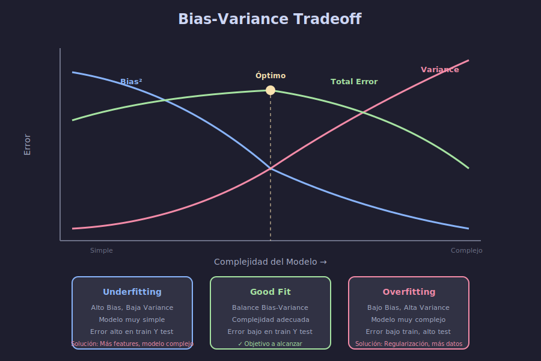

# ⚙️ Optimización de Hiperparámetros

## 🎯 Objetivos de Aprendizaje

- Comprender la diferencia entre parámetros e hiperparámetros
- Implementar GridSearchCV y RandomizedSearchCV
- Entender Nested Cross-Validation
- Conocer el tradeoff Bias-Variance

---

## 📋 Contenido

### 1. Parámetros vs Hiperparámetros

| Tipo                | Descripción                          | Ejemplo                                          | Cómo se obtienen                |
| ------------------- | ------------------------------------ | ------------------------------------------------ | ------------------------------- |
| **Parámetros**      | Se aprenden durante el entrenamiento | Coeficientes en regresión, pesos de red neuronal | Optimización (gradient descent) |
| **Hiperparámetros** | Se definen ANTES del entrenamiento   | n_estimators, max_depth, learning_rate           | Búsqueda manual o automática    |

```python
from sklearn.ensemble import RandomForestClassifier

# Hiperparámetros (los defines tú)
model = RandomForestClassifier(
    n_estimators=100,      # Hiperparámetro
    max_depth=10,          # Hiperparámetro
    min_samples_split=2,   # Hiperparámetro
    random_state=42
)

# Parámetros (se aprenden al entrenar)
model.fit(X_train, y_train)
# model.feature_importances_  ← Parámetros aprendidos
```

---

### 2. GridSearchCV

Búsqueda exhaustiva de todas las combinaciones:

```python
from sklearn.model_selection import GridSearchCV
from sklearn.ensemble import RandomForestClassifier
from sklearn.datasets import make_classification
from sklearn.model_selection import train_test_split

# Datos
X, y = make_classification(n_samples=1000, n_features=20, random_state=42)
X_train, X_test, y_train, y_test = train_test_split(X, y, test_size=0.2, random_state=42)

# Definir grid de hiperparámetros
param_grid = {
    'n_estimators': [50, 100, 200],
    'max_depth': [5, 10, 20, None],
    'min_samples_split': [2, 5, 10]
}

# Total de combinaciones: 3 × 4 × 3 = 36

# GridSearchCV
model = RandomForestClassifier(random_state=42)
grid_search = GridSearchCV(
    estimator=model,
    param_grid=param_grid,
    cv=5,                    # 5-fold CV
    scoring='accuracy',      # Métrica a optimizar
    n_jobs=-1,               # Paralelización
    verbose=1,               # Mostrar progreso
    return_train_score=True  # Guardar scores de train
)

# Ejecutar búsqueda
grid_search.fit(X_train, y_train)

# Resultados
print(f"Mejores hiperparámetros: {grid_search.best_params_}")
print(f"Mejor score CV: {grid_search.best_score_:.4f}")
print(f"Score en test: {grid_search.score(X_test, y_test):.4f}")
```

**Output:**

```
Fitting 5 folds for each of 36 candidates, totalling 180 fits
Mejores hiperparámetros: {'max_depth': 10, 'min_samples_split': 2, 'n_estimators': 100}
Mejor score CV: 0.8625
Score en test: 0.8700
```

---

### 3. Analizar Resultados de GridSearch

```python
import pandas as pd

# Convertir resultados a DataFrame
results = pd.DataFrame(grid_search.cv_results_)

# Columnas más importantes
cols = ['param_n_estimators', 'param_max_depth', 'param_min_samples_split',
        'mean_test_score', 'std_test_score', 'rank_test_score']
print(results[cols].sort_values('rank_test_score').head(10))

# Mejor modelo (ya está entrenado)
best_model = grid_search.best_estimator_
```

**Visualizar resultados:**

```python
import matplotlib.pyplot as plt
import numpy as np

# Heatmap para dos hiperparámetros
pivot = results.pivot_table(
    values='mean_test_score',
    index='param_max_depth',
    columns='param_n_estimators',
    aggfunc='mean'
)

fig, ax = plt.subplots(figsize=(10, 6))
im = ax.imshow(pivot, cmap='viridis', aspect='auto')
ax.set_xticks(range(len(pivot.columns)))
ax.set_xticklabels(pivot.columns)
ax.set_yticks(range(len(pivot.index)))
ax.set_yticklabels(pivot.index)
ax.set_xlabel('n_estimators')
ax.set_ylabel('max_depth')
plt.colorbar(im, label='Mean CV Score')
plt.title('GridSearchCV Results')
plt.tight_layout()
plt.show()
```

---

### 4. RandomizedSearchCV

Búsqueda aleatoria - más eficiente para espacios grandes:

```python
from sklearn.model_selection import RandomizedSearchCV
from scipy.stats import randint, uniform

# Distribuciones de hiperparámetros
param_distributions = {
    'n_estimators': randint(50, 500),           # Entero entre 50 y 500
    'max_depth': randint(5, 50),                # Entero entre 5 y 50
    'min_samples_split': randint(2, 20),        # Entero entre 2 y 20
    'min_samples_leaf': randint(1, 10),         # Entero entre 1 y 10
    'max_features': uniform(0.1, 0.9)           # Float entre 0.1 y 1.0
}

# RandomizedSearchCV
random_search = RandomizedSearchCV(
    estimator=RandomForestClassifier(random_state=42),
    param_distributions=param_distributions,
    n_iter=50,               # Número de combinaciones a probar
    cv=5,
    scoring='accuracy',
    n_jobs=-1,
    random_state=42,
    verbose=1
)

random_search.fit(X_train, y_train)

print(f"Mejores hiperparámetros: {random_search.best_params_}")
print(f"Mejor score CV: {random_search.best_score_:.4f}")
print(f"Score en test: {random_search.score(X_test, y_test):.4f}")
```

---

### 5. GridSearch vs RandomizedSearch

| Aspecto                | GridSearchCV                  | RandomizedSearchCV                   |
| ---------------------- | ----------------------------- | ------------------------------------ |
| **Búsqueda**           | Exhaustiva                    | Aleatoria                            |
| **Complejidad**        | O(combinaciones × K)          | O(n_iter × K)                        |
| **Cuándo usar**        | Pocos hiperparámetros         | Muchos hiperparámetros               |
| **Encuentra óptimo**   | Garantizado (si está en grid) | Probable con suficientes iteraciones |
| **Espacios continuos** | Discretiza                    | Natural                              |

```python
# Ejemplo de eficiencia
# Grid: 10 × 10 × 10 × 10 = 10,000 combinaciones
# Random: 100 iteraciones pueden dar buen resultado
```

---

### 6. Bias-Variance Tradeoff



```python
import numpy as np
import matplotlib.pyplot as plt
from sklearn.tree import DecisionTreeRegressor
from sklearn.model_selection import cross_val_score

# Datos
np.random.seed(42)
X = np.sort(np.random.rand(100, 1) * 10, axis=0)
y = np.sin(X).ravel() + np.random.randn(100) * 0.3

# Evaluar diferentes complejidades (max_depth)
depths = range(1, 20)
train_scores = []
cv_scores = []

for depth in depths:
    model = DecisionTreeRegressor(max_depth=depth, random_state=42)
    model.fit(X, y)

    # Score en train
    train_scores.append(model.score(X, y))

    # Score CV
    cv = cross_val_score(model, X, y, cv=5, scoring='r2')
    cv_scores.append(cv.mean())

# Graficar
plt.figure(figsize=(10, 6))
plt.plot(depths, train_scores, 'b-', label='Train Score', linewidth=2)
plt.plot(depths, cv_scores, 'r-', label='CV Score', linewidth=2)
plt.xlabel('Complejidad del Modelo (max_depth)')
plt.ylabel('R² Score')
plt.title('Bias-Variance Tradeoff')
plt.legend()
plt.grid(True, alpha=0.3)

# Marcar underfitting y overfitting
plt.axvline(x=4, color='g', linestyle='--', alpha=0.5, label='Óptimo')
plt.annotate('Underfitting\n(Alto Bias)', xy=(2, 0.3), fontsize=10)
plt.annotate('Overfitting\n(Alta Variance)', xy=(15, 0.3), fontsize=10)
plt.tight_layout()
plt.show()
```

---

### 7. Nested Cross-Validation

**Problema:** Si usamos CV para seleccionar hiperparámetros Y evaluar el modelo, tenemos sesgo optimista.

**Solución:** Nested CV

```python
from sklearn.model_selection import cross_val_score, GridSearchCV

# CV interno: Selección de hiperparámetros
inner_cv = 5

# CV externo: Evaluación del proceso completo
outer_cv = 5

# GridSearch (loop interno)
param_grid = {
    'n_estimators': [50, 100, 200],
    'max_depth': [5, 10, 20]
}

grid_search = GridSearchCV(
    estimator=RandomForestClassifier(random_state=42),
    param_grid=param_grid,
    cv=inner_cv,
    scoring='accuracy',
    n_jobs=-1
)

# Nested CV (loop externo)
nested_scores = cross_val_score(
    grid_search,  # Objeto completo de GridSearch
    X, y,
    cv=outer_cv,
    scoring='accuracy'
)

print(f"Nested CV Accuracy: {nested_scores.mean():.4f} ± {nested_scores.std():.4f}")
```

**Estructura:**

```
┌──────────────────────────────────────────────────────┐
│                   CV Externo (5-fold)                 │
│  ┌────────────────────────────────────────────────┐  │
│  │  Fold 1: Train(80%) → GridSearchCV → Test(20%) │  │
│  │  Fold 2: Train(80%) → GridSearchCV → Test(20%) │  │
│  │  ...                                           │  │
│  │  Fold 5: Train(80%) → GridSearchCV → Test(20%) │  │
│  └────────────────────────────────────────────────┘  │
│                                                       │
│  Dentro de cada GridSearchCV (CV Interno 5-fold):    │
│  - Encuentra mejores hiperparámetros                 │
│  - Entrena modelo final con esos hiperparámetros    │
│  - Evalúa en el fold de test externo                │
└──────────────────────────────────────────────────────┘
```

---

### 8. Pipelines con GridSearch

```python
from sklearn.pipeline import Pipeline
from sklearn.preprocessing import StandardScaler
from sklearn.decomposition import PCA
from sklearn.svm import SVC

# Pipeline
pipeline = Pipeline([
    ('scaler', StandardScaler()),
    ('pca', PCA()),
    ('svm', SVC())
])

# Grid de hiperparámetros (usar nombre_paso__parametro)
param_grid = {
    'pca__n_components': [5, 10, 15],
    'svm__C': [0.1, 1, 10],
    'svm__kernel': ['rbf', 'linear'],
    'svm__gamma': ['scale', 'auto']
}

# GridSearch sobre pipeline completo
grid_search = GridSearchCV(
    pipeline,
    param_grid,
    cv=5,
    scoring='accuracy',
    n_jobs=-1,
    verbose=1
)

grid_search.fit(X_train, y_train)

print(f"Mejores parámetros: {grid_search.best_params_}")
print(f"Score test: {grid_search.score(X_test, y_test):.4f}")
```

---

### 9. Estrategias de Búsqueda Avanzadas

#### 9.1 Búsqueda en Dos Etapas

```python
# Etapa 1: Búsqueda amplia con pocos valores
param_grid_coarse = {
    'n_estimators': [50, 200],
    'max_depth': [5, 20],
    'learning_rate': [0.01, 0.1]
}

grid_coarse = GridSearchCV(model, param_grid_coarse, cv=3)
grid_coarse.fit(X_train, y_train)

# Etapa 2: Búsqueda fina alrededor del mejor
best = grid_coarse.best_params_
param_grid_fine = {
    'n_estimators': [best['n_estimators'] - 50, best['n_estimators'], best['n_estimators'] + 50],
    'max_depth': [best['max_depth'] - 2, best['max_depth'], best['max_depth'] + 2],
    # ...
}

grid_fine = GridSearchCV(model, param_grid_fine, cv=5)
grid_fine.fit(X_train, y_train)
```

#### 9.2 Early Stopping

```python
from sklearn.ensemble import GradientBoostingClassifier

# Con early stopping manual via warm_start
model = GradientBoostingClassifier(warm_start=True, n_estimators=1)

for n_trees in range(1, 500, 10):
    model.n_estimators = n_trees
    model.fit(X_train, y_train)
    score = model.score(X_val, y_val)
    if n_trees > 50 and score < best_score - 0.01:
        print(f"Early stopping at {n_trees} trees")
        break
```

---

### 10. Ejemplo Completo: Optimización de Modelo

```python
from sklearn.datasets import load_breast_cancer
from sklearn.model_selection import train_test_split, GridSearchCV, cross_val_score
from sklearn.ensemble import GradientBoostingClassifier
from sklearn.metrics import classification_report
import warnings
warnings.filterwarnings('ignore')

# Datos
data = load_breast_cancer()
X_train, X_test, y_train, y_test = train_test_split(
    data.data, data.target, test_size=0.2, random_state=42, stratify=data.target
)

# Grid de hiperparámetros
param_grid = {
    'n_estimators': [50, 100, 200],
    'max_depth': [3, 5, 7],
    'learning_rate': [0.01, 0.1, 0.2],
    'min_samples_split': [2, 5]
}

# GridSearchCV
model = GradientBoostingClassifier(random_state=42)
grid_search = GridSearchCV(
    model, param_grid, cv=5, scoring='f1', n_jobs=-1, verbose=1
)
grid_search.fit(X_train, y_train)

# Resultados
print("\n" + "="*50)
print("RESULTADOS DE OPTIMIZACIÓN")
print("="*50)
print(f"\nMejores hiperparámetros:")
for param, value in grid_search.best_params_.items():
    print(f"  {param}: {value}")

print(f"\nMejor F1 Score (CV): {grid_search.best_score_:.4f}")

# Evaluar en test
y_pred = grid_search.predict(X_test)
print(f"\nRendimiento en Test:")
print(classification_report(y_test, y_pred, target_names=['Maligno', 'Benigno']))

# Nested CV para estimación honesta
print("\nEstimación con Nested CV:")
nested_scores = cross_val_score(grid_search, data.data, data.target, cv=5, scoring='f1')
print(f"F1 Score: {nested_scores.mean():.4f} ± {nested_scores.std():.4f}")
```

---

### 11. Consejos Prácticos

1. **Empieza simple**: Pocos hiperparámetros, rangos amplios
2. **Usa RandomizedSearch** para espacios grandes
3. **Paraleliza** con `n_jobs=-1`
4. **Nested CV** para reportar métricas honestas
5. **No overfittees** los hiperparámetros al validation set
6. **Documenta** los hiperparámetros finales

---

## 📚 Resumen

| Método                 | Uso                           | Eficiencia            |
| ---------------------- | ----------------------------- | --------------------- |
| **GridSearchCV**       | Espacios pequeños, exhaustivo | O(combinaciones)      |
| **RandomizedSearchCV** | Espacios grandes              | O(n_iter)             |
| **Nested CV**          | Evaluación sin sesgo          | Costoso pero correcto |

---

## ✅ Checklist de Verificación

- [ ] Distingo parámetros de hiperparámetros
- [ ] Sé usar GridSearchCV y RandomizedSearchCV
- [ ] Entiendo el tradeoff Bias-Variance
- [ ] Comprendo por qué es importante Nested CV
- [ ] Puedo optimizar pipelines completos

---

## 🔗 Recursos Adicionales

- [GridSearchCV Documentation](https://scikit-learn.org/stable/modules/generated/sklearn.model_selection.GridSearchCV.html)
- [Tuning Hyperparameters](https://scikit-learn.org/stable/modules/grid_search.html)
- [Nested CV](https://scikit-learn.org/stable/auto_examples/model_selection/plot_nested_cross_validation_iris.html)
