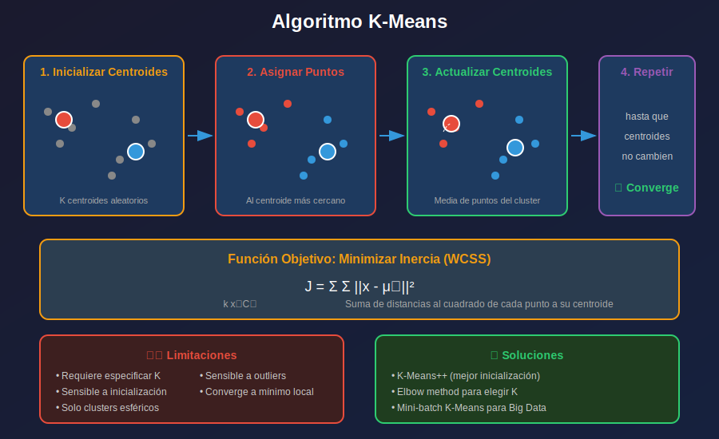

# 📚 K-Means Clustering

## 🎯 Objetivos

- Comprender el algoritmo K-Means paso a paso
- Implementar K-Means desde cero
- Usar K-Means con scikit-learn
- Conocer variantes y limitaciones

---

## 1. El Algoritmo K-Means

K-Means es el algoritmo de clustering más popular. Divide los datos en **K clusters** minimizando la distancia intra-cluster.



### Pasos del Algoritmo

1. **Inicializar** K centroides aleatoriamente
2. **Asignar** cada punto al centroide más cercano
3. **Actualizar** centroides como media de sus puntos
4. **Repetir** pasos 2-3 hasta convergencia

### Función Objetivo (Inercia)

$$J = \sum_{k=1}^{K} \sum_{x \in C_k} ||x - \mu_k||^2$$

- Minimiza la suma de distancias al cuadrado
- También llamada WCSS (Within-Cluster Sum of Squares)

---

## 2. Implementación desde Cero

```python
import numpy as np

class KMeansFromScratch:
    def __init__(self, n_clusters=3, max_iters=100, tol=1e-4, random_state=None):
        self.n_clusters = n_clusters
        self.max_iters = max_iters
        self.tol = tol
        self.random_state = random_state
        
    def fit(self, X):
        np.random.seed(self.random_state)
        n_samples = X.shape[0]
        
        # 1. Inicializar centroides aleatoriamente
        random_idx = np.random.choice(n_samples, self.n_clusters, replace=False)
        self.centroids = X[random_idx].copy()
        
        for iteration in range(self.max_iters):
            # 2. Asignar puntos al centroide más cercano
            self.labels_ = self._assign_clusters(X)
            
            # 3. Calcular nuevos centroides
            new_centroids = self._compute_centroids(X)
            
            # 4. Verificar convergencia
            shift = np.sum((new_centroids - self.centroids) ** 2)
            if shift < self.tol:
                break
                
            self.centroids = new_centroids
        
        self.cluster_centers_ = self.centroids
        self.inertia_ = self._compute_inertia(X)
        return self
    
    def _assign_clusters(self, X):
        distances = np.zeros((X.shape[0], self.n_clusters))
        for k in range(self.n_clusters):
            distances[:, k] = np.linalg.norm(X - self.centroids[k], axis=1)
        return np.argmin(distances, axis=1)
    
    def _compute_centroids(self, X):
        centroids = np.zeros((self.n_clusters, X.shape[1]))
        for k in range(self.n_clusters):
            mask = self.labels_ == k
            if mask.sum() > 0:
                centroids[k] = X[mask].mean(axis=0)
        return centroids
    
    def _compute_inertia(self, X):
        inertia = 0
        for k in range(self.n_clusters):
            mask = self.labels_ == k
            inertia += np.sum((X[mask] - self.centroids[k]) ** 2)
        return inertia
    
    def predict(self, X):
        return self._assign_clusters(X)
```

---

## 3. K-Means con Scikit-learn

```python
from sklearn.cluster import KMeans
from sklearn.datasets import make_blobs
from sklearn.preprocessing import StandardScaler
import matplotlib.pyplot as plt

# Generar datos de ejemplo
X, y_true = make_blobs(n_samples=300, centers=4, cluster_std=0.8, random_state=42)
X_scaled = StandardScaler().fit_transform(X)

# Crear y ajustar modelo
kmeans = KMeans(
    n_clusters=4,
    init='k-means++',      # Inicialización inteligente
    n_init=10,             # Número de inicializaciones
    max_iter=300,          # Máximo de iteraciones
    random_state=42
)
labels = kmeans.fit_predict(X_scaled)

# Atributos importantes
print(f"Centroides:\n{kmeans.cluster_centers_}")
print(f"Inercia: {kmeans.inertia_:.2f}")
print(f"Iteraciones: {kmeans.n_iter_}")
```

---

## 4. K-Means++ Inicialización

El problema de K-Means es que la inicialización aleatoria puede dar malos resultados.

**K-Means++** elige centroides iniciales de forma inteligente:

1. Elegir primer centroide aleatoriamente
2. Para cada centroide siguiente:
   - Calcular distancia de cada punto al centroide más cercano
   - Elegir nuevo centroide con probabilidad proporcional a d²
3. Repetir hasta tener K centroides

```python
# Scikit-learn usa k-means++ por defecto
kmeans = KMeans(n_clusters=4, init='k-means++')

# Comparar con inicialización aleatoria
kmeans_random = KMeans(n_clusters=4, init='random', n_init=1)
```

---

## 5. Visualización de Clusters

```python
def plot_kmeans_result(X, kmeans, title="K-Means Clustering"):
    plt.figure(figsize=(10, 6))
    
    # Scatter de puntos coloreados por cluster
    scatter = plt.scatter(X[:, 0], X[:, 1], c=kmeans.labels_, 
                          cmap='viridis', alpha=0.6, s=50)
    
    # Marcar centroides
    plt.scatter(kmeans.cluster_centers_[:, 0], kmeans.cluster_centers_[:, 1],
                c='red', marker='X', s=200, edgecolors='black', linewidths=2,
                label='Centroides')
    
    plt.colorbar(scatter, label='Cluster')
    plt.xlabel('Feature 1')
    plt.ylabel('Feature 2')
    plt.title(f"{title}\nInercia: {kmeans.inertia_:.2f}")
    plt.legend()
    plt.show()

plot_kmeans_result(X_scaled, kmeans)
```

---

## 6. Limitaciones de K-Means

### 6.1 Requiere especificar K
```python
# ¿Cuántos clusters hay? No lo sabemos a priori
# Solución: método del codo, silhouette
```

### 6.2 Solo clusters esféricos
```python
from sklearn.datasets import make_moons

# K-Means falla con formas no convexas
X_moons, _ = make_moons(n_samples=200, noise=0.05, random_state=42)
kmeans_moons = KMeans(n_clusters=2, random_state=42)
labels_moons = kmeans_moons.fit_predict(X_moons)
# Los clusters se dividen mal
```

### 6.3 Sensible a outliers
```python
# Un outlier puede "arrastrar" el centroide
# Solución: K-Medoids (usa medianas)
```

### 6.4 Sensible a la escala
```python
# SIEMPRE escalar los datos antes de K-Means
from sklearn.preprocessing import StandardScaler
X_scaled = StandardScaler().fit_transform(X)
```

---

## 7. Variantes de K-Means

### Mini-Batch K-Means
Para datasets grandes, usa mini-batches para acelerar.

```python
from sklearn.cluster import MiniBatchKMeans

mbkmeans = MiniBatchKMeans(
    n_clusters=4,
    batch_size=100,
    random_state=42
)
labels = mbkmeans.fit_predict(X_large)
# Mucho más rápido, resultado similar
```

### K-Medoids (PAM)
Usa puntos reales como centroides (más robusto a outliers).

```python
# No está en sklearn, usar sklearn_extra
# pip install scikit-learn-extra
from sklearn_extra.cluster import KMedoids

kmedoids = KMedoids(n_clusters=4, random_state=42)
labels = kmedoids.fit_predict(X_scaled)
```

---

## 8. Ejemplo Completo

```python
import numpy as np
import matplotlib.pyplot as plt
from sklearn.cluster import KMeans
from sklearn.datasets import make_blobs
from sklearn.preprocessing import StandardScaler

# Datos
X, _ = make_blobs(n_samples=500, centers=5, cluster_std=1.0, random_state=42)
X_scaled = StandardScaler().fit_transform(X)

# K-Means
kmeans = KMeans(n_clusters=5, init='k-means++', n_init=10, random_state=42)
labels = kmeans.fit_predict(X_scaled)

# Resultados
print(f"Clusters encontrados: {len(np.unique(labels))}")
print(f"Tamaño de clusters: {np.bincount(labels)}")
print(f"Inercia: {kmeans.inertia_:.2f}")

# Visualización
fig, axes = plt.subplots(1, 2, figsize=(14, 5))

# Original
axes[0].scatter(X_scaled[:, 0], X_scaled[:, 1], alpha=0.5)
axes[0].set_title('Datos Originales')

# Clustered
scatter = axes[1].scatter(X_scaled[:, 0], X_scaled[:, 1], 
                          c=labels, cmap='viridis', alpha=0.6)
axes[1].scatter(kmeans.cluster_centers_[:, 0], kmeans.cluster_centers_[:, 1],
                c='red', marker='X', s=200, edgecolors='black')
axes[1].set_title(f'K-Means (K=5, Inercia={kmeans.inertia_:.2f})')
plt.colorbar(scatter, ax=axes[1])

plt.tight_layout()
plt.show()
```

---

## ✅ Checklist de Aprendizaje

- [ ] Entiendo los 4 pasos del algoritmo K-Means
- [ ] Comprendo la función objetivo (inercia)
- [ ] Sé por qué K-Means++ es mejor que random
- [ ] Conozco las limitaciones de K-Means
- [ ] Puedo usar KMeans de sklearn

---

## 🔗 Referencias

- [K-Means - sklearn](https://scikit-learn.org/stable/modules/generated/sklearn.cluster.KMeans.html)
- [K-Means++ Paper](https://theory.stanford.edu/~sergei/papers/kMeansPP-soda.pdf)
