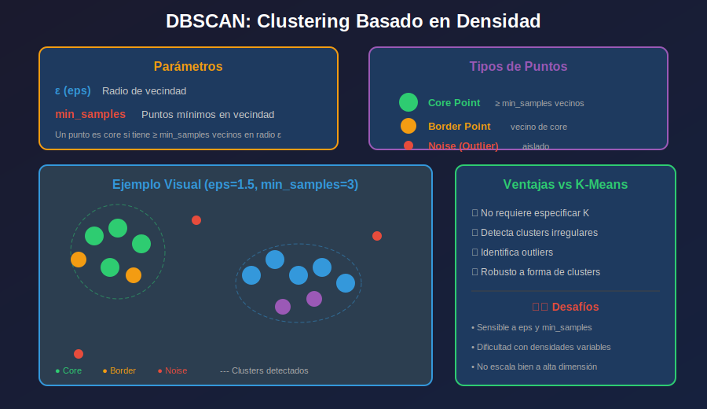

# 📚 DBSCAN: Clustering Basado en Densidad

## 🎯 Objetivos

- Entender el concepto de clustering por densidad
- Conocer los parámetros eps y min_samples
- Implementar DBSCAN con scikit-learn
- Comparar DBSCAN vs K-Means

---

## 1. ¿Qué es DBSCAN?

**DBSCAN** (Density-Based Spatial Clustering of Applications with Noise) agrupa puntos basándose en la **densidad** de la región.



### Idea Central

- Un cluster es una región de **alta densidad** separada de otras regiones por zonas de **baja densidad**
- Los puntos aislados se marcan como **ruido (noise)**

---

## 2. Parámetros Clave

### eps (ε) - Radio de Vecindad

- Define el radio alrededor de cada punto
- Puntos dentro de este radio son "vecinos"

### min_samples - Mínimo de Vecinos

- Mínimo de puntos necesarios para formar una región densa
- Incluye el punto mismo

```python
# Si min_samples=5 y un punto tiene 5+ vecinos en radio eps
# → Es un CORE POINT (punto núcleo)
```

---

## 3. Tipos de Puntos

### Core Point (Punto Núcleo)

- Tiene **≥ min_samples** vecinos dentro de eps
- Forma el "corazón" del cluster

### Border Point (Punto Frontera)

- Tiene **< min_samples** vecinos
- PERO está en la vecindad de un core point
- Pertenece al cluster pero no lo define

### Noise Point (Ruido/Outlier)

- No es core ni border
- Se marca con etiqueta **-1**

```python
# Identificar tipos de puntos
core_samples_mask = np.zeros_like(labels, dtype=bool)
core_samples_mask[dbscan.core_sample_indices_] = True

# Core points: core_samples_mask == True
# Border points: (labels != -1) & (core_samples_mask == False)
# Noise points: labels == -1
```

---

## 4. DBSCAN con Scikit-learn

```python
from sklearn.cluster import DBSCAN
from sklearn.datasets import make_moons
from sklearn.preprocessing import StandardScaler
import matplotlib.pyplot as plt
import numpy as np

# Datos con forma irregular (donde K-Means falla)
X, _ = make_moons(n_samples=300, noise=0.05, random_state=42)
X_scaled = StandardScaler().fit_transform(X)

# DBSCAN
dbscan = DBSCAN(
    eps=0.3,           # Radio de vecindad
    min_samples=5,     # Mínimo vecinos para core point
    metric='euclidean' # Métrica de distancia
)
labels = dbscan.fit_predict(X_scaled)

# Resultados
n_clusters = len(set(labels)) - (1 if -1 in labels else 0)
n_noise = list(labels).count(-1)

print(f"Clusters encontrados: {n_clusters}")
print(f"Puntos de ruido: {n_noise}")
print(f"Core points: {len(dbscan.core_sample_indices_)}")
```

---

## 5. Visualización de DBSCAN

```python
def plot_dbscan(X, labels, core_indices, title="DBSCAN"):
    plt.figure(figsize=(10, 6))

    # Identificar tipos de puntos
    core_mask = np.zeros_like(labels, dtype=bool)
    core_mask[core_indices] = True

    unique_labels = set(labels)
    colors = plt.cm.viridis(np.linspace(0, 1, len(unique_labels)))

    for k, col in zip(unique_labels, colors):
        if k == -1:
            # Noise en gris
            col = [0.5, 0.5, 0.5, 1]
            marker = 'x'
            size = 30
        else:
            marker = 'o'
            size = 50

        class_mask = labels == k

        # Core points (más grandes)
        xy_core = X[class_mask & core_mask]
        plt.scatter(xy_core[:, 0], xy_core[:, 1], c=[col], marker=marker,
                   s=size*2, edgecolors='black', linewidths=1)

        # Border points (más pequeños)
        xy_border = X[class_mask & ~core_mask]
        plt.scatter(xy_border[:, 0], xy_border[:, 1], c=[col], marker=marker,
                   s=size, alpha=0.6)

    plt.title(f"{title}\nClusters: {len(unique_labels)-1}, Noise: {(labels==-1).sum()}")
    plt.xlabel('Feature 1')
    plt.ylabel('Feature 2')
    plt.show()

plot_dbscan(X_scaled, labels, dbscan.core_sample_indices_)
```

---

## 6. Selección de Parámetros

### Método del k-distance graph

```python
from sklearn.neighbors import NearestNeighbors

def find_eps(X, min_samples=5):
    """
    Grafica k-distance para ayudar a elegir eps.
    El "codo" sugiere un buen valor de eps.
    """
    nn = NearestNeighbors(n_neighbors=min_samples)
    nn.fit(X)
    distances, _ = nn.kneighbors(X)

    # Distancia al k-ésimo vecino más cercano
    k_distances = distances[:, min_samples-1]
    k_distances = np.sort(k_distances)[::-1]

    plt.figure(figsize=(10, 5))
    plt.plot(k_distances)
    plt.xlabel('Puntos (ordenados)')
    plt.ylabel(f'Distancia al {min_samples}-ésimo vecino')
    plt.title('k-Distance Graph para selección de eps')
    plt.axhline(y=0.3, color='r', linestyle='--', label='eps sugerido')
    plt.legend()
    plt.show()

find_eps(X_scaled, min_samples=5)
```

### Reglas Generales

| Parámetro       | Guía                         |
| --------------- | ---------------------------- |
| **min_samples** | ≥ dimensiones + 1 (mínimo 3) |
| **eps**         | Usar k-distance graph        |

```python
# Para datos 2D: min_samples >= 3
# Para datos de alta dimensión: min_samples >= D + 1

# eps muy pequeño → muchos puntos como noise
# eps muy grande → todo en un cluster
```

---

## 7. DBSCAN vs K-Means

```python
from sklearn.datasets import make_moons, make_blobs
from sklearn.cluster import KMeans, DBSCAN
import matplotlib.pyplot as plt

# Comparar en diferentes datasets
fig, axes = plt.subplots(2, 3, figsize=(15, 10))

# Dataset 1: Moons (no convexo)
X_moons, _ = make_moons(n_samples=300, noise=0.05, random_state=42)

# Dataset 2: Blobs (convexo)
X_blobs, _ = make_blobs(n_samples=300, centers=3, cluster_std=0.5, random_state=42)

for i, (X, name) in enumerate([(X_moons, 'Moons'), (X_blobs, 'Blobs')]):
    X_scaled = StandardScaler().fit_transform(X)

    # Original
    axes[i, 0].scatter(X_scaled[:, 0], X_scaled[:, 1], alpha=0.6)
    axes[i, 0].set_title(f'{name} - Original')

    # K-Means
    km = KMeans(n_clusters=2 if 'Moon' in name else 3, random_state=42)
    axes[i, 1].scatter(X_scaled[:, 0], X_scaled[:, 1], c=km.fit_predict(X_scaled), cmap='viridis')
    axes[i, 1].set_title(f'{name} - K-Means')

    # DBSCAN
    db = DBSCAN(eps=0.3, min_samples=5)
    labels = db.fit_predict(X_scaled)
    axes[i, 2].scatter(X_scaled[:, 0], X_scaled[:, 1], c=labels, cmap='viridis')
    axes[i, 2].set_title(f'{name} - DBSCAN')

plt.tight_layout()
plt.show()
```

### Cuándo usar cada uno

| Criterio           | K-Means            | DBSCAN                |
| ------------------ | ------------------ | --------------------- |
| Forma de clusters  | Esférica           | Arbitraria            |
| Número de clusters | Debe especificarse | Automático            |
| Outliers           | No detecta         | Detecta como noise    |
| Escalabilidad      | Muy buena          | Buena                 |
| Densidad variable  | No maneja bien     | Puede tener problemas |

---

## 8. Variantes de DBSCAN

### OPTICS

Para datasets con densidades variables.

```python
from sklearn.cluster import OPTICS

optics = OPTICS(min_samples=5, xi=0.05, min_cluster_size=0.1)
labels = optics.fit_predict(X_scaled)
```

### HDBSCAN

Versión jerárquica, más robusta.

```python
# pip install hdbscan
import hdbscan

clusterer = hdbscan.HDBSCAN(min_cluster_size=15)
labels = clusterer.fit_predict(X_scaled)
```

---

## 9. Ejemplo Completo

```python
import numpy as np
import matplotlib.pyplot as plt
from sklearn.cluster import DBSCAN
from sklearn.datasets import make_moons
from sklearn.preprocessing import StandardScaler
from sklearn.neighbors import NearestNeighbors

# Generar datos
X, _ = make_moons(n_samples=500, noise=0.08, random_state=42)
X_scaled = StandardScaler().fit_transform(X)

# Encontrar eps óptimo
nn = NearestNeighbors(n_neighbors=5)
nn.fit(X_scaled)
distances, _ = nn.kneighbors(X_scaled)
k_dist = np.sort(distances[:, 4])[::-1]

# Aplicar DBSCAN
dbscan = DBSCAN(eps=0.25, min_samples=5)
labels = dbscan.fit_predict(X_scaled)

# Resultados
n_clusters = len(set(labels)) - (1 if -1 in labels else 0)
n_noise = (labels == -1).sum()

print(f"Clusters: {n_clusters}")
print(f"Noise: {n_noise} ({n_noise/len(labels)*100:.1f}%)")
print(f"Core points: {len(dbscan.core_sample_indices_)}")

# Visualización
fig, axes = plt.subplots(1, 2, figsize=(14, 5))

# k-distance
axes[0].plot(k_dist)
axes[0].axhline(y=0.25, color='r', linestyle='--', label='eps=0.25')
axes[0].set_title('k-Distance Graph')
axes[0].legend()

# Clusters
scatter = axes[1].scatter(X_scaled[:, 0], X_scaled[:, 1], c=labels, cmap='viridis')
axes[1].set_title(f'DBSCAN (clusters={n_clusters}, noise={n_noise})')
plt.colorbar(scatter, ax=axes[1])

plt.tight_layout()
plt.show()
```

---

## ✅ Checklist de Aprendizaje

- [ ] Entiendo qué significa clustering basado en densidad
- [ ] Conozco la diferencia entre core, border y noise points
- [ ] Sé cómo elegir eps usando k-distance graph
- [ ] Puedo comparar cuándo usar DBSCAN vs K-Means
- [ ] Puedo implementar DBSCAN con sklearn

---

## 🔗 Referencias

- [DBSCAN - sklearn](https://scikit-learn.org/stable/modules/generated/sklearn.cluster.DBSCAN.html)
- [DBSCAN Paper Original](https://www.aaai.org/Papers/KDD/1996/KDD96-037.pdf)
