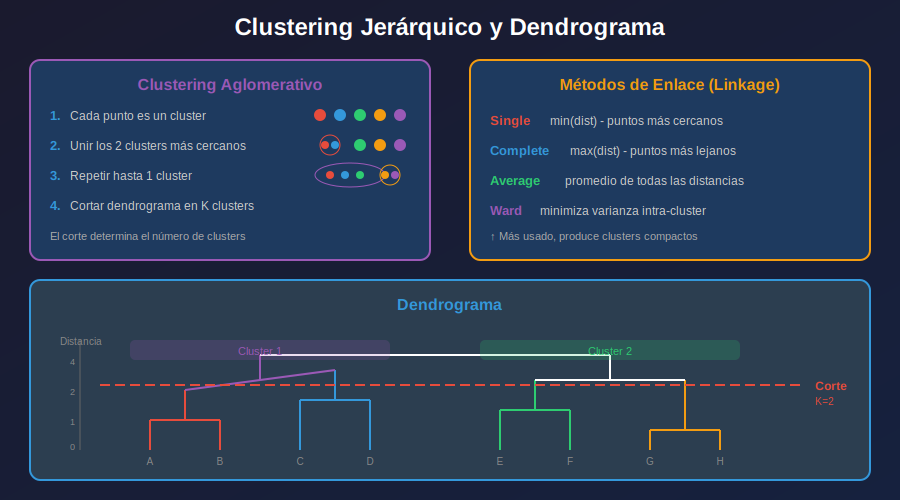

# 📚 Clustering Jerárquico

## 🎯 Objetivos

- Entender el clustering jerárquico aglomerativo
- Interpretar dendrogramas
- Conocer los métodos de enlace (linkage)
- Implementar con scikit-learn y scipy

---

## 1. ¿Qué es Clustering Jerárquico?

Crea una **jerarquía de clusters** representada como un árbol (dendrograma).



### Dos Enfoques

| Tipo | Descripción |
|------|-------------|
| **Aglomerativo** (bottom-up) | Empieza con N clusters, fusiona hasta 1 |
| **Divisivo** (top-down) | Empieza con 1 cluster, divide hasta N |

> En la práctica, el **aglomerativo** es el más usado.

---

## 2. Algoritmo Aglomerativo

### Pasos

1. Cada punto es un cluster individual
2. Calcular distancia entre todos los pares de clusters
3. Fusionar los 2 clusters más cercanos
4. Repetir hasta tener 1 cluster
5. Cortar el dendrograma para obtener K clusters

### Complejidad
- Tiempo: O(n³) para el básico, O(n² log n) optimizado
- Espacio: O(n²) para matriz de distancias

---

## 3. Métodos de Enlace (Linkage)

Define cómo medir la distancia entre clusters.

### Single Linkage (Minimum)
```
dist(A, B) = min{d(a, b) : a ∈ A, b ∈ B}
```
- Distancia entre los puntos **más cercanos**
- Puede crear cadenas largas ("chaining effect")

### Complete Linkage (Maximum)
```
dist(A, B) = max{d(a, b) : a ∈ A, b ∈ B}
```
- Distancia entre los puntos **más lejanos**
- Clusters más compactos

### Average Linkage
```
dist(A, B) = mean{d(a, b) : a ∈ A, b ∈ B}
```
- **Promedio** de todas las distancias
- Balance entre single y complete

### Ward Linkage ⭐ (Más Usado)
```
Minimiza la varianza intra-cluster al fusionar
```
- Produce clusters de **tamaño similar**
- Tiende a clusters **esféricos y compactos**

```python
# Comparar linkages
linkages = ['single', 'complete', 'average', 'ward']
```

---

## 4. Dendrogramas con Scipy

```python
import numpy as np
import matplotlib.pyplot as plt
from scipy.cluster.hierarchy import dendrogram, linkage, fcluster
from scipy.spatial.distance import pdist
from sklearn.datasets import make_blobs
from sklearn.preprocessing import StandardScaler

# Generar datos
X, _ = make_blobs(n_samples=50, centers=3, cluster_std=1.0, random_state=42)
X_scaled = StandardScaler().fit_transform(X)

# Calcular linkage matrix
Z = linkage(X_scaled, method='ward')

# Visualizar dendrograma
plt.figure(figsize=(14, 6))
dendrogram(Z, 
           truncate_mode='lastp',  # Mostrar últimos p clusters
           p=12,                    # Número de hojas
           leaf_rotation=90,
           leaf_font_size=10,
           show_contracted=True)
plt.title('Dendrograma Jerárquico (Ward Linkage)')
plt.xlabel('Índice de muestra o (tamaño del cluster)')
plt.ylabel('Distancia')
plt.axhline(y=10, color='r', linestyle='--', label='Corte K=3')
plt.legend()
plt.show()
```

---

## 5. Obtener Clusters del Dendrograma

```python
from scipy.cluster.hierarchy import fcluster

# Método 1: Número de clusters
labels_k = fcluster(Z, t=3, criterion='maxclust')  # K=3 clusters

# Método 2: Distancia de corte
labels_d = fcluster(Z, t=10, criterion='distance')  # Cortar en distancia 10

# Método 3: Inconsistency (automático)
labels_i = fcluster(Z, t=1.5, criterion='inconsistent')

print(f"Clusters (K=3): {np.unique(labels_k)}")
print(f"Tamaños: {np.bincount(labels_k)}")
```

---

## 6. Clustering Jerárquico con Scikit-learn

```python
from sklearn.cluster import AgglomerativeClustering
import matplotlib.pyplot as plt

# Crear modelo
agg_clustering = AgglomerativeClustering(
    n_clusters=3,           # Número de clusters deseado
    metric='euclidean',     # Métrica de distancia
    linkage='ward'          # Método de enlace
)

# Ajustar y predecir
labels = agg_clustering.fit_predict(X_scaled)

# Visualizar
plt.figure(figsize=(10, 6))
plt.scatter(X_scaled[:, 0], X_scaled[:, 1], c=labels, cmap='viridis', s=50)
plt.title(f'Clustering Jerárquico Aglomerativo (K=3, Ward)')
plt.colorbar(label='Cluster')
plt.show()
```

---

## 7. Comparar Métodos de Linkage

```python
from sklearn.cluster import AgglomerativeClustering
import matplotlib.pyplot as plt

linkages = ['ward', 'complete', 'average', 'single']

fig, axes = plt.subplots(1, 4, figsize=(16, 4))

for ax, linkage_method in zip(axes, linkages):
    # Ward requiere euclidean
    metric = 'euclidean' if linkage_method == 'ward' else 'euclidean'
    
    agg = AgglomerativeClustering(
        n_clusters=3, 
        linkage=linkage_method,
        metric=metric
    )
    labels = agg.fit_predict(X_scaled)
    
    ax.scatter(X_scaled[:, 0], X_scaled[:, 1], c=labels, cmap='viridis', s=30)
    ax.set_title(f'Linkage: {linkage_method}')

plt.suptitle('Comparación de Métodos de Enlace')
plt.tight_layout()
plt.show()
```

---

## 8. Determinar Número de Clusters

### Método Visual: Dendrograma
```python
# Buscar el "salto" más grande en distancias
# Cortar justo antes del salto grande
```

### Método de Inconsistency
```python
from scipy.cluster.hierarchy import inconsistent

depth = 5  # Profundidad de análisis
incons = inconsistent(Z, d=depth)
print("Inconsistency statistics:")
print(incons[-10:])  # Últimas fusiones
```

### Usando Silhouette
```python
from sklearn.metrics import silhouette_score

silhouette_scores = []
K_range = range(2, 10)

for k in K_range:
    agg = AgglomerativeClustering(n_clusters=k, linkage='ward')
    labels = agg.fit_predict(X_scaled)
    score = silhouette_score(X_scaled, labels)
    silhouette_scores.append(score)

plt.plot(K_range, silhouette_scores, 'bo-')
plt.xlabel('Número de Clusters')
plt.ylabel('Silhouette Score')
plt.title('Silhouette para Clustering Jerárquico')
plt.show()
```

---

## 9. Ventajas y Desventajas

### ✅ Ventajas
- No requiere especificar K a priori
- Dendrograma visualiza estructura completa
- Flexible con diferentes linkages
- Produce clusters anidados

### ❌ Desventajas
- Costoso computacionalmente O(n²) - O(n³)
- Sensible a outliers (especialmente single)
- Decisiones de fusión son irreversibles
- No escala bien a datasets muy grandes

---

## 10. Ejemplo Completo

```python
import numpy as np
import matplotlib.pyplot as plt
from scipy.cluster.hierarchy import dendrogram, linkage, fcluster
from sklearn.cluster import AgglomerativeClustering
from sklearn.datasets import make_blobs
from sklearn.preprocessing import StandardScaler
from sklearn.metrics import silhouette_score

# Datos
X, y_true = make_blobs(n_samples=150, centers=4, cluster_std=0.8, random_state=42)
X_scaled = StandardScaler().fit_transform(X)

# Dendrograma
Z = linkage(X_scaled, method='ward')

fig, axes = plt.subplots(1, 3, figsize=(16, 5))

# 1. Dendrograma
dendrogram(Z, ax=axes[0], truncate_mode='lastp', p=20, 
           leaf_rotation=90, leaf_font_size=8)
axes[0].axhline(y=8, color='r', linestyle='--')
axes[0].set_title('Dendrograma (Ward)')

# 2. Datos originales
axes[1].scatter(X_scaled[:, 0], X_scaled[:, 1], alpha=0.6)
axes[1].set_title('Datos Originales')

# 3. Clustering
agg = AgglomerativeClustering(n_clusters=4, linkage='ward')
labels = agg.fit_predict(X_scaled)
axes[2].scatter(X_scaled[:, 0], X_scaled[:, 1], c=labels, cmap='viridis')
axes[2].set_title(f'Aglomerativo K=4 (Silhouette: {silhouette_score(X_scaled, labels):.3f})')

plt.tight_layout()
plt.show()
```

---

## ✅ Checklist de Aprendizaje

- [ ] Entiendo la diferencia entre aglomerativo y divisivo
- [ ] Puedo interpretar un dendrograma
- [ ] Conozco los 4 métodos de linkage principales
- [ ] Sé cuándo usar ward vs otros linkages
- [ ] Puedo extraer clusters de un dendrograma

---

## 🔗 Referencias

- [AgglomerativeClustering - sklearn](https://scikit-learn.org/stable/modules/generated/sklearn.cluster.AgglomerativeClustering.html)
- [Scipy Hierarchical Clustering](https://docs.scipy.org/doc/scipy/reference/cluster.hierarchy.html)
