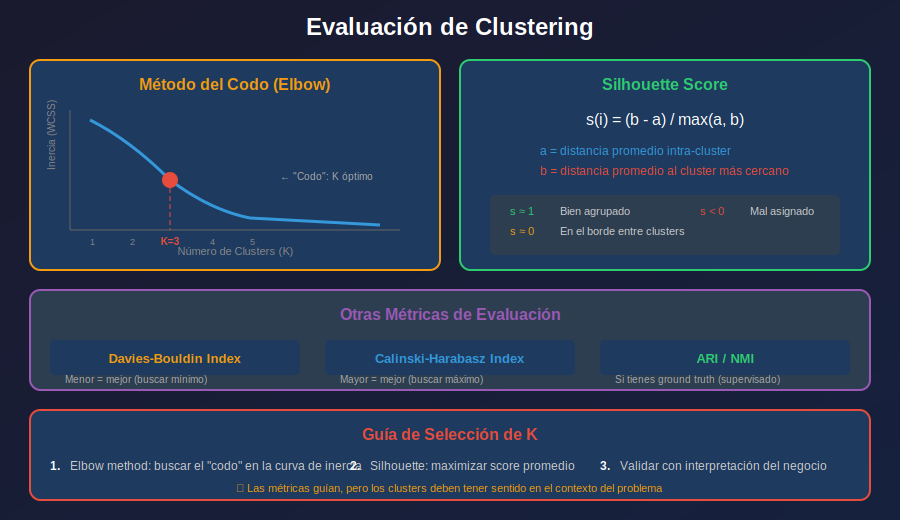

# 📚 Evaluación de Clustering

## 🎯 Objetivos

- Entender métricas internas y externas de clustering
- Aplicar el método del codo (Elbow)
- Calcular e interpretar Silhouette Score
- Conocer otras métricas de evaluación

---

## 1. El Desafío de Evaluar Clustering

A diferencia del aprendizaje supervisado, **no hay ground truth**.



### Tipos de Métricas

| Tipo         | Descripción                   | Ejemplos                            |
| ------------ | ----------------------------- | ----------------------------------- |
| **Internas** | Solo usan datos y clusters    | Silhouette, Inertia, Davies-Bouldin |
| **Externas** | Comparan con etiquetas reales | ARI, NMI, Purity                    |

---

## 2. Método del Codo (Elbow Method)

Busca el punto donde añadir más clusters no reduce significativamente la inercia.

### Implementación

```python
from sklearn.cluster import KMeans
import matplotlib.pyplot as plt

def elbow_method(X, max_k=10):
    """
    Aplica el método del codo para encontrar K óptimo.
    """
    inertias = []
    K_range = range(1, max_k + 1)

    for k in K_range:
        kmeans = KMeans(n_clusters=k, random_state=42, n_init=10)
        kmeans.fit(X)
        inertias.append(kmeans.inertia_)

    # Graficar
    plt.figure(figsize=(10, 5))
    plt.plot(K_range, inertias, 'bo-', linewidth=2, markersize=8)
    plt.xlabel('Número de Clusters (K)')
    plt.ylabel('Inercia (WCSS)')
    plt.title('Método del Codo')
    plt.grid(True, alpha=0.3)
    plt.show()

    return inertias

# Uso
from sklearn.datasets import make_blobs
from sklearn.preprocessing import StandardScaler

X, _ = make_blobs(n_samples=300, centers=4, cluster_std=1.0, random_state=42)
X_scaled = StandardScaler().fit_transform(X)

inertias = elbow_method(X_scaled, max_k=10)
```

### Encontrar el Codo Automáticamente

```python
from kneed import KneeLocator

def find_elbow(X, max_k=10):
    inertias = []
    K_range = range(1, max_k + 1)

    for k in K_range:
        kmeans = KMeans(n_clusters=k, random_state=42, n_init=10)
        kmeans.fit(X)
        inertias.append(kmeans.inertia_)

    # Encontrar codo automáticamente
    kl = KneeLocator(
        K_range, inertias,
        curve='convex', direction='decreasing'
    )

    print(f"K óptimo (Elbow): {kl.elbow}")
    return kl.elbow

# pip install kneed
# k_optimal = find_elbow(X_scaled)
```

---

## 3. Silhouette Score

Mide qué tan bien está asignado cada punto a su cluster.

### Fórmula

Para cada punto i:
$$s(i) = \frac{b(i) - a(i)}{\max(a(i), b(i))}$$

Donde:

- **a(i)**: Distancia promedio a puntos del mismo cluster (cohesión)
- **b(i)**: Distancia promedio al cluster más cercano (separación)

### Interpretación

| Valor     | Interpretación                         |
| --------- | -------------------------------------- |
| **s ≈ 1** | Bien asignado, lejos de otros clusters |
| **s ≈ 0** | En el borde entre clusters             |
| **s < 0** | Probablemente mal asignado             |

### Implementación

```python
from sklearn.metrics import silhouette_score, silhouette_samples
import matplotlib.pyplot as plt
import numpy as np

def silhouette_analysis(X, max_k=10):
    """
    Análisis de Silhouette para diferentes valores de K.
    """
    silhouette_scores = []
    K_range = range(2, max_k + 1)  # Silhouette requiere k >= 2

    for k in K_range:
        kmeans = KMeans(n_clusters=k, random_state=42, n_init=10)
        labels = kmeans.fit_predict(X)
        score = silhouette_score(X, labels)
        silhouette_scores.append(score)
        print(f"K={k}: Silhouette = {score:.4f}")

    # Graficar
    plt.figure(figsize=(10, 5))
    plt.plot(K_range, silhouette_scores, 'go-', linewidth=2, markersize=8)
    plt.xlabel('Número de Clusters (K)')
    plt.ylabel('Silhouette Score')
    plt.title('Silhouette Score por K')
    plt.grid(True, alpha=0.3)

    # Marcar máximo
    best_k = K_range[np.argmax(silhouette_scores)]
    plt.axvline(x=best_k, color='r', linestyle='--', label=f'Mejor K={best_k}')
    plt.legend()
    plt.show()

    return silhouette_scores

silhouette_analysis(X_scaled)
```

### Silhouette Plot Detallado

```python
from sklearn.metrics import silhouette_samples
import matplotlib.cm as cm

def silhouette_plot(X, n_clusters):
    """
    Visualización detallada de silhouette por cluster.
    """
    kmeans = KMeans(n_clusters=n_clusters, random_state=42, n_init=10)
    labels = kmeans.fit_predict(X)

    # Calcular silhouette para cada muestra
    sample_silhouette = silhouette_samples(X, labels)
    avg_silhouette = silhouette_score(X, labels)

    fig, (ax1, ax2) = plt.subplots(1, 2, figsize=(14, 5))

    # Plot 1: Silhouette por cluster
    y_lower = 10
    for i in range(n_clusters):
        cluster_silhouette = sample_silhouette[labels == i]
        cluster_silhouette.sort()

        cluster_size = cluster_silhouette.shape[0]
        y_upper = y_lower + cluster_size

        color = cm.viridis(float(i) / n_clusters)
        ax1.fill_betweenx(np.arange(y_lower, y_upper),
                          0, cluster_silhouette,
                          facecolor=color, edgecolor=color, alpha=0.7)
        ax1.text(-0.05, y_lower + 0.5 * cluster_size, str(i))
        y_lower = y_upper + 10

    ax1.axvline(x=avg_silhouette, color='red', linestyle='--',
                label=f'Promedio: {avg_silhouette:.3f}')
    ax1.set_xlabel('Silhouette Coefficient')
    ax1.set_ylabel('Cluster')
    ax1.set_title(f'Silhouette Plot (K={n_clusters})')
    ax1.legend()

    # Plot 2: Clusters
    colors = cm.viridis(labels.astype(float) / n_clusters)
    ax2.scatter(X[:, 0], X[:, 1], c=colors, s=50, alpha=0.6)
    ax2.scatter(kmeans.cluster_centers_[:, 0], kmeans.cluster_centers_[:, 1],
                marker='X', c='red', s=200, edgecolors='black')
    ax2.set_title('Clusters')

    plt.tight_layout()
    plt.show()

silhouette_plot(X_scaled, n_clusters=4)
```

---

## 4. Otras Métricas Internas

### Davies-Bouldin Index

Menor es mejor (buscar mínimo).

```python
from sklearn.metrics import davies_bouldin_score

def davies_bouldin_analysis(X, max_k=10):
    db_scores = []
    K_range = range(2, max_k + 1)

    for k in K_range:
        kmeans = KMeans(n_clusters=k, random_state=42, n_init=10)
        labels = kmeans.fit_predict(X)
        score = davies_bouldin_score(X, labels)
        db_scores.append(score)

    plt.figure(figsize=(10, 5))
    plt.plot(K_range, db_scores, 'ro-', linewidth=2, markersize=8)
    plt.xlabel('K')
    plt.ylabel('Davies-Bouldin Index')
    plt.title('Davies-Bouldin (menor es mejor)')
    plt.grid(True, alpha=0.3)
    plt.show()

    return db_scores

davies_bouldin_analysis(X_scaled)
```

### Calinski-Harabasz Index

Mayor es mejor (buscar máximo).

```python
from sklearn.metrics import calinski_harabasz_score

def calinski_harabasz_analysis(X, max_k=10):
    ch_scores = []
    K_range = range(2, max_k + 1)

    for k in K_range:
        kmeans = KMeans(n_clusters=k, random_state=42, n_init=10)
        labels = kmeans.fit_predict(X)
        score = calinski_harabasz_score(X, labels)
        ch_scores.append(score)

    plt.figure(figsize=(10, 5))
    plt.plot(K_range, ch_scores, 'bo-', linewidth=2, markersize=8)
    plt.xlabel('K')
    plt.ylabel('Calinski-Harabasz Index')
    plt.title('Calinski-Harabasz (mayor es mejor)')
    plt.grid(True, alpha=0.3)
    plt.show()

    return ch_scores

calinski_harabasz_analysis(X_scaled)
```

---

## 5. Métricas Externas (con Ground Truth)

Si tienes etiquetas reales para comparar:

```python
from sklearn.metrics import (
    adjusted_rand_score,
    normalized_mutual_info_score,
    homogeneity_score,
    completeness_score,
    v_measure_score
)

# Si tenemos y_true (etiquetas reales)
y_true = [0, 0, 1, 1, 2, 2, ...]
y_pred = kmeans.labels_

# ARI: -1 a 1 (1 = perfecto, 0 = aleatorio)
ari = adjusted_rand_score(y_true, y_pred)

# NMI: 0 a 1 (1 = perfecto)
nmi = normalized_mutual_info_score(y_true, y_pred)

# V-measure: media armónica de homogeneity y completeness
v = v_measure_score(y_true, y_pred)

print(f"ARI: {ari:.4f}")
print(f"NMI: {nmi:.4f}")
print(f"V-measure: {v:.4f}")
```

---

## 6. Función de Evaluación Completa

```python
def evaluate_clustering(X, labels, y_true=None):
    """
    Evaluación completa de clustering.
    """
    from sklearn.metrics import (
        silhouette_score, davies_bouldin_score, calinski_harabasz_score,
        adjusted_rand_score, normalized_mutual_info_score
    )

    results = {
        'n_clusters': len(np.unique(labels[labels >= 0])),
        'n_noise': (labels == -1).sum() if -1 in labels else 0
    }

    # Métricas internas (excluir noise si existe)
    mask = labels >= 0
    if mask.sum() > 0 and len(np.unique(labels[mask])) > 1:
        results['silhouette'] = silhouette_score(X[mask], labels[mask])
        results['davies_bouldin'] = davies_bouldin_score(X[mask], labels[mask])
        results['calinski_harabasz'] = calinski_harabasz_score(X[mask], labels[mask])

    # Métricas externas (si hay ground truth)
    if y_true is not None:
        results['ari'] = adjusted_rand_score(y_true, labels)
        results['nmi'] = normalized_mutual_info_score(y_true, labels)

    return results

# Uso
results = evaluate_clustering(X_scaled, labels, y_true)
for metric, value in results.items():
    print(f"{metric}: {value}")
```

---

## 7. Resumen de Métricas

| Métrica           | Rango  | Óptimo       | Usa Ground Truth |
| ----------------- | ------ | ------------ | ---------------- |
| Inertia           | 0 → ∞  | Menor (codo) | No               |
| Silhouette        | -1 → 1 | Mayor        | No               |
| Davies-Bouldin    | 0 → ∞  | Menor        | No               |
| Calinski-Harabasz | 0 → ∞  | Mayor        | No               |
| ARI               | -1 → 1 | Mayor (1)    | Sí               |
| NMI               | 0 → 1  | Mayor (1)    | Sí               |

---

## ✅ Checklist de Aprendizaje

- [ ] Entiendo la diferencia entre métricas internas y externas
- [ ] Puedo aplicar el método del codo
- [ ] Sé calcular e interpretar Silhouette Score
- [ ] Conozco Davies-Bouldin y Calinski-Harabasz
- [ ] Puedo evaluar clustering con y sin ground truth

---

## 🔗 Referencias

- [Clustering Metrics - sklearn](https://scikit-learn.org/stable/modules/clustering.html#clustering-evaluation)
- [Silhouette Analysis](https://scikit-learn.org/stable/auto_examples/cluster/plot_kmeans_silhouette_analysis.html)
