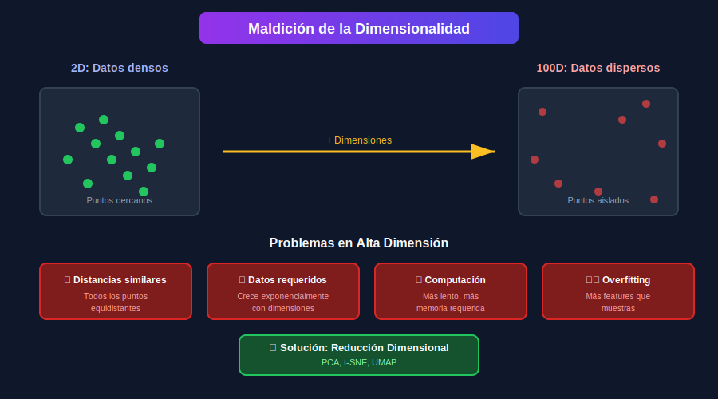

# 📉 Introducción a la Reducción de Dimensionalidad

## 🎯 Objetivos

- Comprender qué es la reducción de dimensionalidad
- Entender la maldición de la dimensionalidad
- Conocer los tipos de técnicas disponibles
- Saber cuándo aplicar reducción dimensional

---

## 📚 ¿Qué es la Reducción de Dimensionalidad?

La **reducción de dimensionalidad** es el proceso de transformar datos de un espacio de alta dimensión a uno de menor dimensión, preservando la información más relevante.

### Ejemplo Conceptual

```
Datos originales: 1000 features
         ↓
Reducción dimensional
         ↓
Datos reducidos: 50 features (manteniendo 95% de información)
```

---

## 🌪️ La Maldición de la Dimensionalidad



### ¿Qué es?

El término "curse of dimensionality" (Richard Bellman, 1961) describe los problemas que surgen cuando trabajamos con datos de alta dimensión.

### Problemas Principales

#### 1. Distancias se Vuelven Similares

```python
import numpy as np

def compare_distances(dims, n_points=100):
    """Demuestra cómo las distancias convergen en alta dimensión."""
    np.random.seed(42)

    for d in dims:
        X = np.random.randn(n_points, d)

        # Calcular todas las distancias
        distances = []
        for i in range(n_points):
            for j in range(i+1, n_points):
                dist = np.linalg.norm(X[i] - X[j])
                distances.append(dist)

        distances = np.array(distances)
        ratio = distances.max() / distances.min()

        print(f"D={d:4d}: max/min ratio = {ratio:.2f}")

# compare_distances([2, 10, 100, 1000])
# D=   2: max/min ratio = 15.23
# D=  10: max/min ratio = 3.41
# D= 100: max/min ratio = 1.68
# D=1000: max/min ratio = 1.21  ← ¡Casi iguales!
```

#### 2. Datos Requeridos Crecen Exponencialmente

Para mantener la misma densidad de datos:

| Dimensiones | Puntos necesarios |
| ----------- | ----------------- |
| 1D          | 10                |
| 2D          | 100               |
| 3D          | 1,000             |
| 10D         | 10,000,000,000    |

#### 3. Volumen se Concentra en Bordes

```python
import numpy as np

def volume_in_shell(d, shell_thickness=0.1):
    """Fracción del volumen en el 'shell' exterior de un hipercubo."""
    inner_ratio = (1 - shell_thickness) ** d
    return 1 - inner_ratio

# for d in [2, 10, 50, 100]:
#     print(f"D={d}: {volume_in_shell(d)*100:.1f}% del volumen está en el borde exterior")
# D=2: 19.0% del volumen está en el borde exterior
# D=10: 65.1% del volumen está en el borde exterior
# D=50: 99.5% del volumen está en el borde exterior
# D=100: 100.0% del volumen está en el borde exterior
```

---

## 🎯 Motivaciones para Reducir Dimensiones

### 1. Visualización

```python
# De 784 dimensiones (MNIST) a 2D para visualizar
from sklearn.manifold import TSNE

# X_2d = TSNE(n_components=2).fit_transform(X_mnist)
# plt.scatter(X_2d[:, 0], X_2d[:, 1], c=y_mnist)
```

### 2. Eliminar Ruido

Features irrelevantes añaden ruido que afecta el modelo.

### 3. Reducir Overfitting

Menos features = menos riesgo de memorizar datos de entrenamiento.

### 4. Mejorar Rendimiento

Menos dimensiones = entrenamiento más rápido.

### 5. Comprimir Datos

Almacenar y transmitir menos información.

---

## 🗂️ Tipos de Técnicas

### Técnicas Lineales

Asumen que los datos pueden proyectarse linealmente.

| Técnica             | Supervisada | Descripción                      |
| ------------------- | ----------- | -------------------------------- |
| **PCA**             | No          | Maximiza varianza                |
| **LDA**             | Sí          | Maximiza separabilidad de clases |
| **Factor Analysis** | No          | Modela factores latentes         |

### Técnicas No Lineales

Capturan relaciones complejas.

| Técnica          | Descripción                         |
| ---------------- | ----------------------------------- |
| **t-SNE**        | Preserva estructura local           |
| **UMAP**         | Preserva local y global, más rápido |
| **Isomap**       | Preserva distancias geodésicas      |
| **LLE**          | Locally Linear Embedding            |
| **Autoencoders** | Redes neuronales para reducción     |

---

## 📊 Selección de Features vs Extracción

### Selección de Features

Selecciona un subconjunto de las features originales.

```python
from sklearn.feature_selection import SelectKBest, f_classif

selector = SelectKBest(f_classif, k=10)
X_selected = selector.fit_transform(X, y)
# Mantiene 10 features originales
```

**Ventajas**: Interpretabilidad, features originales
**Desventajas**: Ignora combinaciones de features

### Extracción de Features (Reducción Dimensional)

Crea nuevas features como combinaciones de las originales.

```python
from sklearn.decomposition import PCA

pca = PCA(n_components=10)
X_extracted = pca.fit_transform(X)
# Crea 10 nuevas features (combinaciones)
```

**Ventajas**: Captura más información
**Desventajas**: Features no interpretables directamente

---

## 🔄 Flujo de Trabajo Típico

```
1. Datos originales (D dimensiones)
         ↓
2. Preprocesamiento (escalar)
         ↓
3. Reducción dimensional
         ↓
4. Datos reducidos (K dimensiones, K << D)
         ↓
5. Modelo de ML o visualización
```

### Ejemplo Completo

```python
from sklearn.preprocessing import StandardScaler
from sklearn.decomposition import PCA
from sklearn.pipeline import Pipeline
from sklearn.linear_model import LogisticRegression

# Pipeline completo
pipeline = Pipeline([
    ('scaler', StandardScaler()),
    ('pca', PCA(n_components=50)),
    ('classifier', LogisticRegression())
])

# pipeline.fit(X_train, y_train)
# pipeline.score(X_test, y_test)
```

---

## 📏 Métricas de Evaluación

### Para PCA

- **Varianza explicada**: % de información retenida
- **Scree plot**: Gráfico de varianza por componente

### Para t-SNE/UMAP

- **Trustworthiness**: ¿Vecinos cercanos en embedding eran cercanos originalmente?
- **Continuity**: ¿Vecinos originales siguen cercanos?
- **Visual inspection**: ¿Clusters claros?

---

## 🤔 ¿Cuándo Usar Cada Técnica?

| Situación                   | Técnica Recomendada |
| --------------------------- | ------------------- |
| Preprocesamiento para ML    | PCA                 |
| Visualización exploratoria  | t-SNE, UMAP         |
| Datos muy grandes           | PCA, UMAP           |
| Preservar estructura global | PCA, UMAP           |
| Revelar clusters            | t-SNE, UMAP         |
| Clasificación supervisada   | LDA                 |
| Compresión de datos         | PCA                 |

---

## ✅ Resumen

| Concepto                  | Descripción                            |
| ------------------------- | -------------------------------------- |
| Reducción dimensional     | Transformar a menor número de features |
| Maldición dimensionalidad | Problemas en alta dimensión            |
| Técnicas lineales         | PCA, LDA (proyecciones lineales)       |
| Técnicas no lineales      | t-SNE, UMAP (relaciones complejas)     |
| Selección vs Extracción   | Elegir vs crear features               |

---

## 🔗 Navegación

| ⬅️ Anterior                          | 🏠 Semana 17           | Siguiente ➡️     |
| ------------------------------------ | ---------------------- | ---------------- |
| [Semana 16](../../week-16/README.md) | [README](../README.md) | [PCA](02-pca.md) |
