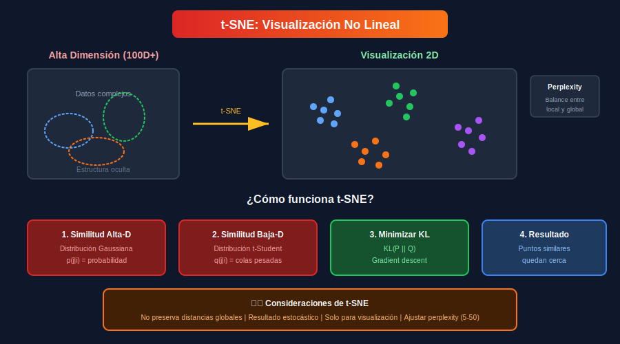

# 🌀 t-SNE: Visualización No Lineal

## 🎯 Objetivos

- Comprender cómo funciona t-SNE
- Aprender a ajustar el parámetro perplexity
- Crear visualizaciones efectivas
- Conocer las limitaciones de t-SNE

---

## 📚 ¿Qué es t-SNE?

**t-SNE** (t-distributed Stochastic Neighbor Embedding) es una técnica de reducción dimensional no lineal especialmente diseñada para **visualización** de datos de alta dimensión.



### Características Principales

- ✅ Excelente para revelar clusters
- ✅ Preserva estructura local
- ❌ No preserva distancias globales
- ❌ Solo para visualización (2D/3D)

---

## 🧮 ¿Cómo Funciona?

### Paso 1: Calcular Similitudes en Alta Dimensión

Para cada par de puntos $(x_i, x_j)$, calcula la probabilidad condicional:

$$p_{j|i} = \frac{\exp(-||x_i - x_j||^2 / 2\sigma_i^2)}{\sum_{k \neq i} \exp(-||x_i - x_k||^2 / 2\sigma_i^2)}$$

Donde $\sigma_i$ se ajusta según **perplexity**.

### Paso 2: Simetrizar

$$p_{ij} = \frac{p_{j|i} + p_{i|j}}{2n}$$

### Paso 3: Similitudes en Baja Dimensión

Usa distribución **t-Student** (colas más pesadas):

$$q_{ij} = \frac{(1 + ||y_i - y_j||^2)^{-1}}{\sum_{k \neq l}(1 + ||y_k - y_l||^2)^{-1}}$$

### Paso 4: Minimizar Divergencia KL

$$KL(P||Q) = \sum_{i \neq j} p_{ij} \log \frac{p_{ij}}{q_{ij}}$$

Mediante **gradient descent**.

---

## 💻 Implementación con Scikit-learn

### Uso Básico

```python
from sklearn.manifold import TSNE
from sklearn.preprocessing import StandardScaler
import numpy as np
import matplotlib.pyplot as plt

# Datos de ejemplo
np.random.seed(42)
n_samples = 300
X1 = np.random.randn(n_samples, 50) + np.array([0]*50)
X2 = np.random.randn(n_samples, 50) + np.array([5]*50)
X3 = np.random.randn(n_samples, 50) + np.array([10]*50)
X = np.vstack([X1, X2, X3])
y = np.array([0]*n_samples + [1]*n_samples + [2]*n_samples)

# Escalar
X_scaled = StandardScaler().fit_transform(X)

# t-SNE
tsne = TSNE(
    n_components=2,      # Dimensiones de salida (2 o 3)
    perplexity=30,       # Balance local/global (5-50)
    learning_rate=200,   # Tasa de aprendizaje
    n_iter=1000,         # Iteraciones
    random_state=42      # Reproducibilidad
)

X_tsne = tsne.fit_transform(X_scaled)

# Visualizar
plt.figure(figsize=(10, 7))
scatter = plt.scatter(X_tsne[:, 0], X_tsne[:, 1], c=y, cmap='viridis', alpha=0.6)
plt.colorbar(scatter, label='Clase')
plt.title('t-SNE Visualization')
plt.xlabel('t-SNE 1')
plt.ylabel('t-SNE 2')
plt.show()
```

---

## 🎛️ Parámetro: Perplexity

**Perplexity** controla cuántos vecinos considera cada punto.

### Interpretación

- **Perplexity baja (5-10)**: Enfoque muy local, clusters pequeños
- **Perplexity media (30)**: Balance típico, valor por defecto
- **Perplexity alta (50-100)**: Más estructura global

### Regla General

$$\text{perplexity} \approx \frac{n\_samples}{3} \text{ a } \frac{n\_samples}{50}$$

### Comparación Visual

```python
def compare_perplexity(X, y, perplexities=[5, 15, 30, 50]):
    """Compara diferentes valores de perplexity."""
    n = len(perplexities)
    fig, axes = plt.subplots(1, n, figsize=(5*n, 5))

    for ax, perp in zip(axes, perplexities):
        tsne = TSNE(n_components=2, perplexity=perp, random_state=42)
        X_tsne = tsne.fit_transform(X)

        ax.scatter(X_tsne[:, 0], X_tsne[:, 1], c=y, cmap='viridis', alpha=0.6, s=30)
        ax.set_title(f'Perplexity = {perp}')
        ax.set_xticks([])
        ax.set_yticks([])

    plt.tight_layout()
    plt.show()

# compare_perplexity(X_scaled, y)
```

---

## ⚙️ Otros Parámetros Importantes

### Learning Rate

```python
# Muy bajo: puntos comprimidos
# Muy alto: puntos dispersos caóticamente
# Recomendado: 10-1000, sklearn usa "auto" por defecto

tsne = TSNE(learning_rate='auto')  # Sklearn >= 1.1
```

### Iteraciones

```python
# Más iteraciones = mejor convergencia (pero más lento)
tsne = TSNE(n_iter=1000)  # Default
tsne = TSNE(n_iter=5000)  # Para datasets grandes
```

### Early Exaggeration

```python
# Amplifica clusters inicialmente
tsne = TSNE(early_exaggeration=12.0)  # Default
```

---

## 📊 Visualización 3D

```python
from mpl_toolkits.mplot3d import Axes3D

tsne_3d = TSNE(n_components=3, perplexity=30, random_state=42)
X_tsne_3d = tsne_3d.fit_transform(X_scaled)

fig = plt.figure(figsize=(10, 8))
ax = fig.add_subplot(111, projection='3d')
scatter = ax.scatter(X_tsne_3d[:, 0], X_tsne_3d[:, 1], X_tsne_3d[:, 2],
                     c=y, cmap='viridis', alpha=0.6)
ax.set_title('t-SNE 3D')
plt.colorbar(scatter)
plt.show()
```

---

## ⚠️ Limitaciones y Precauciones

### 1. No Preserva Distancias Globales

```python
# ❌ INCORRECTO: Interpretar distancias entre clusters
# "El cluster A está más lejos de B que de C"
# Esto NO es confiable en t-SNE

# ✅ CORRECTO: Solo interpretar agrupaciones
# "Estos puntos forman un cluster"
```

### 2. Resultado Estocástico

```python
# Cada ejecución da resultado diferente
tsne1 = TSNE(random_state=None)  # Diferente cada vez
X1 = tsne1.fit_transform(X)

tsne2 = TSNE(random_state=None)
X2 = tsne2.fit_transform(X)  # Diferente de X1!

# Siempre usar random_state para reproducibilidad
tsne = TSNE(random_state=42)
```

### 3. No Se Puede Usar para Nuevos Datos

```python
# ❌ t-SNE no tiene método transform()
# tsne.transform(X_new)  # Error!

# ✅ Para nuevos datos, usar UMAP o aproximaciones
```

### 4. Lento para Datos Grandes

```python
# t-SNE es O(n²) - cuadrático en número de muestras
# Para n > 10,000, considerar:
# 1. Usar una muestra
# 2. Reducir con PCA primero
# 3. Usar UMAP (más rápido)
```

---

## 🚀 Optimización para Datos Grandes

### PCA + t-SNE

```python
from sklearn.decomposition import PCA

# Reducir primero con PCA
pca = PCA(n_components=50)
X_pca = pca.fit_transform(X_scaled)

# Luego t-SNE sobre los componentes
tsne = TSNE(n_components=2, perplexity=30, random_state=42)
X_tsne = tsne.fit_transform(X_pca)

# Más rápido y a menudo igual de efectivo
```

### Usar Submuestra

```python
# Para datasets muy grandes
n_sample = min(10000, len(X))
idx = np.random.choice(len(X), n_sample, replace=False)
X_sample = X_scaled[idx]
y_sample = y[idx]

X_tsne = TSNE(random_state=42).fit_transform(X_sample)
```

---

## 📏 Evaluación de Calidad

### Divergencia KL (incorporada)

```python
tsne = TSNE(n_components=2, random_state=42)
X_tsne = tsne.fit_transform(X_scaled)

print(f"KL Divergence: {tsne.kl_divergence_:.4f}")
# Menor es mejor
```

### Trustworthiness

```python
from sklearn.manifold import trustworthiness

# Qué tan bien se preservan los vecinos
trust = trustworthiness(X_scaled, X_tsne, n_neighbors=15)
print(f"Trustworthiness: {trust:.4f}")
# 1.0 = perfecto, > 0.9 es bueno
```

---

## 🎨 Ejemplo Completo: MNIST

```python
from sklearn.datasets import load_digits

# Cargar datos (dígitos 8x8 = 64 dimensiones)
digits = load_digits()
X_digits = digits.data
y_digits = digits.target

# Escalar
X_digits_scaled = StandardScaler().fit_transform(X_digits)

# t-SNE
tsne = TSNE(n_components=2, perplexity=30, random_state=42, n_iter=1000)
X_digits_tsne = tsne.fit_transform(X_digits_scaled)

# Visualizar
plt.figure(figsize=(12, 10))
scatter = plt.scatter(X_digits_tsne[:, 0], X_digits_tsne[:, 1],
                      c=y_digits, cmap='tab10', alpha=0.7, s=30)
plt.colorbar(scatter, label='Dígito')
plt.title('t-SNE de Dígitos (64D → 2D)')
plt.xlabel('t-SNE 1')
plt.ylabel('t-SNE 2')

# Añadir anotaciones para algunos puntos
for digit in range(10):
    idx = np.where(y_digits == digit)[0][0]
    plt.annotate(str(digit), (X_digits_tsne[idx, 0], X_digits_tsne[idx, 1]),
                 fontsize=14, fontweight='bold')

plt.show()
```

---

## ✅ Resumen

| Aspecto              | Detalle                                  |
| -------------------- | ---------------------------------------- |
| **Propósito**        | Visualización de datos de alta dimensión |
| **Tipo**             | No lineal, basado en probabilidades      |
| **Parámetro clave**  | perplexity (5-50)                        |
| **Preserva**         | Estructura local (vecinos cercanos)      |
| **No preserva**      | Distancias globales                      |
| **Complejidad**      | O(n²) - lento para datos grandes         |
| **Reproducibilidad** | Requiere random_state                    |

---

## 🔗 Navegación

| ⬅️ Anterior      | 🏠 Semana 17           | Siguiente ➡️                                 |
| ---------------- | ---------------------- | -------------------------------------------- |
| [PCA](02-pca.md) | [README](../README.md) | [UMAP y Comparación](04-umap-comparacion.md) |
