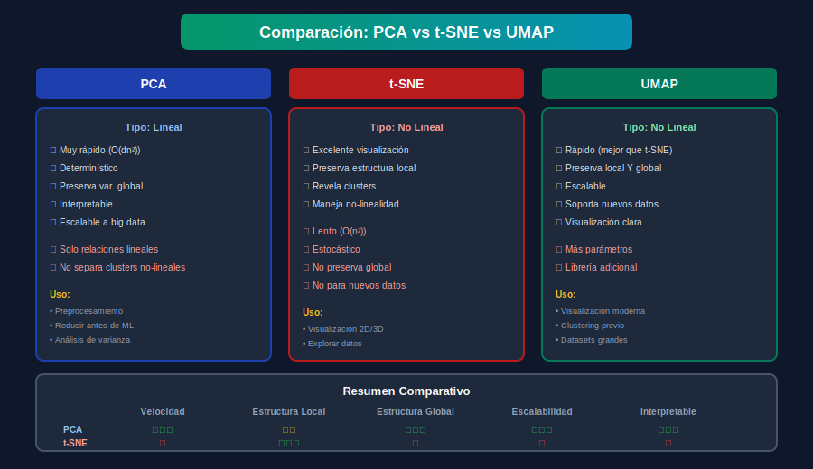

# 🚀 UMAP y Comparación de Técnicas

## 🎯 Objetivos

- Comprender cómo funciona UMAP
- Ajustar sus parámetros principales
- Comparar PCA, t-SNE y UMAP
- Elegir la técnica adecuada para cada caso

---

## 📚 ¿Qué es UMAP?

**UMAP** (Uniform Manifold Approximation and Projection) es una técnica moderna de reducción dimensional no lineal que:

- Es más rápida que t-SNE
- Preserva mejor la estructura global
- Permite transformar nuevos datos
- Escala mejor a datasets grandes



---

## 🧮 Fundamento Matemático

UMAP se basa en teoría de **topología algebraica** y **variedades de Riemann**:

1. **Construye un grafo** de vecinos en alta dimensión
2. **Optimiza** una representación en baja dimensión que preserve la topología
3. Usa **cross-entropy** fuzzy como función de pérdida

### Diferencias con t-SNE

| Aspecto | t-SNE | UMAP |
|---------|-------|------|
| Base teórica | Probabilidad | Topología |
| Preserva | Solo local | Local + global |
| Velocidad | Lenta O(n²) | Rápida O(n log n) |
| Transform | No | Sí |

---

## 💻 Instalación

```bash
pip install umap-learn
```

---

## 🔧 Uso Básico

```python
import umap
from sklearn.preprocessing import StandardScaler
import numpy as np
import matplotlib.pyplot as plt

# Datos de ejemplo
np.random.seed(42)
n_samples = 500
X1 = np.random.randn(n_samples, 50) + np.array([0]*50)
X2 = np.random.randn(n_samples, 50) + np.array([5]*50)
X3 = np.random.randn(n_samples, 50) + np.array([10]*50)
X = np.vstack([X1, X2, X3])
y = np.array([0]*n_samples + [1]*n_samples + [2]*n_samples)

# Escalar
X_scaled = StandardScaler().fit_transform(X)

# UMAP
reducer = umap.UMAP(
    n_components=2,      # Dimensiones de salida
    n_neighbors=15,      # Vecinos locales (estructura local)
    min_dist=0.1,        # Distancia mínima entre puntos
    metric='euclidean',  # Métrica de distancia
    random_state=42
)

X_umap = reducer.fit_transform(X_scaled)

# Visualizar
plt.figure(figsize=(10, 7))
scatter = plt.scatter(X_umap[:, 0], X_umap[:, 1], c=y, cmap='viridis', alpha=0.6)
plt.colorbar(scatter, label='Clase')
plt.title('UMAP Visualization')
plt.xlabel('UMAP 1')
plt.ylabel('UMAP 2')
plt.show()
```

---

## 🎛️ Parámetros Principales

### n_neighbors

Controla el balance entre estructura **local** y **global**.

```python
# Valores típicos: 5-50
# Bajo (5-15): Más estructura local, clusters más compactos
# Alto (30-100): Más estructura global, mejor preservación de distancias

def compare_neighbors(X, y, n_neighbors_list=[5, 15, 50, 100]):
    n = len(n_neighbors_list)
    fig, axes = plt.subplots(1, n, figsize=(5*n, 5))
    
    for ax, nn in zip(axes, n_neighbors_list):
        reducer = umap.UMAP(n_neighbors=nn, random_state=42)
        X_umap = reducer.fit_transform(X)
        
        ax.scatter(X_umap[:, 0], X_umap[:, 1], c=y, cmap='viridis', alpha=0.6, s=20)
        ax.set_title(f'n_neighbors = {nn}')
        ax.set_xticks([])
        ax.set_yticks([])
    
    plt.tight_layout()
    plt.show()

# compare_neighbors(X_scaled, y)
```

### min_dist

Controla qué tan **juntos** pueden estar los puntos.

```python
# Valores típicos: 0.0-1.0
# Bajo (0.0-0.1): Clusters más compactos, mejor para clustering
# Alto (0.5-1.0): Puntos más dispersos, mejor preservación global

def compare_min_dist(X, y, min_dist_list=[0.0, 0.1, 0.5, 1.0]):
    n = len(min_dist_list)
    fig, axes = plt.subplots(1, n, figsize=(5*n, 5))
    
    for ax, md in zip(axes, min_dist_list):
        reducer = umap.UMAP(min_dist=md, random_state=42)
        X_umap = reducer.fit_transform(X)
        
        ax.scatter(X_umap[:, 0], X_umap[:, 1], c=y, cmap='viridis', alpha=0.6, s=20)
        ax.set_title(f'min_dist = {md}')
        ax.set_xticks([])
        ax.set_yticks([])
    
    plt.tight_layout()
    plt.show()

# compare_min_dist(X_scaled, y)
```

### metric

Métrica de distancia a usar.

```python
# Métricas disponibles
reducer = umap.UMAP(metric='euclidean')    # Default
reducer = umap.UMAP(metric='manhattan')
reducer = umap.UMAP(metric='cosine')       # Para texto/embeddings
reducer = umap.UMAP(metric='correlation')
```

---

## 🔄 Transform para Nuevos Datos

A diferencia de t-SNE, UMAP puede transformar nuevos datos:

```python
# Entrenar
reducer = umap.UMAP(n_components=2, random_state=42)
reducer.fit(X_train)

# Transformar datos existentes
X_train_umap = reducer.transform(X_train)

# Transformar NUEVOS datos
X_test_umap = reducer.transform(X_test)
```

---

## 📊 Comparación: PCA vs t-SNE vs UMAP

### Código de Comparación

```python
from sklearn.decomposition import PCA
from sklearn.manifold import TSNE
import umap
import time

def compare_methods(X, y, title="Comparación"):
    """Compara PCA, t-SNE y UMAP."""
    methods = {
        'PCA': PCA(n_components=2),
        't-SNE': TSNE(n_components=2, random_state=42, perplexity=30),
        'UMAP': umap.UMAP(n_components=2, random_state=42)
    }
    
    fig, axes = plt.subplots(1, 3, figsize=(15, 5))
    
    for ax, (name, method) in zip(axes, methods.items()):
        start = time.time()
        X_reduced = method.fit_transform(X)
        elapsed = time.time() - start
        
        ax.scatter(X_reduced[:, 0], X_reduced[:, 1], c=y, cmap='viridis', alpha=0.6, s=20)
        ax.set_title(f'{name}\n({elapsed:.2f}s)')
        ax.set_xticks([])
        ax.set_yticks([])
    
    plt.suptitle(title)
    plt.tight_layout()
    plt.show()

# compare_methods(X_scaled, y)
```

### Benchmark de Tiempo

```python
def benchmark_methods(X):
    """Benchmark de tiempo para cada método."""
    results = {}
    
    # PCA
    start = time.time()
    PCA(n_components=2).fit_transform(X)
    results['PCA'] = time.time() - start
    
    # t-SNE
    start = time.time()
    TSNE(n_components=2, random_state=42).fit_transform(X)
    results['t-SNE'] = time.time() - start
    
    # UMAP
    start = time.time()
    umap.UMAP(n_components=2, random_state=42).fit_transform(X)
    results['UMAP'] = time.time() - start
    
    print("=== Benchmark de Tiempo ===")
    for name, elapsed in results.items():
        print(f"{name}: {elapsed:.2f}s")
    
    return results

# benchmark_methods(X_scaled)
```

---

## 🎯 Cuándo Usar Cada Técnica

### PCA

```python
# ✅ Usar cuando:
# - Preprocesamiento antes de ML
# - Necesitas interpretabilidad
# - Datos grandes
# - Quieres preservar varianza global
# - Necesitas transformar nuevos datos

# Ejemplo: Pipeline de clasificación
from sklearn.pipeline import Pipeline
from sklearn.svm import SVC

pipeline = Pipeline([
    ('pca', PCA(n_components=50)),
    ('svm', SVC())
])
```

### t-SNE

```python
# ✅ Usar cuando:
# - Solo visualización 2D/3D
# - Quieres revelar clusters ocultos
# - Dataset pequeño-mediano (< 10,000)
# - No necesitas transformar nuevos datos

# Ejemplo: Exploración de datos
tsne = TSNE(n_components=2, perplexity=30, random_state=42)
X_viz = tsne.fit_transform(X_scaled)
plt.scatter(X_viz[:, 0], X_viz[:, 1], c=y)
```

### UMAP

```python
# ✅ Usar cuando:
# - Visualización moderna
# - Dataset grande
# - Necesitas transformar nuevos datos
# - Quieres preservar estructura local Y global
# - Pre-clustering

# Ejemplo: Análisis exploratorio
reducer = umap.UMAP(n_neighbors=15, min_dist=0.1, random_state=42)
X_viz = reducer.fit_transform(X_scaled)
```

---

## 🔬 UMAP para Clustering

UMAP es excelente como paso previo a clustering:

```python
from sklearn.cluster import KMeans, HDBSCAN

# Reducir con UMAP
reducer = umap.UMAP(n_components=10, n_neighbors=30, min_dist=0.0, random_state=42)
X_umap = reducer.fit_transform(X_scaled)

# Clustering sobre embedding
kmeans = KMeans(n_clusters=3, random_state=42)
labels = kmeans.fit_predict(X_umap)

# O usar HDBSCAN (mejor con UMAP)
# hdbscan = HDBSCAN(min_cluster_size=15)
# labels = hdbscan.fit_predict(X_umap)
```

---

## 📊 UMAP Supervisado

UMAP puede usar etiquetas para mejorar la separación:

```python
# UMAP no supervisado
reducer_unsup = umap.UMAP(random_state=42)
X_unsup = reducer_unsup.fit_transform(X_scaled)

# UMAP supervisado
reducer_sup = umap.UMAP(random_state=42)
X_sup = reducer_sup.fit_transform(X_scaled, y=y)

# El supervisado separa mejor las clases
```

---

## 📏 Evaluación de Calidad

### Trustworthiness

```python
from sklearn.manifold import trustworthiness

# Evaluar preservación de vecinos
trust_pca = trustworthiness(X_scaled, X_pca, n_neighbors=15)
trust_tsne = trustworthiness(X_scaled, X_tsne, n_neighbors=15)
trust_umap = trustworthiness(X_scaled, X_umap, n_neighbors=15)

print(f"PCA:   {trust_pca:.4f}")
print(f"t-SNE: {trust_tsne:.4f}")
print(f"UMAP:  {trust_umap:.4f}")
```

### Silhouette en Embedding

```python
from sklearn.metrics import silhouette_score

# Si hay clusters naturales
sil_pca = silhouette_score(X_pca, y)
sil_tsne = silhouette_score(X_tsne, y)
sil_umap = silhouette_score(X_umap, y)

print(f"Silhouette PCA:   {sil_pca:.4f}")
print(f"Silhouette t-SNE: {sil_tsne:.4f}")
print(f"Silhouette UMAP:  {sil_umap:.4f}")
```

---

## 🎨 Ejemplo Completo: MNIST

```python
from sklearn.datasets import fetch_openml
from sklearn.preprocessing import StandardScaler

# Cargar MNIST (puede tardar)
# mnist = fetch_openml('mnist_784', version=1, as_frame=False)
# X_mnist = mnist.data[:10000]  # Submuestra
# y_mnist = mnist.target[:10000].astype(int)

# Para ejemplo más rápido, usar digits
from sklearn.datasets import load_digits
digits = load_digits()
X_mnist = digits.data
y_mnist = digits.target

X_scaled = StandardScaler().fit_transform(X_mnist)

# Comparar métodos
import time

methods = {
    'PCA': PCA(n_components=2),
    't-SNE (perp=30)': TSNE(n_components=2, perplexity=30, random_state=42),
    'UMAP (nn=15)': umap.UMAP(n_components=2, n_neighbors=15, random_state=42)
}

fig, axes = plt.subplots(1, 3, figsize=(16, 5))

for ax, (name, method) in zip(axes, methods.items()):
    start = time.time()
    X_reduced = method.fit_transform(X_scaled)
    elapsed = time.time() - start
    
    scatter = ax.scatter(X_reduced[:, 0], X_reduced[:, 1], 
                         c=y_mnist, cmap='tab10', alpha=0.5, s=10)
    ax.set_title(f'{name}\n({elapsed:.2f}s)')
    ax.set_xticks([])
    ax.set_yticks([])

plt.colorbar(scatter, ax=axes, label='Dígito', shrink=0.8)
plt.suptitle('Visualización de Dígitos: PCA vs t-SNE vs UMAP')
plt.tight_layout()
plt.show()
```

---

## ✅ Resumen Comparativo

| Característica | PCA | t-SNE | UMAP |
|----------------|-----|-------|------|
| **Tipo** | Lineal | No lineal | No lineal |
| **Velocidad** | ⭐⭐⭐ Rápido | ⭐ Lento | ⭐⭐⭐ Rápido |
| **Estructura local** | ⭐⭐ | ⭐⭐⭐ | ⭐⭐⭐ |
| **Estructura global** | ⭐⭐⭐ | ⭐ | ⭐⭐⭐ |
| **Transform nuevos** | ✅ | ❌ | ✅ |
| **Escalabilidad** | ⭐⭐⭐ | ⭐ | ⭐⭐⭐ |
| **Interpretable** | ⭐⭐⭐ | ⭐ | ⭐ |
| **Uso principal** | Preproceso ML | Visualización | Visualización + ML |

---

## 🔗 Navegación

| ⬅️ Anterior | 🏠 Semana 17 | Siguiente ➡️ |
|-------------|--------------|--------------|
| [t-SNE](03-tsne.md) | [README](../README.md) | [Ejercicio 01](../2-practicas/ejercicio-01-pca/README.md) |
