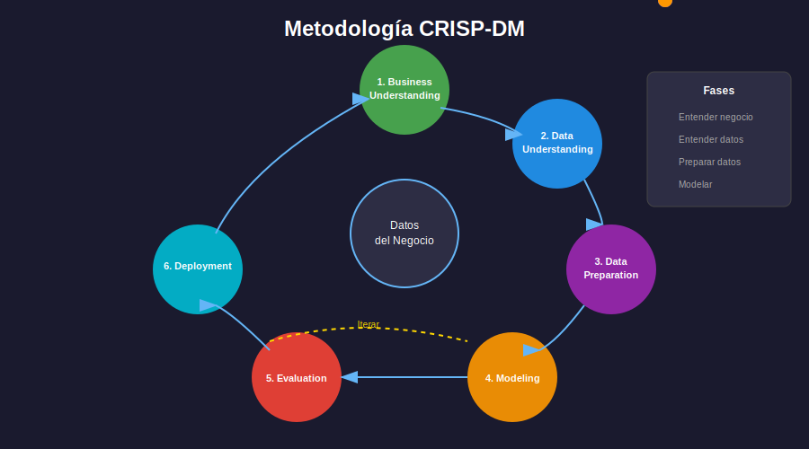

# 📊 Metodología CRISP-DM para Proyectos ML

## 🎯 Objetivo

Comprender y aplicar la metodología estándar de la industria para proyectos de Machine Learning.

---

## 📚 Contenido

### 1. ¿Qué es CRISP-DM?

**Cross-Industry Standard Process for Data Mining** es la metodología más utilizada en proyectos de ciencia de datos y machine learning.



### 2. Las 6 Fases

#### Fase 1: Business Understanding (Entender el Negocio)

**Objetivo**: Definir claramente el problema y los objetivos del proyecto.

```python
# Ejemplo: Proyecto Titanic
"""
DEFINICIÓN DEL PROBLEMA
=======================
Objetivo: Predecir la supervivencia de pasajeros del Titanic
Métrica de éxito: Accuracy > 0.80
Stakeholders: Competencia Kaggle
Restricciones: Solo datos disponibles en train.csv
"""
```

**Preguntas clave**:
- ¿Cuál es el problema de negocio?
- ¿Cómo se medirá el éxito?
- ¿Qué datos están disponibles?
- ¿Cuáles son las restricciones?

#### Fase 2: Data Understanding (Entender los Datos)

**Objetivo**: Explorar y comprender los datos disponibles.

```python
import pandas as pd
import matplotlib.pyplot as plt
import seaborn as sns

# Cargar datos
train = pd.read_csv('train.csv')

# Información básica
print(f"Shape: {train.shape}")
print(f"\nTipos de datos:\n{train.dtypes}")
print(f"\nEstadísticas:\n{train.describe()}")

# Missing values
print(f"\nValores faltantes:\n{train.isnull().sum()}")

# Distribución del target
print(f"\nDistribución target:\n{train['Survived'].value_counts(normalize=True)}")
```

**Análisis requerido**:
- Dimensiones del dataset
- Tipos de variables
- Valores faltantes
- Distribuciones
- Correlaciones
- Outliers

#### Fase 3: Data Preparation (Preparar los Datos)

**Objetivo**: Transformar los datos para el modelado.

```python
from sklearn.preprocessing import StandardScaler, LabelEncoder
from sklearn.impute import SimpleImputer

# Imputar missing values
imputer = SimpleImputer(strategy='median')
train['Age'] = imputer.fit_transform(train[['Age']])

# Encoding categóricas
le = LabelEncoder()
train['Sex_encoded'] = le.fit_transform(train['Sex'])

# Crear nuevas features
train['FamilySize'] = train['SibSp'] + train['Parch'] + 1
train['IsAlone'] = (train['FamilySize'] == 1).astype(int)

# Escalar numéricas
scaler = StandardScaler()
train[['Age_scaled', 'Fare_scaled']] = scaler.fit_transform(train[['Age', 'Fare']])
```

**Tareas comunes**:
- Limpieza de datos
- Tratamiento de missing values
- Encoding de categóricas
- Feature engineering
- Normalización/Escalado
- Selección de features

#### Fase 4: Modeling (Modelado)

**Objetivo**: Construir y entrenar modelos predictivos.

```python
from sklearn.model_selection import train_test_split, cross_val_score
from sklearn.linear_model import LogisticRegression
from sklearn.ensemble import RandomForestClassifier
from sklearn.svm import SVC

# Preparar datos
X = train[features]
y = train['Survived']
X_train, X_val, y_train, y_val = train_test_split(X, y, test_size=0.2, random_state=42)

# Probar múltiples modelos
models = {
    'Logistic Regression': LogisticRegression(),
    'Random Forest': RandomForestClassifier(),
    'SVM': SVC()
}

for name, model in models.items():
    scores = cross_val_score(model, X_train, y_train, cv=5)
    print(f"{name}: {scores.mean():.4f} ± {scores.std():.4f}")
```

**Estrategia de modelado**:
1. Baseline simple
2. Múltiples algoritmos
3. Cross-validation
4. Optimización de hiperparámetros

#### Fase 5: Evaluation (Evaluación)

**Objetivo**: Evaluar el rendimiento del modelo.

```python
from sklearn.metrics import accuracy_score, classification_report, confusion_matrix

# Entrenar mejor modelo
best_model = RandomForestClassifier(n_estimators=100)
best_model.fit(X_train, y_train)

# Evaluar
y_pred = best_model.predict(X_val)
print(f"Accuracy: {accuracy_score(y_val, y_pred):.4f}")
print(f"\nClassification Report:\n{classification_report(y_val, y_pred)}")
print(f"\nConfusion Matrix:\n{confusion_matrix(y_val, y_pred)}")
```

**Preguntas de evaluación**:
- ¿Cumple con los objetivos de negocio?
- ¿Es el modelo robusto (CV)?
- ¿Hay overfitting?
- ¿Qué errores comete el modelo?

#### Fase 6: Deployment (Despliegue)

**Objetivo**: Poner el modelo en producción o generar entregables.

```python
import joblib

# Guardar modelo
joblib.dump(best_model, 'model.pkl')

# Generar predicciones para submission
test = pd.read_csv('test.csv')
# ... aplicar mismo preprocesamiento ...
predictions = best_model.predict(test_processed)

# Crear submission
submission = pd.DataFrame({
    'PassengerId': test['PassengerId'],
    'Survived': predictions
})
submission.to_csv('submission.csv', index=False)
```

---

## 🔄 Naturaleza Iterativa

CRISP-DM es **iterativo**, no lineal:

- Después de modelar, puedes volver a preparar datos
- Los resultados de evaluación guían nuevas iteraciones
- El entendimiento del negocio se refina continuamente

```
Business → Data → Preparation → Modeling → Evaluation
    ↑                                          |
    └──────────────────────────────────────────┘
                    Iterar
```

---

## ✅ Checklist por Fase

### Business Understanding
- [ ] Problema definido claramente
- [ ] Métrica de éxito establecida
- [ ] Restricciones identificadas

### Data Understanding
- [ ] EDA completo realizado
- [ ] Missing values identificados
- [ ] Distribuciones analizadas

### Data Preparation
- [ ] Missing values tratados
- [ ] Features engineeradas
- [ ] Datos transformados correctamente

### Modeling
- [ ] Baseline establecido
- [ ] Múltiples modelos probados
- [ ] Cross-validation aplicado

### Evaluation
- [ ] Métricas calculadas
- [ ] Modelo validado
- [ ] Errores analizados

### Deployment
- [ ] Modelo guardado
- [ ] Predicciones generadas
- [ ] Documentación completa

---

## 📚 Recursos Adicionales

- [CRISP-DM Wikipedia](https://en.wikipedia.org/wiki/Cross-industry_standard_process_for_data_mining)
- [IBM CRISP-DM Guide](https://www.ibm.com/docs/en/spss-modeler/saas?topic=dm-crisp-help-overview)

---

## 🔗 Navegación

| ⬅️ Anterior | 🏠 Semana | Siguiente ➡️ |
|-------------|----------|--------------|
| [README](../README.md) | [Semana 18](../README.md) | [Pipelines Producción](02-pipelines-produccion.md) |
