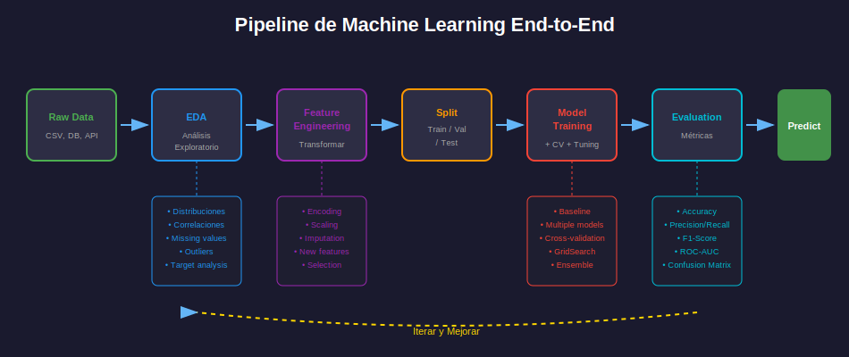

# 🔧 Pipelines de Producción con Scikit-learn

## 🎯 Objetivo

Construir pipelines reproducibles y robustos para proyectos ML end-to-end.

---

## 📚 Contenido

### 1. ¿Por Qué Usar Pipelines?



**Problemas sin pipelines**:
- Código difícil de mantener
- Riesgo de data leakage
- Preprocesamiento inconsistente train/test
- Difícil de reproducir

**Beneficios de pipelines**:
- Código limpio y modular
- Prevención de data leakage
- Fácil de reproducir
- Integración con GridSearchCV

---

### 2. Pipeline Básico

```python
from sklearn.pipeline import Pipeline
from sklearn.preprocessing import StandardScaler
from sklearn.linear_model import LogisticRegression

# Pipeline simple
pipe = Pipeline([
    ('scaler', StandardScaler()),
    ('classifier', LogisticRegression())
])

# Uso
pipe.fit(X_train, y_train)
predictions = pipe.predict(X_test)
score = pipe.score(X_test, y_test)
```

---

### 3. ColumnTransformer para Diferentes Tipos

```python
from sklearn.compose import ColumnTransformer
from sklearn.preprocessing import StandardScaler, OneHotEncoder
from sklearn.impute import SimpleImputer
from sklearn.pipeline import Pipeline

# Definir columnas
numeric_features = ['Age', 'Fare', 'SibSp', 'Parch']
categorical_features = ['Sex', 'Embarked', 'Pclass']

# Transformadores por tipo
numeric_transformer = Pipeline([
    ('imputer', SimpleImputer(strategy='median')),
    ('scaler', StandardScaler())
])

categorical_transformer = Pipeline([
    ('imputer', SimpleImputer(strategy='most_frequent')),
    ('encoder', OneHotEncoder(handle_unknown='ignore'))
])

# Combinar con ColumnTransformer
preprocessor = ColumnTransformer([
    ('num', numeric_transformer, numeric_features),
    ('cat', categorical_transformer, categorical_features)
])

# Pipeline completo
full_pipeline = Pipeline([
    ('preprocessor', preprocessor),
    ('classifier', LogisticRegression())
])
```

---

### 4. Pipeline para Titanic Completo

```python
import pandas as pd
import numpy as np
from sklearn.pipeline import Pipeline
from sklearn.compose import ColumnTransformer
from sklearn.preprocessing import StandardScaler, OneHotEncoder
from sklearn.impute import SimpleImputer
from sklearn.ensemble import RandomForestClassifier
from sklearn.model_selection import cross_val_score

# Cargar datos
train = pd.read_csv('train.csv')
test = pd.read_csv('test.csv')

# Features
numeric_features = ['Age', 'Fare', 'SibSp', 'Parch']
categorical_features = ['Sex', 'Embarked', 'Pclass']

# Transformadores
numeric_transformer = Pipeline([
    ('imputer', SimpleImputer(strategy='median')),
    ('scaler', StandardScaler())
])

categorical_transformer = Pipeline([
    ('imputer', SimpleImputer(strategy='constant', fill_value='missing')),
    ('encoder', OneHotEncoder(handle_unknown='ignore', sparse_output=False))
])

# Preprocessor
preprocessor = ColumnTransformer([
    ('num', numeric_transformer, numeric_features),
    ('cat', categorical_transformer, categorical_features)
], remainder='drop')

# Pipeline final
pipeline = Pipeline([
    ('preprocessor', preprocessor),
    ('classifier', RandomForestClassifier(n_estimators=100, random_state=42))
])

# Preparar datos
X = train[numeric_features + categorical_features]
y = train['Survived']

# Cross-validation
scores = cross_val_score(pipeline, X, y, cv=5, scoring='accuracy')
print(f"CV Score: {scores.mean():.4f} ± {scores.std():.4f}")

# Entrenar en todo train
pipeline.fit(X, y)

# Predecir en test
X_test = test[numeric_features + categorical_features]
predictions = pipeline.predict(X_test)
```

---

### 5. GridSearchCV con Pipelines

```python
from sklearn.model_selection import GridSearchCV

# Pipeline
pipeline = Pipeline([
    ('preprocessor', preprocessor),
    ('classifier', RandomForestClassifier(random_state=42))
])

# Parámetros (usar __ para acceder a componentes)
param_grid = {
    'preprocessor__num__imputer__strategy': ['mean', 'median'],
    'classifier__n_estimators': [50, 100, 200],
    'classifier__max_depth': [5, 10, None],
    'classifier__min_samples_split': [2, 5, 10]
}

# GridSearch
grid_search = GridSearchCV(
    pipeline,
    param_grid,
    cv=5,
    scoring='accuracy',
    n_jobs=-1,
    verbose=1
)

grid_search.fit(X, y)

print(f"Best Score: {grid_search.best_score_:.4f}")
print(f"Best Params: {grid_search.best_params_}")
```

---

### 6. Custom Transformers

```python
from sklearn.base import BaseEstimator, TransformerMixin

class FamilySizeTransformer(BaseEstimator, TransformerMixin):
    """Crea feature de tamaño familiar."""
    
    def fit(self, X, y=None):
        return self
    
    def transform(self, X):
        X = X.copy()
        X['FamilySize'] = X['SibSp'] + X['Parch'] + 1
        X['IsAlone'] = (X['FamilySize'] == 1).astype(int)
        return X

class TitleExtractor(BaseEstimator, TransformerMixin):
    """Extrae título del nombre."""
    
    def fit(self, X, y=None):
        return self
    
    def transform(self, X):
        X = X.copy()
        X['Title'] = X['Name'].str.extract(r' ([A-Za-z]+)\.', expand=False)
        # Agrupar títulos raros
        X['Title'] = X['Title'].replace(['Lady', 'Countess', 'Capt', 'Col',
                                         'Don', 'Dr', 'Major', 'Rev', 'Sir', 
                                         'Jonkheer', 'Dona'], 'Rare')
        X['Title'] = X['Title'].replace(['Mlle', 'Ms'], 'Miss')
        X['Title'] = X['Title'].replace('Mme', 'Mrs')
        return X

# Usar en pipeline
feature_engineering = Pipeline([
    ('family', FamilySizeTransformer()),
    ('title', TitleExtractor())
])
```

---

### 7. Pipeline Completo Avanzado

```python
from sklearn.pipeline import Pipeline, FeatureUnion
from sklearn.compose import ColumnTransformer
from sklearn.preprocessing import StandardScaler, OneHotEncoder
from sklearn.impute import SimpleImputer
from sklearn.feature_selection import SelectKBest, f_classif
from sklearn.ensemble import GradientBoostingClassifier

# Custom transformers
class FeatureEngineer(BaseEstimator, TransformerMixin):
    def fit(self, X, y=None):
        return self
    
    def transform(self, X):
        X = X.copy()
        # Family size
        X['FamilySize'] = X['SibSp'] + X['Parch'] + 1
        X['IsAlone'] = (X['FamilySize'] == 1).astype(int)
        # Age groups
        X['AgeGroup'] = pd.cut(X['Age'], bins=[0, 12, 18, 35, 60, 100], 
                               labels=['Child', 'Teen', 'Adult', 'Middle', 'Senior'])
        # Fare per person
        X['FarePerPerson'] = X['Fare'] / X['FamilySize']
        return X

# Columnas después de feature engineering
numeric_features = ['Age', 'Fare', 'SibSp', 'Parch', 'FamilySize', 'FarePerPerson']
categorical_features = ['Sex', 'Embarked', 'Pclass', 'IsAlone', 'AgeGroup']

# Preprocessor
numeric_transformer = Pipeline([
    ('imputer', SimpleImputer(strategy='median')),
    ('scaler', StandardScaler())
])

categorical_transformer = Pipeline([
    ('imputer', SimpleImputer(strategy='most_frequent')),
    ('encoder', OneHotEncoder(handle_unknown='ignore', sparse_output=False))
])

preprocessor = ColumnTransformer([
    ('num', numeric_transformer, numeric_features),
    ('cat', categorical_transformer, categorical_features)
])

# Pipeline completo
full_pipeline = Pipeline([
    ('feature_engineering', FeatureEngineer()),
    ('preprocessor', preprocessor),
    ('feature_selection', SelectKBest(f_classif, k=15)),
    ('classifier', GradientBoostingClassifier(random_state=42))
])
```

---

### 8. Guardar y Cargar Pipeline

```python
import joblib

# Guardar
joblib.dump(full_pipeline, 'titanic_pipeline.pkl')

# Cargar
loaded_pipeline = joblib.load('titanic_pipeline.pkl')

# Usar
predictions = loaded_pipeline.predict(new_data)
```

---

## ⚠️ Errores Comunes

### Data Leakage

```python
# ❌ MAL: Fit en todo el dataset antes de split
scaler.fit(X)  # Usa información de test!
X_scaled = scaler.transform(X)
X_train, X_test = train_test_split(X_scaled, ...)

# ✅ BIEN: Fit solo en train
X_train, X_test = train_test_split(X, ...)
scaler.fit(X_train)
X_train_scaled = scaler.transform(X_train)
X_test_scaled = scaler.transform(X_test)

# ✅ MEJOR: Usar Pipeline (automáticamente correcto)
pipeline.fit(X_train, y_train)
pipeline.predict(X_test)
```

### Preprocesamiento Inconsistente

```python
# ❌ MAL: Diferentes transformaciones
train['Age'].fillna(train['Age'].mean(), inplace=True)  # Media de train
test['Age'].fillna(test['Age'].mean(), inplace=True)    # Media de test (diferente!)

# ✅ BIEN: Usar Pipeline (guarda parámetros del fit)
pipeline.fit(X_train, y_train)  # Aprende media de train
pipeline.predict(X_test)         # Usa media de train en test
```

---

## ✅ Checklist de Pipeline

- [ ] Todas las transformaciones en el pipeline
- [ ] ColumnTransformer para diferentes tipos de datos
- [ ] Custom transformers para feature engineering
- [ ] Pipeline probado con cross-validation
- [ ] Sin data leakage (fit solo en train)
- [ ] Pipeline guardado para reproducibilidad

---

## 🔗 Navegación

| ⬅️ Anterior | 🏠 Semana | Siguiente ➡️ |
|-------------|----------|--------------|
| [Metodología](01-metodologia-ml.md) | [Semana 18](../README.md) | [Presentación](03-presentacion-resultados.md) |
