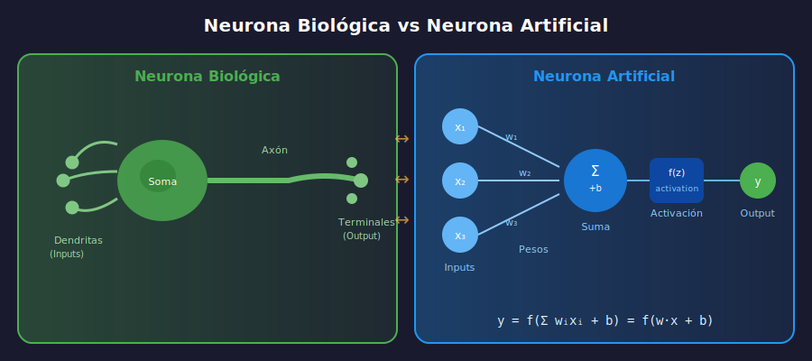

# 🧠 Introducción a las Redes Neuronales

## 🎯 Objetivos

- Comprender la inspiración biológica de las redes neuronales
- Entender los componentes básicos de una neurona artificial
- Conocer la historia y evolución del deep learning

---

## 📚 Contenido

### 1. De las Neuronas Biológicas a las Artificiales

El cerebro humano contiene aproximadamente **86 mil millones de neuronas**, cada una conectada a miles de otras. Las redes neuronales artificiales se inspiran en esta arquitectura.



#### Neurona Biológica

```
Dendritas → Soma → Axón → Terminales sinápticas
 (inputs)   (proceso)  (output)    (conexiones)
```

- **Dendritas**: Reciben señales de otras neuronas
- **Soma**: Cuerpo celular que procesa las señales
- **Axón**: Transmite la señal de salida
- **Sinapsis**: Conexiones con otras neuronas

#### Neurona Artificial

```python
# Analogía en código
def artificial_neuron(inputs, weights, bias, activation_fn):
    """
    inputs: señales de entrada (como dendritas)
    weights: importancia de cada input (como sinapsis)
    bias: umbral de activación
    activation_fn: decisión de activarse o no (como soma)
    """
    weighted_sum = sum(x * w for x, w in zip(inputs, weights)) + bias
    output = activation_fn(weighted_sum)
    return output
```

---

### 2. Componentes de una Neurona Artificial

#### 2.1 Inputs (x)

Los datos de entrada que la neurona recibe:

```python
import numpy as np

# Ejemplo: características de una imagen de 3 píxeles
inputs = np.array([0.5, 0.3, 0.8])  # x₁, x₂, x₃
```

#### 2.2 Pesos (w)

Determinan la importancia de cada input:

```python
# Cada input tiene un peso asociado
weights = np.array([0.4, -0.2, 0.6])  # w₁, w₂, w₃

# Pesos grandes = input importante
# Pesos negativos = input inhibe la salida
```

#### 2.3 Bias (b)

Permite ajustar el umbral de activación:

```python
bias = 0.1  # Desplaza la función de activación
```

#### 2.4 Suma Ponderada (z)

Combinación lineal de inputs y pesos:

```python
# z = w₁x₁ + w₂x₂ + w₃x₃ + b
z = np.dot(inputs, weights) + bias
print(f"Suma ponderada: {z}")  # z = 0.5*0.4 + 0.3*(-0.2) + 0.8*0.6 + 0.1 = 0.72
```

#### 2.5 Función de Activación (f)

Introduce no-linealidad:

```python
def sigmoid(z):
    """Función de activación sigmoid"""
    return 1 / (1 + np.exp(-z))

# Aplicar activación
output = sigmoid(z)
print(f"Output: {output}")  # ≈ 0.67
```

---

### 3. ¿Por Qué Necesitamos No-Linealidad?

Sin funciones de activación no-lineales, una red multicapa sería equivalente a una sola capa:

```python
# Sin activación (solo lineal)
# Capa 1: h = W₁x + b₁
# Capa 2: y = W₂h + b₂ = W₂(W₁x + b₁) + b₂ = (W₂W₁)x + (W₂b₁ + b₂)
#                      = W'x + b' ← ¡Equivalente a una sola capa!

# Con activación no-lineal
# h = f(W₁x + b₁)
# y = f(W₂h + b₂) ← ¡No se puede simplificar!
```

Las funciones de activación permiten a las redes aprender **patrones complejos y no-lineales**.

---

### 4. Historia del Deep Learning

| Año  | Hito                                    | Investigadores     |
| ---- | --------------------------------------- | ------------------ |
| 1943 | Modelo de neurona McCulloch-Pitts       | McCulloch, Pitts   |
| 1958 | Perceptrón                              | Frank Rosenblatt   |
| 1969 | Limitaciones del Perceptrón (XOR)       | Minsky, Papert     |
| 1986 | Backpropagation popularizado            | Rumelhart, Hinton  |
| 2006 | Deep Belief Networks                    | Hinton             |
| 2012 | AlexNet gana ImageNet                   | Krizhevsky, Hinton |
| 2017 | Transformer "Attention is All You Need" | Vaswani et al.     |
| 2022 | ChatGPT / GPT-4                         | OpenAI             |

---

### 5. Tipos de Arquitecturas

```
┌─────────────────────────────────────────────────────────────┐
│                    REDES NEURONALES                          │
├─────────────────┬─────────────────┬─────────────────────────┤
│   Feedforward   │   Recurrentes   │    Convolucionales      │
│      (MLP)      │   (RNN/LSTM)    │        (CNN)            │
├─────────────────┼─────────────────┼─────────────────────────┤
│ • Datos tabular │ • Secuencias    │ • Imágenes              │
│ • Clasificación │ • Texto/NLP     │ • Video                 │
│ • Regresión     │ • Series temp.  │ • Audio (espectro)      │
└─────────────────┴─────────────────┴─────────────────────────┘
```

---

### 6. Neurona Completa en Código

```python
import numpy as np

class Neuron:
    """Implementación de una neurona artificial."""

    def __init__(self, n_inputs: int, activation: str = 'sigmoid'):
        # Inicialización aleatoria de pesos
        self.weights = np.random.randn(n_inputs) * 0.01
        self.bias = 0.0
        self.activation = activation

    def _activate(self, z: float) -> float:
        """Aplica la función de activación."""
        if self.activation == 'sigmoid':
            return 1 / (1 + np.exp(-z))
        elif self.activation == 'relu':
            return max(0, z)
        elif self.activation == 'tanh':
            return np.tanh(z)
        else:
            return z  # Lineal

    def forward(self, inputs: np.ndarray) -> float:
        """Forward pass: calcula la salida de la neurona."""
        z = np.dot(inputs, self.weights) + self.bias
        return self._activate(z)


# Uso
neuron = Neuron(n_inputs=3, activation='sigmoid')
inputs = np.array([0.5, 0.3, 0.8])
output = neuron.forward(inputs)
print(f"Output: {output:.4f}")
```

---

## ✅ Checklist de Verificación

- [ ] Entiendo la analogía entre neuronas biológicas y artificiales
- [ ] Puedo explicar el papel de pesos, bias y activación
- [ ] Comprendo por qué la no-linealidad es esencial
- [ ] Conozco los hitos principales de la historia del DL

---

## 🔗 Referencias

- [Neural Networks and Deep Learning - Ch. 1](http://neuralnetworksanddeeplearning.com/chap1.html)
- [3Blue1Brown - But what is a neural network?](https://www.youtube.com/watch?v=aircAruvnKk)
