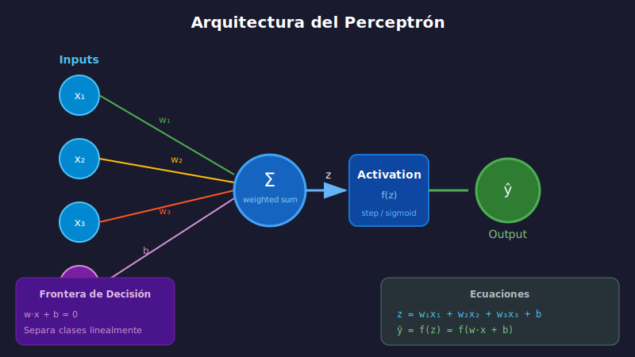

# 🔵 El Perceptrón

## 🎯 Objetivos

- Implementar un perceptrón desde cero
- Entender el algoritmo de aprendizaje del perceptrón
- Conocer sus limitaciones (problemas no linealmente separables)

---

## 📚 Contenido

### 1. ¿Qué es el Perceptrón?

El perceptrón es la red neuronal más simple: **una sola neurona** que clasifica datos en dos categorías.



#### Formulación Matemática

$$\hat{y} = f(z) = f(\sum_{i=1}^{n} w_i x_i + b) = f(\mathbf{w} \cdot \mathbf{x} + b)$$

Donde:

- $\mathbf{x}$: vector de inputs
- $\mathbf{w}$: vector de pesos
- $b$: bias
- $f$: función de activación (step function)

---

### 2. Función de Activación Step

El perceptrón clásico usa una función escalón:

```python
import numpy as np

def step_function(z):
    """
    Función escalón (Heaviside)
    Retorna 1 si z >= 0, 0 en caso contrario
    """
    return np.where(z >= 0, 1, 0)


# Ejemplos
print(step_function(0.5))   # 1
print(step_function(-0.3))  # 0
print(step_function(0.0))   # 1
```

---

### 3. Algoritmo de Aprendizaje

El perceptrón aprende ajustando sus pesos cuando comete errores:

```
Para cada ejemplo (x, y):
    1. Calcular predicción: ŷ = step(w·x + b)
    2. Calcular error: e = y - ŷ
    3. Si hay error (e ≠ 0):
       - Actualizar pesos: w = w + η·e·x
       - Actualizar bias:  b = b + η·e
```

Donde $\eta$ es el **learning rate** (tasa de aprendizaje).

---

### 4. Implementación Completa

```python
import numpy as np
import matplotlib.pyplot as plt

class Perceptron:
    """
    Implementación del Perceptrón de Rosenblatt.

    Attributes:
        weights: pesos de la neurona
        bias: término de sesgo
        learning_rate: tasa de aprendizaje
        errors_: errores por época (para tracking)
    """

    def __init__(self, n_features: int, learning_rate: float = 0.1):
        self.weights = np.zeros(n_features)
        self.bias = 0.0
        self.learning_rate = learning_rate
        self.errors_ = []

    def _step(self, z: np.ndarray) -> np.ndarray:
        """Función de activación escalón."""
        return np.where(z >= 0, 1, 0)

    def predict(self, X: np.ndarray) -> np.ndarray:
        """Realiza predicciones para un conjunto de datos."""
        z = np.dot(X, self.weights) + self.bias
        return self._step(z)

    def fit(self, X: np.ndarray, y: np.ndarray, n_epochs: int = 100) -> 'Perceptron':
        """
        Entrena el perceptrón.

        Args:
            X: matriz de features (n_samples, n_features)
            y: vector de etiquetas (0 o 1)
            n_epochs: número de pasadas por el dataset

        Returns:
            self: el perceptrón entrenado
        """
        for epoch in range(n_epochs):
            errors = 0
            for xi, yi in zip(X, y):
                # Forward pass
                prediction = self.predict(xi.reshape(1, -1))[0]

                # Calcular error
                error = yi - prediction

                # Actualizar si hay error
                if error != 0:
                    self.weights += self.learning_rate * error * xi
                    self.bias += self.learning_rate * error
                    errors += 1

            self.errors_.append(errors)

            # Early stopping si no hay errores
            if errors == 0:
                print(f"Convergió en época {epoch + 1}")
                break

        return self

    def score(self, X: np.ndarray, y: np.ndarray) -> float:
        """Calcula la accuracy."""
        predictions = self.predict(X)
        return np.mean(predictions == y)


# Ejemplo: Compuerta AND
print("=== Compuerta AND ===")
X_and = np.array([
    [0, 0],
    [0, 1],
    [1, 0],
    [1, 1]
])
y_and = np.array([0, 0, 0, 1])  # AND

perceptron_and = Perceptron(n_features=2, learning_rate=0.1)
perceptron_and.fit(X_and, y_and, n_epochs=20)

print(f"Pesos: {perceptron_and.weights}")
print(f"Bias: {perceptron_and.bias}")
print(f"Predicciones: {perceptron_and.predict(X_and)}")
print(f"Accuracy: {perceptron_and.score(X_and, y_and)}")
```

---

### 5. Compuertas Lógicas

El perceptrón puede aprender compuertas lógicas **linealmente separables**:

```python
# Compuerta OR
print("\n=== Compuerta OR ===")
y_or = np.array([0, 1, 1, 1])

perceptron_or = Perceptron(n_features=2)
perceptron_or.fit(X_and, y_or, n_epochs=20)
print(f"Predicciones OR: {perceptron_or.predict(X_and)}")

# Compuerta NAND
print("\n=== Compuerta NAND ===")
y_nand = np.array([1, 1, 1, 0])

perceptron_nand = Perceptron(n_features=2)
perceptron_nand.fit(X_and, y_nand, n_epochs=20)
print(f"Predicciones NAND: {perceptron_nand.predict(X_and)}")
```

---

### 6. Visualización de la Frontera de Decisión

```python
def plot_decision_boundary(perceptron, X, y, title="Decision Boundary"):
    """Visualiza la frontera de decisión del perceptrón."""
    fig, ax = plt.subplots(figsize=(8, 6))

    # Crear mesh
    x_min, x_max = X[:, 0].min() - 0.5, X[:, 0].max() + 0.5
    y_min, y_max = X[:, 1].min() - 0.5, X[:, 1].max() + 0.5
    xx, yy = np.meshgrid(np.linspace(x_min, x_max, 200),
                         np.linspace(y_min, y_max, 200))

    # Predecir en el mesh
    Z = perceptron.predict(np.c_[xx.ravel(), yy.ravel()])
    Z = Z.reshape(xx.shape)

    # Plot
    ax.contourf(xx, yy, Z, alpha=0.3, cmap='RdYlBu')
    ax.scatter(X[y == 0][:, 0], X[y == 0][:, 1],
               c='red', marker='o', s=100, label='Clase 0')
    ax.scatter(X[y == 1][:, 0], X[y == 1][:, 1],
               c='blue', marker='s', s=100, label='Clase 1')

    # Línea de decisión: w1*x1 + w2*x2 + b = 0 → x2 = (-w1*x1 - b) / w2
    if perceptron.weights[1] != 0:
        x1_line = np.linspace(x_min, x_max, 100)
        x2_line = (-perceptron.weights[0] * x1_line - perceptron.bias) / perceptron.weights[1]
        ax.plot(x1_line, x2_line, 'k--', linewidth=2, label='Frontera')

    ax.set_xlabel('x₁')
    ax.set_ylabel('x₂')
    ax.set_title(title)
    ax.legend()
    ax.set_xlim(x_min, x_max)
    ax.set_ylim(y_min, y_max)
    plt.tight_layout()
    plt.show()

# Visualizar AND
plot_decision_boundary(perceptron_and, X_and, y_and, "Perceptrón - AND")
```

---

### 7. Limitación: El Problema XOR

El perceptrón **NO puede** aprender la compuerta XOR porque no es linealmente separable:

```python
print("\n=== Compuerta XOR (FALLA) ===")
y_xor = np.array([0, 1, 1, 0])  # XOR: ¡No linealmente separable!

perceptron_xor = Perceptron(n_features=2)
perceptron_xor.fit(X_and, y_xor, n_epochs=100)
print(f"Predicciones XOR: {perceptron_xor.predict(X_and)}")
print(f"Esperado:         {y_xor}")
print(f"Accuracy: {perceptron_xor.score(X_and, y_xor)}")  # < 1.0

# El perceptrón NO converge para XOR
print(f"Errores en últimas épocas: {perceptron_xor.errors_[-5:]}")
```

#### ¿Por qué falla?

```
XOR:                    No existe línea que separe
(0,1)=1  (1,1)=0        las clases correctamente
  ●────────○
  │        │            ● = 1 (activar)
  │   ??   │            ○ = 0 (no activar)
  │        │
  ○────────●
(0,0)=0  (1,0)=1
```

**Solución**: Usar **redes multicapa** (MLP) con capas ocultas.

---

### 8. Teorema de Convergencia

> **Teorema**: Si los datos son **linealmente separables**, el perceptrón **siempre converge** a una solución en un número finito de pasos.

Demostrado por Rosenblatt (1962), pero la limitación a problemas linealmente separables fue destacada por Minsky y Papert (1969), lo que causó el primer "invierno de la IA".

---

## ✅ Checklist de Verificación

- [ ] Puedo implementar un perceptrón desde cero
- [ ] Entiendo el algoritmo de actualización de pesos
- [ ] Sé clasificar compuertas AND, OR, NAND
- [ ] Comprendo por qué XOR no es aprendible por un perceptrón

---

## 🔗 Referencias

- [Original Perceptron Paper - Rosenblatt 1958](https://www.ling.upenn.edu/courses/cogs501/Rosenblatt1958.pdf)
- [Perceptrons - Minsky & Papert 1969](<https://en.wikipedia.org/wiki/Perceptrons_(book)>)
