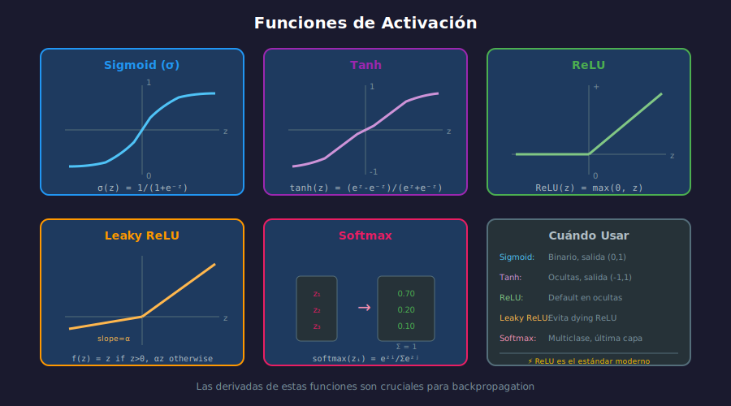

# ⚡ Funciones de Activación

## 🎯 Objetivos

- Conocer las principales funciones de activación
- Entender sus derivadas (esenciales para backpropagation)
- Saber cuándo usar cada una

---

## 📚 Contenido

### 1. ¿Por Qué Funciones de Activación?

Las funciones de activación introducen **no-linealidad** en la red, permitiendo aprender patrones complejos.



---

### 2. Sigmoid (Logística)

$$\sigma(z) = \frac{1}{1 + e^{-z}}$$

```python
import numpy as np
import matplotlib.pyplot as plt

def sigmoid(z):
    """Función sigmoid."""
    return 1 / (1 + np.exp(-z))

def sigmoid_derivative(z):
    """Derivada de sigmoid: σ'(z) = σ(z)(1 - σ(z))"""
    s = sigmoid(z)
    return s * (1 - s)


# Visualizar
z = np.linspace(-10, 10, 100)

fig, axes = plt.subplots(1, 2, figsize=(12, 4))

axes[0].plot(z, sigmoid(z), 'b-', linewidth=2)
axes[0].axhline(y=0.5, color='gray', linestyle='--', alpha=0.5)
axes[0].axvline(x=0, color='gray', linestyle='--', alpha=0.5)
axes[0].set_title('Sigmoid σ(z)')
axes[0].set_xlabel('z')
axes[0].set_ylabel('σ(z)')
axes[0].set_ylim(-0.1, 1.1)
axes[0].grid(True, alpha=0.3)

axes[1].plot(z, sigmoid_derivative(z), 'r-', linewidth=2)
axes[1].set_title("Derivada σ'(z)")
axes[1].set_xlabel('z')
axes[1].set_ylabel("σ'(z)")
axes[1].grid(True, alpha=0.3)

plt.tight_layout()
plt.show()

print(f"Sigmoid(0) = {sigmoid(0)}")         # 0.5
print(f"Sigmoid(5) = {sigmoid(5):.4f}")     # ~0.9933
print(f"Sigmoid(-5) = {sigmoid(-5):.4f}")   # ~0.0067
```

#### Propiedades

| Propiedad        | Valor              |
| ---------------- | ------------------ |
| Rango            | (0, 1)             |
| Centrada en cero | ❌ No              |
| Derivada máxima  | 0.25 (en z=0)      |
| Problema         | Vanishing gradient |

#### Cuándo Usar

- ✅ Capa de salida para clasificación binaria
- ❌ Evitar en capas ocultas (vanishing gradient)

---

### 3. Tanh (Tangente Hiperbólica)

$$\tanh(z) = \frac{e^z - e^{-z}}{e^z + e^{-z}} = 2\sigma(2z) - 1$$

```python
def tanh(z):
    """Función tanh."""
    return np.tanh(z)

def tanh_derivative(z):
    """Derivada de tanh: tanh'(z) = 1 - tanh²(z)"""
    return 1 - np.tanh(z) ** 2


# Visualizar
fig, axes = plt.subplots(1, 2, figsize=(12, 4))

axes[0].plot(z, tanh(z), 'purple', linewidth=2)
axes[0].axhline(y=0, color='gray', linestyle='--', alpha=0.5)
axes[0].axvline(x=0, color='gray', linestyle='--', alpha=0.5)
axes[0].set_title('Tanh(z)')
axes[0].set_ylim(-1.2, 1.2)
axes[0].grid(True, alpha=0.3)

axes[1].plot(z, tanh_derivative(z), 'orange', linewidth=2)
axes[1].set_title("Tanh'(z)")
axes[1].grid(True, alpha=0.3)

plt.tight_layout()
plt.show()
```

#### Propiedades

| Propiedad        | Valor                                  |
| ---------------- | -------------------------------------- |
| Rango            | (-1, 1)                                |
| Centrada en cero | ✅ Sí                                  |
| Derivada máxima  | 1.0 (en z=0)                           |
| Problema         | Vanishing gradient (menor que sigmoid) |

#### Cuándo Usar

- ✅ Capas ocultas cuando se necesita salida centrada
- ✅ RNNs (aunque LSTM es mejor)

---

### 4. ReLU (Rectified Linear Unit)

$$\text{ReLU}(z) = \max(0, z)$$

```python
def relu(z):
    """Función ReLU."""
    return np.maximum(0, z)

def relu_derivative(z):
    """Derivada de ReLU: 1 si z > 0, 0 si z <= 0"""
    return np.where(z > 0, 1, 0)


# Visualizar
fig, axes = plt.subplots(1, 2, figsize=(12, 4))

axes[0].plot(z, relu(z), 'g-', linewidth=2)
axes[0].axhline(y=0, color='gray', linestyle='--', alpha=0.5)
axes[0].axvline(x=0, color='gray', linestyle='--', alpha=0.5)
axes[0].set_title('ReLU(z)')
axes[0].set_ylim(-1, 10)
axes[0].grid(True, alpha=0.3)

axes[1].plot(z, relu_derivative(z), 'lime', linewidth=2)
axes[1].set_title("ReLU'(z)")
axes[1].set_ylim(-0.1, 1.2)
axes[1].grid(True, alpha=0.3)

plt.tight_layout()
plt.show()
```

#### Propiedades

| Propiedad        | Valor                         |
| ---------------- | ----------------------------- |
| Rango            | [0, ∞)                        |
| Centrada en cero | ❌ No                         |
| Derivada         | 0 o 1 (simple y rápida)       |
| Problema         | Dying ReLU (neuronas muertas) |

#### Cuándo Usar

- ✅ **Default para capas ocultas** en la mayoría de redes
- ✅ CNNs, redes profundas
- ⚠️ Cuidado con learning rates altos

---

### 5. Leaky ReLU

$$\text{LeakyReLU}(z) = \begin{cases} z & \text{si } z > 0 \\ \alpha z & \text{si } z \leq 0 \end{cases}$$

```python
def leaky_relu(z, alpha=0.01):
    """Leaky ReLU con pendiente alpha para valores negativos."""
    return np.where(z > 0, z, alpha * z)

def leaky_relu_derivative(z, alpha=0.01):
    """Derivada de Leaky ReLU."""
    return np.where(z > 0, 1, alpha)


# Visualizar
fig, ax = plt.subplots(figsize=(8, 5))
ax.plot(z, leaky_relu(z, 0.1), 'orange', linewidth=2, label='Leaky ReLU (α=0.1)')
ax.plot(z, relu(z), 'g--', linewidth=2, alpha=0.5, label='ReLU')
ax.axhline(y=0, color='gray', linestyle='--', alpha=0.5)
ax.axvline(x=0, color='gray', linestyle='--', alpha=0.5)
ax.set_title('Leaky ReLU vs ReLU')
ax.legend()
ax.grid(True, alpha=0.3)
plt.show()
```

#### Cuándo Usar

- ✅ Cuando ReLU causa dying neurons
- ✅ GANs y redes muy profundas

---

### 6. Softmax

$$\text{softmax}(z_i) = \frac{e^{z_i}}{\sum_{j=1}^{K} e^{z_j}}$$

```python
def softmax(z):
    """
    Función softmax para clasificación multiclase.
    Convierte logits en probabilidades que suman 1.
    """
    # Restar max para estabilidad numérica
    exp_z = np.exp(z - np.max(z))
    return exp_z / np.sum(exp_z)


# Ejemplo
logits = np.array([2.0, 1.0, 0.1])
probs = softmax(logits)

print("Logits:", logits)
print("Probabilidades:", probs)
print("Suma:", np.sum(probs))  # 1.0
print(f"Clase predicha: {np.argmax(probs)}")  # 0
```

#### Propiedades

| Propiedad | Valor                     |
| --------- | ------------------------- |
| Rango     | (0, 1) para cada elemento |
| Suma      | Siempre = 1               |
| Uso       | Capa de salida multiclase |

---

### 7. Comparación de Derivadas

Las derivadas son **cruciales** para backpropagation:

```python
fig, axes = plt.subplots(2, 2, figsize=(12, 10))
z = np.linspace(-5, 5, 200)

# Sigmoid
axes[0, 0].plot(z, sigmoid(z), 'b-', label='σ(z)', linewidth=2)
axes[0, 0].plot(z, sigmoid_derivative(z), 'b--', label="σ'(z)", linewidth=2)
axes[0, 0].set_title('Sigmoid')
axes[0, 0].legend()
axes[0, 0].grid(True, alpha=0.3)

# Tanh
axes[0, 1].plot(z, tanh(z), 'purple', label='tanh(z)', linewidth=2)
axes[0, 1].plot(z, tanh_derivative(z), 'purple', linestyle='--', label="tanh'(z)", linewidth=2)
axes[0, 1].set_title('Tanh')
axes[0, 1].legend()
axes[0, 1].grid(True, alpha=0.3)

# ReLU
axes[1, 0].plot(z, relu(z), 'g-', label='ReLU(z)', linewidth=2)
axes[1, 0].plot(z, relu_derivative(z), 'g--', label="ReLU'(z)", linewidth=2)
axes[1, 0].set_title('ReLU')
axes[1, 0].legend()
axes[1, 0].set_ylim(-1, 5)
axes[1, 0].grid(True, alpha=0.3)

# Leaky ReLU
axes[1, 1].plot(z, leaky_relu(z, 0.1), 'orange', label='LeakyReLU(z)', linewidth=2)
axes[1, 1].plot(z, leaky_relu_derivative(z, 0.1), 'orange', linestyle='--', label="LeakyReLU'(z)", linewidth=2)
axes[1, 1].set_title('Leaky ReLU (α=0.1)')
axes[1, 1].legend()
axes[1, 1].set_ylim(-1, 5)
axes[1, 1].grid(True, alpha=0.3)

plt.tight_layout()
plt.show()
```

---

### 8. Resumen y Recomendaciones

```
┌────────────────┬─────────────┬─────────────────────────────────┐
│ Función        │ Uso         │ Notas                           │
├────────────────┼─────────────┼─────────────────────────────────┤
│ ReLU           │ Ocultas     │ DEFAULT - rápido, efectivo      │
│ Leaky ReLU     │ Ocultas     │ Si ReLU causa dying neurons     │
│ Sigmoid        │ Salida      │ Clasificación binaria           │
│ Softmax        │ Salida      │ Clasificación multiclase        │
│ Tanh           │ Ocultas/RNN │ Salida centrada en 0            │
│ Linear         │ Salida      │ Regresión                       │
└────────────────┴─────────────┴─────────────────────────────────┘
```

---

## ✅ Checklist de Verificación

- [ ] Puedo implementar sigmoid, tanh, ReLU y sus derivadas
- [ ] Entiendo el problema del vanishing gradient
- [ ] Sé cuándo usar cada función de activación
- [ ] Puedo aplicar softmax para clasificación multiclase

---

## 🔗 Referencias

- [Activation Functions - Deep Learning Book](https://www.deeplearningbook.org/contents/mlp.html)
- [ReLU Paper - Nair & Hinton 2010](https://www.cs.toronto.edu/~fritz/absps/reluICML.pdf)
