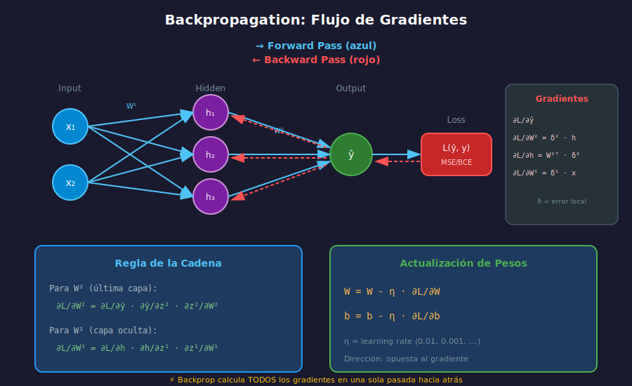

# 🔄 Backpropagation

## 🎯 Objetivos

- Entender el algoritmo de backpropagation matemáticamente
- Aplicar la regla de la cadena para calcular gradientes
- Implementar backpropagation desde cero

---

## 📚 Contenido

### 1. ¿Qué es Backpropagation?

Backpropagation es el algoritmo para calcular **eficientemente** los gradientes de la función de pérdida con respecto a todos los pesos de la red.



#### Idea Central

1. **Forward Pass**: Calcular la salida de la red
2. **Calcular Loss**: Comparar predicción con valor real
3. **Backward Pass**: Propagar el error hacia atrás usando la **regla de la cadena**
4. **Actualizar Pesos**: Ajustar en dirección opuesta al gradiente

---

### 2. Regla de la Cadena

La base matemática de backpropagation es la **regla de la cadena** del cálculo:

$$\frac{\partial L}{\partial w} = \frac{\partial L}{\partial y} \cdot \frac{\partial y}{\partial z} \cdot \frac{\partial z}{\partial w}$$

```python
import numpy as np

# Ejemplo simple: y = f(g(x))
# Si f(u) = u², g(x) = 3x + 1
# Entonces dy/dx = df/du * du/dx = 2u * 3 = 2(3x+1) * 3

x = 2
g_x = 3 * x + 1  # g(2) = 7
f_g = g_x ** 2   # f(g(2)) = 49

# Derivadas
df_du = 2 * g_x  # 14
du_dx = 3

# Regla de la cadena
dy_dx = df_du * du_dx  # 14 * 3 = 42
print(f"dy/dx = {dy_dx}")
```

---

### 3. Grafo de Computación

Una red neuronal se puede ver como un **grafo de computación**:

```
Forward:
x ──→ [z = Wx + b] ──→ [a = σ(z)] ──→ [L = loss(a, y)]

Backward (propagamos ∂L/∂•):
∂L/∂W ←── ∂L/∂z ←── ∂L/∂a ←── ∂L/∂L = 1
```

```python
# Ejemplo: una neurona con sigmoid
# Forward
def forward(x, w, b):
    z = np.dot(w, x) + b      # Combinación lineal
    a = 1 / (1 + np.exp(-z))  # Activación sigmoid
    return z, a

# Backward
def backward(x, w, z, a, y):
    """
    Calcula gradientes usando regla de la cadena.

    Args:
        x: input
        w: pesos
        z: pre-activación
        a: activación (output)
        y: label real

    Returns:
        dL_dw: gradiente de loss respecto a w
        dL_db: gradiente de loss respecto a b
    """
    # Loss: L = (a - y)²
    dL_da = 2 * (a - y)

    # Sigmoid: a = σ(z), σ'(z) = σ(z)(1-σ(z)) = a(1-a)
    da_dz = a * (1 - a)

    # z = w·x + b
    dz_dw = x
    dz_db = 1

    # Regla de la cadena
    dL_dz = dL_da * da_dz
    dL_dw = dL_dz * dz_dw
    dL_db = dL_dz * dz_db

    return dL_dw, dL_db
```

---

### 4. Backpropagation para MLP

Para una red con múltiples capas:

```python
class Layer:
    """Capa fully connected con activación."""

    def __init__(self, n_input, n_output, activation='relu'):
        # Inicialización Xavier/He
        self.W = np.random.randn(n_output, n_input) * np.sqrt(2.0 / n_input)
        self.b = np.zeros((n_output, 1))
        self.activation = activation

        # Cache para backward
        self.x = None
        self.z = None
        self.a = None

    def _activate(self, z):
        if self.activation == 'relu':
            return np.maximum(0, z)
        elif self.activation == 'sigmoid':
            return 1 / (1 + np.exp(-np.clip(z, -500, 500)))
        else:  # linear
            return z

    def _activate_derivative(self, z):
        if self.activation == 'relu':
            return (z > 0).astype(float)
        elif self.activation == 'sigmoid':
            s = self._activate(z)
            return s * (1 - s)
        else:
            return np.ones_like(z)

    def forward(self, x):
        """Forward pass."""
        self.x = x
        self.z = np.dot(self.W, x) + self.b
        self.a = self._activate(self.z)
        return self.a

    def backward(self, dL_da, learning_rate):
        """
        Backward pass.

        Args:
            dL_da: gradiente de loss respecto a activación
            learning_rate: tasa de aprendizaje

        Returns:
            dL_dx: gradiente para pasar a capa anterior
        """
        m = self.x.shape[1]  # batch size

        # Gradiente a través de activación
        da_dz = self._activate_derivative(self.z)
        dL_dz = dL_da * da_dz

        # Gradientes de parámetros
        dL_dW = (1/m) * np.dot(dL_dz, self.x.T)
        dL_db = (1/m) * np.sum(dL_dz, axis=1, keepdims=True)

        # Gradiente para capa anterior
        dL_dx = np.dot(self.W.T, dL_dz)

        # Actualizar parámetros
        self.W -= learning_rate * dL_dW
        self.b -= learning_rate * dL_db

        return dL_dx
```

---

### 5. Red Neuronal Completa con Backprop

```python
class NeuralNetwork:
    """Red neuronal multicapa con backpropagation."""

    def __init__(self, layer_sizes, activations=None):
        """
        Args:
            layer_sizes: lista [input, hidden1, hidden2, ..., output]
            activations: lista de activaciones por capa
        """
        self.layers = []
        n_layers = len(layer_sizes) - 1

        if activations is None:
            activations = ['relu'] * (n_layers - 1) + ['sigmoid']

        for i in range(n_layers):
            layer = Layer(layer_sizes[i], layer_sizes[i+1], activations[i])
            self.layers.append(layer)

    def forward(self, X):
        """Forward pass a través de todas las capas."""
        a = X
        for layer in self.layers:
            a = layer.forward(a)
        return a

    def compute_loss(self, y_pred, y_true):
        """Binary cross-entropy loss."""
        epsilon = 1e-15
        y_pred = np.clip(y_pred, epsilon, 1 - epsilon)
        loss = -np.mean(y_true * np.log(y_pred) + (1 - y_true) * np.log(1 - y_pred))
        return loss

    def backward(self, y_pred, y_true, learning_rate):
        """Backward pass a través de todas las capas."""
        # Gradiente de BCE loss
        epsilon = 1e-15
        y_pred = np.clip(y_pred, epsilon, 1 - epsilon)
        dL_da = -(y_true / y_pred) + (1 - y_true) / (1 - y_pred)
        dL_da /= y_true.shape[1]  # Normalizar por batch size

        # Propagar hacia atrás
        for layer in reversed(self.layers):
            dL_da = layer.backward(dL_da, learning_rate)

    def train(self, X, y, epochs, learning_rate, verbose=True):
        """Entrena la red."""
        losses = []

        for epoch in range(epochs):
            # Forward
            y_pred = self.forward(X)

            # Loss
            loss = self.compute_loss(y_pred, y)
            losses.append(loss)

            # Backward
            self.backward(y_pred, y, learning_rate)

            if verbose and (epoch + 1) % 100 == 0:
                acc = np.mean((y_pred > 0.5) == y)
                print(f"Epoch {epoch+1}: Loss = {loss:.4f}, Accuracy = {acc:.4f}")

        return losses

    def predict(self, X):
        """Predice clases."""
        return (self.forward(X) > 0.5).astype(int)


# Ejemplo: XOR (que el perceptrón no puede aprender)
print("=== Aprendiendo XOR con MLP ===")

X = np.array([[0, 0, 1, 1],
              [0, 1, 0, 1]])  # Shape: (2, 4)
y = np.array([[0, 1, 1, 0]])  # XOR: Shape: (1, 4)

# Red: 2 inputs -> 4 hidden -> 1 output
nn = NeuralNetwork([2, 4, 1], activations=['relu', 'sigmoid'])

losses = nn.train(X, y, epochs=1000, learning_rate=0.5)

print(f"\nPredicciones: {nn.forward(X).flatten()}")
print(f"Esperado:     {y.flatten()}")
print(f"Redondeado:   {nn.predict(X).flatten()}")
```

---

### 6. Gradient Checking

Para verificar que backpropagation está implementado correctamente:

```python
def gradient_check(network, X, y, epsilon=1e-7):
    """
    Verifica gradientes numéricamente.

    Compara gradientes analíticos (backprop) vs numéricos (diferencias finitas).
    """
    # Forward y backward para obtener gradientes analíticos
    y_pred = network.forward(X)
    network.backward(y_pred, y, learning_rate=0)  # lr=0 para no actualizar

    for layer_idx, layer in enumerate(network.layers):
        # Verificar gradiente de W
        dW_analytical = layer.dW if hasattr(layer, 'dW') else None

        # Calcular gradiente numérico
        dW_numerical = np.zeros_like(layer.W)

        for i in range(layer.W.shape[0]):
            for j in range(layer.W.shape[1]):
                # f(w + ε)
                layer.W[i, j] += epsilon
                y_plus = network.forward(X)
                loss_plus = network.compute_loss(y_plus, y)

                # f(w - ε)
                layer.W[i, j] -= 2 * epsilon
                y_minus = network.forward(X)
                loss_minus = network.compute_loss(y_minus, y)

                # Restaurar
                layer.W[i, j] += epsilon

                # Gradiente numérico
                dW_numerical[i, j] = (loss_plus - loss_minus) / (2 * epsilon)

        # Comparar
        if dW_analytical is not None:
            diff = np.linalg.norm(dW_analytical - dW_numerical)
            diff /= np.linalg.norm(dW_analytical) + np.linalg.norm(dW_numerical) + 1e-8
            print(f"Layer {layer_idx}: Gradient diff = {diff:.2e}")
            if diff < 1e-5:
                print("  ✅ Gradientes correctos")
            else:
                print("  ❌ Gradientes incorrectos!")
```

---

### 7. Vanishing y Exploding Gradients

#### Vanishing Gradient

Los gradientes se hacen muy pequeños en capas profundas:

```python
# Con sigmoid, derivada máxima = 0.25
# Después de n capas: 0.25^n → 0 muy rápido

n_layers = 10
max_gradient = 0.25 ** n_layers
print(f"Gradiente máximo después de {n_layers} capas sigmoid: {max_gradient:.2e}")
# ≈ 9.54e-7 ¡Casi cero!
```

**Solución**: Usar ReLU (derivada = 1 para valores positivos)

#### Exploding Gradient

Los gradientes crecen exponencialmente:

**Solución**: Gradient clipping

```python
def clip_gradients(gradients, max_norm=1.0):
    """Clip gradients to prevent explosion."""
    total_norm = np.sqrt(sum(np.sum(g**2) for g in gradients))
    clip_coef = max_norm / (total_norm + 1e-6)
    if clip_coef < 1:
        return [g * clip_coef for g in gradients]
    return gradients
```

---

### 8. Resumen del Algoritmo

```
BACKPROPAGATION
===============

1. FORWARD PASS
   Para cada capa l = 1, 2, ..., L:
       z[l] = W[l] · a[l-1] + b[l]
       a[l] = f(z[l])  # f = activación

   Calcular Loss: L = loss(a[L], y)

2. BACKWARD PASS
   Inicializar: δ[L] = ∂L/∂a[L] * f'(z[L])

   Para cada capa l = L, L-1, ..., 1:
       dW[l] = δ[l] · a[l-1]ᵀ
       db[l] = sum(δ[l])
       δ[l-1] = W[l]ᵀ · δ[l] * f'(z[l-1])

3. UPDATE
   Para cada capa:
       W[l] = W[l] - η · dW[l]
       b[l] = b[l] - η · db[l]
```

---

## ✅ Checklist de Verificación

- [ ] Entiendo la regla de la cadena y cómo se aplica
- [ ] Puedo calcular gradientes para una neurona a mano
- [ ] Implementé backpropagation para un MLP
- [ ] Sé cómo verificar gradientes numéricamente
- [ ] Comprendo vanishing/exploding gradients

---

## 🔗 Referencias

- [Backpropagation Calculus - 3Blue1Brown](https://www.youtube.com/watch?v=tIeHLnjs5U8)
- [CS231n Backpropagation](https://cs231n.github.io/optimization-2/)
- [Neural Networks and Deep Learning - Ch. 2](http://neuralnetworksanddeeplearning.com/chap2.html)
