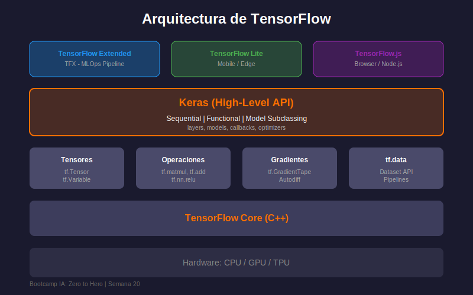

# 🔷 Introducción a TensorFlow

## 🎯 Objetivos

- Comprender qué es TensorFlow y su ecosistema
- Entender la arquitectura de tensores y grafos
- Conocer las diferencias entre TensorFlow 1.x y 2.x
- Configurar el entorno de trabajo correctamente

---

## 📚 Contenido

### 1. ¿Qué es TensorFlow?

**TensorFlow** es una plataforma de código abierto para Machine Learning desarrollada por Google Brain. Es el framework de deep learning más utilizado en la industria.

```python
import tensorflow as tf

# Verificar versión instalada
print(f"TensorFlow version: {tf.__version__}")

# Verificar si hay GPU disponible
gpus = tf.config.list_physical_devices('GPU')
print(f"GPUs disponibles: {len(gpus)}")
```

#### ¿Por qué TensorFlow?

| Característica        | Beneficio                                      |
| --------------------- | ---------------------------------------------- |
| **Escalabilidad**     | Desde móviles hasta clusters de servidores     |
| **Producción**        | TensorFlow Serving para deployment             |
| **Ecosistema**        | TensorBoard, TF Lite, TF.js, TFX               |
| **Comunidad**         | Documentación extensa, ejemplos, tutoriales    |
| **Keras Integrado**   | API de alto nivel incluida                     |

---

### 2. Arquitectura de TensorFlow



#### 2.1 Tensores: La Unidad Básica

Un **tensor** es un array n-dimensional, la estructura de datos fundamental:

```python
import tensorflow as tf
import numpy as np

# Tensor escalar (0-D)
scalar = tf.constant(42)
print(f"Escalar: {scalar}, shape: {scalar.shape}, dtype: {scalar.dtype}")

# Tensor vector (1-D)
vector = tf.constant([1.0, 2.0, 3.0, 4.0])
print(f"Vector: {vector}, shape: {vector.shape}")

# Tensor matriz (2-D)
matrix = tf.constant([[1, 2, 3],
                      [4, 5, 6]])
print(f"Matriz shape: {matrix.shape}")

# Tensor 3-D (típico para imágenes en batch)
tensor_3d = tf.constant([
    [[1, 2], [3, 4]],
    [[5, 6], [7, 8]]
])
print(f"3D tensor shape: {tensor_3d.shape}")  # (2, 2, 2)
```

#### 2.2 Tipos de Datos (dtypes)

```python
# Tipos más comunes
tf.float32   # Más usado para pesos de redes neuronales
tf.float64   # Mayor precisión, más lento
tf.int32     # Enteros, para índices
tf.int64     # Enteros largos
tf.bool      # Booleanos
tf.string    # Texto

# Especificar dtype al crear tensor
weights = tf.constant([0.1, 0.2, 0.3], dtype=tf.float32)
labels = tf.constant([0, 1, 2], dtype=tf.int32)
```

---

### 3. TensorFlow 2.x: Ejecución Eager

En TensorFlow 2.x, la **ejecución eager** está habilitada por defecto:

```python
# TensorFlow 1.x (antiguo) - Requería sesiones
# with tf.Session() as sess:
#     result = sess.run(operation)

# TensorFlow 2.x (actual) - Ejecución inmediata
a = tf.constant([1, 2, 3])
b = tf.constant([4, 5, 6])
c = a + b  # Se ejecuta inmediatamente
print(c)  # tf.Tensor([5 7 9], shape=(3,), dtype=int32)

# Convertir a NumPy fácilmente
numpy_array = c.numpy()
print(type(numpy_array))  # <class 'numpy.ndarray'>
```

#### Ventajas de Eager Execution

1. **Debugging intuitivo**: Puedes usar print() y pdb
2. **Flujo natural de Python**: Sin necesidad de sesiones
3. **Interoperabilidad con NumPy**: Conversión directa

---

### 4. Operaciones con Tensores

#### 4.1 Operaciones Matemáticas

```python
import tensorflow as tf

a = tf.constant([[1.0, 2.0], [3.0, 4.0]])
b = tf.constant([[5.0, 6.0], [7.0, 8.0]])

# Operaciones elemento a elemento
print("Suma:", tf.add(a, b))          # o simplemente: a + b
print("Resta:", tf.subtract(a, b))    # o: a - b
print("Multiplicación:", tf.multiply(a, b))  # o: a * b
print("División:", tf.divide(a, b))   # o: a / b

# Operaciones matriciales
print("Matmul:", tf.matmul(a, b))     # o: a @ b

# Funciones matemáticas
print("Raíz cuadrada:", tf.sqrt(a))
print("Exponencial:", tf.exp(a))
print("Logaritmo:", tf.math.log(a))
```

#### 4.2 Reducción y Agregación

```python
tensor = tf.constant([[1, 2, 3], [4, 5, 6]], dtype=tf.float32)

# Reducción sobre todo el tensor
print("Suma total:", tf.reduce_sum(tensor))
print("Media:", tf.reduce_mean(tensor))
print("Máximo:", tf.reduce_max(tensor))
print("Mínimo:", tf.reduce_min(tensor))

# Reducción sobre un eje específico
print("Suma por filas:", tf.reduce_sum(tensor, axis=1))  # [6, 15]
print("Suma por columnas:", tf.reduce_sum(tensor, axis=0))  # [5, 7, 9]
```

#### 4.3 Reshape y Manipulación

```python
# Reshape
original = tf.constant([[1, 2, 3], [4, 5, 6]])
reshaped = tf.reshape(original, [3, 2])
print(f"Original: {original.shape} -> Reshaped: {reshaped.shape}")

# Transpose
transposed = tf.transpose(original)
print(f"Transpuesta: {transposed.shape}")

# Expand dims (añadir dimensión)
expanded = tf.expand_dims(original, axis=0)  # Para batch
print(f"Expandido: {expanded.shape}")  # (1, 2, 3)

# Squeeze (eliminar dimensiones de tamaño 1)
squeezed = tf.squeeze(expanded)
print(f"Squeezed: {squeezed.shape}")  # (2, 3)
```

---

### 5. Variables: Pesos Entrenables

Los **tensores constantes** son inmutables. Para pesos de redes neuronales, usamos **Variables**:

```python
# Crear una variable (peso entrenable)
weights = tf.Variable(
    initial_value=tf.random.normal([3, 2]),
    trainable=True,
    name="layer_weights"
)
print(f"Weights: {weights.shape}")

# Las variables se pueden modificar
weights.assign(weights * 2)  # Multiplicar por 2
weights.assign_add(tf.ones_like(weights))  # Sumar 1

# Inicializadores comunes para pesos
glorot_init = tf.keras.initializers.GlorotUniform()
he_init = tf.keras.initializers.HeNormal()

# Crear variable con inicializador
layer_weights = tf.Variable(
    initial_value=glorot_init(shape=[784, 256]),
    trainable=True
)
```

---

### 6. GradientTape: Diferenciación Automática

TensorFlow calcula gradientes automáticamente con `tf.GradientTape`:

```python
# Ejemplo simple de gradiente
x = tf.Variable(3.0)

with tf.GradientTape() as tape:
    y = x ** 2  # y = x²

# dy/dx = 2x, cuando x=3, gradiente = 6
grad = tape.gradient(y, x)
print(f"Gradiente de x² en x=3: {grad}")  # 6.0

# Ejemplo con múltiples variables (como en una red neuronal)
w = tf.Variable(tf.random.normal([2, 1]))
b = tf.Variable(tf.zeros([1]))
x = tf.constant([[1.0, 2.0], [3.0, 4.0]])
y_true = tf.constant([[1.0], [0.0]])

with tf.GradientTape() as tape:
    # Forward pass
    y_pred = tf.sigmoid(tf.matmul(x, w) + b)
    # Loss
    loss = tf.reduce_mean((y_true - y_pred) ** 2)

# Calcular gradientes respecto a w y b
gradients = tape.gradient(loss, [w, b])
print(f"Gradiente de w: {gradients[0].shape}")
print(f"Gradiente de b: {gradients[1].shape}")
```

---

### 7. El Ecosistema TensorFlow

```
                    TensorFlow Ecosystem
    ┌─────────────────────────────────────────────┐
    │                                             │
    │   🔧 TensorFlow Core (Bajo nivel)           │
    │                                             │
    │   🎯 Keras (Alto nivel) - ESTA SEMANA       │
    │                                             │
    │   📊 TensorBoard (Visualización)            │
    │                                             │
    │   📱 TF Lite (Mobile/Edge)                  │
    │                                             │
    │   🌐 TF.js (JavaScript)                     │
    │                                             │
    │   🏭 TFX (Producción/MLOps)                 │
    │                                             │
    │   🔄 TF Data (Pipelines de datos)           │
    │                                             │
    └─────────────────────────────────────────────┘
```

---

### 8. Configuración del Entorno

```python
import tensorflow as tf

# Verificar instalación
print(f"TensorFlow: {tf.__version__}")

# Configurar memoria GPU (si hay)
gpus = tf.config.list_physical_devices('GPU')
if gpus:
    try:
        # Permitir crecimiento dinámico de memoria
        for gpu in gpus:
            tf.config.experimental.set_memory_growth(gpu, True)
        print(f"GPU configurada: {gpus}")
    except RuntimeError as e:
        print(e)
else:
    print("No se detectó GPU, usando CPU")

# Establecer seed para reproducibilidad
tf.random.set_seed(42)
```

---

## 💡 Resumen

| Concepto           | Descripción                                           |
| ------------------ | ----------------------------------------------------- |
| **Tensor**         | Array n-dimensional, unidad básica de datos           |
| **Variable**       | Tensor mutable para pesos entrenables                 |
| **GradientTape**   | Contexto para calcular gradientes automáticamente     |
| **Eager Execution**| Evaluación inmediata (por defecto en TF 2.x)          |
| **dtype**          | Tipo de datos del tensor (float32, int32, etc.)       |

---

## ✅ Verificación de Aprendizaje

- [ ] Puedo crear tensores de diferentes dimensiones
- [ ] Entiendo la diferencia entre Constant y Variable
- [ ] Sé usar GradientTape para calcular gradientes
- [ ] Puedo realizar operaciones matemáticas con tensores
- [ ] Comprendo el ecosistema de TensorFlow

---

_Siguiente: [02-keras-api-sequential.md](02-keras-api-sequential.md)_
