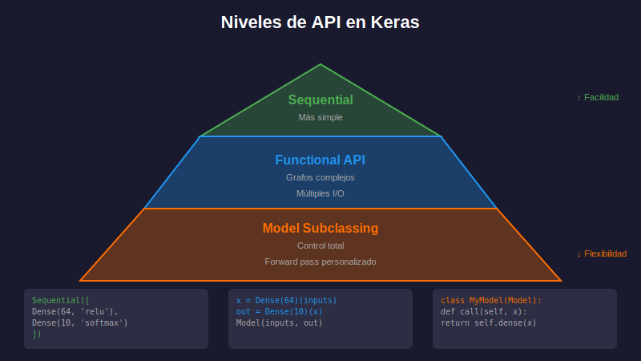
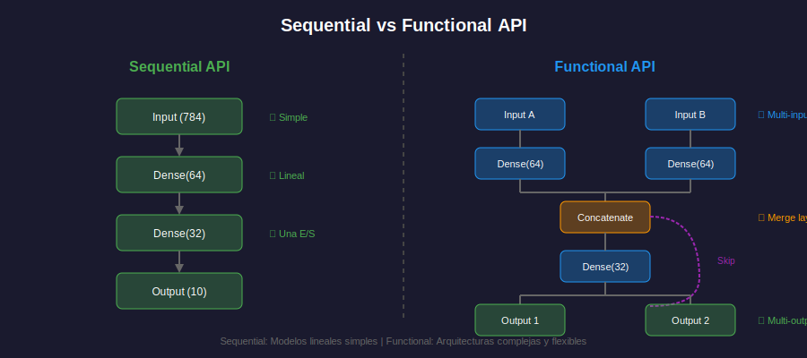

# 🧱 Keras API Sequential

## 🎯 Objetivos

- Entender los diferentes niveles de abstracción en Keras
- Dominar la API Sequential para construir modelos
- Conocer las formas de crear modelos paso a paso
- Aprender a inspeccionar y visualizar arquitecturas

---

## 📚 Contenido

### 1. Keras: La API de Alto Nivel

**Keras** es la API de alto nivel de TensorFlow que permite construir y entrenar modelos de forma intuitiva y rápida.



```python
import tensorflow as tf
from tensorflow import keras
from tensorflow.keras import layers

# Siempre usar tf.keras (integrado con TensorFlow)
print(f"Keras version: {keras.__version__}")
```

#### Tres Niveles de Abstracción

| Nivel      | API                | Cuándo usar                            |
| ---------- | ------------------ | -------------------------------------- |
| **Alto**   | Sequential         | Modelos lineales, apilado de capas     |
| **Medio**  | Functional         | Arquitecturas complejas, múltiples I/O |
| **Bajo**   | Model subclassing  | Máximo control, investigación          |

---

### 2. API Sequential: Lo Básico

La API Sequential es perfecta para modelos donde los datos fluyen de forma lineal a través de las capas.

#### 2.1 Creación con Lista de Capas

```python
import tensorflow as tf
from tensorflow.keras import layers, Sequential

# Forma 1: Lista de capas en el constructor
model = Sequential([
    layers.Dense(64, activation='relu', input_shape=(784,)),
    layers.Dense(32, activation='relu'),
    layers.Dense(10, activation='softmax')
])

# Ver resumen del modelo
model.summary()
```

**Output esperado:**
```
Model: "sequential"
_________________________________________________________________
 Layer (type)                Output Shape              Param #   
=================================================================
 dense (Dense)               (None, 64)                50240     
 dense_1 (Dense)             (None, 32)                2080      
 dense_2 (Dense)             (None, 10)                330       
=================================================================
Total params: 52,650
Trainable params: 52,650
Non-trainable params: 0
_________________________________________________________________
```

#### 2.2 Creación con .add()

```python
# Forma 2: Añadiendo capas una por una
model = Sequential()
model.add(layers.Dense(64, activation='relu', input_shape=(784,)))
model.add(layers.Dense(32, activation='relu'))
model.add(layers.Dense(10, activation='softmax'))
```

#### 2.3 Con InputLayer Explícito

```python
# Forma 3: InputLayer explícito (más claro)
model = Sequential([
    layers.InputLayer(input_shape=(784,)),  # Forma de entrada
    layers.Dense(64, activation='relu'),
    layers.Dense(32, activation='relu'),
    layers.Dense(10, activation='softmax')
])
```

---

### 3. Entendiendo input_shape

Es crucial configurar correctamente la forma de entrada:

```python
# Para imágenes MNIST aplanadas: 28x28 = 784 pixels
input_shape = (784,)

# Para imágenes sin aplanar: altura, anchura, canales
input_shape = (28, 28, 1)  # Grayscale
input_shape = (224, 224, 3)  # RGB color

# Para secuencias: longitud, features
input_shape = (100, 50)  # 100 timesteps, 50 features

# Para datos tabulares: número de features
input_shape = (13,)  # 13 features como Boston Housing

# IMPORTANTE: No incluir batch size en input_shape
# Keras añade automáticamente la dimensión del batch como None
```

#### Ejemplo Práctico

```python
# Modelo para datos tabulares (precio de casas)
model_regression = Sequential([
    layers.Dense(64, activation='relu', input_shape=(13,)),
    layers.Dense(32, activation='relu'),
    layers.Dense(1)  # Sin activación para regresión
])

# Modelo para clasificación de imágenes
model_images = Sequential([
    layers.Flatten(input_shape=(28, 28, 1)),  # Aplanar imagen
    layers.Dense(128, activation='relu'),
    layers.Dense(10, activation='softmax')
])
```

---

### 4. Nombrando Modelos y Capas

Dar nombres descriptivos facilita el debugging:

```python
model = Sequential([
    layers.Dense(64, activation='relu', name='hidden_1', 
                 input_shape=(784,)),
    layers.Dense(32, activation='relu', name='hidden_2'),
    layers.Dense(10, activation='softmax', name='output')
], name='mnist_classifier')

# Acceder a capas por nombre
layer = model.get_layer('hidden_1')
print(f"Capa: {layer.name}, Output: {layer.output_shape}")

# Acceder a capas por índice
first_layer = model.layers[0]
print(f"Primera capa: {first_layer.name}")
```

---

### 5. Inspección del Modelo

#### 5.1 Método summary()

```python
model.summary()

# Con más detalle sobre shapes
model.summary(expand_nested=True, show_trainable=True)
```

#### 5.2 Visualización con plot_model

```python
from tensorflow.keras.utils import plot_model

# Guardar diagrama como imagen
plot_model(
    model,
    to_file='model_architecture.png',
    show_shapes=True,
    show_layer_names=True,
    show_layer_activations=True,
    dpi=150
)
```

#### 5.3 Información de Capas

```python
# Iterar sobre capas
for i, layer in enumerate(model.layers):
    print(f"Capa {i}: {layer.name}")
    print(f"  - Input shape: {layer.input_shape}")
    print(f"  - Output shape: {layer.output_shape}")
    print(f"  - Parámetros: {layer.count_params()}")
    print()

# Obtener pesos de una capa
weights, biases = model.layers[0].get_weights()
print(f"Pesos shape: {weights.shape}")
print(f"Biases shape: {biases.shape}")
```

---

### 6. Configuración de Capas Dense

La capa Dense es la más fundamental:

```python
layers.Dense(
    units,              # Número de neuronas (obligatorio)
    activation=None,    # Función de activación
    use_bias=True,      # Usar bias (sesgo)
    kernel_initializer='glorot_uniform',  # Inicializador de pesos
    bias_initializer='zeros',             # Inicializador de bias
    kernel_regularizer=None,    # Regularización L1/L2
    bias_regularizer=None,
    activity_regularizer=None,
    kernel_constraint=None,     # Restricciones en pesos
    bias_constraint=None,
)
```

#### Ejemplos de Configuración

```python
# Capa básica
layers.Dense(64, activation='relu')

# Con regularización L2
layers.Dense(64, activation='relu',
            kernel_regularizer=tf.keras.regularizers.l2(0.01))

# Con inicialización He (mejor para ReLU)
layers.Dense(64, activation='relu',
            kernel_initializer='he_normal')

# Sin bias
layers.Dense(64, activation='relu', use_bias=False)
```

---

### 7. Sequential vs Functional API



#### Cuándo usar Sequential

✅ Modelo lineal, capa tras capa
✅ Una entrada, una salida
✅ Prototipado rápido
✅ Modelos simples a medianos

#### Cuándo usar Functional API

✅ Múltiples entradas/salidas
✅ Capas compartidas
✅ Conexiones residuales (skip connections)
✅ Grafos no lineales

```python
# Ejemplo donde Sequential NO funciona:
# Modelo con skip connection (necesita Functional API)
from tensorflow.keras import Model, Input

inputs = Input(shape=(784,))
x = layers.Dense(64, activation='relu')(inputs)
x = layers.Dense(64, activation='relu')(x)
x = layers.Add()([x, inputs[:, :64]])  # Skip connection - NO posible en Sequential
outputs = layers.Dense(10, activation='softmax')(x)
model = Model(inputs, outputs)
```

---

### 8. Patrones Comunes

#### Clasificación Binaria

```python
model = Sequential([
    layers.Dense(64, activation='relu', input_shape=(n_features,)),
    layers.Dense(32, activation='relu'),
    layers.Dense(1, activation='sigmoid')  # Una neurona, sigmoid
])
```

#### Clasificación Multiclase

```python
model = Sequential([
    layers.Dense(128, activation='relu', input_shape=(n_features,)),
    layers.Dense(64, activation='relu'),
    layers.Dense(n_classes, activation='softmax')  # n neuronas, softmax
])
```

#### Regresión

```python
model = Sequential([
    layers.Dense(64, activation='relu', input_shape=(n_features,)),
    layers.Dense(32, activation='relu'),
    layers.Dense(1)  # Sin activación
])
```

---

## 💡 Resumen

| Aspecto              | Sequential API                          |
| -------------------- | --------------------------------------- |
| **Uso**              | Modelos lineales simples                |
| **Creación**         | Lista de capas o `.add()`               |
| **input_shape**      | En primera capa o InputLayer            |
| **Inspección**       | `.summary()`, `.layers`, `plot_model()` |
| **Limitación**       | Solo grafos lineales                    |

---

## ✅ Verificación de Aprendizaje

- [ ] Puedo crear modelos con Sequential de ambas formas
- [ ] Entiendo cómo configurar input_shape correctamente
- [ ] Sé inspeccionar un modelo con summary() y acceder a capas
- [ ] Conozco cuándo usar Sequential vs Functional API
- [ ] Puedo configurar capas Dense con diferentes parámetros

---

_Siguiente: [03-capas-y-activaciones.md](03-capas-y-activaciones.md)_
