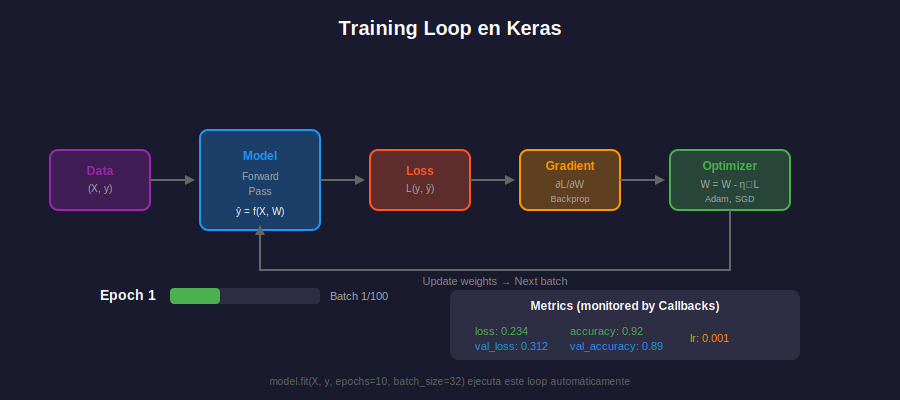
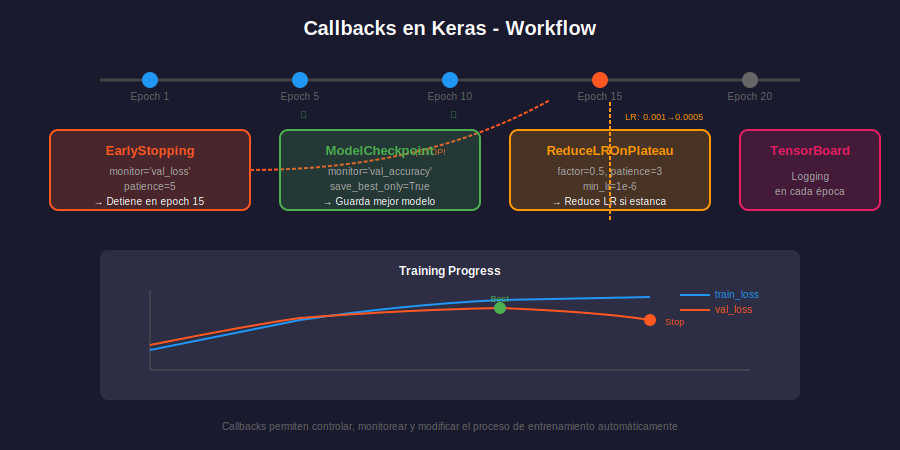

;# ⚙️ Compilación y Entrenamiento

## 🎯 Objetivos

- Entender el proceso de compilación de modelos en Keras
- Conocer los optimizadores, funciones de pérdida y métricas
- Dominar el método fit() y sus parámetros
- Implementar callbacks para controlar el entrenamiento
- Guardar y cargar modelos entrenados

---

## 📚 Contenido

### 1. El Proceso de Compilación

Antes de entrenar, debemos **compilar** el modelo especificando:

1. **Optimizer**: Cómo se actualizan los pesos
2. **Loss**: Qué se minimiza
3. **Metrics**: Qué se monitorea (no afecta entrenamiento)

```python
import tensorflow as tf
from tensorflow.keras import Sequential, layers

model = Sequential([
    layers.Dense(64, activation='relu', input_shape=(784,)),
    layers.Dense(10, activation='softmax')
])

# Compilación básica
model.compile(
    optimizer='adam',
    loss='sparse_categorical_crossentropy',
    metrics=['accuracy']
)
```

---

### 2. Optimizadores

Los optimizadores actualizan los pesos usando los gradientes calculados.

#### 2.1 Optimizadores Principales

```python
from tensorflow.keras import optimizers

# SGD: Stochastic Gradient Descent
sgd = optimizers.SGD(learning_rate=0.01, momentum=0.9)

# Adam: Adaptive Moment Estimation (más usado)
adam = optimizers.Adam(learning_rate=0.001)

# RMSprop: Bueno para RNNs
rmsprop = optimizers.RMSprop(learning_rate=0.001)

# AdamW: Adam con weight decay (regularización)
adamw = optimizers.AdamW(learning_rate=0.001, weight_decay=0.01)

# Uso en compile
model.compile(optimizer=adam, loss='mse')
```

#### 2.2 Comparación de Optimizadores

| Optimizer | Ventajas                        | Learning Rate Típico |
| --------- | ------------------------------- | -------------------- |
| **SGD**   | Simple, buena generalización    | 0.01 - 0.1           |
| **Adam**  | Adaptativo, converge rápido     | 0.001                |
| **RMSprop** | Bueno para RNNs               | 0.001                |
| **AdamW** | Adam + regularización           | 0.001                |

#### 2.3 Configuración del Learning Rate

```python
# Learning rate fijo
optimizer = optimizers.Adam(learning_rate=0.001)

# Learning rate schedule
lr_schedule = optimizers.schedules.ExponentialDecay(
    initial_learning_rate=0.001,
    decay_steps=1000,
    decay_rate=0.9
)
optimizer = optimizers.Adam(learning_rate=lr_schedule)

# Otra opción: CosineDecay
lr_schedule = optimizers.schedules.CosineDecay(
    initial_learning_rate=0.001,
    decay_steps=10000
)
```

---

### 3. Funciones de Pérdida (Loss Functions)

La función de pérdida mide qué tan lejos están las predicciones de los valores reales.

#### 3.1 Clasificación

```python
# Para etiquetas como enteros: [0, 1, 2, 3, ...]
model.compile(
    loss='sparse_categorical_crossentropy',
    # loss=tf.keras.losses.SparseCategoricalCrossentropy()
)

# Para etiquetas one-hot: [[1,0,0], [0,1,0], ...]
model.compile(
    loss='categorical_crossentropy',
    # loss=tf.keras.losses.CategoricalCrossentropy()
)

# Para clasificación binaria
model.compile(
    loss='binary_crossentropy',
    # loss=tf.keras.losses.BinaryCrossentropy()
)
```

#### 3.2 Regresión

```python
# MSE: Mean Squared Error (más común)
model.compile(loss='mse')  # loss='mean_squared_error'

# MAE: Mean Absolute Error (robusto a outliers)
model.compile(loss='mae')  # loss='mean_absolute_error'

# Huber: Combina MSE y MAE
model.compile(loss=tf.keras.losses.Huber(delta=1.0))
```

#### 3.3 Tabla de Referencia

| Tarea                  | Loss                           | Activación Output |
| ---------------------- | ------------------------------ | ----------------- |
| Binaria                | binary_crossentropy            | sigmoid           |
| Multiclase (int)       | sparse_categorical_crossentropy | softmax          |
| Multiclase (one-hot)   | categorical_crossentropy       | softmax           |
| Regresión              | mse / mae / huber              | linear (None)     |

---

### 4. Métricas

Las métricas monitorean el rendimiento pero no afectan el entrenamiento.

```python
from tensorflow.keras import metrics

model.compile(
    optimizer='adam',
    loss='sparse_categorical_crossentropy',
    metrics=[
        'accuracy',  # Precisión general
        metrics.Precision(name='precision'),
        metrics.Recall(name='recall'),
        metrics.AUC(name='auc'),
    ]
)

# Métricas para regresión
model.compile(
    optimizer='adam',
    loss='mse',
    metrics=['mae', 'mse', metrics.RootMeanSquaredError()]
)
```

---

### 5. Entrenamiento con fit()



#### 5.1 Sintaxis Básica

```python
history = model.fit(
    X_train,                    # Datos de entrada
    y_train,                    # Etiquetas
    epochs=10,                  # Iteraciones sobre todo el dataset
    batch_size=32,              # Muestras por actualización de pesos
    validation_split=0.2,       # 20% para validación
    verbose=1                   # Mostrar progreso
)

# verbose: 0=silencioso, 1=barra de progreso, 2=una línea por época
```

#### 5.2 Con Datos de Validación Explícitos

```python
history = model.fit(
    X_train, y_train,
    epochs=50,
    batch_size=64,
    validation_data=(X_val, y_val),  # Datos de validación separados
    shuffle=True                      # Mezclar datos cada época
)
```

#### 5.3 El Objeto History

```python
# history contiene las métricas de entrenamiento
print(history.history.keys())
# dict_keys(['loss', 'accuracy', 'val_loss', 'val_accuracy'])

# Acceder a métricas
train_loss = history.history['loss']
val_loss = history.history['val_loss']
train_acc = history.history['accuracy']
val_acc = history.history['val_accuracy']

# Visualizar
import matplotlib.pyplot as plt

fig, axes = plt.subplots(1, 2, figsize=(12, 4))

# Loss
axes[0].plot(train_loss, label='Train')
axes[0].plot(val_loss, label='Validation')
axes[0].set_title('Loss over epochs')
axes[0].legend()

# Accuracy
axes[1].plot(train_acc, label='Train')
axes[1].plot(val_acc, label='Validation')
axes[1].set_title('Accuracy over epochs')
axes[1].legend()

plt.tight_layout()
plt.show()
```

---

### 6. Callbacks

Los callbacks permiten ejecutar acciones en puntos específicos del entrenamiento.



#### 6.1 EarlyStopping

Detiene el entrenamiento cuando una métrica deja de mejorar:

```python
from tensorflow.keras.callbacks import EarlyStopping

early_stop = EarlyStopping(
    monitor='val_loss',      # Métrica a monitorear
    patience=5,              # Épocas sin mejora antes de parar
    restore_best_weights=True,  # Restaurar mejores pesos
    min_delta=0.001,         # Mejora mínima significativa
    mode='min'               # 'min' para loss, 'max' para accuracy
)

model.fit(X_train, y_train, epochs=100, callbacks=[early_stop])
```

#### 6.2 ModelCheckpoint

Guarda el modelo periódicamente:

```python
from tensorflow.keras.callbacks import ModelCheckpoint

checkpoint = ModelCheckpoint(
    filepath='best_model.keras',  # Ruta del archivo
    monitor='val_accuracy',       # Métrica a monitorear
    save_best_only=True,          # Solo guardar si mejora
    save_weights_only=False,      # Guardar modelo completo
    mode='max',
    verbose=1
)

# Guardar cada época con nombre único
checkpoint_epochs = ModelCheckpoint(
    filepath='models/model_{epoch:02d}_{val_accuracy:.2f}.keras',
    save_best_only=False
)
```

#### 6.3 TensorBoard

Visualización en tiempo real:

```python
from tensorflow.keras.callbacks import TensorBoard
import datetime

log_dir = f"logs/fit/{datetime.datetime.now().strftime('%Y%m%d-%H%M%S')}"
tensorboard = TensorBoard(
    log_dir=log_dir,
    histogram_freq=1,       # Histogramas de pesos cada época
    write_graph=True,       # Visualizar grafo del modelo
    write_images=True       # Visualizar pesos como imágenes
)

# Para ver TensorBoard ejecutar en terminal:
# tensorboard --logdir logs/fit
```

#### 6.4 ReduceLROnPlateau

Reduce learning rate cuando el entrenamiento se estanca:

```python
from tensorflow.keras.callbacks import ReduceLROnPlateau

reduce_lr = ReduceLROnPlateau(
    monitor='val_loss',
    factor=0.2,          # Nuevo LR = LR * factor
    patience=3,          # Épocas sin mejora
    min_lr=1e-6,         # LR mínimo
    verbose=1
)
```

#### 6.5 Combinando Callbacks

```python
callbacks = [
    EarlyStopping(
        monitor='val_loss',
        patience=10,
        restore_best_weights=True
    ),
    ModelCheckpoint(
        filepath='best_model.keras',
        monitor='val_loss',
        save_best_only=True
    ),
    ReduceLROnPlateau(
        monitor='val_loss',
        factor=0.5,
        patience=5,
        min_lr=1e-7
    ),
    TensorBoard(log_dir='./logs')
]

history = model.fit(
    X_train, y_train,
    epochs=100,
    validation_data=(X_val, y_val),
    callbacks=callbacks
)
```

---

### 7. Evaluación y Predicción

#### 7.1 Evaluación

```python
# Evaluar en datos de test
test_loss, test_accuracy = model.evaluate(X_test, y_test, verbose=1)
print(f"Test Loss: {test_loss:.4f}")
print(f"Test Accuracy: {test_accuracy:.4f}")
```

#### 7.2 Predicción

```python
# Predicciones (probabilidades)
predictions = model.predict(X_test)
print(f"Shape: {predictions.shape}")  # (n_samples, n_classes)

# Clase predicha (índice con mayor probabilidad)
predicted_classes = predictions.argmax(axis=1)

# Para un solo ejemplo
single_pred = model.predict(X_test[:1])
print(f"Probabilidades: {single_pred}")
print(f"Clase predicha: {single_pred.argmax()}")
```

---

### 8. Guardar y Cargar Modelos

#### 8.1 Formato Keras (Recomendado)

```python
# Guardar modelo completo (arquitectura + pesos + optimizer)
model.save('my_model.keras')

# Cargar modelo
loaded_model = tf.keras.models.load_model('my_model.keras')

# Verificar que funciona igual
loaded_model.evaluate(X_test, y_test)
```

#### 8.2 Solo Pesos

```python
# Guardar solo pesos
model.save_weights('model_weights.weights.h5')

# Cargar pesos (modelo debe tener misma arquitectura)
new_model = create_model()  # Misma arquitectura
new_model.load_weights('model_weights.weights.h5')
```

#### 8.3 SavedModel (Para Producción)

```python
# Formato SavedModel (TensorFlow Serving compatible)
model.save('saved_model_dir', save_format='tf')

# Cargar
loaded = tf.keras.models.load_model('saved_model_dir')
```

---

### 9. Ejemplo Completo de Entrenamiento

```python
import tensorflow as tf
from tensorflow.keras import Sequential, layers
from tensorflow.keras.callbacks import EarlyStopping, ModelCheckpoint
from tensorflow.keras.datasets import mnist
import numpy as np

# Reproducibilidad
tf.random.set_seed(42)
np.random.seed(42)

# 1. Cargar y preparar datos
(X_train, y_train), (X_test, y_test) = mnist.load_data()
X_train = X_train.reshape(-1, 784).astype('float32') / 255.0
X_test = X_test.reshape(-1, 784).astype('float32') / 255.0

# Split validación
val_split = 0.1
n_val = int(len(X_train) * val_split)
X_val, y_val = X_train[:n_val], y_train[:n_val]
X_train, y_train = X_train[n_val:], y_train[n_val:]

# 2. Crear modelo
model = Sequential([
    layers.Dense(256, activation='relu', input_shape=(784,)),
    layers.BatchNormalization(),
    layers.Dropout(0.3),
    layers.Dense(128, activation='relu'),
    layers.BatchNormalization(),
    layers.Dropout(0.3),
    layers.Dense(10, activation='softmax')
], name='mnist_classifier')

# 3. Compilar
model.compile(
    optimizer=tf.keras.optimizers.Adam(learning_rate=0.001),
    loss='sparse_categorical_crossentropy',
    metrics=['accuracy']
)

# 4. Callbacks
callbacks = [
    EarlyStopping(
        monitor='val_loss',
        patience=5,
        restore_best_weights=True,
        verbose=1
    ),
    ModelCheckpoint(
        filepath='best_mnist_model.keras',
        monitor='val_accuracy',
        save_best_only=True,
        verbose=1
    )
]

# 5. Entrenar
history = model.fit(
    X_train, y_train,
    epochs=50,
    batch_size=128,
    validation_data=(X_val, y_val),
    callbacks=callbacks,
    verbose=1
)

# 6. Evaluar
test_loss, test_acc = model.evaluate(X_test, y_test)
print(f"\nTest Accuracy: {test_acc:.4f}")

# 7. Guardar modelo final
model.save('mnist_final_model.keras')
print("Modelo guardado exitosamente")
```

---

## 💡 Resumen

| Componente    | Opciones Comunes                                      |
| ------------- | ----------------------------------------------------- |
| **Optimizer** | Adam (default), SGD+momentum, RMSprop                 |
| **Loss**      | sparse_categorical_crossentropy, mse, binary_crossentropy |
| **Callbacks** | EarlyStopping, ModelCheckpoint, TensorBoard           |
| **Guardar**   | .keras (recomendado), SavedModel (producción)         |

---

## ✅ Verificación de Aprendizaje

- [ ] Puedo compilar modelos con optimizer, loss y metrics apropiados
- [ ] Entiendo la diferencia entre las funciones de pérdida
- [ ] Sé usar fit() con validación y callbacks
- [ ] Puedo implementar EarlyStopping y ModelCheckpoint
- [ ] Domino guardar y cargar modelos en diferentes formatos

---

_Fin de la teoría de Semana 20_
