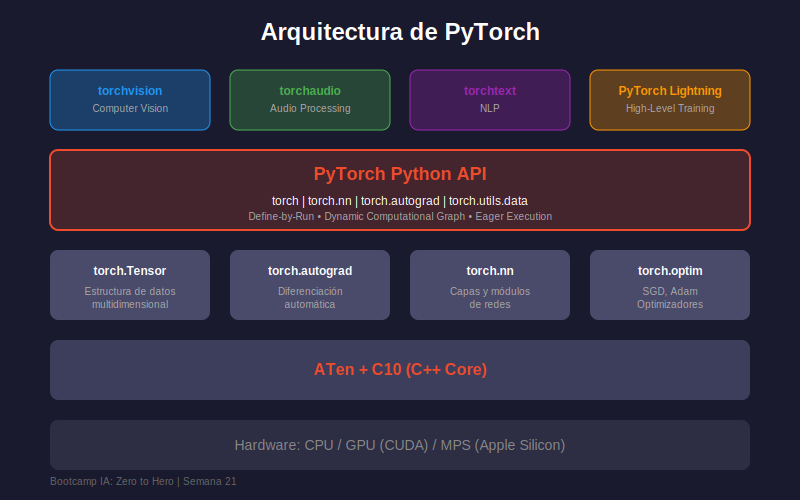

# 🔥 Introducción a PyTorch

## 🎯 Objetivos

- Comprender qué es PyTorch y su filosofía de diseño
- Conocer el ecosistema de PyTorch
- Entender las diferencias con TensorFlow
- Configurar el entorno de trabajo

---

## 1. ¿Qué es PyTorch?

PyTorch es un framework de deep learning desarrollado por **Meta AI** (anteriormente Facebook AI Research). Es conocido por:

- **Define-by-Run**: Grafo computacional dinámico
- **Pythónico**: Sintaxis natural y familiar
- **Preferido en investigación**: ~70% de papers en conferencias top
- **Debugging fácil**: Compatible con herramientas estándar de Python

```python
import torch

# PyTorch se siente como Python nativo
x = torch.tensor([1.0, 2.0, 3.0])
y = x * 2 + 1
print(y)  # tensor([3., 5., 7.])
```

---

## 2. PyTorch vs TensorFlow

| Característica    | PyTorch                          | TensorFlow/Keras               |
| ----------------- | -------------------------------- | ------------------------------ |
| **Grafo**         | Dinámico (define-by-run)         | Estático (con eager mode)      |
| **Debugging**     | print(), pdb, breakpoints        | tf.print(), TensorBoard        |
| **Curva de aprendizaje** | Más suave si sabes Python  | Más abstracto                  |
| **Producción**    | TorchServe, ONNX                 | TensorFlow Serving, TFLite     |
| **Investigación** | Dominante (~70%)                 | Popular en industria           |
| **Mobile/Edge**   | PyTorch Mobile (en desarrollo)   | TensorFlow Lite (maduro)       |

### ¿Cuándo usar cada uno?

```python
# PyTorch: Control total, investigación, modelos complejos
# - Cuando necesitas debugging paso a paso
# - Arquitecturas dinámicas (longitud variable, grafos)
# - Prototipos rápidos

# TensorFlow: Producción, mobile, ecosistema completo
# - Despliegue en producción establecido
# - Aplicaciones móviles con TFLite
# - Pipelines MLOps con TFX
```

---

## 3. Arquitectura de PyTorch



### Componentes Principales

```python
import torch
import torch.nn as nn
import torch.optim as optim
import torch.nn.functional as F
from torch.utils.data import DataLoader, Dataset

# torch: Tensores y operaciones básicas
# torch.nn: Capas, redes neuronales, pérdidas
# torch.optim: Optimizadores (SGD, Adam, etc.)
# torch.nn.functional: Funciones sin estado (activaciones, etc.)
# torch.utils.data: Carga y procesamiento de datos
```

### Ecosistema Completo

| Librería        | Propósito                     |
| --------------- | ----------------------------- |
| **torchvision** | Computer vision, datasets     |
| **torchaudio**  | Procesamiento de audio        |
| **torchtext**   | NLP y procesamiento de texto  |
| **PyTorch Lightning** | Training simplificado   |
| **Hugging Face** | Modelos pre-entrenados NLP   |

---

## 4. Instalación y Configuración

### Instalación Básica

```bash
# CPU only
pip install torch torchvision

# Con CUDA (GPU NVIDIA)
pip install torch torchvision --index-url https://download.pytorch.org/whl/cu118
```

### Verificar Instalación

```python
import torch

# Versión
print(f"PyTorch version: {torch.__version__}")

# Verificar CUDA
print(f"CUDA available: {torch.cuda.is_available()}")
if torch.cuda.is_available():
    print(f"CUDA version: {torch.version.cuda}")
    print(f"GPU: {torch.cuda.get_device_name(0)}")

# Test básico
x = torch.rand(3, 3)
print(f"Random tensor:\n{x}")
```

---

## 5. Primer Programa en PyTorch

```python
import torch
import torch.nn as nn

# 1. Crear datos de ejemplo
X = torch.tensor([[1.0], [2.0], [3.0], [4.0]])
y = torch.tensor([[2.0], [4.0], [6.0], [8.0]])

# 2. Definir modelo simple (y = 2x)
model = nn.Linear(1, 1)

# 3. Definir pérdida y optimizador
criterion = nn.MSELoss()
optimizer = torch.optim.SGD(model.parameters(), lr=0.01)

# 4. Training loop
for epoch in range(100):
    # Forward pass
    predictions = model(X)
    loss = criterion(predictions, y)
    
    # Backward pass
    optimizer.zero_grad()  # Limpiar gradientes
    loss.backward()        # Calcular gradientes
    optimizer.step()       # Actualizar parámetros
    
    if (epoch + 1) % 20 == 0:
        print(f"Epoch {epoch+1}, Loss: {loss.item():.4f}")

# 5. Resultado
print(f"\nPeso aprendido: {model.weight.item():.4f}")  # ~2.0
print(f"Bias aprendido: {model.bias.item():.4f}")     # ~0.0
```

---

## 6. Filosofía "Pythonic"

PyTorch está diseñado para sentirse como Python nativo:

```python
import torch

# Indexing como NumPy
tensor = torch.arange(10)
print(tensor[2:5])      # tensor([2, 3, 4])
print(tensor[::2])      # tensor([0, 2, 4, 6, 8])

# List comprehensions
tensors = [torch.rand(3) for _ in range(5)]

# Control flow normal
def dynamic_computation(x):
    if x.sum() > 0:
        return x * 2
    else:
        return x * -1

# Funciona con estructuras de control de Python!
result = dynamic_computation(torch.tensor([-1.0, 2.0, 3.0]))
print(result)  # tensor([-2., 4., 6.])
```

---

## 7. Dispositivos: CPU vs GPU

```python
import torch

# Detectar dispositivo disponible
device = torch.device("cuda" if torch.cuda.is_available() else "cpu")
print(f"Using device: {device}")

# Crear tensor en dispositivo específico
x_cpu = torch.rand(3, 3)                    # En CPU
x_gpu = torch.rand(3, 3, device=device)     # En GPU si está disponible

# Mover tensores entre dispositivos
x_to_gpu = x_cpu.to(device)
x_to_cpu = x_gpu.cpu()

# Patrón común: modelo y datos en el mismo dispositivo
model = nn.Linear(10, 5).to(device)
data = torch.rand(32, 10).to(device)
output = model(data)  # Todo en GPU
```

---

## 📝 Resumen

| Concepto        | Descripción                                          |
| --------------- | ---------------------------------------------------- |
| **PyTorch**     | Framework de deep learning de Meta, dinámico         |
| **Define-by-Run** | Grafo computacional se crea durante ejecución      |
| **torch**       | Módulo principal para tensores y operaciones         |
| **torch.nn**    | Redes neuronales, capas, pérdidas                    |
| **device**      | CPU o CUDA (GPU) para computación                    |

---

## 🔗 Recursos

- [PyTorch Official Website](https://pytorch.org/)
- [PyTorch Tutorials](https://pytorch.org/tutorials/)
- [Deep Learning with PyTorch Book](https://pytorch.org/deep-learning-with-pytorch)

---

_Siguiente: [02 - Tensores en PyTorch](02-tensores-pytorch.md)_
