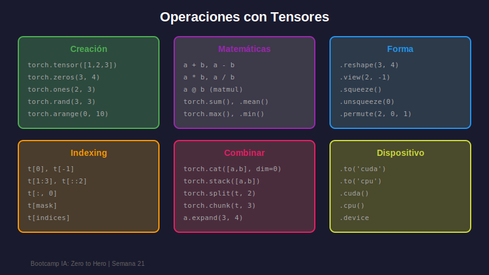

# 🔢 Tensores en PyTorch

## 🎯 Objetivos

- Dominar la creación de tensores en PyTorch
- Realizar operaciones matemáticas con tensores
- Entender shapes, dtypes y dispositivos
- Convertir entre NumPy y PyTorch

---

## 1. ¿Qué es un Tensor?

Un **tensor** es la estructura de datos fundamental en PyTorch:

- **0D**: Escalar (un número)
- **1D**: Vector (lista de números)
- **2D**: Matriz (tabla de números)
- **nD**: Tensor n-dimensional

```python
import torch

# Escalar (0D)
scalar = torch.tensor(42)
print(f"Scalar: {scalar}, dim: {scalar.dim()}")

# Vector (1D)
vector = torch.tensor([1, 2, 3, 4])
print(f"Vector shape: {vector.shape}")

# Matriz (2D)
matrix = torch.tensor([[1, 2], [3, 4], [5, 6]])
print(f"Matrix shape: {matrix.shape}")

# Tensor 3D (batch de matrices)
tensor_3d = torch.rand(2, 3, 4)  # 2 matrices de 3x4
print(f"3D Tensor shape: {tensor_3d.shape}")
```

---

## 2. Creación de Tensores



### Desde Datos Existentes

```python
import torch
import numpy as np

# Desde lista Python
t1 = torch.tensor([1, 2, 3, 4])

# Desde NumPy (comparte memoria!)
numpy_array = np.array([1.0, 2.0, 3.0])
t2 = torch.from_numpy(numpy_array)

# Copiar tensor existente
t3 = t1.clone()

# Especificar tipo de dato
t4 = torch.tensor([1, 2, 3], dtype=torch.float32)
```

### Tensores con Valores Especiales

```python
# Ceros y unos
zeros = torch.zeros(3, 4)           # 3x4 de ceros
ones = torch.ones(2, 3, 4)          # 2x3x4 de unos
empty = torch.empty(2, 2)           # Sin inicializar

# Con mismo shape que otro tensor
like_zeros = torch.zeros_like(ones)
like_ones = torch.ones_like(zeros)

# Identidad y diagonales
eye = torch.eye(3)                  # Matriz identidad 3x3
diag = torch.diag(torch.tensor([1, 2, 3]))  # Matriz diagonal
```

### Tensores Aleatorios

```python
# Distribución uniforme [0, 1)
uniform = torch.rand(3, 3)

# Distribución normal (media=0, std=1)
normal = torch.randn(3, 3)

# Enteros aleatorios
randint = torch.randint(0, 10, (3, 3))  # Enteros entre 0 y 9

# Reproducibilidad
torch.manual_seed(42)
reproducible = torch.rand(3)
```

### Secuencias y Rangos

```python
# Similar a range()
arange = torch.arange(0, 10, 2)     # [0, 2, 4, 6, 8]

# Espaciado lineal
linspace = torch.linspace(0, 1, 5)  # 5 valores entre 0 y 1

# Espaciado logarítmico
logspace = torch.logspace(0, 2, 3)  # [1, 10, 100]
```

---

## 3. Atributos de Tensores

```python
import torch

t = torch.rand(2, 3, 4, dtype=torch.float32)

# Shape y dimensiones
print(f"Shape: {t.shape}")          # torch.Size([2, 3, 4])
print(f"Dimensions: {t.dim()}")     # 3
print(f"Total elements: {t.numel()}")  # 24

# Tipo de dato
print(f"Dtype: {t.dtype}")          # torch.float32

# Dispositivo
print(f"Device: {t.device}")        # cpu

# ¿Requiere gradientes?
print(f"Requires grad: {t.requires_grad}")  # False
```

### Tipos de Datos Comunes

| Dtype               | Descripción            | Uso Común               |
| ------------------- | ---------------------- | ----------------------- |
| `torch.float32`     | Float 32 bits          | Default para modelos    |
| `torch.float64`     | Float 64 bits          | Alta precisión          |
| `torch.float16`     | Float 16 bits          | Entrenamiento mixto     |
| `torch.int32`       | Entero 32 bits         | Índices                 |
| `torch.int64`       | Entero 64 bits         | Labels, índices largos  |
| `torch.bool`        | Booleano               | Máscaras                |

```python
# Conversión de tipos
t_float = torch.tensor([1, 2, 3]).float()
t_int = torch.tensor([1.5, 2.7, 3.2]).int()
t_bool = torch.tensor([0, 1, 2]).bool()
```

---

## 4. Operaciones con Tensores

### Operaciones Matemáticas Básicas

```python
a = torch.tensor([1.0, 2.0, 3.0])
b = torch.tensor([4.0, 5.0, 6.0])

# Aritméticas (element-wise)
suma = a + b            # o torch.add(a, b)
resta = a - b           # o torch.sub(a, b)
mult = a * b            # o torch.mul(a, b)
div = a / b             # o torch.div(a, b)
potencia = a ** 2       # o torch.pow(a, 2)

# In-place (modifica el tensor original)
a.add_(1)               # a = a + 1 (nota el _ al final)
```

### Operaciones de Reducción

```python
t = torch.tensor([[1.0, 2.0, 3.0],
                  [4.0, 5.0, 6.0]])

# Sobre todo el tensor
print(f"Sum: {t.sum()}")            # 21.0
print(f"Mean: {t.mean()}")          # 3.5
print(f"Std: {t.std()}")            # 1.87
print(f"Min: {t.min()}")            # 1.0
print(f"Max: {t.max()}")            # 6.0

# Sobre dimensión específica
print(f"Sum dim=0: {t.sum(dim=0)}")   # [5, 7, 9] (por columnas)
print(f"Sum dim=1: {t.sum(dim=1)}")   # [6, 15]   (por filas)

# Mantener dimensiones
print(f"Sum keepdim: {t.sum(dim=1, keepdim=True).shape}")  # [2, 1]
```

### Operaciones Matriciales

```python
# Matrices para ejemplos
A = torch.rand(2, 3)
B = torch.rand(3, 4)
C = torch.rand(2, 3)

# Multiplicación de matrices
result = torch.matmul(A, B)     # [2, 4]
result = A @ B                   # Operador equivalente

# Producto punto (vectores)
v1 = torch.tensor([1.0, 2.0, 3.0])
v2 = torch.tensor([4.0, 5.0, 6.0])
dot = torch.dot(v1, v2)         # 32.0

# Transpuesta
At = A.T                        # o A.transpose(0, 1)

# Batch matrix multiplication
batch_A = torch.rand(10, 2, 3)  # 10 matrices de 2x3
batch_B = torch.rand(10, 3, 4)  # 10 matrices de 3x4
batch_result = torch.bmm(batch_A, batch_B)  # [10, 2, 4]
```

---

## 5. Indexing y Slicing

```python
t = torch.arange(12).reshape(3, 4)
# tensor([[ 0,  1,  2,  3],
#         [ 4,  5,  6,  7],
#         [ 8,  9, 10, 11]])

# Indexing básico
print(t[0])         # Primera fila: [0, 1, 2, 3]
print(t[1, 2])      # Elemento [1, 2]: 6
print(t[-1])        # Última fila: [8, 9, 10, 11]

# Slicing
print(t[:2])        # Primeras 2 filas
print(t[:, 1])      # Segunda columna
print(t[1:, 2:])    # Submatriz

# Fancy indexing
indices = torch.tensor([0, 2])
print(t[indices])   # Filas 0 y 2

# Boolean indexing
mask = t > 5
print(t[mask])      # Elementos mayores a 5
```

---

## 6. Reshape y Manipulación de Forma

```python
t = torch.arange(12)

# Reshape
reshaped = t.reshape(3, 4)
reshaped = t.view(3, 4)         # Similar, pero requiere memoria contigua

# Inferir dimensión con -1
auto_shape = t.reshape(-1, 4)   # Calcula automáticamente: [3, 4]
auto_shape = t.reshape(2, -1)   # [2, 6]

# Flatten
flat = reshaped.flatten()       # Vuelve a 1D
flat = reshaped.reshape(-1)     # Equivalente

# Squeeze y Unsqueeze
t = torch.rand(1, 3, 1, 4)
squeezed = t.squeeze()          # Elimina dims de tamaño 1: [3, 4]
unsqueezed = squeezed.unsqueeze(0)  # Añade dim en posición 0: [1, 3, 4]

# Permute (reordenar dimensiones)
t = torch.rand(2, 3, 4)
permuted = t.permute(2, 0, 1)   # [4, 2, 3]

# Concatenar
a = torch.rand(2, 3)
b = torch.rand(2, 3)
concat_dim0 = torch.cat([a, b], dim=0)  # [4, 3]
concat_dim1 = torch.cat([a, b], dim=1)  # [2, 6]

# Stack (nueva dimensión)
stacked = torch.stack([a, b], dim=0)    # [2, 2, 3]
```

---

## 7. Broadcasting

Broadcasting permite operar tensores de diferentes shapes:

```python
# Escalar con tensor
t = torch.tensor([1.0, 2.0, 3.0])
result = t + 10                 # [11, 12, 13]

# Vector con matriz
matrix = torch.ones(3, 4)
vector = torch.tensor([1, 2, 3, 4])
result = matrix + vector        # Broadcast por filas

# Reglas de broadcasting:
# 1. Alinear shapes por la derecha
# 2. Dimensiones compatibles si son iguales o una es 1
# 3. La dimensión de tamaño 1 se "expande"

a = torch.ones(3, 1)    # [3, 1]
b = torch.ones(1, 4)    # [1, 4]
result = a + b          # [3, 4]
```

---

## 8. NumPy ↔ PyTorch

```python
import torch
import numpy as np

# NumPy → PyTorch
np_array = np.array([1.0, 2.0, 3.0])
tensor = torch.from_numpy(np_array)     # Comparte memoria!
tensor_copy = torch.tensor(np_array)    # Copia

# PyTorch → NumPy
tensor = torch.tensor([1.0, 2.0, 3.0])
np_array = tensor.numpy()               # Comparte memoria!
np_copy = tensor.detach().numpy()       # Seguro si hay gradientes

# ⚠️ Cuidado: memoria compartida
np_array = np.array([1.0, 2.0])
tensor = torch.from_numpy(np_array)
np_array[0] = 100       # Modifica ambos!
print(tensor)           # tensor([100.,   2.])
```

---

## 📝 Resumen

| Operación       | Función/Método                        |
| --------------- | ------------------------------------- |
| Crear           | `torch.tensor()`, `torch.rand()`, etc.|
| Shape           | `.shape`, `.reshape()`, `.view()`     |
| Matemáticas     | `+`, `-`, `*`, `/`, `@`               |
| Reducción       | `.sum()`, `.mean()`, `.max()`         |
| Indexing        | `t[i, j]`, `t[:, 1]`, `t[mask]`       |
| Manipular       | `.squeeze()`, `.unsqueeze()`, `.cat()`|
| NumPy           | `.numpy()`, `torch.from_numpy()`      |

---

## 🔗 Recursos

- [PyTorch Tensor Tutorial](https://pytorch.org/tutorials/beginner/blitz/tensor_tutorial.html)
- [Tensor Operations](https://pytorch.org/docs/stable/tensors.html)

---

_Siguiente: [03 - Autograd y Diferenciación](03-autograd-diferenciacion.md)_
