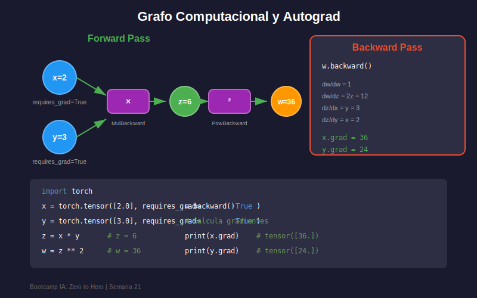

# ⚡ Autograd: Diferenciación Automática

## 🎯 Objetivos

- Comprender el sistema de diferenciación automática de PyTorch
- Dominar `requires_grad` y el grafo computacional
- Usar `backward()` para calcular gradientes
- Aplicar `torch.no_grad()` y `detach()` correctamente

---

## 1. ¿Qué es Autograd?

**Autograd** es el motor de diferenciación automática de PyTorch. Permite calcular gradientes automáticamente sin derivar fórmulas manualmente.

```python
import torch

# Crear tensor con seguimiento de gradientes
x = torch.tensor([2.0], requires_grad=True)

# Operación: y = x²
y = x ** 2

# Calcular gradiente: dy/dx = 2x
y.backward()

print(f"x = {x.item()}")
print(f"y = x² = {y.item()}")
print(f"dy/dx = 2x = {x.grad.item()}")  # 4.0
```

---

## 2. Grafo Computacional



PyTorch construye un **grafo computacional dinámico** durante el forward pass:

```python
import torch

# Variables de entrada
a = torch.tensor([2.0], requires_grad=True)
b = torch.tensor([3.0], requires_grad=True)

# Forward pass (construye el grafo)
c = a * b       # MulBackward
d = c + a       # AddBackward
e = d ** 2      # PowBackward

# El grafo se construye automáticamente
print(f"e.grad_fn: {e.grad_fn}")  # PowBackward

# Backward pass (calcula gradientes siguiendo el grafo)
e.backward()

print(f"de/da = {a.grad.item()}")  # 56.0
print(f"de/db = {b.grad.item()}")  # 32.0
```

### ¿Cómo funciona?

```
Forward:
a=2 ─┬─→ [×] → c=6 ──→ [+] → d=8 ──→ [²] → e=64
     │              ↗
b=3 ─┘          a=2

Backward (cadena de derivadas):
de/da = de/dd × dd/dc × dc/da + de/dd × dd/da
      = 2d    × 1     × b     + 2d    × 1
      = 16    × 1     × 3     + 16    × 1
      = 48 + 8 = 56
```

---

## 3. requires_grad

El flag `requires_grad` indica si PyTorch debe rastrear operaciones para calcular gradientes:

```python
import torch

# Con requires_grad=True
x = torch.tensor([1.0, 2.0, 3.0], requires_grad=True)
y = x.sum() ** 2
y.backward()
print(f"Gradiente: {x.grad}")

# Sin requires_grad (default)
z = torch.tensor([1.0, 2.0, 3.0])  # requires_grad=False
print(f"requires_grad: {z.requires_grad}")  # False

# Activar requires_grad después
z.requires_grad_(True)  # In-place
print(f"requires_grad: {z.requires_grad}")  # True

# Los resultados heredan requires_grad
a = torch.rand(3, requires_grad=True)
b = torch.rand(3)  # No requiere grad
c = a + b
print(f"c.requires_grad: {c.requires_grad}")  # True (hereda de a)
```

---

## 4. backward() en Detalle

### Caso Escalar

```python
# Si el output es escalar, no necesita argumentos
x = torch.tensor([2.0], requires_grad=True)
y = x ** 3  # y = x³
y.backward()  # dy/dx = 3x² = 12
print(f"Gradiente: {x.grad}")  # tensor([12.])
```

### Caso Vector/Matriz

```python
# Si el output NO es escalar, necesita un "vector gradiente"
x = torch.tensor([1.0, 2.0, 3.0], requires_grad=True)
y = x ** 2  # y = [1, 4, 9]

# Necesitamos un vector del mismo tamaño
# Típicamente usamos loss.sum() o loss.mean() para obtener escalar
loss = y.sum()  # Ahora es escalar
loss.backward()
print(f"Gradiente: {x.grad}")  # [2., 4., 6.] = 2x

# Alternativa: pasar gradient directamente
x.grad.zero_()  # Limpiar gradientes previos
y = x ** 2
y.backward(torch.ones_like(y))  # Vector de unos
print(f"Gradiente: {x.grad}")  # [2., 4., 6.]
```

---

## 5. Acumulación de Gradientes

PyTorch **acumula** gradientes por defecto. Hay que limpiarlos manualmente:

```python
import torch

x = torch.tensor([2.0], requires_grad=True)

# Primera backward
y1 = x ** 2
y1.backward()
print(f"Grad después de y1: {x.grad}")  # 4.0

# Segunda backward (se acumula!)
y2 = x ** 3
y2.backward()
print(f"Grad después de y2: {x.grad}")  # 4.0 + 12.0 = 16.0

# Limpiar gradientes
x.grad.zero_()  # o x.grad = None
y3 = x ** 2
y3.backward()
print(f"Grad después de limpiar: {x.grad}")  # 4.0
```

### En Training Loop

```python
# Patrón estándar
optimizer = torch.optim.SGD([x], lr=0.01)

for epoch in range(100):
    # 1. Limpiar gradientes
    optimizer.zero_grad()
    
    # 2. Forward
    y = model(x)
    loss = criterion(y, target)
    
    # 3. Backward
    loss.backward()
    
    # 4. Actualizar parámetros
    optimizer.step()
```

---

## 6. torch.no_grad()

Desactiva el cálculo de gradientes para mejorar rendimiento:

```python
import torch

x = torch.tensor([1.0], requires_grad=True)

# Con gradientes (entrenamiento)
y = x ** 2
print(f"y.requires_grad: {y.requires_grad}")  # True

# Sin gradientes (inferencia)
with torch.no_grad():
    z = x ** 2
    print(f"z.requires_grad: {z.requires_grad}")  # False

# Uso típico: evaluación de modelo
model.eval()  # Modo evaluación
with torch.no_grad():
    predictions = model(test_data)
    # No se calculan gradientes = más rápido y menos memoria
```

### Alternativa: @torch.no_grad()

```python
@torch.no_grad()
def evaluate(model, test_loader):
    model.eval()
    correct = 0
    total = 0
    for data, target in test_loader:
        output = model(data)
        _, predicted = output.max(1)
        correct += (predicted == target).sum().item()
        total += target.size(0)
    return correct / total
```

---

## 7. detach()

Crea una copia del tensor sin conexión al grafo:

```python
import torch

x = torch.tensor([2.0], requires_grad=True)
y = x ** 2

# y está conectado al grafo
print(f"y.requires_grad: {y.requires_grad}")  # True

# detach() crea copia sin gradientes
z = y.detach()
print(f"z.requires_grad: {z.requires_grad}")  # False

# Útil para:
# 1. Pasar tensor a NumPy
numpy_array = y.detach().numpy()

# 2. Usar valor sin afectar gradientes
target = y.detach()  # No propaga gradientes hacia atrás

# 3. Congelar parte de la red
frozen_features = pretrained_model(x).detach()
output = my_classifier(frozen_features)  # Solo entrena my_classifier
```

---

## 8. Gradientes de Funciones Comunes

```python
import torch

x = torch.tensor([2.0], requires_grad=True)

# Función lineal: y = 3x + 2 → dy/dx = 3
y = 3 * x + 2
y.backward()
print(f"Lineal: {x.grad.item()}")  # 3.0
x.grad.zero_()

# Cuadrática: y = x² → dy/dx = 2x
y = x ** 2
y.backward()
print(f"Cuadrática: {x.grad.item()}")  # 4.0
x.grad.zero_()

# Exponencial: y = e^x → dy/dx = e^x
y = torch.exp(x)
y.backward()
print(f"Exponencial: {x.grad.item()}")  # ~7.39
x.grad.zero_()

# Sigmoid: σ(x) → σ(x)(1-σ(x))
y = torch.sigmoid(x)
y.backward()
print(f"Sigmoid: {x.grad.item()}")  # ~0.105
x.grad.zero_()

# ReLU: max(0, x) → 1 si x > 0, 0 si x ≤ 0
y = torch.relu(x)
y.backward()
print(f"ReLU: {x.grad.item()}")  # 1.0 (x > 0)
```

---

## 9. Ejemplo: Regresión Lineal Manual

```python
import torch

# Datos
X = torch.tensor([[1.0], [2.0], [3.0], [4.0]])
y = torch.tensor([[2.0], [4.0], [6.0], [8.0]])

# Parámetros con gradientes
w = torch.randn(1, 1, requires_grad=True)
b = torch.zeros(1, requires_grad=True)

learning_rate = 0.01

for epoch in range(1000):
    # Forward: y_pred = Xw + b
    y_pred = X @ w + b
    
    # Loss: MSE
    loss = ((y_pred - y) ** 2).mean()
    
    # Backward
    loss.backward()
    
    # Update (sin acumular gradientes, sin crear grafo)
    with torch.no_grad():
        w -= learning_rate * w.grad
        b -= learning_rate * b.grad
    
    # Limpiar gradientes
    w.grad.zero_()
    b.grad.zero_()
    
    if (epoch + 1) % 200 == 0:
        print(f"Epoch {epoch+1}, Loss: {loss.item():.6f}, w: {w.item():.3f}")

print(f"\nResultado: y = {w.item():.3f}x + {b.item():.3f}")
```

---

## 📝 Resumen

| Concepto         | Descripción                                    |
| ---------------- | ---------------------------------------------- |
| `requires_grad`  | Flag para rastrear operaciones                 |
| `backward()`     | Calcula gradientes usando backpropagation      |
| `grad`           | Atributo donde se almacenan los gradientes     |
| `zero_grad()`    | Limpia gradientes acumulados                   |
| `no_grad()`      | Contexto sin cálculo de gradientes             |
| `detach()`       | Desconecta tensor del grafo computacional      |

---

## 🔗 Recursos

- [Autograd Tutorial](https://pytorch.org/tutorials/beginner/blitz/autograd_tutorial.html)
- [Autograd Mechanics](https://pytorch.org/docs/stable/notes/autograd.html)

---

_Siguiente: [04 - nn.Module y Training Loop](04-nn-module-training.md)_
