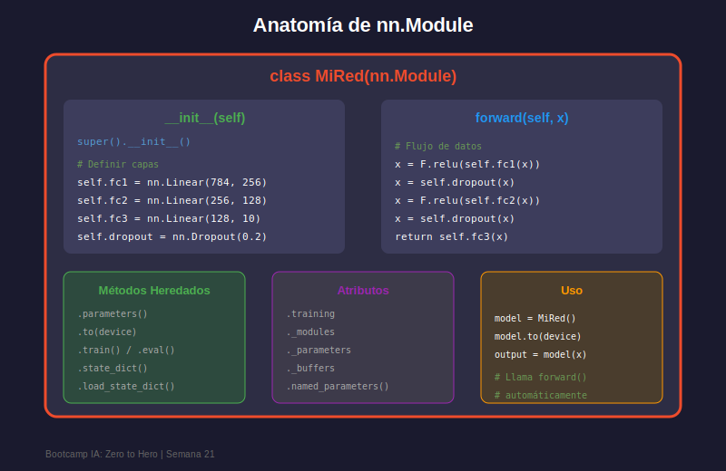
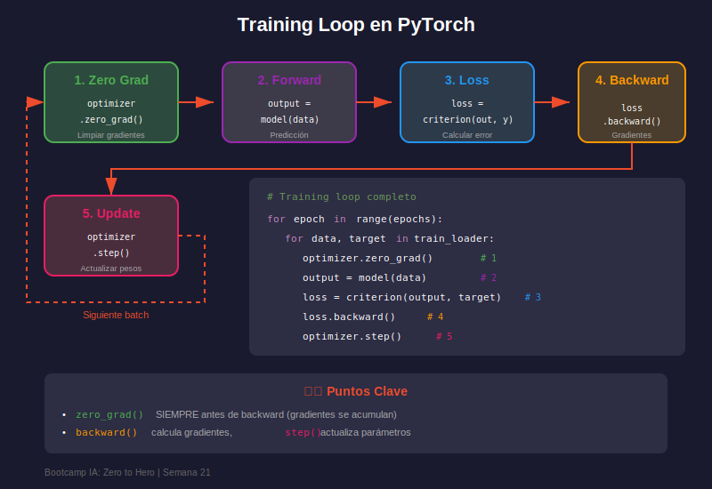

# 🧠 nn.Module y Training Loop

## 🎯 Objetivos

- Construir redes neuronales con `nn.Module`
- Entender la anatomía de un módulo PyTorch
- Implementar el training loop completo
- Aplicar patrones y mejores prácticas

---

## 1. Anatomía de nn.Module



`nn.Module` es la clase base para todas las redes neuronales en PyTorch:

```python
import torch
import torch.nn as nn

class SimpleNet(nn.Module):
    def __init__(self):
        super().__init__()  # ¡Siempre llamar al constructor padre!
        
        # Definir capas como atributos
        self.fc1 = nn.Linear(784, 128)
        self.fc2 = nn.Linear(128, 64)
        self.fc3 = nn.Linear(64, 10)
        self.relu = nn.ReLU()
    
    def forward(self, x):
        # Definir el flujo de datos
        x = self.relu(self.fc1(x))
        x = self.relu(self.fc2(x))
        x = self.fc3(x)
        return x

# Crear instancia
model = SimpleNet()
print(model)
```

### Reglas Fundamentales

1. **Heredar de `nn.Module`**
2. **Llamar `super().__init__()`** en `__init__`
3. **Definir capas como atributos** de la clase
4. **Implementar `forward()`** para definir el flujo

---

## 2. Capas Comunes (nn.*)

### Capas Densas

```python
import torch.nn as nn

# Linear (Fully Connected)
fc = nn.Linear(in_features=784, out_features=128)

# Con/sin bias
fc_no_bias = nn.Linear(784, 128, bias=False)

# Inspeccionar parámetros
print(f"Weight shape: {fc.weight.shape}")  # [128, 784]
print(f"Bias shape: {fc.bias.shape}")      # [128]
```

### Activaciones

```python
# Como módulos
relu = nn.ReLU()
sigmoid = nn.Sigmoid()
tanh = nn.Tanh()
softmax = nn.Softmax(dim=1)
leaky_relu = nn.LeakyReLU(0.01)

# Como funciones (sin estado)
import torch.nn.functional as F
x = torch.randn(32, 128)
x = F.relu(x)
x = F.softmax(x, dim=1)
```

### Regularización

```python
# Dropout
dropout = nn.Dropout(p=0.5)

# Batch Normalization
batch_norm = nn.BatchNorm1d(128)  # Para datos 1D

# Uso en modelo
class NetWithDropout(nn.Module):
    def __init__(self):
        super().__init__()
        self.fc1 = nn.Linear(784, 256)
        self.bn1 = nn.BatchNorm1d(256)
        self.dropout = nn.Dropout(0.3)
        self.fc2 = nn.Linear(256, 10)
    
    def forward(self, x):
        x = F.relu(self.bn1(self.fc1(x)))
        x = self.dropout(x)  # Solo activo en training
        return self.fc2(x)
```

---

## 3. Funciones de Pérdida

```python
import torch.nn as nn

# Para clasificación
criterion_ce = nn.CrossEntropyLoss()      # Multiclase (incluye softmax)
criterion_bce = nn.BCELoss()              # Binaria (requiere sigmoid)
criterion_bce_logits = nn.BCEWithLogitsLoss()  # Binaria (incluye sigmoid)

# Para regresión
criterion_mse = nn.MSELoss()              # Error cuadrático medio
criterion_l1 = nn.L1Loss()                # Error absoluto medio
criterion_smooth = nn.SmoothL1Loss()      # Huber loss

# Ejemplo de uso
predictions = model(inputs)               # [batch, num_classes]
targets = torch.tensor([0, 1, 2])         # [batch]
loss = criterion_ce(predictions, targets)
```

---

## 4. Optimizadores

```python
import torch.optim as optim

# SGD (Stochastic Gradient Descent)
optimizer = optim.SGD(model.parameters(), lr=0.01)

# SGD con momentum
optimizer = optim.SGD(model.parameters(), lr=0.01, momentum=0.9)

# Adam (más usado)
optimizer = optim.Adam(model.parameters(), lr=0.001)

# Adam con weight decay (L2 regularization)
optimizer = optim.AdamW(model.parameters(), lr=0.001, weight_decay=0.01)

# RMSprop
optimizer = optim.RMSprop(model.parameters(), lr=0.01)
```

### Grupos de Parámetros

```python
# Diferentes learning rates para diferentes capas
optimizer = optim.Adam([
    {'params': model.encoder.parameters(), 'lr': 0.0001},
    {'params': model.decoder.parameters(), 'lr': 0.001}
])
```

---

## 5. Training Loop Completo



```python
import torch
import torch.nn as nn
import torch.optim as optim
from torch.utils.data import DataLoader

def train_one_epoch(model, dataloader, criterion, optimizer, device):
    """Entrena el modelo por una época."""
    model.train()  # Modo entrenamiento
    running_loss = 0.0
    correct = 0
    total = 0
    
    for batch_idx, (data, target) in enumerate(dataloader):
        # Mover datos al dispositivo
        data, target = data.to(device), target.to(device)
        
        # 1. Limpiar gradientes
        optimizer.zero_grad()
        
        # 2. Forward pass
        output = model(data)
        
        # 3. Calcular pérdida
        loss = criterion(output, target)
        
        # 4. Backward pass
        loss.backward()
        
        # 5. Actualizar parámetros
        optimizer.step()
        
        # Estadísticas
        running_loss += loss.item()
        _, predicted = output.max(1)
        total += target.size(0)
        correct += predicted.eq(target).sum().item()
    
    epoch_loss = running_loss / len(dataloader)
    accuracy = 100. * correct / total
    return epoch_loss, accuracy


def evaluate(model, dataloader, criterion, device):
    """Evalúa el modelo en un dataset."""
    model.eval()  # Modo evaluación
    running_loss = 0.0
    correct = 0
    total = 0
    
    with torch.no_grad():  # Sin calcular gradientes
        for data, target in dataloader:
            data, target = data.to(device), target.to(device)
            output = model(data)
            loss = criterion(output, target)
            
            running_loss += loss.item()
            _, predicted = output.max(1)
            total += target.size(0)
            correct += predicted.eq(target).sum().item()
    
    epoch_loss = running_loss / len(dataloader)
    accuracy = 100. * correct / total
    return epoch_loss, accuracy


# Loop principal
def train(model, train_loader, val_loader, epochs, device):
    criterion = nn.CrossEntropyLoss()
    optimizer = optim.Adam(model.parameters(), lr=0.001)
    
    history = {'train_loss': [], 'train_acc': [], 'val_loss': [], 'val_acc': []}
    
    for epoch in range(epochs):
        train_loss, train_acc = train_one_epoch(
            model, train_loader, criterion, optimizer, device
        )
        val_loss, val_acc = evaluate(
            model, val_loader, criterion, device
        )
        
        history['train_loss'].append(train_loss)
        history['train_acc'].append(train_acc)
        history['val_loss'].append(val_loss)
        history['val_acc'].append(val_acc)
        
        print(f"Epoch {epoch+1}/{epochs}")
        print(f"  Train Loss: {train_loss:.4f}, Train Acc: {train_acc:.2f}%")
        print(f"  Val Loss: {val_loss:.4f}, Val Acc: {val_acc:.2f}%")
    
    return history
```

---

## 6. model.train() vs model.eval()

```python
# model.train() activa:
# - Dropout (aplica dropout)
# - BatchNorm (usa estadísticas del batch actual)
model.train()
output = model(training_data)

# model.eval() activa:
# - Dropout (desactivado, no hace nada)
# - BatchNorm (usa estadísticas guardadas del entrenamiento)
model.eval()
with torch.no_grad():
    output = model(test_data)
```

---

## 7. Guardar y Cargar Modelos

### Guardar Solo Pesos (Recomendado)

```python
# Guardar
torch.save(model.state_dict(), 'model_weights.pth')

# Cargar
model = SimpleNet()  # Crear arquitectura primero
model.load_state_dict(torch.load('model_weights.pth'))
model.eval()
```

### Guardar Modelo Completo

```python
# Guardar todo (arquitectura + pesos)
torch.save(model, 'model_complete.pth')

# Cargar
model = torch.load('model_complete.pth')
model.eval()
```

### Guardar Checkpoint Completo

```python
# Guardar checkpoint para continuar entrenamiento
checkpoint = {
    'epoch': epoch,
    'model_state_dict': model.state_dict(),
    'optimizer_state_dict': optimizer.state_dict(),
    'loss': loss,
    'history': history
}
torch.save(checkpoint, 'checkpoint.pth')

# Cargar checkpoint
checkpoint = torch.load('checkpoint.pth')
model.load_state_dict(checkpoint['model_state_dict'])
optimizer.load_state_dict(checkpoint['optimizer_state_dict'])
start_epoch = checkpoint['epoch']
```

---

## 8. DataLoader y Datasets

```python
from torch.utils.data import Dataset, DataLoader
import torch

class CustomDataset(Dataset):
    def __init__(self, X, y):
        self.X = torch.tensor(X, dtype=torch.float32)
        self.y = torch.tensor(y, dtype=torch.long)
    
    def __len__(self):
        return len(self.X)
    
    def __getitem__(self, idx):
        return self.X[idx], self.y[idx]

# Crear dataset y dataloader
dataset = CustomDataset(X_train, y_train)
dataloader = DataLoader(
    dataset,
    batch_size=32,
    shuffle=True,      # Mezclar en cada época
    num_workers=4,     # Procesos paralelos para cargar datos
    pin_memory=True    # Acelera transferencia a GPU
)

# Iterar
for batch_data, batch_labels in dataloader:
    output = model(batch_data)
```

### Datasets de torchvision

```python
from torchvision import datasets, transforms

# Transformaciones
transform = transforms.Compose([
    transforms.ToTensor(),
    transforms.Normalize((0.5,), (0.5,))
])

# Datasets predefinidos
train_dataset = datasets.MNIST(
    root='./data',
    train=True,
    download=True,
    transform=transform
)

test_dataset = datasets.MNIST(
    root='./data',
    train=False,
    transform=transform
)
```

---

## 9. Ejemplo Completo: Clasificador MNIST

```python
import torch
import torch.nn as nn
import torch.optim as optim
from torch.utils.data import DataLoader
from torchvision import datasets, transforms

# Configuración
device = torch.device('cuda' if torch.cuda.is_available() else 'cpu')
batch_size = 64
epochs = 10

# Datos
transform = transforms.Compose([
    transforms.ToTensor(),
    transforms.Normalize((0.1307,), (0.3081,))
])

train_dataset = datasets.MNIST('./data', train=True, download=True, transform=transform)
test_dataset = datasets.MNIST('./data', train=False, transform=transform)

train_loader = DataLoader(train_dataset, batch_size=batch_size, shuffle=True)
test_loader = DataLoader(test_dataset, batch_size=batch_size)

# Modelo
class MNISTClassifier(nn.Module):
    def __init__(self):
        super().__init__()
        self.flatten = nn.Flatten()
        self.fc1 = nn.Linear(28*28, 256)
        self.fc2 = nn.Linear(256, 128)
        self.fc3 = nn.Linear(128, 10)
        self.dropout = nn.Dropout(0.2)
    
    def forward(self, x):
        x = self.flatten(x)
        x = torch.relu(self.fc1(x))
        x = self.dropout(x)
        x = torch.relu(self.fc2(x))
        x = self.dropout(x)
        x = self.fc3(x)
        return x

model = MNISTClassifier().to(device)
criterion = nn.CrossEntropyLoss()
optimizer = optim.Adam(model.parameters(), lr=0.001)

# Entrenamiento
for epoch in range(epochs):
    model.train()
    for data, target in train_loader:
        data, target = data.to(device), target.to(device)
        optimizer.zero_grad()
        output = model(data)
        loss = criterion(output, target)
        loss.backward()
        optimizer.step()
    
    # Evaluación
    model.eval()
    correct = 0
    with torch.no_grad():
        for data, target in test_loader:
            data, target = data.to(device), target.to(device)
            output = model(data)
            pred = output.argmax(dim=1)
            correct += pred.eq(target).sum().item()
    
    accuracy = 100. * correct / len(test_dataset)
    print(f'Epoch {epoch+1}: Test Accuracy = {accuracy:.2f}%')

# Guardar modelo
torch.save(model.state_dict(), 'mnist_classifier.pth')
```

---

## 📝 Resumen

| Componente       | Descripción                                    |
| ---------------- | ---------------------------------------------- |
| `nn.Module`      | Clase base para redes neuronales               |
| `forward()`      | Define el flujo de datos                       |
| `model.train()`  | Activa dropout y BN en modo entrenamiento      |
| `model.eval()`   | Desactiva dropout, BN usa stats guardadas      |
| `state_dict()`   | Diccionario con parámetros del modelo          |
| `DataLoader`     | Itera datos en batches                         |

---

## 🔗 Recursos

- [nn.Module Tutorial](https://pytorch.org/tutorials/beginner/nn_tutorial.html)
- [Save and Load Models](https://pytorch.org/tutorials/beginner/saving_loading_models.html)
- [Data Loading Tutorial](https://pytorch.org/tutorials/beginner/data_loading_tutorial.html)

---

_Completaste la teoría de la Semana 21. ¡Ahora a practicar!_
