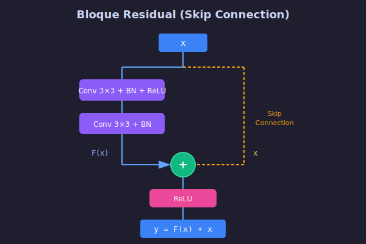
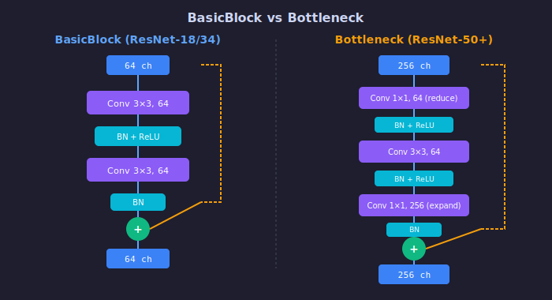

# 🔗 ResNet y Conexiones Residuales

## 🎯 Objetivos

- Comprender la arquitectura ResNet en detalle
- Implementar bloques BasicBlock y Bottleneck
- Entender las variantes de ResNet (18, 34, 50, 101, 152)

---

## 1. La Idea Fundamental

### Aprendizaje Residual

En lugar de aprender la transformación directa $H(x)$, la red aprende el **residuo**:

$$F(x) = H(x) - x$$

Y la salida se calcula como:

$$y = F(x) + x$$

### ¿Por Qué "Residual"?

$F(x)$ representa lo que **falta agregar** a la entrada para obtener la salida deseada.

```
Si la transformación óptima es identidad:
  H(x) = x
  F(x) = H(x) - x = 0  ← ¡Fácil de aprender!
```

---

## 2. BasicBlock (ResNet-18/34)



### Arquitectura

```
         x
         │
    ┌────┴────┐
    │         │
    ▼         │
┌───────┐     │
│Conv 3×3│     │
│  BN    │     │
│ ReLU   │     │
├───────┤     │
│Conv 3×3│     │
│  BN    │     │
└───────┘     │
    │         │
    ▼         │
   (+)◄───────┘  Skip Connection
    │
   ReLU
    │
    ▼
   out
```

### Implementación PyTorch

```python
import torch.nn as nn

class BasicBlock(nn.Module):
    """Bloque residual básico para ResNet-18/34."""
    
    expansion = 1  # No cambia canales
    
    def __init__(self, in_channels, out_channels, stride=1, downsample=None):
        super().__init__()
        
        # Primera convolución
        self.conv1 = nn.Conv2d(
            in_channels, out_channels,
            kernel_size=3, stride=stride, padding=1, bias=False
        )
        self.bn1 = nn.BatchNorm2d(out_channels)
        
        # Segunda convolución
        self.conv2 = nn.Conv2d(
            out_channels, out_channels,
            kernel_size=3, stride=1, padding=1, bias=False
        )
        self.bn2 = nn.BatchNorm2d(out_channels)
        
        self.relu = nn.ReLU(inplace=True)
        self.downsample = downsample
    
    def forward(self, x):
        identity = x
        
        # Rama principal
        out = self.conv1(x)
        out = self.bn1(out)
        out = self.relu(out)
        
        out = self.conv2(out)
        out = self.bn2(out)
        
        # Skip connection
        if self.downsample is not None:
            identity = self.downsample(x)
        
        out += identity  # ¡La magia!
        out = self.relu(out)
        
        return out
```

---

## 3. Bottleneck (ResNet-50/101/152)



### ¿Por Qué Bottleneck?

Para redes muy profundas, BasicBlock es costoso. Bottleneck reduce cómputo:

```
BasicBlock: 3×3×64×64 + 3×3×64×64 = 73,728 params

Bottleneck: 1×1×256×64 + 3×3×64×64 + 1×1×64×256 = 69,632 params
            (reduce)    (procesa)    (expande)
            
¡Menos parámetros con más profundidad!
```

### Arquitectura

```
           x (256 ch)
           │
      ┌────┴────┐
      │         │
      ▼         │
  ┌───────┐     │
  │Conv 1×1│     │  ← Reduce: 256 → 64
  │  BN    │     │
  │ ReLU   │     │
  ├───────┤     │
  │Conv 3×3│     │  ← Procesa: 64 → 64
  │  BN    │     │
  │ ReLU   │     │
  ├───────┤     │
  │Conv 1×1│     │  ← Expande: 64 → 256
  │  BN    │     │
  └───────┘     │
      │         │
      ▼         │
     (+)◄───────┘
      │
    ReLU
      │
      ▼
     out (256 ch)
```

### Implementación PyTorch

```python
class Bottleneck(nn.Module):
    """Bloque bottleneck para ResNet-50/101/152."""
    
    expansion = 4  # Salida = 4× canales internos
    
    def __init__(self, in_channels, out_channels, stride=1, downsample=None):
        super().__init__()
        
        # 1×1 reduce
        self.conv1 = nn.Conv2d(
            in_channels, out_channels,
            kernel_size=1, bias=False
        )
        self.bn1 = nn.BatchNorm2d(out_channels)
        
        # 3×3 procesa
        self.conv2 = nn.Conv2d(
            out_channels, out_channels,
            kernel_size=3, stride=stride, padding=1, bias=False
        )
        self.bn2 = nn.BatchNorm2d(out_channels)
        
        # 1×1 expande
        self.conv3 = nn.Conv2d(
            out_channels, out_channels * self.expansion,
            kernel_size=1, bias=False
        )
        self.bn3 = nn.BatchNorm2d(out_channels * self.expansion)
        
        self.relu = nn.ReLU(inplace=True)
        self.downsample = downsample
    
    def forward(self, x):
        identity = x
        
        out = self.relu(self.bn1(self.conv1(x)))
        out = self.relu(self.bn2(self.conv2(out)))
        out = self.bn3(self.conv3(out))
        
        if self.downsample is not None:
            identity = self.downsample(x)
        
        out += identity
        out = self.relu(out)
        
        return out
```

---

## 4. Downsample: Cuando las Dimensiones No Coinciden

### El Problema

Skip connection suma $x + F(x)$. Pero si cambian dimensiones:

```
x:    [batch, 64, 56, 56]
F(x): [batch, 128, 28, 28]  ← stride=2

¡No se pueden sumar!
```

### La Solución

Proyección 1×1 con stride:

```python
downsample = nn.Sequential(
    nn.Conv2d(64, 128, kernel_size=1, stride=2, bias=False),
    nn.BatchNorm2d(128)
)

# Ahora:
# x:          [batch, 64, 56, 56]
# downsample: [batch, 128, 28, 28]  ✓
# F(x):       [batch, 128, 28, 28]  ✓
```

---

## 5. Variantes de ResNet

### Configuración por Variante

| Variante | Bloque | Capas por Stage | Total Capas | Params |
|----------|--------|-----------------|-------------|--------|
| ResNet-18 | BasicBlock | [2, 2, 2, 2] | 18 | 11.7M |
| ResNet-34 | BasicBlock | [3, 4, 6, 3] | 34 | 21.8M |
| ResNet-50 | Bottleneck | [3, 4, 6, 3] | 50 | 25.6M |
| ResNet-101 | Bottleneck | [3, 4, 23, 3] | 101 | 44.5M |
| ResNet-152 | Bottleneck | [3, 8, 36, 3] | 152 | 60.2M |

### Estructura General

```
Input (224×224×3)
    │
    ▼
┌─────────────────┐
│  Conv 7×7, 64   │  ← Stem
│  MaxPool 3×3    │
└─────────────────┘
    │ (56×56×64)
    ▼
┌─────────────────┐
│   Stage 1       │  ← 64 canales
│   N bloques     │
└─────────────────┘
    │ (56×56×64)
    ▼
┌─────────────────┐
│   Stage 2       │  ← 128 canales, stride=2
│   N bloques     │
└─────────────────┘
    │ (28×28×128)
    ▼
┌─────────────────┐
│   Stage 3       │  ← 256 canales, stride=2
│   N bloques     │
└─────────────────┘
    │ (14×14×256)
    ▼
┌─────────────────┐
│   Stage 4       │  ← 512 canales, stride=2
│   N bloques     │
└─────────────────┘
    │ (7×7×512)
    ▼
┌─────────────────┐
│ Global AvgPool  │
│   FC → 1000     │
└─────────────────┘
    │
    ▼
  Output
```

---

## 6. ResNet Completa

```python
class ResNet(nn.Module):
    """Arquitectura ResNet completa."""
    
    def __init__(self, block, layers, num_classes=1000):
        super().__init__()
        self.in_channels = 64
        
        # Stem
        self.conv1 = nn.Conv2d(3, 64, kernel_size=7, stride=2, padding=3, bias=False)
        self.bn1 = nn.BatchNorm2d(64)
        self.relu = nn.ReLU(inplace=True)
        self.maxpool = nn.MaxPool2d(kernel_size=3, stride=2, padding=1)
        
        # Stages
        self.layer1 = self._make_layer(block, 64, layers[0])
        self.layer2 = self._make_layer(block, 128, layers[1], stride=2)
        self.layer3 = self._make_layer(block, 256, layers[2], stride=2)
        self.layer4 = self._make_layer(block, 512, layers[3], stride=2)
        
        # Clasificador
        self.avgpool = nn.AdaptiveAvgPool2d((1, 1))
        self.fc = nn.Linear(512 * block.expansion, num_classes)
    
    def _make_layer(self, block, out_channels, blocks, stride=1):
        downsample = None
        
        if stride != 1 or self.in_channels != out_channels * block.expansion:
            downsample = nn.Sequential(
                nn.Conv2d(self.in_channels, out_channels * block.expansion,
                         kernel_size=1, stride=stride, bias=False),
                nn.BatchNorm2d(out_channels * block.expansion)
            )
        
        layers = []
        layers.append(block(self.in_channels, out_channels, stride, downsample))
        self.in_channels = out_channels * block.expansion
        
        for _ in range(1, blocks):
            layers.append(block(self.in_channels, out_channels))
        
        return nn.Sequential(*layers)
    
    def forward(self, x):
        x = self.maxpool(self.relu(self.bn1(self.conv1(x))))
        
        x = self.layer1(x)
        x = self.layer2(x)
        x = self.layer3(x)
        x = self.layer4(x)
        
        x = self.avgpool(x)
        x = x.view(x.size(0), -1)
        x = self.fc(x)
        
        return x


# Constructores
def resnet18(num_classes=1000):
    return ResNet(BasicBlock, [2, 2, 2, 2], num_classes)

def resnet50(num_classes=1000):
    return ResNet(Bottleneck, [3, 4, 6, 3], num_classes)
```

---

## 7. Usar ResNet Preentrenada

```python
from torchvision import models

# Cargar con pesos de ImageNet
model = models.resnet50(weights='IMAGENET1K_V2')

# Ver arquitectura
print(model)

# Contar parámetros
total = sum(p.numel() for p in model.parameters())
print(f"Parámetros: {total:,}")  # ~25.6M
```

---

## ✅ Resumen

| Componente | Función |
|------------|---------|
| Skip Connection | Permite flujo de gradiente directo |
| BasicBlock | 2 convs 3×3, para ResNet-18/34 |
| Bottleneck | 1×1→3×3→1×1, para ResNet-50+ |
| Downsample | Ajusta dimensiones cuando hay stride |

---

## 🔗 Navegación

[← Problema Profundidad](01-problema-profundidad.md) | [Siguiente: Transfer Learning →](03-transfer-learning.md)
