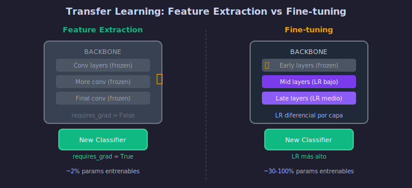

# 🔄 Transfer Learning

## 🎯 Objetivos

- Comprender qué es Transfer Learning y por qué funciona
- Conocer cuándo aplicar Transfer Learning
- Aprender a usar modelos preentrenados en PyTorch

---

## 1. ¿Qué es Transfer Learning?

### Definición

Usar conocimiento aprendido en un problema (source) para resolver otro problema (target).

```
ImageNet (1.2M imágenes, 1000 clases)
              │
              │  Transfer
              ▼
Tu Dataset (1000 imágenes, 5 clases)
```

### Analogía

Es como aprender un nuevo idioma cuando ya sabes uno:
- No empiezas de cero
- Reutilizas conceptos (gramática, estructura)
- Solo aprendes lo específico del nuevo idioma

---

## 2. ¿Por Qué Funciona?

### Jerarquía de Features


Las CNNs aprenden features en orden de complejidad:

```
Capas Iniciales        Capas Medias         Capas Finales
┌──────────────┐      ┌──────────────┐     ┌──────────────┐
│   Bordes     │      │   Texturas   │     │   Objetos    │
│   Colores    │  →   │   Patrones   │  →  │   Partes     │
│   Gradientes │      │   Formas     │     │   Clases     │
└──────────────┘      └──────────────┘     └──────────────┘
    Genéricas           Semi-genéricas       Específicas
```

### Las Primeras Capas son Universales

Detectores de bordes y texturas son útiles para **cualquier** tarea visual:
- Clasificar perros vs gatos
- Detectar tumores
- Reconocer flores
- Identificar defectos en manufactura

---

## 3. Tipos de Transfer Learning



### Feature Extraction

Usar CNN preentrenada como extractor de características fijo:

```
┌─────────────────────────────────────────┐
│          Modelo Preentrenado            │
│  ┌───────────────────────────────────┐  │
│  │        CONGELADO (no entrena)     │  │
│  │   Conv1 → Conv2 → ... → ConvN    │  │
│  └───────────────────────────────────┘  │
│                    │                    │
│                    ▼                    │
│  ┌───────────────────────────────────┐  │
│  │    NUEVO CLASIFICADOR (entrena)   │  │
│  │         FC → Softmax              │  │
│  └───────────────────────────────────┘  │
└─────────────────────────────────────────┘
```

**Código:**
```python
import torch.nn as nn
from torchvision import models

# Cargar modelo preentrenado
model = models.resnet50(weights='IMAGENET1K_V2')

# Congelar todas las capas
for param in model.parameters():
    param.requires_grad = False

# Reemplazar clasificador
num_features = model.fc.in_features
model.fc = nn.Linear(num_features, num_classes)  # Solo esto entrena
```

### Fine-tuning

Ajustar (fine-tune) parte o todo el modelo preentrenado:

```
┌─────────────────────────────────────────┐
│          Modelo Preentrenado            │
│  ┌───────────────────────────────────┐  │
│  │   Capas iniciales (congeladas)    │  │
│  │        Conv1 → Conv2              │  │
│  └───────────────────────────────────┘  │
│                    │                    │
│  ┌───────────────────────────────────┐  │
│  │   Capas finales (fine-tune)       │  │
│  │     Conv3 → Conv4 → Conv5         │  │
│  └───────────────────────────────────┘  │
│                    │                    │
│  ┌───────────────────────────────────┐  │
│  │    NUEVO CLASIFICADOR (entrena)   │  │
│  │         FC → Softmax              │  │
│  └───────────────────────────────────┘  │
└─────────────────────────────────────────┘
```

---

## 4. ¿Cuándo Usar Cada Estrategia?

### Matriz de Decisión

```
                    Dataset Pequeño          Dataset Grande
                    (< 1K samples)           (> 10K samples)
                 ┌───────────────────┬───────────────────────┐
Similar al       │ Feature Extraction│ Fine-tune todo       │
source (ImageNet)│ (congelar todo)   │ (LR bajo)            │
                 ├───────────────────┼───────────────────────┤
Diferente al     │ Feature Extraction│ Fine-tune capas      │
source           │ (capas medias)    │ superiores           │
                 └───────────────────┴───────────────────────┘
```

### Ejemplos Prácticos

| Escenario | Estrategia | Razón |
|-----------|------------|-------|
| 500 fotos de flores | Feature extraction | Poco dato, similar a ImageNet |
| 50K rayos X | Fine-tune todo | Mucho dato, diferente dominio |
| 2K productos defectuosos | Fine-tune últimas capas | Poco dato, diferente dominio |

---

## 5. Modelos Preentrenados Disponibles

### En torchvision

```python
from torchvision import models

# Clasificación ImageNet
resnet18 = models.resnet18(weights='IMAGENET1K_V1')
resnet50 = models.resnet50(weights='IMAGENET1K_V2')
efficientnet = models.efficientnet_b0(weights='IMAGENET1K_V1')
vgg16 = models.vgg16(weights='IMAGENET1K_V1')
mobilenet = models.mobilenet_v3_small(weights='IMAGENET1K_V1')

# Ver todos los pesos disponibles
print(models.ResNet50_Weights.DEFAULT)
```

### En timm (PyTorch Image Models)

```python
import timm

# Listar modelos disponibles
print(timm.list_models(pretrained=True)[:10])

# Cargar modelo
model = timm.create_model('efficientnet_b0', pretrained=True, num_classes=10)
```

### Comparativa de Modelos

| Modelo | Params | Top-1 Acc | Velocidad |
|--------|--------|-----------|-----------|
| ResNet-18 | 11.7M | 69.8% | Rápido |
| ResNet-50 | 25.6M | 80.9% | Medio |
| EfficientNet-B0 | 5.3M | 77.7% | Rápido |
| EfficientNet-B4 | 19.3M | 83.4% | Lento |
| ViT-B/16 | 86.6M | 84.5% | Lento |

---

## 6. Implementación Completa

### Feature Extraction

```python
import torch
import torch.nn as nn
from torchvision import models, transforms
from torch.utils.data import DataLoader

# 1. Cargar modelo preentrenado
model = models.resnet50(weights='IMAGENET1K_V2')

# 2. Congelar backbone
for param in model.parameters():
    param.requires_grad = False

# 3. Reemplazar clasificador
num_features = model.fc.in_features  # 2048 para ResNet-50
model.fc = nn.Sequential(
    nn.Linear(num_features, 256),
    nn.ReLU(),
    nn.Dropout(0.5),
    nn.Linear(256, num_classes)
)

# 4. Verificar parámetros entrenables
trainable = sum(p.numel() for p in model.parameters() if p.requires_grad)
total = sum(p.numel() for p in model.parameters())
print(f"Entrenables: {trainable:,} / {total:,} ({100*trainable/total:.1f}%)")

# 5. Transforms (IMPORTANTE: usar mismas que ImageNet)
transform = transforms.Compose([
    transforms.Resize(256),
    transforms.CenterCrop(224),
    transforms.ToTensor(),
    transforms.Normalize(
        mean=[0.485, 0.456, 0.406],
        std=[0.229, 0.224, 0.225]
    )
])

# 6. Entrenar solo el clasificador
optimizer = torch.optim.Adam(model.fc.parameters(), lr=0.001)
```

---

## 7. Errores Comunes

### ❌ No Normalizar Correctamente

```python
# MAL: usar cualquier normalización
transforms.Normalize(mean=[0.5], std=[0.5])

# BIEN: usar estadísticas de ImageNet
transforms.Normalize(
    mean=[0.485, 0.456, 0.406],
    std=[0.229, 0.224, 0.225]
)
```

### ❌ Learning Rate Muy Alto

```python
# MAL: LR alto destruye features aprendidos
optimizer = torch.optim.Adam(model.parameters(), lr=0.01)

# BIEN: LR bajo para preservar conocimiento
optimizer = torch.optim.Adam(model.parameters(), lr=0.0001)
```

### ❌ No Verificar Parámetros Congelados

```python
# SIEMPRE verificar
for name, param in model.named_parameters():
    print(f"{name}: requires_grad={param.requires_grad}")
```

---

## ✅ Resumen

| Concepto | Descripción |
|----------|-------------|
| Transfer Learning | Reutilizar conocimiento de un modelo preentrenado |
| Feature Extraction | Congelar backbone, entrenar solo clasificador |
| Fine-tuning | Entrenar parte o todo el modelo con LR bajo |
| Normalización | Usar SIEMPRE estadísticas de ImageNet |

---

## 🔗 Navegación

[← ResNet](02-resnet-conexiones-residuales.md) | [Siguiente: Fine-tuning →](04-fine-tuning-estrategias.md)
