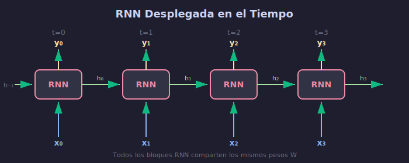

# 🔄 Introducción a Redes Neuronales Recurrentes

## 🎯 Objetivos

- Comprender qué son las RNNs y para qué sirven
- Entender el concepto de estado oculto
- Visualizar el despliegue temporal de una RNN
- Implementar una RNN básica desde cero

---

## 1. ¿Qué son las RNNs?



Las **Redes Neuronales Recurrentes** son arquitecturas diseñadas para procesar **datos secuenciales**, donde el orden importa.

### Diferencia con Redes Feedforward

| Feedforward | Recurrente |
|-------------|------------|
| Entrada → Salida (una vez) | Entrada → Estado → Salida (múltiples pasos) |
| Sin memoria | Con memoria (estado oculto) |
| Entradas independientes | Entradas relacionadas temporalmente |

### Aplicaciones

- **NLP**: Traducción, generación de texto, análisis de sentimiento
- **Series temporales**: Predicción de precios, clima, demanda
- **Audio**: Reconocimiento de voz, generación de música
- **Video**: Análisis de secuencias de frames

---

## 2. Arquitectura Básica

### Diagrama Conceptual

```
        ┌─────────┐
x_t ───►│   RNN   │───► h_t ───► y_t
        │  Cell   │
        └────▲────┘
             │
            h_{t-1}
```

### La Fórmula Fundamental

$$h_t = \tanh(W_{hh} \cdot h_{t-1} + W_{xh} \cdot x_t + b_h)$$

$$y_t = W_{hy} \cdot h_t + b_y$$

Donde:
- $x_t$: Entrada en tiempo $t$
- $h_t$: Estado oculto en tiempo $t$
- $y_t$: Salida en tiempo $t$
- $W_{xh}$: Pesos entrada → oculto
- $W_{hh}$: Pesos oculto → oculto (recurrencia)
- $W_{hy}$: Pesos oculto → salida

---

## 3. Despliegue Temporal (Unrolling)

Una RNN puede visualizarse "desplegada" en el tiempo:

```
x_0         x_1         x_2         x_3
 │           │           │           │
 ▼           ▼           ▼           ▼
┌───┐       ┌───┐       ┌───┐       ┌───┐
│RNN│──h_0─►│RNN│──h_1─►│RNN│──h_2─►│RNN│──h_3─►
└───┘       └───┘       └───┘       └───┘
 │           │           │           │
 ▼           ▼           ▼           ▼
y_0         y_1         y_2         y_3
```

**Importante**: Todos los bloques RNN comparten los **mismos pesos**.

---

## 4. Tipos de Arquitecturas RNN

### One-to-Many
```
x ──► [RNN] ──► y_1, y_2, y_3, ...
```
Ejemplo: Generación de texto a partir de un tema

### Many-to-One
```
x_1, x_2, x_3 ──► [RNN] ──► y
```
Ejemplo: Clasificación de sentimiento

### Many-to-Many (igual longitud)
```
x_1, x_2, x_3 ──► [RNN] ──► y_1, y_2, y_3
```
Ejemplo: Etiquetado POS (Part-of-Speech)

### Many-to-Many (diferente longitud)
```
x_1, x_2 ──► [Encoder] ──► [Decoder] ──► y_1, y_2, y_3
```
Ejemplo: Traducción automática

---

## 5. Implementación desde Cero

### RNNCell Básica

```python
import torch
import torch.nn as nn

class SimpleRNNCell(nn.Module):
    """Celda RNN básica."""
    
    def __init__(self, input_size, hidden_size):
        super().__init__()
        self.hidden_size = hidden_size
        
        # Pesos combinados para eficiencia
        self.W_xh = nn.Linear(input_size, hidden_size)
        self.W_hh = nn.Linear(hidden_size, hidden_size, bias=False)
        self.tanh = nn.Tanh()
    
    def forward(self, x, h_prev):
        """
        Args:
            x: Entrada actual (batch, input_size)
            h_prev: Estado oculto anterior (batch, hidden_size)
        
        Returns:
            h_new: Nuevo estado oculto (batch, hidden_size)
        """
        h_new = self.tanh(self.W_xh(x) + self.W_hh(h_prev))
        return h_new
```

### RNN Completa

```python
class SimpleRNN(nn.Module):
    """RNN que procesa secuencias completas."""
    
    def __init__(self, input_size, hidden_size, output_size):
        super().__init__()
        self.hidden_size = hidden_size
        self.rnn_cell = SimpleRNNCell(input_size, hidden_size)
        self.fc = nn.Linear(hidden_size, output_size)
    
    def forward(self, x, h_0=None):
        """
        Args:
            x: Secuencia (batch, seq_len, input_size)
            h_0: Estado inicial (batch, hidden_size)
        
        Returns:
            outputs: Salidas (batch, seq_len, output_size)
            h_n: Estado final (batch, hidden_size)
        """
        batch_size, seq_len, _ = x.shape
        
        # Inicializar estado oculto
        if h_0 is None:
            h_0 = torch.zeros(batch_size, self.hidden_size, device=x.device)
        
        h = h_0
        outputs = []
        
        # Procesar secuencia paso a paso
        for t in range(seq_len):
            h = self.rnn_cell(x[:, t, :], h)
            output = self.fc(h)
            outputs.append(output)
        
        outputs = torch.stack(outputs, dim=1)
        return outputs, h
```

---

## 6. Backpropagation Through Time (BPTT)

El entrenamiento de RNNs usa **BPTT**, que es backpropagation aplicado a la red desplegada:

```
     Loss_0    Loss_1    Loss_2    Loss_3
        │         │         │         │
        ▼         ▼         ▼         ▼
x_0 ──►[RNN]──►[RNN]──►[RNN]──►[RNN]
        │         │         │         │
        └─────────┴─────────┴─────────┘
                      │
                      ▼
                Actualizar W
```

### Problema del Gradiente

Los gradientes se multiplican en cada paso temporal:

$$\frac{\partial L}{\partial W} = \sum_{t=1}^{T} \frac{\partial L_t}{\partial W} = \sum_{t=1}^{T} \frac{\partial L_t}{\partial h_t} \cdot \prod_{k=1}^{t} \frac{\partial h_k}{\partial h_{k-1}} \cdot \frac{\partial h_1}{\partial W}$$

Este producto puede:
- **Explotar** si los valores son > 1
- **Desvanecerse** si los valores son < 1

---

## 7. Ejemplo Práctico: Secuencia de Caracteres

```python
# Predicción del siguiente carácter
text = "hello world"
chars = sorted(set(text))
char_to_idx = {c: i for i, c in enumerate(chars)}

# Preparar datos
X = []  # Secuencias de entrada
y = []  # Siguiente carácter

for i in range(len(text) - 1):
    X.append(char_to_idx[text[i]])
    y.append(char_to_idx[text[i + 1]])

# Entrenar RNN para predecir siguiente carácter
model = SimpleRNN(
    input_size=len(chars),
    hidden_size=32,
    output_size=len(chars)
)
```

---

## ✅ Checklist de Comprensión

- [ ] Entiendo qué es un estado oculto y su rol
- [ ] Puedo visualizar una RNN desplegada
- [ ] Comprendo las diferentes arquitecturas (one-to-many, etc.)
- [ ] Sé implementar una RNNCell básica
- [ ] Entiendo el concepto de BPTT

---

## 📚 Recursos Adicionales

- [Understanding LSTM Networks](https://colah.github.io/posts/2015-08-Understanding-LSTMs/)
- [The Unreasonable Effectiveness of RNNs](https://karpathy.github.io/2015/05/21/rnn-effectiveness/)
