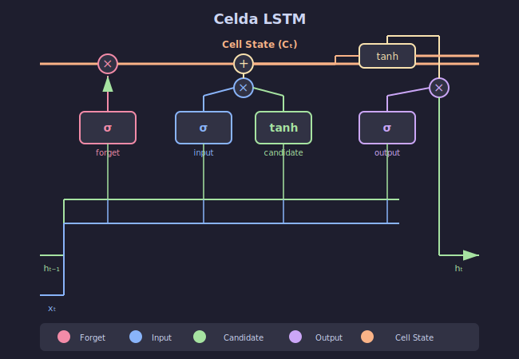

# 🧠 LSTM: Memoria a Largo Plazo

## 🎯 Objetivos

- Comprender la arquitectura LSTM
- Entender cada una de las 4 puertas
- Implementar una celda LSTM desde cero
- Visualizar el flujo de información

---

## 1. ¿Qué es LSTM?



**Long Short-Term Memory** (LSTM) fue propuesta por Hochreiter & Schmidhuber en 1997 para resolver el problema del vanishing gradient.

### Idea Clave

Añadir un **cell state** ($C_t$) que actúa como una "cinta transportadora" de información:

```
Cell State (memoria a largo plazo)
═══════════════════════════════════════►
        │           │           │
        ▼           ▼           ▼
    [Forget]    [Update]    [Output]
        │           │           │
        ▼           ▼           ▼
Hidden State (memoria a corto plazo)
───────────────────────────────────────►
```

---

## 2. Arquitectura: Las 4 Puertas

### Visión General

```
                    ┌─────────────────────────────────────┐
                    │           Cell State C_t            │
                    │  ═══════════════════════════════►   │
                    │      │         │         │          │
                    │      ×         +         │          │
                    │      │    ┌────┴────┐    │          │
                    │      │    │         │    │          │
                    │   ┌──┴──┐ │  ┌───┐  │ ┌──┴──┐       │
                    │   │  f  │ │  │ C̃ │  │ │  o  │       │
                    │   │gate │ │  └───┘  │ │gate │       │
                    │   └──┬──┘ │    │    │ └──┬──┘       │
                    │      │    │ ┌──┴──┐ │    │          │
                    │      │    │ │  i  │ │    │          │
                    │      │    │ │gate │ │    │          │
                    │      │    │ └──┬──┘ │    │          │
                    │      │    │    │    │    │          │
 h_{t-1} ──────────►│──────┴────┴────┴────┴────┴──────────│───► h_t
 x_t     ──────────►│                                     │
                    └─────────────────────────────────────┘
```

---

## 3. Las Puertas en Detalle

### 3.1 Forget Gate (Puerta de Olvido)

**Decide qué información descartar del cell state.**

$$f_t = \sigma(W_f \cdot [h_{t-1}, x_t] + b_f)$$

```python
# f_t ∈ [0, 1] para cada elemento del cell state
# 0 = olvidar completamente
# 1 = recordar completamente
```

**Ejemplo**: En traducción, al terminar una oración, olvidar el género del sujeto anterior.

### 3.2 Input Gate (Puerta de Entrada)

**Decide qué nueva información almacenar.**

$$i_t = \sigma(W_i \cdot [h_{t-1}, x_t] + b_i)$$
$$\tilde{C}_t = \tanh(W_C \cdot [h_{t-1}, x_t] + b_C)$$

```python
# i_t: qué valores actualizar
# C̃_t: nuevos valores candidatos
```

**Ejemplo**: Al encontrar un nuevo sujeto, actualizar el género almacenado.

### 3.3 Cell State Update

**Actualiza el cell state combinando olvido y entrada.**

$$C_t = f_t \odot C_{t-1} + i_t \odot \tilde{C}_t$$

```python
# Elemento a elemento:
# C_new = (forget * C_old) + (input * candidates)
```

### 3.4 Output Gate (Puerta de Salida)

**Decide qué parte del cell state mostrar como salida.**

$$o_t = \sigma(W_o \cdot [h_{t-1}, x_t] + b_o)$$
$$h_t = o_t \odot \tanh(C_t)$$

```python
# Filtra el cell state para producir el hidden state
```

---

## 4. Implementación desde Cero

```python
import torch
import torch.nn as nn

class LSTMCell(nn.Module):
    """Celda LSTM implementada desde cero."""
    
    def __init__(self, input_size, hidden_size):
        super().__init__()
        self.hidden_size = hidden_size
        
        # Pesos combinados para las 4 puertas (eficiencia)
        # [i, f, g, o] donde g es el candidato C̃
        self.W_ih = nn.Linear(input_size, 4 * hidden_size)
        self.W_hh = nn.Linear(hidden_size, 4 * hidden_size, bias=False)
    
    def forward(self, x, state):
        """
        Args:
            x: Entrada (batch, input_size)
            state: Tupla (h_prev, c_prev)
        
        Returns:
            h_new, c_new
        """
        h_prev, c_prev = state
        
        # Calcular todas las puertas de una vez
        gates = self.W_ih(x) + self.W_hh(h_prev)
        
        # Separar las 4 puertas
        i, f, g, o = gates.chunk(4, dim=1)
        
        # Aplicar activaciones
        i = torch.sigmoid(i)  # Input gate
        f = torch.sigmoid(f)  # Forget gate
        g = torch.tanh(g)     # Candidate
        o = torch.sigmoid(o)  # Output gate
        
        # Actualizar cell state
        c_new = f * c_prev + i * g
        
        # Calcular hidden state
        h_new = o * torch.tanh(c_new)
        
        return h_new, c_new


class LSTM(nn.Module):
    """LSTM completa para secuencias."""
    
    def __init__(self, input_size, hidden_size, num_layers=1):
        super().__init__()
        self.hidden_size = hidden_size
        self.num_layers = num_layers
        
        self.cells = nn.ModuleList([
            LSTMCell(
                input_size if i == 0 else hidden_size,
                hidden_size
            )
            for i in range(num_layers)
        ])
    
    def forward(self, x, state=None):
        """
        Args:
            x: Secuencia (batch, seq_len, input_size)
            state: Tupla (h_0, c_0) cada uno (num_layers, batch, hidden)
        
        Returns:
            outputs: (batch, seq_len, hidden_size)
            (h_n, c_n): Estados finales
        """
        batch_size, seq_len, _ = x.shape
        
        # Inicializar estados
        if state is None:
            h = [torch.zeros(batch_size, self.hidden_size, device=x.device)
                 for _ in range(self.num_layers)]
            c = [torch.zeros(batch_size, self.hidden_size, device=x.device)
                 for _ in range(self.num_layers)]
        else:
            h = list(state[0])
            c = list(state[1])
        
        outputs = []
        
        for t in range(seq_len):
            inp = x[:, t, :]
            
            for layer, cell in enumerate(self.cells):
                h[layer], c[layer] = cell(inp, (h[layer], c[layer]))
                inp = h[layer]  # Input para siguiente capa
            
            outputs.append(h[-1])  # Output de última capa
        
        outputs = torch.stack(outputs, dim=1)
        h_n = torch.stack(h)
        c_n = torch.stack(c)
        
        return outputs, (h_n, c_n)
```

---

## 5. ¿Por Qué Funciona?

### Camino Directo para Gradientes

```
C_{t-1} ────────× f_t ────────► C_t
                                 │
                                 │ Gradiente fluye directamente
                                 ▼
                           ∂L/∂C_{t-1} = f_t · ∂L/∂C_t
```

Si $f_t \approx 1$, el gradiente pasa **sin atenuación**.

### Comparación con RNN Vanilla

| Aspecto | RNN | LSTM |
|---------|-----|------|
| Camino de gradiente | Multiplicativo (tanh) | Aditivo (cell state) |
| Memoria | ~10-20 pasos | ~100+ pasos |
| Puertas | 0 | 4 (i, f, o, g) |
| Parámetros | $3n^2$ | $12n^2$ |

---

## 6. Usando LSTM de PyTorch

```python
# PyTorch proporciona LSTM optimizada
lstm = nn.LSTM(
    input_size=10,
    hidden_size=64,
    num_layers=2,
    batch_first=True,
    dropout=0.2,
    bidirectional=False
)

# Forward pass
x = torch.randn(32, 50, 10)  # (batch, seq, features)
outputs, (h_n, c_n) = lstm(x)

print(f'Outputs: {outputs.shape}')  # (32, 50, 64)
print(f'h_n: {h_n.shape}')          # (2, 32, 64)
print(f'c_n: {c_n.shape}')          # (2, 32, 64)
```

---

## 7. Variantes de LSTM

### Peephole Connections

Las puertas pueden "mirar" el cell state:

$$f_t = \sigma(W_f \cdot [h_{t-1}, x_t] + W_{cf} \cdot C_{t-1})$$

### Coupled Forget-Input

Simplificación donde $i_t = 1 - f_t$:

$$C_t = f_t \odot C_{t-1} + (1 - f_t) \odot \tilde{C}_t$$

---

## ✅ Checklist de Comprensión

- [ ] Entiendo el rol del cell state
- [ ] Puedo explicar cada una de las 4 puertas
- [ ] Sé por qué LSTM resuelve vanishing gradient
- [ ] Puedo implementar una LSTMCell
- [ ] Conozco cómo usar nn.LSTM de PyTorch

---

## 📚 Siguiente Paso

En el siguiente archivo veremos **GRU**, una simplificación de LSTM con solo 2 puertas.
