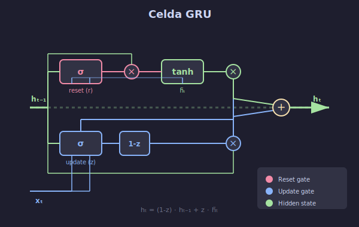

# ⚡ GRU: Simplificación Efectiva

## 🎯 Objetivos

- Comprender la arquitectura GRU
- Comparar GRU con LSTM
- Implementar una celda GRU
- Conocer cuándo usar cada arquitectura

---

## 1. ¿Qué es GRU?



**Gated Recurrent Unit** (GRU) fue propuesta por Cho et al. en 2014 como una simplificación de LSTM.

### Diferencias Clave con LSTM

| LSTM | GRU |
|------|-----|
| 4 puertas (i, f, o, g) | 2 puertas (r, z) |
| Cell state + Hidden state | Solo Hidden state |
| Más parámetros | Menos parámetros |
| Más expresiva | Más eficiente |

---

## 2. Arquitectura: Las 2 Puertas

### Visión General

```
         z_t (update)           r_t (reset)
            │                      │
            ▼                      ▼
h_{t-1} ──►[×]──────────────►[×]──►[tanh]──►[×]──► h_t
            │                              ▲  │
            │                              │  │
            └──────────────►[1-z]──────────┘  │
                                              │
x_t ──────────────────────────────────────────┘
```

### Fórmulas

**Reset Gate** (qué olvidar del pasado):
$$r_t = \sigma(W_r \cdot [h_{t-1}, x_t])$$

**Update Gate** (balance pasado/presente):
$$z_t = \sigma(W_z \cdot [h_{t-1}, x_t])$$

**Candidato**:
$$\tilde{h}_t = \tanh(W \cdot [r_t \odot h_{t-1}, x_t])$$

**Nuevo estado**:
$$h_t = (1 - z_t) \odot h_{t-1} + z_t \odot \tilde{h}_t$$

---

## 3. Las Puertas en Detalle

### 3.1 Reset Gate ($r_t$)

**Decide cuánto del estado anterior usar para calcular el candidato.**

```python
# r_t ≈ 0: Ignorar el pasado, como empezar de nuevo
# r_t ≈ 1: Usar todo el estado anterior
```

**Intuición**: Permite "resetear" la memoria cuando la información anterior ya no es relevante.

### 3.2 Update Gate ($z_t$)

**Controla el balance entre mantener el estado anterior y actualizarlo.**

```python
# z_t ≈ 0: Mantener el estado anterior (h_t ≈ h_{t-1})
# z_t ≈ 1: Usar el nuevo candidato (h_t ≈ h̃_t)
```

**Intuición**: Combina las funciones de forget e input gate de LSTM en una sola puerta.

---

## 4. Comparación Visual: LSTM vs GRU

### LSTM
```
C_{t-1} ════════[×f]════════[+]════════► C_t
                             ▲
                             │
                          [×i]
                             │
h_{t-1} ────┬───────────────[g̃]
            │                │
            └────────────────┴─────[×o]────► h_t
```

### GRU
```
h_{t-1} ────┬────[×(1-z)]────────[+]────► h_t
            │                     ▲
            │                     │
            └────[×r]────[h̃]───[×z]
```

**GRU fusiona el cell state y hidden state en uno solo.**

---

## 5. Implementación desde Cero

```python
import torch
import torch.nn as nn

class GRUCell(nn.Module):
    """Celda GRU implementada desde cero."""
    
    def __init__(self, input_size, hidden_size):
        super().__init__()
        self.hidden_size = hidden_size
        
        # Pesos para reset y update gates
        self.W_ir = nn.Linear(input_size, hidden_size)
        self.W_hr = nn.Linear(hidden_size, hidden_size, bias=False)
        
        self.W_iz = nn.Linear(input_size, hidden_size)
        self.W_hz = nn.Linear(hidden_size, hidden_size, bias=False)
        
        # Pesos para candidato
        self.W_in = nn.Linear(input_size, hidden_size)
        self.W_hn = nn.Linear(hidden_size, hidden_size, bias=False)
    
    def forward(self, x, h_prev):
        """
        Args:
            x: Entrada (batch, input_size)
            h_prev: Estado anterior (batch, hidden_size)
        
        Returns:
            h_new: Nuevo estado (batch, hidden_size)
        """
        # Reset gate
        r = torch.sigmoid(self.W_ir(x) + self.W_hr(h_prev))
        
        # Update gate
        z = torch.sigmoid(self.W_iz(x) + self.W_hz(h_prev))
        
        # Candidato (con reset aplicado)
        h_tilde = torch.tanh(self.W_in(x) + self.W_hn(r * h_prev))
        
        # Nuevo estado
        h_new = (1 - z) * h_prev + z * h_tilde
        
        return h_new


class GRU(nn.Module):
    """GRU completa para secuencias."""
    
    def __init__(self, input_size, hidden_size, num_layers=1):
        super().__init__()
        self.hidden_size = hidden_size
        self.num_layers = num_layers
        
        self.cells = nn.ModuleList([
            GRUCell(
                input_size if i == 0 else hidden_size,
                hidden_size
            )
            for i in range(num_layers)
        ])
    
    def forward(self, x, h_0=None):
        """
        Args:
            x: Secuencia (batch, seq_len, input_size)
            h_0: Estado inicial (num_layers, batch, hidden)
        
        Returns:
            outputs: (batch, seq_len, hidden_size)
            h_n: Estado final (num_layers, batch, hidden)
        """
        batch_size, seq_len, _ = x.shape
        
        # Inicializar estados
        if h_0 is None:
            h = [torch.zeros(batch_size, self.hidden_size, device=x.device)
                 for _ in range(self.num_layers)]
        else:
            h = list(h_0)
        
        outputs = []
        
        for t in range(seq_len):
            inp = x[:, t, :]
            
            for layer, cell in enumerate(self.cells):
                h[layer] = cell(inp, h[layer])
                inp = h[layer]
            
            outputs.append(h[-1])
        
        outputs = torch.stack(outputs, dim=1)
        h_n = torch.stack(h)
        
        return outputs, h_n
```

---

## 6. Usando GRU de PyTorch

```python
# PyTorch proporciona GRU optimizada
gru = nn.GRU(
    input_size=10,
    hidden_size=64,
    num_layers=2,
    batch_first=True,
    dropout=0.2,
    bidirectional=False
)

# Forward pass
x = torch.randn(32, 50, 10)  # (batch, seq, features)
outputs, h_n = gru(x)

print(f'Outputs: {outputs.shape}')  # (32, 50, 64)
print(f'h_n: {h_n.shape}')          # (2, 32, 64)
# Nota: GRU no tiene c_n (no hay cell state)
```

---

## 7. ¿Cuándo Usar LSTM vs GRU?

### Usar LSTM cuando:
- Secuencias muy largas (>500 pasos)
- Necesitas máxima capacidad de modelado
- Tienes suficientes datos para los parámetros extra
- La memoria de largo plazo es crítica

### Usar GRU cuando:
- Entrenamiento más rápido es prioridad
- Secuencias de longitud moderada
- Dataset pequeño/mediano
- Recursos computacionales limitados

### Benchmark Típico

```
Tarea: Predicción de texto (seq_len=100)

| Modelo | Parámetros | Tiempo/epoch | Perplexity |
|--------|------------|--------------|------------|
| RNN    | 100K       | 1.0x         | 120        |
| GRU    | 300K       | 1.8x         | 85         |
| LSTM   | 400K       | 2.2x         | 82         |
```

---

## 8. Arquitecturas Avanzadas

### Bidirectional GRU/LSTM

Procesa la secuencia en ambas direcciones:

```python
bi_gru = nn.GRU(
    input_size=10,
    hidden_size=64,
    bidirectional=True
)

# Output shape: (batch, seq, 2*hidden)
# h_n shape: (2*num_layers, batch, hidden)
```

### Stacked (Multi-layer)

```python
stacked_gru = nn.GRU(
    input_size=10,
    hidden_size=64,
    num_layers=3,
    dropout=0.2  # Dropout entre capas
)
```

### Bidirectional + Stacked

```python
model = nn.GRU(
    input_size=10,
    hidden_size=64,
    num_layers=2,
    bidirectional=True,
    dropout=0.3
)
# Output: (batch, seq, 128)  # 2*64
# h_n: (4, batch, 64)        # 2*2 layers
```

---

## 9. Resumen Comparativo

| Característica | RNN | GRU | LSTM |
|----------------|-----|-----|------|
| Puertas | 0 | 2 | 4 |
| Estados | h | h | h, c |
| Parámetros (n→n) | 3n² | 9n² | 12n² |
| Dependencias largas | ❌ | ✅ | ✅ |
| Velocidad | ⚡⚡⚡ | ⚡⚡ | ⚡ |
| Capacidad | Baja | Media | Alta |

---

## ✅ Checklist de Comprensión

- [ ] Entiendo las 2 puertas de GRU (reset, update)
- [ ] Puedo explicar la diferencia con LSTM
- [ ] Sé implementar una GRUCell
- [ ] Conozco cuándo usar GRU vs LSTM
- [ ] Entiendo bidirectional y stacked RNNs

---

## 📚 Recursos Adicionales

- [Learning Phrase Representations (Paper GRU)](https://arxiv.org/abs/1406.1078)
- [Empirical Evaluation of Gated RNNs](https://arxiv.org/abs/1412.3555)
