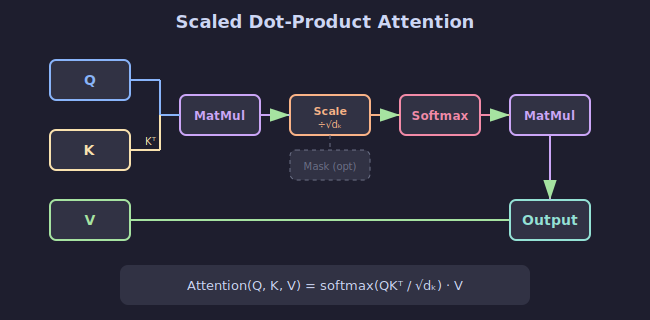

# 👁️ Mecanismo de Atención

## 🎯 Objetivos

- Comprender el problema que resuelve la atención
- Entender Query, Key, Value
- Implementar atención básica

---



---

## 1. El Problema de las RNNs

### Cuello de Botella

En arquitecturas seq2seq tradicionales:

```
Encoder: "El gato negro" → [h_final]
                              ↓
Decoder: [h_final] → "The black cat"
```

**Problema**: Toda la información debe comprimirse en un único vector.

### Limitaciones

- Secuencias largas pierden información inicial
- No hay acceso directo a tokens específicos
- Dificultad con dependencias de largo alcance

---

## 2. La Idea de Atención

### Intuición

En lugar de un único vector, el decoder puede "mirar" todos los estados del encoder:

```
Encoder states: [h1, h2, h3, h4]
                  ↓   ↓   ↓   ↓
Attention:      [0.1, 0.7, 0.1, 0.1]  ← "¿A cuál presto atención?"
                  ↓   ↓   ↓   ↓
Context:        Σ(attention × states)
```

### Analogía

Como cuando lees un libro y buscas información específica:
- **Query**: "¿Qué busco?" (lo que necesito saber)
- **Keys**: "¿Qué hay disponible?" (índice del libro)
- **Values**: "¿Qué contiene?" (el contenido real)

---

## 3. Query, Key, Value

### Definiciones

| Componente | Símbolo | Descripción |
|------------|---------|-------------|
| Query | Q | Lo que estoy buscando |
| Key | K | Contra qué comparo |
| Value | V | Lo que obtengo si hay match |

### Proceso

1. **Comparar** Query con todas las Keys → scores
2. **Normalizar** scores con softmax → weights
3. **Combinar** Values ponderados → output

---

## 4. Scaled Dot-Product Attention

### Fórmula

$$\text{Attention}(Q, K, V) = \text{softmax}\left(\frac{QK^T}{\sqrt{d_k}}\right)V$$

### Por qué escalar por √d_k

Sin escalar, para dimensiones altas los productos punto son muy grandes, causando:
- Gradientes de softmax cercanos a 0
- Saturación y problemas de entrenamiento

### Implementación

```python
import torch
import torch.nn.functional as F

def scaled_dot_product_attention(Q, K, V):
    """
    Scaled Dot-Product Attention.
    
    Args:
        Q: (batch, seq_q, d_k)
        K: (batch, seq_k, d_k)
        V: (batch, seq_k, d_v)
    
    Returns:
        output: (batch, seq_q, d_v)
        attention_weights: (batch, seq_q, seq_k)
    """
    d_k = Q.size(-1)
    
    # 1. Calcular scores: QK^T
    scores = torch.matmul(Q, K.transpose(-2, -1))  # (batch, seq_q, seq_k)
    
    # 2. Escalar
    scores = scores / (d_k ** 0.5)
    
    # 3. Softmax para obtener pesos
    attention_weights = F.softmax(scores, dim=-1)
    
    # 4. Multiplicar por Values
    output = torch.matmul(attention_weights, V)
    
    return output, attention_weights
```

---

## 5. Ejemplo Paso a Paso

```python
# Dimensiones pequeñas para visualizar
d_k = 4
seq_len = 3

# Crear Q, K, V (batch=1)
Q = torch.randn(1, seq_len, d_k)
K = torch.randn(1, seq_len, d_k)
V = torch.randn(1, seq_len, d_k)

print('Q shape:', Q.shape)
print('K shape:', K.shape)
print('V shape:', V.shape)

# Paso 1: QK^T
scores = torch.matmul(Q, K.transpose(-2, -1))
print('\nScores (QK^T):')
print(scores)

# Paso 2: Escalar
scaled_scores = scores / (d_k ** 0.5)
print('\nScaled scores:')
print(scaled_scores)

# Paso 3: Softmax
weights = F.softmax(scaled_scores, dim=-1)
print('\nAttention weights:')
print(weights)
print('Sum per row:', weights.sum(dim=-1))  # Debe ser 1.0

# Paso 4: Weighted sum de Values
output = torch.matmul(weights, V)
print('\nOutput shape:', output.shape)
```

---

## 6. Visualizando la Atención

```python
import matplotlib.pyplot as plt

def plot_attention(weights, src_tokens, tgt_tokens):
    """Visualizar matriz de atención."""
    plt.figure(figsize=(8, 6))
    plt.imshow(weights, cmap='Blues')
    plt.colorbar()
    plt.xticks(range(len(src_tokens)), src_tokens)
    plt.yticks(range(len(tgt_tokens)), tgt_tokens)
    plt.xlabel('Source')
    plt.ylabel('Target')
    plt.title('Attention Weights')
    plt.show()

# Ejemplo
src = ['El', 'gato', 'negro']
tgt = ['The', 'black', 'cat']
# weights de shape (3, 3)
```

---

## 7. Tipos de Atención

### Por Relación Q-K-V

| Tipo | Query | Key/Value | Uso |
|------|-------|-----------|-----|
| Self-Attention | mismo input | mismo input | Encoder |
| Cross-Attention | decoder | encoder | Decoder |
| Masked Self-Attention | mismo input | mismo (causal) | Decoder autoregresivo |

### Por Cálculo

| Tipo | Fórmula | Complejidad |
|------|---------|-------------|
| Dot-Product | QK^T | O(n²d) |
| Additive | v^T·tanh(W_q·Q + W_k·K) | O(n²d) |
| Multiplicative | Q·W·K^T | O(n²d²) |

---

## ✅ Checklist de Comprensión

- [ ] Entiendo el problema del cuello de botella en seq2seq
- [ ] Puedo explicar Query, Key, Value
- [ ] Sé por qué se escala por √d_k
- [ ] Implementé attention desde cero

---

## 📚 Recursos

- [Attention Is All You Need (Paper)](https://arxiv.org/abs/1706.03762)
- [Visualizing Attention](https://jalammar.github.io/visualizing-neural-machine-translation-mechanics-of-seq2seq-models-with-attention/)
