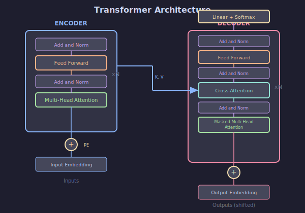
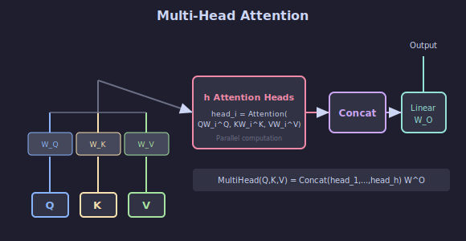

# 🏗️ Arquitectura Transformer

## 🎯 Objetivos

- Comprender la arquitectura completa del Transformer
- Entender Multi-Head Attention
- Conocer Feed-Forward Network y Add & Norm
- Implementar un Transformer Encoder

---



---

## 1. Visión General

### Arquitectura Original (2017)

```
         ┌─────────────────────────────────────┐
         │           DECODER                   │
         │  ┌─────────────────────────────┐   │
         │  │    Linear + Softmax         │   │
         │  └─────────────────────────────┘   │
         │  ┌─────────────────────────────┐   │
         │  │      Add & Norm             │   │
         │  │      Feed Forward           │   │
         │  │      Add & Norm             │   │
         │  │   Cross-Attention ←─────────┼───┤
         │  │      Add & Norm             │   │
         │  │   Masked Self-Attn          │   │
         │  └─────────────────────────────┘   │
         │         ↑ Nx                       │
         │  ┌─────────────────────────────┐   │
         │  │  Output Embedding + Pos     │   │
         │  └─────────────────────────────┘   │
         └─────────────────────────────────────┘
                                    
         ┌─────────────────────────────────────┐
         │           ENCODER                   │
         │  ┌─────────────────────────────┐   │
         │  │      Add & Norm             │   │
         │  │      Feed Forward           │   │
         │  │      Add & Norm             │   │
         │  │     Self-Attention          │   │
         │  └─────────────────────────────┘   │
         │         ↑ Nx                       │
         │  ┌─────────────────────────────┐   │
         │  │  Input Embedding + Pos      │   │
         │  └─────────────────────────────┘   │
         └─────────────────────────────────────┘
```

---

## 2. Multi-Head Attention



### ¿Por Qué Múltiples Heads?

Un solo head puede enfocarse en un tipo de relación. Múltiples heads permiten:
- Diferentes "puntos de vista"
- Capturar relaciones sintácticas Y semánticas
- Mayor expresividad

### Fórmula

$$\text{MultiHead}(Q, K, V) = \text{Concat}(\text{head}_1, ..., \text{head}_h)W^O$$

donde:
$$\text{head}_i = \text{Attention}(QW_i^Q, KW_i^K, VW_i^V)$$

### Implementación

```python
import torch
import torch.nn as nn
import torch.nn.functional as F

class MultiHeadAttention(nn.Module):
    def __init__(self, d_model, num_heads, dropout=0.1):
        super().__init__()
        assert d_model % num_heads == 0
        
        self.d_model = d_model
        self.num_heads = num_heads
        self.d_k = d_model // num_heads
        
        self.W_q = nn.Linear(d_model, d_model)
        self.W_k = nn.Linear(d_model, d_model)
        self.W_v = nn.Linear(d_model, d_model)
        self.W_o = nn.Linear(d_model, d_model)
        
        self.dropout = nn.Dropout(dropout)
    
    def forward(self, Q, K, V, mask=None):
        batch_size = Q.size(0)
        
        # 1. Proyectar y reshape para multi-head
        Q = self.W_q(Q).view(batch_size, -1, self.num_heads, self.d_k).transpose(1, 2)
        K = self.W_k(K).view(batch_size, -1, self.num_heads, self.d_k).transpose(1, 2)
        V = self.W_v(V).view(batch_size, -1, self.num_heads, self.d_k).transpose(1, 2)
        # Shape: (batch, num_heads, seq_len, d_k)
        
        # 2. Scaled Dot-Product Attention
        scores = torch.matmul(Q, K.transpose(-2, -1)) / (self.d_k ** 0.5)
        
        if mask is not None:
            scores = scores.masked_fill(mask == 0, float('-inf'))
        
        attention = F.softmax(scores, dim=-1)
        attention = self.dropout(attention)
        
        # 3. Aplicar a Values
        context = torch.matmul(attention, V)
        # Shape: (batch, num_heads, seq_len, d_k)
        
        # 4. Concatenar heads
        context = context.transpose(1, 2).contiguous().view(
            batch_size, -1, self.d_model
        )
        
        # 5. Proyección final
        output = self.W_o(context)
        
        return output
```

---

## 3. Feed-Forward Network

### Estructura

Dos capas lineales con activación:

$$\text{FFN}(x) = \text{ReLU}(xW_1 + b_1)W_2 + b_2$$

### Implementación

```python
class FeedForward(nn.Module):
    def __init__(self, d_model, d_ff, dropout=0.1):
        super().__init__()
        self.linear1 = nn.Linear(d_model, d_ff)
        self.linear2 = nn.Linear(d_ff, d_model)
        self.dropout = nn.Dropout(dropout)
    
    def forward(self, x):
        x = self.linear1(x)
        x = F.relu(x)
        x = self.dropout(x)
        x = self.linear2(x)
        return x
```

### Dimensiones Típicas

- d_model = 512
- d_ff = 2048 (4× d_model)

---

## 4. Add & Norm (Residual + Layer Norm)

### Residual Connection

$$\text{output} = x + \text{Sublayer}(x)$$

Permite gradientes fluir directamente (como en ResNet).

### Layer Normalization

$$\text{LayerNorm}(x) = \gamma \cdot \frac{x - \mu}{\sqrt{\sigma^2 + \epsilon}} + \beta$$

Normaliza sobre la dimensión de features (no batch).

### Implementación

```python
class AddNorm(nn.Module):
    def __init__(self, d_model, dropout=0.1):
        super().__init__()
        self.norm = nn.LayerNorm(d_model)
        self.dropout = nn.Dropout(dropout)
    
    def forward(self, x, sublayer_output):
        return self.norm(x + self.dropout(sublayer_output))
```

---

## 5. Encoder Layer

```python
class EncoderLayer(nn.Module):
    def __init__(self, d_model, num_heads, d_ff, dropout=0.1):
        super().__init__()
        self.self_attention = MultiHeadAttention(d_model, num_heads, dropout)
        self.feed_forward = FeedForward(d_model, d_ff, dropout)
        self.norm1 = nn.LayerNorm(d_model)
        self.norm2 = nn.LayerNorm(d_model)
        self.dropout = nn.Dropout(dropout)
    
    def forward(self, x, mask=None):
        # Self-Attention + Add & Norm
        attn_output = self.self_attention(x, x, x, mask)
        x = self.norm1(x + self.dropout(attn_output))
        
        # Feed-Forward + Add & Norm
        ff_output = self.feed_forward(x)
        x = self.norm2(x + self.dropout(ff_output))
        
        return x
```

---

## 6. Encoder Completo

```python
class TransformerEncoder(nn.Module):
    def __init__(self, num_layers, d_model, num_heads, d_ff, 
                 vocab_size, max_len, dropout=0.1):
        super().__init__()
        
        self.embedding = nn.Embedding(vocab_size, d_model)
        self.pos_encoding = PositionalEncoding(d_model, max_len)
        
        self.layers = nn.ModuleList([
            EncoderLayer(d_model, num_heads, d_ff, dropout)
            for _ in range(num_layers)
        ])
        
        self.dropout = nn.Dropout(dropout)
    
    def forward(self, x, mask=None):
        # x: (batch, seq_len) - token IDs
        x = self.embedding(x)
        x = self.pos_encoding(x)
        x = self.dropout(x)
        
        for layer in self.layers:
            x = layer(x, mask)
        
        return x
```

---

## 7. Hiperparámetros del Paper Original

| Parámetro | Base | Big |
|-----------|------|-----|
| d_model | 512 | 1024 |
| d_ff | 2048 | 4096 |
| num_heads | 8 | 16 |
| num_layers | 6 | 6 |
| dropout | 0.1 | 0.3 |

---

## ✅ Checklist de Comprensión

- [ ] Entiendo Multi-Head Attention
- [ ] Sé qué hace Feed-Forward Network
- [ ] Comprendo residual + layer norm
- [ ] Puedo construir un encoder layer

---

## 📚 Recursos

- [Attention Is All You Need](https://arxiv.org/abs/1706.03762)
- [The Annotated Transformer](https://nlp.seas.harvard.edu/2018/04/03/attention.html)
