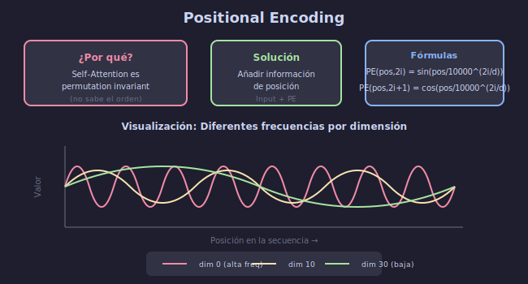

# 📍 Positional Encoding

## 🎯 Objetivos

- Entender por qué el Transformer necesita información posicional
- Comprender el encoding sinusoidal
- Implementar Positional Encoding

---



---

## 1. El Problema

### Self-Attention es Permutation Invariant

```python
# Para self-attention, el orden NO importa por defecto:
# "gato el negro" produce la misma salida que "el gato negro"
# (Solo cambian los índices, no los valores)
```

### ¿Por Qué?

- Self-attention procesa todos los tokens **en paralelo**
- No hay concepto inherente de "primero" o "después"
- Necesitamos **inyectar** información de posición

---

## 2. Solución: Positional Encoding

### Idea

Añadir un vector de posición a cada embedding:

$$\text{Input}_i = \text{Embedding}_i + \text{PE}_i$$

### Requisitos

1. **Único** para cada posición
2. **Determinístico** (no aprendido, aunque también se puede)
3. **Generalizable** a secuencias más largas que las vistas en entrenamiento
4. **Distancia relativa** fácil de calcular

---

## 3. Encoding Sinusoidal

### Fórmulas

$$PE_{(pos, 2i)} = \sin\left(\frac{pos}{10000^{2i/d_{model}}}\right)$$

$$PE_{(pos, 2i+1)} = \cos\left(\frac{pos}{10000^{2i/d_{model}}}\right)$$

Donde:
- pos = posición en la secuencia (0, 1, 2, ...)
- i = índice de la dimensión (0, 1, ..., d_model/2 - 1)
- d_model = dimensión del modelo

### Intuición

- **Diferentes frecuencias**: Dimensiones bajas → frecuencias altas, altas → bajas
- **Senos y cosenos**: Permiten calcular PE(pos+k) como función lineal de PE(pos)
- **Rango acotado**: Siempre entre -1 y 1

---

## 4. Implementación

```python
import torch
import torch.nn as nn
import math

class PositionalEncoding(nn.Module):
    def __init__(self, d_model, max_len=5000, dropout=0.1):
        super().__init__()
        self.dropout = nn.Dropout(dropout)
        
        # Crear matriz de positional encoding
        pe = torch.zeros(max_len, d_model)
        position = torch.arange(0, max_len, dtype=torch.float).unsqueeze(1)
        
        # Divisor para las frecuencias
        div_term = torch.exp(
            torch.arange(0, d_model, 2).float() * (-math.log(10000.0) / d_model)
        )
        
        # Aplicar sin a índices pares, cos a impares
        pe[:, 0::2] = torch.sin(position * div_term)
        pe[:, 1::2] = torch.cos(position * div_term)
        
        # Añadir dimensión de batch
        pe = pe.unsqueeze(0)  # (1, max_len, d_model)
        
        # Registrar como buffer (no es parámetro entrenable)
        self.register_buffer('pe', pe)
    
    def forward(self, x):
        """
        Args:
            x: (batch, seq_len, d_model)
        Returns:
            x + pe: (batch, seq_len, d_model)
        """
        x = x + self.pe[:, :x.size(1), :]
        return self.dropout(x)
```

---

## 5. Visualización

```python
import matplotlib.pyplot as plt
import numpy as np

def visualize_positional_encoding(d_model=64, max_len=100):
    pe = PositionalEncoding(d_model, max_len)
    
    # Obtener la matriz PE
    pe_matrix = pe.pe[0, :max_len, :].numpy()
    
    plt.figure(figsize=(12, 8))
    plt.imshow(pe_matrix, aspect='auto', cmap='RdBu')
    plt.colorbar()
    plt.xlabel('Dimensión del embedding')
    plt.ylabel('Posición')
    plt.title('Positional Encoding')
    plt.show()
    
    # Visualizar algunas dimensiones específicas
    plt.figure(figsize=(12, 4))
    for dim in [0, 1, 10, 11, 30, 31]:
        plt.plot(pe_matrix[:, dim], label=f'dim {dim}')
    plt.xlabel('Posición')
    plt.ylabel('Valor')
    plt.legend()
    plt.title('PE por dimensión')
    plt.show()

visualize_positional_encoding()
```

---

## 6. Propiedades del Encoding Sinusoidal

### Relación entre Posiciones

Para cualquier offset k fijo:

$$PE_{pos+k} = f(PE_{pos})$$

Es una transformación lineal, lo que facilita aprender relaciones relativas.

### Ejemplo

```python
# Verificar que posiciones cercanas tienen PE similares
pe = PositionalEncoding(d_model=64, max_len=100)
pe_matrix = pe.pe[0]

# Distancia entre posición 5 y 6
dist_5_6 = torch.norm(pe_matrix[5] - pe_matrix[6])

# Distancia entre posición 5 y 50
dist_5_50 = torch.norm(pe_matrix[5] - pe_matrix[50])

print(f'Distancia pos 5-6: {dist_5_6:.4f}')
print(f'Distancia pos 5-50: {dist_5_50:.4f}')
# La primera debería ser menor
```

---

## 7. Alternativas

### Learned Positional Embeddings

```python
class LearnedPositionalEncoding(nn.Module):
    def __init__(self, d_model, max_len=512):
        super().__init__()
        self.pe = nn.Embedding(max_len, d_model)
    
    def forward(self, x):
        seq_len = x.size(1)
        positions = torch.arange(seq_len, device=x.device)
        return x + self.pe(positions)
```

### Comparación

| Tipo | Ventajas | Desventajas |
|------|----------|-------------|
| Sinusoidal | Generaliza a cualquier longitud | Fijo, no adaptativo |
| Aprendido | Adaptado a la tarea | Limitado a max_len visto |

### Uso Actual

- **BERT**: Learned positional embeddings
- **GPT**: Learned positional embeddings
- **Transformer original**: Sinusoidal
- **LLaMA, GPT-4**: RoPE (Rotary Position Embedding)

---

## 8. Rotary Position Embedding (RoPE)

Técnica moderna usada en LLMs actuales:

```python
# Idea simplificada de RoPE
# En lugar de sumar, rota el embedding según la posición
# Permite codificar posición relativa de forma más natural

def apply_rope(x, positions):
    """
    Rotary Position Embedding simplificado.
    Rota pares de dimensiones según la posición.
    """
    # Implementación completa es más compleja
    # pero la idea es rotar vectores 2D
    pass
```

---

## ✅ Checklist de Comprensión

- [ ] Entiendo por qué self-attention necesita información posicional
- [ ] Comprendo el encoding sinusoidal
- [ ] Sé implementar PositionalEncoding
- [ ] Conozco alternativas (learned, RoPE)

---

## 📚 Recursos

- [Transformer Architecture: Positional Encoding](https://kazemnejad.com/blog/transformer_architecture_positional_encoding/)
- [RoPE Paper](https://arxiv.org/abs/2104.09864)
