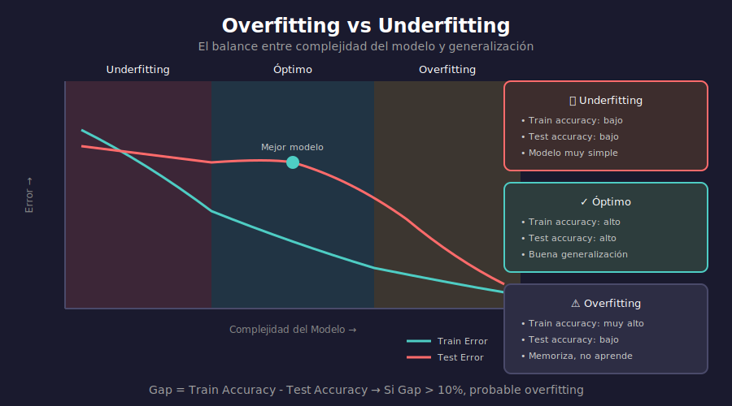

# ⚠️ Overfitting y Underfitting

## 🎯 Objetivos

- Comprender qué es overfitting y por qué ocurre
- Identificar underfitting y sus causas
- Aprender a detectar ambos problemas
- Conocer el trade-off bias-variance

---

## 1. El Problema Fundamental

### ¿Qué Queremos?

Un modelo que **generalice** bien a datos nuevos, no solo que memorice los datos de entrenamiento.

```
Objetivo: Minimizar el error en datos NO VISTOS
```

### Overfitting (Sobreajuste)

El modelo aprende **demasiado bien** los datos de entrenamiento, incluyendo el ruido.

```
Training Accuracy: 99.5%  ✓ (parece excelente)
Test Accuracy:     62.0%  ✗ (pero no generaliza)
```

**Síntomas**:
- Gran diferencia entre train y test accuracy
- Loss de validación sube mientras train loss baja
- El modelo "memoriza" en lugar de aprender patrones

### Underfitting (Subajuste)

El modelo es **demasiado simple** para capturar los patrones.

```
Training Accuracy: 55%  ✗
Test Accuracy:     52%  ✗
```

**Síntomas**:
- Bajo rendimiento en train Y test
- El modelo no captura la complejidad del problema

---

## 2. Visualización del Problema



---

## 3. Causas del Overfitting

### Modelo Demasiado Complejo

```python
# Modelo muy grande para el dataset
model = nn.Sequential(
    nn.Linear(10, 1000),    # 10 features → 1000 neuronas
    nn.ReLU(),
    nn.Linear(1000, 1000),  # Demasiada capacidad
    nn.ReLU(),
    nn.Linear(1000, 2)      # Para clasificación binaria
)
# Si solo tienes 100 muestras, esto es overkill
```

### Dataset Pequeño

```python
# Pocas muestras = fácil de memorizar
train_samples = 100
parameters = 1_000_000  # ¡Más parámetros que datos!
```

### Entrenamiento Excesivo

```python
# Demasiadas épocas
for epoch in range(1000):  # El modelo empieza a memorizar
    train(model, data)
```

### Datos con Ruido

```python
# Etiquetas incorrectas o datos ruidosos
# El modelo intenta "aprender" el ruido
```

---

## 4. Detectar Overfitting

### Learning Curves

```python
import matplotlib.pyplot as plt

def plot_learning_curves(train_losses, val_losses):
    """Visualiza overfitting con curvas de aprendizaje."""
    plt.figure(figsize=(10, 5))
    
    plt.subplot(1, 2, 1)
    plt.plot(train_losses, label='Train Loss')
    plt.plot(val_losses, label='Validation Loss')
    plt.xlabel('Epoch')
    plt.ylabel('Loss')
    plt.legend()
    plt.title('Loss Curves')
    
    # Señal de overfitting: val_loss sube mientras train_loss baja
    if val_losses[-1] > val_losses[len(val_losses)//2]:
        plt.axvline(x=len(val_losses)//2, color='r', 
                   linestyle='--', label='Overfitting starts')
    
    plt.show()
```

### Gap Train-Test

```python
def check_overfitting(train_acc, test_acc, threshold=0.1):
    """Detecta overfitting basado en gap de accuracy."""
    gap = train_acc - test_acc
    
    if gap > threshold:
        print(f"⚠️ Overfitting detectado!")
        print(f"   Train: {train_acc:.2%}, Test: {test_acc:.2%}")
        print(f"   Gap: {gap:.2%}")
        return True
    return False

# Ejemplo
check_overfitting(0.98, 0.75)  # Gap de 23% → Overfitting
```

---

## 5. Bias-Variance Trade-off

### Definiciones

| Concepto | Descripción |
|----------|-------------|
| **Bias** | Error por suposiciones simplificadas (underfitting) |
| **Variance** | Error por sensibilidad a fluctuaciones (overfitting) |

### Fórmula del Error Total

$$\text{Error Total} = \text{Bias}^2 + \text{Variance} + \text{Ruido Irreducible}$$

### Trade-off

```
Alto Bias, Baja Variance → Underfitting
Bajo Bias, Alta Variance → Overfitting
Balance óptimo → Buena generalización
```

---

## 6. Soluciones al Overfitting

### Técnicas de Regularización

| Técnica | Efecto |
|---------|--------|
| **Dropout** | Apaga neuronas aleatoriamente |
| **L2/Weight Decay** | Penaliza pesos grandes |
| **Batch Normalization** | Normaliza activaciones |
| **Data Augmentation** | Aumenta datos artificialmente |
| **Early Stopping** | Para entrenamiento antes de overfitting |

### Más Datos

```python
# La mejor solución (cuando es posible)
# Más datos = más difícil de memorizar
```

### Modelo Más Simple

```python
# Reducir capacidad
model_simple = nn.Sequential(
    nn.Linear(10, 32),   # Menos neuronas
    nn.ReLU(),
    nn.Linear(32, 2)
)
```

---

## 7. Ejemplo Práctico

```python
import torch
import torch.nn as nn
from torch.utils.data import DataLoader, random_split

def train_and_evaluate(model, train_loader, val_loader, epochs=50):
    """Entrena y detecta overfitting."""
    criterion = nn.CrossEntropyLoss()
    optimizer = torch.optim.Adam(model.parameters(), lr=0.001)
    
    train_losses, val_losses = [], []
    train_accs, val_accs = [], []
    
    for epoch in range(epochs):
        # Training
        model.train()
        train_loss, correct, total = 0, 0, 0
        for x, y in train_loader:
            optimizer.zero_grad()
            output = model(x)
            loss = criterion(output, y)
            loss.backward()
            optimizer.step()
            
            train_loss += loss.item()
            correct += (output.argmax(1) == y).sum().item()
            total += y.size(0)
        
        train_losses.append(train_loss / len(train_loader))
        train_accs.append(correct / total)
        
        # Validation
        model.eval()
        val_loss, correct, total = 0, 0, 0
        with torch.no_grad():
            for x, y in val_loader:
                output = model(x)
                val_loss += criterion(output, y).item()
                correct += (output.argmax(1) == y).sum().item()
                total += y.size(0)
        
        val_losses.append(val_loss / len(val_loader))
        val_accs.append(correct / total)
        
        # Detectar overfitting
        if epoch > 10 and val_losses[-1] > val_losses[-10]:
            print(f"⚠️ Epoch {epoch}: Posible overfitting")
    
    return train_losses, val_losses, train_accs, val_accs
```

---

## ✅ Checklist de Verificación

- [ ] Entiendo la diferencia entre overfitting y underfitting
- [ ] Puedo identificar overfitting en learning curves
- [ ] Comprendo el trade-off bias-variance
- [ ] Conozco las técnicas para combatir overfitting
- [ ] Sé cuándo un modelo es demasiado complejo

---

## 📚 Recursos Adicionales

- [Understanding Bias-Variance Trade-off](https://towardsdatascience.com/understanding-the-bias-variance-tradeoff-165e6942b229)
- [Overfitting in Machine Learning](https://www.ibm.com/topics/overfitting)

---

_Siguiente: [02-dropout.md](02-dropout.md) - Técnica de regularización más popular_
