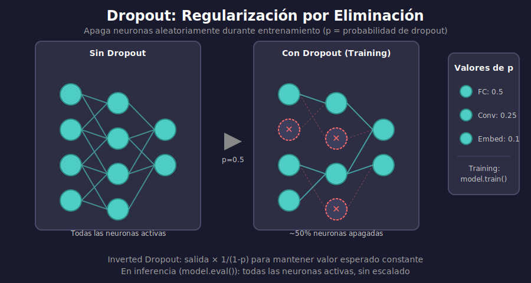

# 🎲 Dropout

## 🎯 Objetivos

- Comprender cómo funciona Dropout
- Entender Inverted Dropout
- Saber dónde y cuándo aplicarlo
- Implementar Dropout en PyTorch

---

## 1. ¿Qué es Dropout?

### Idea Principal

Durante el entrenamiento, **apaga neuronas aleatoriamente** con probabilidad `p`.



### ¿Por Qué Funciona?

1. **Previene co-adaptación**: Las neuronas no pueden depender de otras específicas
2. **Ensemble implícito**: Entrena muchas subredes simultáneamente
3. **Regularización**: Reduce la capacidad efectiva del modelo

---

## 2. Matemáticas del Dropout

### Durante Entrenamiento

Cada neurona se mantiene con probabilidad $(1-p)$:

$$y = \begin{cases} 
0 & \text{con probabilidad } p \\
\frac{x}{1-p} & \text{con probabilidad } 1-p
\end{cases}$$

### Inverted Dropout

El factor $\frac{1}{1-p}$ escala las activaciones para mantener el valor esperado:

```python
# Sin escalar (incorrecto):
# E[y_train] = (1-p) * x
# E[y_test] = x  → ¡Diferentes!

# Con Inverted Dropout (correcto):
# E[y_train] = (1-p) * x/(1-p) = x
# E[y_test] = x  → ¡Iguales!
```

### Durante Inferencia

**Dropout se desactiva** (todas las neuronas activas).

```python
model.train()  # Dropout activo
model.eval()   # Dropout inactivo
```

---

## 3. Implementación desde Cero

```python
import torch
import torch.nn as nn

class MyDropout(nn.Module):
    """Implementación manual de Dropout."""
    
    def __init__(self, p: float = 0.5):
        super().__init__()
        self.p = p
    
    def forward(self, x):
        if not self.training or self.p == 0:
            return x
        
        # Crear máscara binaria
        mask = (torch.rand_like(x) > self.p).float()
        
        # Aplicar máscara y escalar (inverted dropout)
        return x * mask / (1 - self.p)

# Verificar
dropout = MyDropout(p=0.3)
x = torch.ones(10)

dropout.train()
print("Train:", dropout(x))  # Algunas posiciones en 0, otras escaladas

dropout.eval()
print("Eval:", dropout(x))   # Todas en 1.0
```

---

## 4. Dropout en PyTorch

### Uso Básico

```python
import torch.nn as nn

# Crear capa de dropout
dropout = nn.Dropout(p=0.5)  # 50% de probabilidad de apagar

# En una red
model = nn.Sequential(
    nn.Linear(784, 256),
    nn.ReLU(),
    nn.Dropout(0.5),        # Después de activación
    nn.Linear(256, 128),
    nn.ReLU(),
    nn.Dropout(0.3),        # Puede variar por capa
    nn.Linear(128, 10)
)
```

### Variantes de Dropout

```python
# Dropout estándar (para fully connected)
nn.Dropout(p=0.5)

# Dropout 2D (para CNNs - apaga canales enteros)
nn.Dropout2d(p=0.5)

# Dropout 1D (para secuencias)
nn.Dropout1d(p=0.5)

# Alpha Dropout (para SELU activations)
nn.AlphaDropout(p=0.5)
```

---

## 5. Dónde Aplicar Dropout

### ✅ Buenas Prácticas

```python
class GoodModel(nn.Module):
    def __init__(self):
        super().__init__()
        # Dropout en capas fully connected
        self.fc1 = nn.Linear(512, 256)
        self.dropout1 = nn.Dropout(0.5)
        
        self.fc2 = nn.Linear(256, 128)
        self.dropout2 = nn.Dropout(0.3)
        
        self.fc3 = nn.Linear(128, 10)
        # NO dropout en la última capa
    
    def forward(self, x):
        x = F.relu(self.fc1(x))
        x = self.dropout1(x)  # Después de activación
        
        x = F.relu(self.fc2(x))
        x = self.dropout2(x)
        
        x = self.fc3(x)  # Sin dropout antes de softmax
        return x
```

### ❌ Evitar

```python
# No usar dropout muy alto en capas pequeñas
nn.Linear(32, 16)
nn.Dropout(0.9)  # ❌ Demasiado agresivo

# No usar entre conv y batch norm típicamente
nn.Conv2d(64, 128, 3)
nn.Dropout2d(0.5)  # ❌ Generalmente no necesario
nn.BatchNorm2d(128)
```

### Valores Típicos de p

| Capa | Dropout p |
|------|-----------|
| Después de embedding | 0.1 - 0.2 |
| Capas ocultas FC | 0.3 - 0.5 |
| Capas grandes FC | 0.5 - 0.7 |
| Antes de clasificador | 0.2 - 0.4 |
| CNNs (Dropout2d) | 0.1 - 0.3 |

---

## 6. Ejemplo Completo: CNN con Dropout

```python
import torch
import torch.nn as nn
import torch.nn.functional as F

class CNNWithDropout(nn.Module):
    """CNN para MNIST con Dropout."""
    
    def __init__(self, dropout_conv=0.25, dropout_fc=0.5):
        super().__init__()
        
        # Convolucionales
        self.conv1 = nn.Conv2d(1, 32, 3, padding=1)
        self.conv2 = nn.Conv2d(32, 64, 3, padding=1)
        self.pool = nn.MaxPool2d(2, 2)
        
        # Dropout para conv (opcional, apaga canales)
        self.dropout_conv = nn.Dropout2d(dropout_conv)
        
        # Fully connected
        self.fc1 = nn.Linear(64 * 7 * 7, 128)
        self.fc2 = nn.Linear(128, 10)
        
        # Dropout para FC
        self.dropout_fc = nn.Dropout(dropout_fc)
    
    def forward(self, x):
        # Conv block 1
        x = self.pool(F.relu(self.conv1(x)))  # 28x28 → 14x14
        x = self.dropout_conv(x)
        
        # Conv block 2
        x = self.pool(F.relu(self.conv2(x)))  # 14x14 → 7x7
        x = self.dropout_conv(x)
        
        # Flatten
        x = x.view(-1, 64 * 7 * 7)
        
        # FC layers
        x = F.relu(self.fc1(x))
        x = self.dropout_fc(x)  # Dropout más agresivo en FC
        
        x = self.fc2(x)
        return x

# Crear modelo
model = CNNWithDropout(dropout_conv=0.25, dropout_fc=0.5)
print(model)
```

---

## 7. Comparación Con/Sin Dropout

```python
def compare_dropout(train_loader, test_loader, epochs=20):
    """Compara modelo con y sin dropout."""
    
    # Modelo sin dropout
    model_no_dropout = nn.Sequential(
        nn.Flatten(),
        nn.Linear(784, 256),
        nn.ReLU(),
        nn.Linear(256, 128),
        nn.ReLU(),
        nn.Linear(128, 10)
    )
    
    # Modelo con dropout
    model_with_dropout = nn.Sequential(
        nn.Flatten(),
        nn.Linear(784, 256),
        nn.ReLU(),
        nn.Dropout(0.5),
        nn.Linear(256, 128),
        nn.ReLU(),
        nn.Dropout(0.3),
        nn.Linear(128, 10)
    )
    
    # Entrenar ambos y comparar...
    # El modelo con dropout debería tener menor gap train-test
```

---

## 8. Tips Avanzados

### Dropout Schedule

```python
# Aumentar dropout gradualmente
class ScheduledDropout(nn.Module):
    def __init__(self, p_start=0.0, p_end=0.5, warmup_epochs=10):
        super().__init__()
        self.p_start = p_start
        self.p_end = p_end
        self.warmup_epochs = warmup_epochs
        self.current_epoch = 0
    
    @property
    def p(self):
        progress = min(self.current_epoch / self.warmup_epochs, 1.0)
        return self.p_start + (self.p_end - self.p_start) * progress
    
    def forward(self, x):
        return F.dropout(x, self.p, self.training)
```

### Spatial Dropout para CNNs

```python
# Dropout2d apaga canales enteros
# Mejor para features espacialmente correlacionadas
x = torch.randn(1, 64, 32, 32)  # (batch, channels, H, W)
dropout2d = nn.Dropout2d(0.5)
output = dropout2d(x)  # Canales enteros en 0
```

---

## ✅ Checklist de Verificación

- [ ] Entiendo cómo Dropout previene overfitting
- [ ] Comprendo Inverted Dropout y por qué escalar
- [ ] Sé la diferencia entre train() y eval()
- [ ] Conozco dónde aplicar Dropout en una red
- [ ] Puedo elegir valores apropiados de p

---

## 📚 Recursos Adicionales

- [Dropout Paper (Srivastava 2014)](https://jmlr.org/papers/v15/srivastava14a.html)
- [PyTorch Dropout Documentation](https://pytorch.org/docs/stable/generated/torch.nn.Dropout.html)

---

_Siguiente: [03-batch-normalization.md](03-batch-normalization.md) - Normalización de activaciones_
