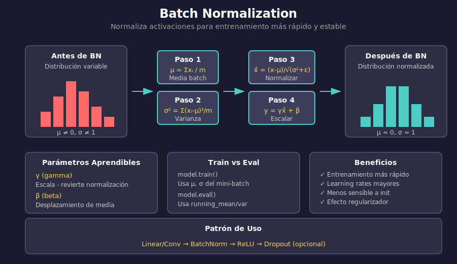

# 📊 Batch Normalization

## 🎯 Objetivos

- Comprender el problema de Internal Covariate Shift
- Entender cómo funciona Batch Normalization
- Conocer parámetros γ y β
- Diferenciar comportamiento en train vs eval

---

## 1. El Problema

### Internal Covariate Shift

Durante el entrenamiento, la distribución de las activaciones cambia constantemente:

```
Época 1: activaciones ∈ [-1, 1]
Época 5: activaciones ∈ [-5, 10]
Época 10: activaciones ∈ [0, 100]

→ Cada capa debe re-adaptarse constantemente
→ Entrenamiento lento e inestable
```

### Síntomas

- Necesidad de learning rates muy pequeños
- Inicialización cuidadosa de pesos
- Saturación de funciones de activación
- Entrenamiento lento

---

## 2. Solución: Batch Normalization

### Idea Principal

Normalizar las activaciones a media 0 y varianza 1 **dentro de cada mini-batch**:

$$\hat{x}_i = \frac{x_i - \mu_B}{\sqrt{\sigma_B^2 + \epsilon}}$$

Donde:
- $\mu_B = \frac{1}{m}\sum_{i=1}^{m} x_i$ (media del batch)
- $\sigma_B^2 = \frac{1}{m}\sum_{i=1}^{m} (x_i - \mu_B)^2$ (varianza del batch)
- $\epsilon$ = pequeño valor para estabilidad numérica

### Parámetros Aprendibles (γ, β)

La red puede "desnormalizar" si es útil:

$$y_i = \gamma \hat{x}_i + \beta$$

- **γ (gamma)**: escala - puede revertir la normalización
- **β (beta)**: desplazamiento - ajusta la media

```python
# Si γ = σ_B y β = μ_B, se recupera la entrada original
```

---

## 3. Algoritmo Completo



---

## 4. Implementación desde Cero

```python
import torch
import torch.nn as nn

class MyBatchNorm1d(nn.Module):
    """Implementación manual de Batch Normalization."""
    
    def __init__(self, num_features, eps=1e-5, momentum=0.1):
        super().__init__()
        self.eps = eps
        self.momentum = momentum
        
        # Parámetros aprendibles
        self.gamma = nn.Parameter(torch.ones(num_features))
        self.beta = nn.Parameter(torch.zeros(num_features))
        
        # Running statistics (para inferencia)
        self.register_buffer('running_mean', torch.zeros(num_features))
        self.register_buffer('running_var', torch.ones(num_features))
    
    def forward(self, x):
        if self.training:
            # Calcular estadísticas del batch
            mean = x.mean(dim=0)
            var = x.var(dim=0, unbiased=False)
            
            # Actualizar running statistics
            self.running_mean = (1 - self.momentum) * self.running_mean + self.momentum * mean
            self.running_var = (1 - self.momentum) * self.running_var + self.momentum * var
        else:
            # Usar running statistics en inferencia
            mean = self.running_mean
            var = self.running_var
        
        # Normalizar
        x_norm = (x - mean) / torch.sqrt(var + self.eps)
        
        # Escalar y desplazar
        return self.gamma * x_norm + self.beta
```

---

## 5. Batch Norm en PyTorch

### Tipos de Batch Norm

```python
import torch.nn as nn

# Para capas fully connected (normaliza sobre features)
nn.BatchNorm1d(num_features)

# Para CNNs (normaliza sobre canales)
nn.BatchNorm2d(num_features)  # Input: (N, C, H, W)

# Para datos 3D (videos, 3D convs)
nn.BatchNorm3d(num_features)
```

### Uso en Redes

```python
# Patrón común: Linear/Conv → BatchNorm → Activation
model = nn.Sequential(
    nn.Linear(784, 256),
    nn.BatchNorm1d(256),
    nn.ReLU(),
    
    nn.Linear(256, 128),
    nn.BatchNorm1d(128),
    nn.ReLU(),
    
    nn.Linear(128, 10)
)
```

### Para CNNs

```python
class CNNWithBatchNorm(nn.Module):
    def __init__(self):
        super().__init__()
        self.conv1 = nn.Conv2d(1, 32, 3, padding=1)
        self.bn1 = nn.BatchNorm2d(32)
        
        self.conv2 = nn.Conv2d(32, 64, 3, padding=1)
        self.bn2 = nn.BatchNorm2d(64)
        
        self.fc = nn.Linear(64 * 7 * 7, 10)
    
    def forward(self, x):
        # Conv → BN → ReLU → Pool
        x = F.max_pool2d(F.relu(self.bn1(self.conv1(x))), 2)
        x = F.max_pool2d(F.relu(self.bn2(self.conv2(x))), 2)
        
        x = x.view(-1, 64 * 7 * 7)
        return self.fc(x)
```

---

## 6. Train vs Eval Mode

### Diferencia Crítica

```python
model = nn.Sequential(
    nn.Linear(100, 50),
    nn.BatchNorm1d(50),
    nn.ReLU()
)

# ENTRENAMIENTO: usa estadísticas del batch actual
model.train()
output_train = model(batch_data)

# INFERENCIA: usa running statistics acumuladas
model.eval()
output_eval = model(single_sample)  # ¡No necesita batch!
```

### ⚠️ Error Común

```python
# ❌ INCORRECTO: Olvidar model.eval()
model.train()  # BN usa estadísticas del batch
prediction = model(test_data)  # Resultados incorrectos

# ✅ CORRECTO
model.eval()  # BN usa running statistics
with torch.no_grad():
    prediction = model(test_data)
```

---

## 7. Beneficios de Batch Norm

### 1. Entrenamiento Más Rápido

```python
# Sin BN: lr pequeño, muchas épocas
optimizer = Adam(model.parameters(), lr=0.0001)

# Con BN: lr más grande, converge antes
optimizer = Adam(model_bn.parameters(), lr=0.001)
```

### 2. Menos Sensible a Inicialización

```python
# Sin BN: inicialización crítica
nn.init.xavier_uniform_(layer.weight)  # Necesario

# Con BN: más robusto a inicialización
# La normalización "arregla" distribuciones malas
```

### 3. Efecto Regularizador

El ruido de las estadísticas del mini-batch actúa como regularización ligera.

### 4. Permite Learning Rates Mayores

```
Sin BN:  lr_max ≈ 0.001
Con BN:  lr_max ≈ 0.01 - 0.1
```

---

## 8. Dónde Colocar Batch Norm

### Debate: Antes o Después de Activación

```python
# Opción 1: Después de Linear/Conv, antes de activación (original)
x = self.linear(x)
x = self.bn(x)
x = F.relu(x)

# Opción 2: Después de activación
x = self.linear(x)
x = F.relu(x)
x = self.bn(x)

# En la práctica, Opción 1 es más común
```

### Con Dropout

```python
# Orden típico: Linear → BN → ReLU → Dropout
x = self.linear(x)
x = self.bn(x)
x = F.relu(x)
x = self.dropout(x)
```

---

## 9. Variantes de Normalización

| Técnica | Normaliza sobre | Uso principal |
|---------|-----------------|---------------|
| **Batch Norm** | Mini-batch | CNNs, MLPs |
| **Layer Norm** | Features | Transformers, RNNs |
| **Instance Norm** | Instancia individual | Style Transfer |
| **Group Norm** | Grupos de canales | Batch pequeños |

```python
# Layer Norm (no depende del batch)
nn.LayerNorm(normalized_shape)

# Instance Norm
nn.InstanceNorm2d(num_features)

# Group Norm
nn.GroupNorm(num_groups, num_channels)
```

---

## 10. Ejemplo Comparativo

```python
def compare_with_without_bn():
    """Compara convergencia con y sin Batch Norm."""
    
    # Sin Batch Norm
    model_no_bn = nn.Sequential(
        nn.Linear(784, 256),
        nn.ReLU(),
        nn.Linear(256, 128),
        nn.ReLU(),
        nn.Linear(128, 10)
    )
    
    # Con Batch Norm
    model_with_bn = nn.Sequential(
        nn.Linear(784, 256),
        nn.BatchNorm1d(256),
        nn.ReLU(),
        nn.Linear(256, 128),
        nn.BatchNorm1d(128),
        nn.ReLU(),
        nn.Linear(128, 10)
    )
    
    # El modelo con BN típicamente:
    # - Converge más rápido
    # - Permite lr más alto
    # - Es más estable
```

---

## ✅ Checklist de Verificación

- [ ] Entiendo el problema de Internal Covariate Shift
- [ ] Comprendo la fórmula de normalización
- [ ] Sé qué hacen γ y β
- [ ] Distingo el comportamiento en train vs eval
- [ ] Conozco dónde colocar BatchNorm en una red

---

## 📚 Recursos Adicionales

- [Batch Normalization Paper (2015)](https://arxiv.org/abs/1502.03167)
- [How Does Batch Norm Help Optimization?](https://arxiv.org/abs/1805.11604)
- [PyTorch BatchNorm Documentation](https://pytorch.org/docs/stable/generated/torch.nn.BatchNorm2d.html)

---

_Siguiente: [04-data-augmentation.md](04-data-augmentation.md) - Aumentar datos artificialmente_
